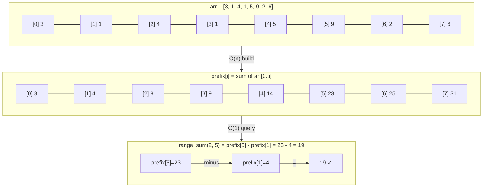

---
title: Prefix Sum
aliases: [prefix sum array, cumulative sum, range sum query, difference array]
tags: [DSA, arrays, prefix-sum, range-query]
domain: DSA
difficulty: Beginner
created: 2026-07-26
related: [Array_Operations, Sliding_Window, Two_Pointers]
status: complete
---

# ➕ Prefix Sum

> [!abstract] TL;DR
> Build a cumulative-sum array in O(n) once; then answer any range sum query `[l, r]` in O(1) with `prefix[r] - prefix[l-1]`. Extend to 2D for matrix queries. The **difference array** is the inverse — it lets you apply range updates in O(1) and read the final array in O(n).

## Intuition

Think of a **running total column in a spreadsheet**.

You have sales data for every day. Instead of summing Jan–Jun every time you need the semester total, you add a "cumulative sales" column once. Now any date range is just `cumulative[end] - cumulative[start-1]` — two lookups, regardless of range length.

That's exactly prefix sum. The O(n) upfront work on the "cumulative column" buys you O(1) per query forever after.

## How It Works

### 1D Prefix Sum Construction



### Key Formula
```
prefix[i] = arr[0] + arr[1] + ... + arr[i]
prefix[i] = prefix[i-1] + arr[i]   (recurrence)

range_sum(l, r) = prefix[r] - prefix[l-1]
               = prefix[r] - (0 if l == 0 else prefix[l-1])
```

**Off-by-one tip**: define `prefix[0] = 0` (sentinel) so the formula `prefix[r+1] - prefix[l]` works uniformly without the `l==0` special case.

### Difference Array (Range Updates)
The difference array `diff` is defined such that `arr[i] = diff[0] + diff[1] + ... + diff[i]`.

To **add `val` to every element in `arr[l..r]`**:
- `diff[l] += val`
- `diff[r+1] -= val`

After all updates, reconstruct `arr` with a prefix sum pass in O(n).

This lets you apply m range updates in O(m) total (instead of O(m*n)) and read the result in O(n).

### 2D Prefix Sum
For a matrix, `prefix[i][j]` = sum of the submatrix from `(0,0)` to `(i,j)`:
```
prefix[i][j] = matrix[i][j] + prefix[i-1][j] + prefix[i][j-1] - prefix[i-1][j-1]

submatrix_sum(r1,c1,r2,c2)
  = prefix[r2][c2]
  - prefix[r1-1][c2]
  - prefix[r2][c1-1]
  + prefix[r1-1][c1-1]
```
(inclusion-exclusion — add the overlapping corner back once)

## Complexity Analysis

| Operation | Time | Space | Notes |
|-----------|------|-------|-------|
| Build prefix array | O(n) | O(n) | One-time preprocessing |
| Range sum query | O(1) | O(1) | After build |
| Brute force range sum | O(n) per query | O(1) | No preprocessing |
| m queries brute force | O(m·n) | O(1) | Slow for many queries |
| m queries with prefix | O(n + m) | O(n) | Build once, query many |
| 2D prefix build | O(n·m) | O(n·m) | For n×m matrix |
| 2D range query | O(1) | O(1) | After build |
| Range update (diff array) | O(1) per update | O(n) | Build diff array |
| Read after diff updates | O(n) | O(1) | One prefix sum pass |

## Implementation

```python
from typing import List

# ── 1. 1D Prefix Sum — Range Sum Query (LeetCode 303) ────────────────────────
class NumArray:
    """
    Immutable array with O(1) range sum queries.
    Build: O(n)  Query: O(1)
    """
    def __init__(self, nums: List[int]):
        n = len(nums)
        # prefix[0] = 0 sentinel; prefix[i] = sum of nums[0..i-1]
        self.prefix = [0] * (n + 1)
        for i in range(n):
            self.prefix[i + 1] = self.prefix[i] + nums[i]

    def sum_range(self, left: int, right: int) -> int:
        """sum of nums[left..right] inclusive"""
        return self.prefix[right + 1] - self.prefix[left]


# ── 2. Subarray Sum Equals K (LeetCode 560) ──────────────────────────────────
def subarray_sum(nums: List[int], k: int) -> int:
    """
    Count subarrays whose sum equals k.
    Key insight: if prefix[j] - prefix[i] == k, then nums[i..j-1] sums to k.
    So count how many previous prefix sums equal (current_prefix - k).
    Time: O(n)  Space: O(n)
    """
    count = 0
    prefix_sum = 0
    # prefix_counts[x] = how many times prefix sum x has been seen
    prefix_counts = {0: 1}   # empty prefix (before index 0) has sum 0

    for num in nums:
        prefix_sum += num
        # How many subarrays ending here sum to k?
        count += prefix_counts.get(prefix_sum - k, 0)
        prefix_counts[prefix_sum] = prefix_counts.get(prefix_sum, 0) + 1

    return count


# ── 3. Product of Array Except Self (LeetCode 238) ───────────────────────────
def product_except_self(nums: List[int]) -> List[int]:
    """
    output[i] = product of all elements except nums[i].
    Done without division using prefix and suffix products.
    Time: O(n)  Space: O(1) output doesn't count
    """
    n = len(nums)
    result = [1] * n

    # Pass 1: result[i] = product of nums[0..i-1] (prefix product)
    prefix = 1
    for i in range(n):
        result[i] = prefix
        prefix *= nums[i]

    # Pass 2: multiply by product of nums[i+1..n-1] (suffix product)
    suffix = 1
    for i in range(n - 1, -1, -1):
        result[i] *= suffix
        suffix *= nums[i]

    return result


# ── 4. 2D Prefix Sum — Matrix Region Sum ─────────────────────────────────────
class NumMatrix:
    """
    Matrix with O(1) rectangular region sum queries.
    Build: O(n*m)  Query: O(1)
    """
    def __init__(self, matrix: List[List[int]]):
        n, m = len(matrix), len(matrix[0])
        # Add sentinel row and column of zeros
        self.prefix = [[0] * (m + 1) for _ in range(n + 1)]
        for i in range(1, n + 1):
            for j in range(1, m + 1):
                self.prefix[i][j] = (
                    matrix[i - 1][j - 1]
                    + self.prefix[i - 1][j]
                    + self.prefix[i][j - 1]
                    - self.prefix[i - 1][j - 1]   # subtract double-counted corner
                )

    def sum_region(self, r1: int, c1: int, r2: int, c2: int) -> int:
        """Sum of submatrix from (r1,c1) to (r2,c2) inclusive."""
        return (
            self.prefix[r2 + 1][c2 + 1]
            - self.prefix[r1][c2 + 1]
            - self.prefix[r2 + 1][c1]
            + self.prefix[r1][c1]
        )


# ── 5. Difference Array — Range Update ───────────────────────────────────────
def apply_range_updates(n: int, updates: List[List[int]]) -> List[int]:
    """
    Apply multiple [l, r, val] range additions and return the final array.
    Each update: add val to all elements arr[l..r].
    Time: O(n + m) where m = number of updates  Space: O(n)
    """
    diff = [0] * (n + 1)

    for l, r, val in updates:
        diff[l] += val
        if r + 1 <= n:
            diff[r + 1] -= val

    # Reconstruct by prefix summing the diff array
    result = []
    running = 0
    for i in range(n):
        running += diff[i]
        result.append(running)

    return result


# ── Demo ──────────────────────────────────────────────────────────────────────
if __name__ == "__main__":
    # 1D range sum
    na = NumArray([3, 1, 4, 1, 5, 9, 2, 6])
    print(na.sum_range(2, 5))   # 4+1+5+9 = 19

    # Subarray sum = k
    print(subarray_sum([1, 1, 1], 2))   # 2

    # Product except self
    print(product_except_self([1, 2, 3, 4]))  # [24, 12, 8, 6]

    # Difference array
    arr = apply_range_updates(6, [[1, 3, 5], [0, 2, -2], [4, 5, 3]])
    print(arr)  # [-2, 3, 3, 5, 3, 3]
```

## Dry Run / Example Trace

**`subarray_sum([1, 2, 3], k=3)` → `2`**

Subarrays that sum to 3: `[1,2]` and `[3]`.

| i | num | prefix_sum | prefix_sum - k | count in map | count (total) | prefix_counts |
|---|-----|-----------|---------------|-------------|--------------|--------------|
| — | — | 0 | — | — | 0 | {0:1} |
| 0 | 1 | 1 | 1-3=-2 | 0 | 0 | {0:1, 1:1} |
| 1 | 2 | 3 | 3-3=0 | 1 | 1 | {0:1, 1:1, 3:1} |
| 2 | 3 | 6 | 6-3=3 | 1 | 2 | {0:1, 1:1, 3:1, 6:1} |

Answer: **2**.

The `{0:1}` sentinel handles the case where a prefix itself sums to k (the entire prefix `[3]` in this example).

## Patterns & LeetCode Applications

| Problem | Technique | LeetCode |
|---------|-----------|----------|
| Range Sum Query - Immutable | 1D prefix sum | 303 |
| Range Sum Query 2D - Immutable | 2D prefix sum | 304 |
| Subarray Sum Equals K | Prefix sum + hash map | 560 |
| Continuous Subarray Sum | Prefix sum mod + hash map | 523 |
| Product of Array Except Self | Prefix + suffix products | 238 |
| Find Pivot Index | Prefix sum comparison | 724 |
| Running Sum of 1D Array | Direct prefix sum | 1480 |
| Corporate Flight Bookings | Difference array | 1109 |
| Car Pooling | Difference array | 1094 |

## Common Pitfalls

1. **Off-by-one on range formula** — `range_sum(l, r) = prefix[r] - prefix[l-1]` breaks when `l=0`. Use the sentinel `prefix[0]=0` approach so the formula is always `prefix[r+1] - prefix[l]`.
2. **Forgetting the sentinel `{0: 1}` in "subarray sum = k"** — without it you miss subarrays that start at index 0.
3. **2D inclusion-exclusion mistake** — forgetting to add back `prefix[r1-1][c1-1]` after subtracting two overlapping strips double-subtracts the corner.
4. **Difference array out-of-bounds** — `diff[r+1] -= val` when `r+1 == n` (allocate `diff` of size `n+1` to avoid this).
5. **Using prefix sum on a mutable array** — prefix sum assumes the array doesn't change. For updates, use a Fenwick Tree (BIT) or Segment Tree instead.

## Related Concepts

- [[_MOC_Arrays|↑ Section MOC]]
- [[Array_Operations]] — indexing and slicing basics
- [[Sliding_Window]] — alternative for dynamic window sums, no preprocessing
- [[Two_Pointers]] — pair-based traversal that complements prefix sum
- [[Fenwick_Tree]] — upgrade for mutable arrays with O(log n) update and query
- [[Hash_Table_Fundamentals]] — needed for "subarray sum = k" and mod-based variants

## Review Questions (3)

1. **Why does "subarray sum equals k" need a hash map of prefix sums rather than a simple sliding window? What property of the input breaks sliding window here?**
2. **The 2D prefix sum formula uses inclusion-exclusion. Draw a 4×4 matrix, shade the region `(1,1)` to `(3,3)`, and trace exactly which rectangles are added and subtracted in `prefix[r2][c2] - prefix[r1-1][c2] - prefix[r2][c1-1] + prefix[r1-1][c1-1]`.**
3. **You're given an array and m range-update queries (add v to all elements in [l,r]). With a difference array the total time is O(n+m). What's the time with a naive approach, and when does the crossover happen?**

## Sources

- [CP-algorithms — Prefix Sums](https://cp-algorithms.com/algebra/prefix-sums.html)
- [LeetCode — Prefix Sum article](https://leetcode.com/discuss/study-guide/563022)
- Cormen et al. — *CLRS*, Exercise 2.3

#prefix-sum #range-query #difference-array #2D-prefix #arrays
