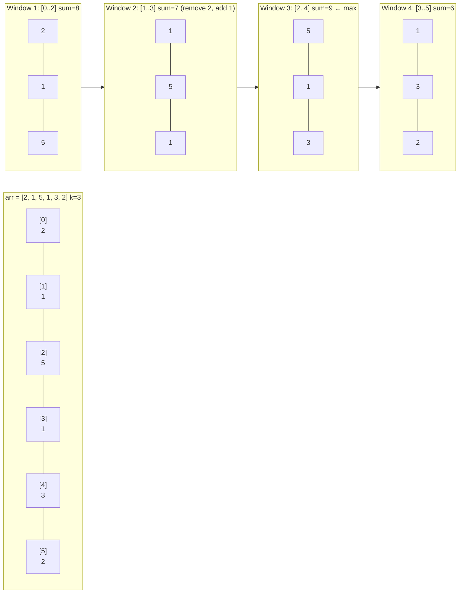
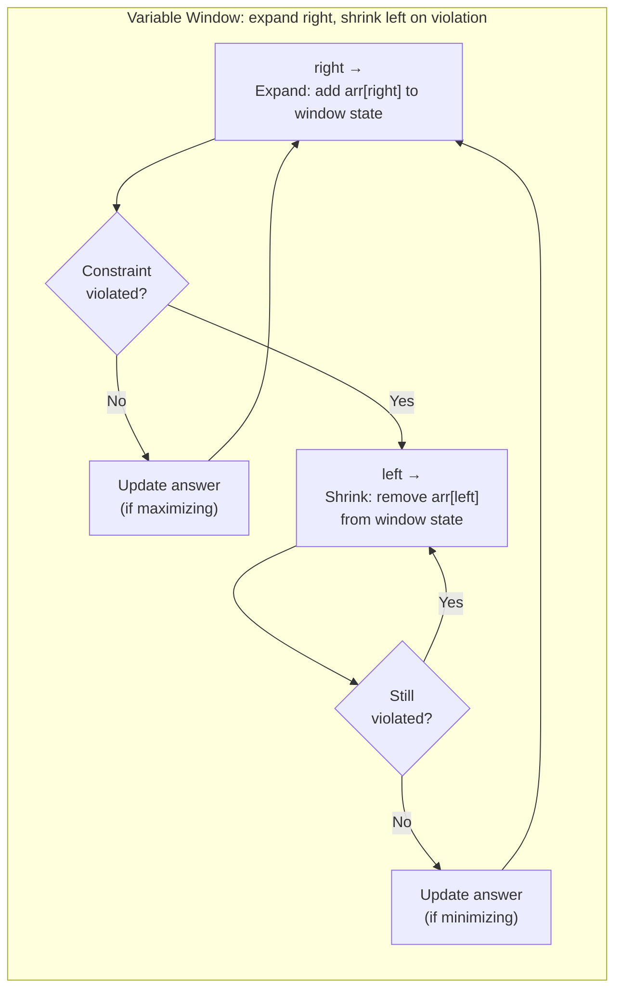

---
title: Sliding Window
aliases: [sliding window technique, variable window, fixed window]
tags: [DSA, arrays, strings, sliding-window, technique]
domain: DSA
difficulty: Intermediate
created: 2026-07-26
related: [Two_Pointers, Prefix_Sum, Hash_Table_Patterns]
status: complete
---

# 🔭 Sliding Window

> [!abstract] TL;DR
> Sliding window maintains a **contiguous subarray/substring** defined by two pointers (`left`, `right`). For **fixed-size** windows, move both pointers together. For **variable-size** windows, expand `right` greedily and shrink `left` when a constraint is violated. Converts O(n²) or O(nk) brute-force into O(n).

## Intuition

Imagine a **magnifying glass sliding over a line of text**.

- For a **fixed-size** problem (e.g., "average of every 3 words"), you slide the glass one word at a time — drop the leftmost word, gain the next rightmost. You never restart.
- For a **variable-size** problem (e.g., "find the shortest span covering all vowels"), you **expand the glass** until all vowels are covered, then **shrink it from the left** as much as possible while still covering them. Then expand again.

The key insight: **you never need to recompute the entire window** — you maintain the window state incrementally.

## How It Works

### Fixed-Size Window



Algorithm for max sum of k elements:
1. Compute sum of first k elements (initial window).
2. Slide: `window_sum += arr[right] - arr[left]`, advance both pointers.
3. Track maximum.

### Variable-Size Window (Expand & Shrink)



**Maximizing** (longest window satisfying condition): update answer after expansion, before shrinking.
**Minimizing** (shortest window satisfying condition): update answer after shrinking.

### Identifying a Sliding Window Problem
Look for these keywords:
- "longest/shortest **subarray** or **substring**..."
- "...containing exactly/at most/at least k distinct elements"
- "...sum equals/greater than/less than target"
- "**contiguous** elements only"
- "...without repeating"

## Complexity Analysis

| Variant | Time | Space | Notes |
|---------|------|-------|-------|
| Fixed window | O(n) | O(1) | One pass, constant state |
| Variable window (array) | O(n) | O(1) | Each element enters+exits window once |
| Variable window (chars) | O(n) | O(k) | Hash map of k distinct chars |
| Minimum window substring | O(n+m) | O(m) | m = pattern length |
| Brute force (for comparison) | O(n²) or O(nk) | O(1) | Nested loops |

> [!note] Why O(n)?
> Each element is added to the window **once** (when `right` passes it) and removed at most **once** (when `left` passes it). Total operations = 2n = O(n).

## Implementation

```python
from collections import defaultdict
from typing import List

# ── 1. Fixed Window: Maximum Average Subarray (LeetCode 643) ──────────────────
def find_max_average(nums: List[int], k: int) -> float:
    """
    Maximum average of any subarray of length exactly k.
    Time: O(n)  Space: O(1)
    """
    # Build the initial window
    window_sum = sum(nums[:k])
    max_sum = window_sum

    # Slide: add right element, drop left element
    for right in range(k, len(nums)):
        window_sum += nums[right] - nums[right - k]
        max_sum = max(max_sum, window_sum)

    return max_sum / k


# ── 2. Variable Window: Longest Substring Without Repeating (LeetCode 3) ──────
def length_of_longest_substring(s: str) -> int:
    """
    Find the length of the longest substring with all unique characters.
    Time: O(n)  Space: O(min(n, alphabet)) — at most 128 ASCII chars
    """
    char_index: dict[str, int] = {}  # char → last seen index
    left = 0
    best = 0

    for right, ch in enumerate(s):
        # If ch was seen and its last occurrence is inside the window
        if ch in char_index and char_index[ch] >= left:
            left = char_index[ch] + 1   # shrink: jump left past duplicate
        char_index[ch] = right
        best = max(best, right - left + 1)

    return best


# ── 3. Variable Window: Minimum Window Substring (LeetCode 76) ────────────────
def min_window(s: str, t: str) -> str:
    """
    Shortest substring of s that contains all characters of t.
    Time: O(|s| + |t|)  Space: O(|t|)
    """
    if not t or not s:
        return ""

    need = defaultdict(int)
    for ch in t:
        need[ch] += 1

    have = defaultdict(int)
    formed = 0                        # chars satisfying their required count
    required = len(need)              # distinct chars we need to satisfy

    left = 0
    best_len = float("inf")
    best_l, best_r = 0, 0

    for right, ch in enumerate(s):
        # Expand window
        have[ch] += 1
        if have[ch] == need[ch]:     # this char's requirement just met
            formed += 1

        # Shrink while window is valid
        while formed == required:
            # Update best
            if right - left + 1 < best_len:
                best_len = right - left + 1
                best_l, best_r = left, right

            # Remove left character
            left_ch = s[left]
            have[left_ch] -= 1
            if have[left_ch] < need[left_ch]:
                formed -= 1          # window no longer valid
            left += 1

    return s[best_l:best_r + 1] if best_len != float("inf") else ""


# ── 4. Variable Window: Fruit Into Baskets (LeetCode 904) ─────────────────────
def total_fruit(fruits: List[int]) -> int:
    """
    Max subarray length with at most 2 distinct values.
    Generalizes to: longest subarray with at most k distinct elements.
    Time: O(n)  Space: O(k) — here k=2
    """
    basket: dict[int, int] = {}   # fruit_type → count in window
    left = 0
    best = 0

    for right, fruit in enumerate(fruits):
        basket[fruit] = basket.get(fruit, 0) + 1

        # More than 2 types → shrink
        while len(basket) > 2:
            left_fruit = fruits[left]
            basket[left_fruit] -= 1
            if basket[left_fruit] == 0:
                del basket[left_fruit]
            left += 1

        best = max(best, right - left + 1)

    return best


# ── 5. Fixed Window: Max Sum of K Consecutive Elements ────────────────────────
def max_sum_subarray(nums: List[int], k: int) -> int:
    """Classic fixed window."""
    if len(nums) < k:
        return 0
    window = sum(nums[:k])
    best = window
    for i in range(k, len(nums)):
        window += nums[i] - nums[i - k]
        best = max(best, window)
    return best
```

## Dry Run / Example Trace

**`length_of_longest_substring("abcabcbb")` → `3`**

| right | ch | left | Window | char_index | best |
|-------|----|------|--------|-----------|------|
| 0 | a | 0 | "a" | {a:0} | 1 |
| 1 | b | 0 | "ab" | {a:0,b:1} | 2 |
| 2 | c | 0 | "abc" | {a:0,b:1,c:2} | 3 |
| 3 | a | 1 | "bca" | {a:3,b:1,c:2} | 3 (a seen at 0, left jumps to 1) |
| 4 | b | 2 | "cab" | {a:3,b:4,c:2} | 3 (b seen at 1, left jumps to 2) |
| 5 | c | 3 | "abc" | {a:3,b:4,c:5} | 3 (c seen at 2, left jumps to 3) |
| 6 | b | 5 | "cb" | {a:3,b:6,c:5} | 3 (b seen at 4, left jumps to 5) |
| 7 | b | 7 | "b" | {a:3,b:7,c:5} | 3 (b seen at 6, left jumps to 7) |

Answer: **3** (window "abc").

## Patterns & LeetCode Applications

| Problem | Window Type | Key State | LeetCode |
|---------|------------|-----------|----------|
| Max Average Subarray I | Fixed | sum | 643 |
| Minimum Size Subarray Sum | Variable (minimize) | sum ≥ target | 209 |
| Longest Substring Without Repeating | Variable (maximize) | last seen index | 3 |
| Longest Substring with At Most 2 Distinct | Variable (maximize) | count map | 159 |
| Minimum Window Substring | Variable (minimize) | need/have counts | 76 |
| Fruit Into Baskets | Variable (maximize) | at most 2 keys | 904 |
| Max Consecutive Ones III | Variable (maximize) | flip budget | 1004 |
| Permutation in String | Fixed | char frequency | 567 |

## Common Pitfalls

1. **Forgetting to shrink after constraint violation** — the `while formed == required: shrink` loop must run before updating the minimum answer; missing it gives wrong minimums.
2. **Using `if` instead of `while` for shrinking** — one `if` step may not be enough to restore validity; always shrink in a `while` loop.
3. **Recomputing window sum from scratch** — recalculating `sum(arr[left:right+1])` inside the loop turns O(n) into O(nk). Update incrementally.
4. **Off-by-one on window size** — window size is `right - left + 1`, not `right - left`. Be careful when the problem asks for "exactly k" vs "at most k".
5. **Not clearing state when the window becomes empty** — if `left > right`, reset state explicitly (especially hash map counts) for edge cases.
6. **Applying to non-contiguous problems** — sliding window only works for **contiguous** subarrays. If the problem allows skipping elements, use DP instead.

## Related Concepts

- [[_MOC_Arrays|↑ Section MOC]]
- [[Two_Pointers]] — sliding window is a specialization where both pointers move right only
- [[Prefix_Sum]] — alternative for range-sum queries without the "contiguous" constraint being dynamic
- [[Hash_Table_Patterns]] — many variable windows need a hash map to track window state
- [[Dynamic_Programming_Fundamentals]] — for non-contiguous variants that sliding window can't handle

## Review Questions (3)

1. **Why does the sliding window guarantee O(n) time even for the variable-size variant? Prove that each element is added to and removed from the window at most once.**
2. **A problem asks for the "longest subarray with sum ≤ k" where all elements are positive. Explain why two pointers (sliding window) works here but would fail if negative numbers were present.**
3. **"Permutation in String" (LeetCode 567) uses a fixed window of size `len(p)`. Describe the window state and the O(1) comparison trick to avoid comparing the full frequency map at every step.**

## Sources

- [LeetCode — Sliding Window Pattern Guide](https://leetcode.com/discuss/study-guide/1773891)
- Neetcode.io — Sliding Window playlist
- *Grokking the Coding Interview* — Sliding Window chapter

#sliding-window #arrays #strings #variable-window #fixed-window #technique
