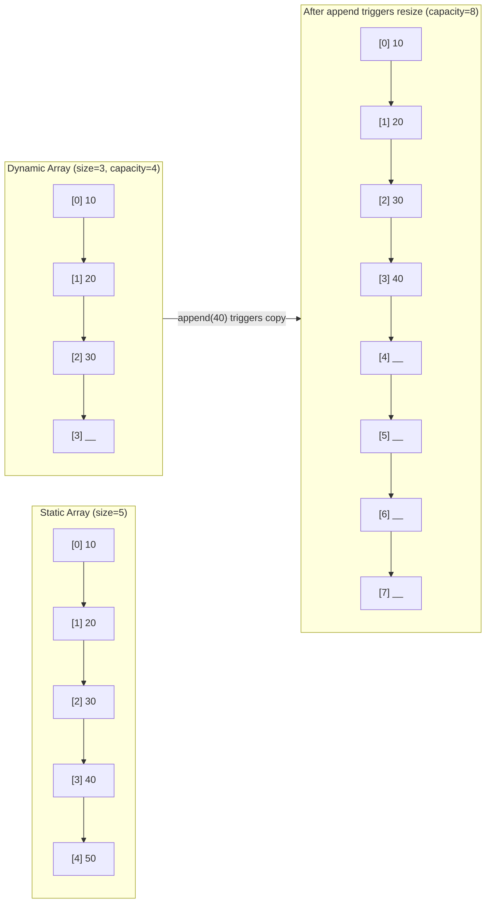

---
title: Static vs Dynamic Arrays
aliases: [dynamic array, array resizing, amortized array]
tags: [DSA, arrays, memory, amortized-analysis]
domain: DSA
difficulty: Beginner
created: 2026-07-26
related: [Amortized_Analysis, Array_Operations, Two_Pointers]
status: complete
---

# 📦 Static vs Dynamic Arrays

> [!abstract] TL;DR
> A **static array** has a fixed size decided at creation; a **dynamic array** (Python `list`, Java `ArrayList`) grows automatically by doubling its capacity, giving amortized O(1) appends. Both offer O(1) random access via contiguous memory — the key advantage over linked lists.

## Intuition

Think of a **parking lot**.

- A **static array** is a parking lot with a fixed number of painted spaces. Every space is immediately addressable (spot 7 is always in the same place), but if the lot fills up, you're stuck.
- A **dynamic array** is a parking lot that builds a new, larger lot (twice the size) whenever the current one fills — but you must **move every single car** to the new lot. This move is expensive once, but happens so rarely that the average cost per car park is still O(1).

The "move every car" step is why appending to a dynamic array is **amortized** O(1), not strictly O(1).

## How It Works

### Static Array
- Allocated at declaration; size is immutable.
- Stored as a contiguous block of memory (stack or heap).
- Element `i` lives at address `base + i * element_size` → O(1) access.

### Dynamic Array
- Maintains an internal static array plus a `size` (elements used) and `capacity` (total slots).
- **Append**: if `size < capacity`, write at index `size` and increment — O(1).
- **Resize**: if `size == capacity`, allocate a new array of size `2 * capacity`, copy all elements, then append — O(n) this one time.
- **Amortized cost**: the doubling strategy means element `i` has been copied at most `log₂(i)` times total, so total copy work across `n` appends is O(n) → O(1) amortized per append.

### Memory Layout



### Cache Locality
Contiguous memory means sequential element access hits the CPU cache line. A linked list node can live anywhere in memory — each pointer dereference is a potential cache miss. Arrays win on **cache locality** for any workload that reads elements in order.

## Complexity Analysis

| Operation | Static Array | Dynamic Array | Notes |
|-----------|-------------|---------------|-------|
| Access (index) | O(1) | O(1) | Direct address calc |
| Search (unsorted) | O(n) | O(n) | Linear scan |
| Search (sorted) | O(log n) | O(log n) | Binary search |
| Append at end | N/A | O(1) amortized | Occasional O(n) resize |
| Insert at middle | O(n) | O(n) | Shift elements right |
| Delete at middle | O(n) | O(n) | Shift elements left |
| Delete at end | O(1) | O(1) amortized | Shrink may copy |
| Space overhead | 0% | Up to 100% waste | Capacity ≥ size |

## Implementation

```python
import sys

# ── 1. Python list growth demo ────────────────────────────────────────────────
def show_list_growth():
    """Show how Python list capacity jumps in powers-of-roughly-2."""
    lst = []
    prev_size = sys.getsizeof(lst)
    print(f"len=0  bytes={prev_size}")
    for i in range(1, 33):
        lst.append(i)
        size = sys.getsizeof(lst)
        if size != prev_size:
            print(f"len={i:<3} bytes={size}  (grew by {size - prev_size})")
            prev_size = size

# ── 2. Manual dynamic array (educational) ─────────────────────────────────────
class DynamicArray:
    """Minimal dynamic array demonstrating doubling resize."""

    def __init__(self):
        self._capacity = 1
        self._size = 0
        self._data = [None] * self._capacity

    def __len__(self) -> int:
        return self._size

    def __getitem__(self, index: int):
        if not (0 <= index < self._size):
            raise IndexError("index out of range")
        return self._data[index]

    def append(self, value) -> None:
        if self._size == self._capacity:
            self._resize(2 * self._capacity)   # amortized O(1)
        self._data[self._size] = value
        self._size += 1

    def insert(self, index: int, value) -> None:
        """O(n) — must shift elements right."""
        if not (0 <= index <= self._size):
            raise IndexError("index out of range")
        if self._size == self._capacity:
            self._resize(2 * self._capacity)
        # Shift right from the end
        for i in range(self._size, index, -1):
            self._data[i] = self._data[i - 1]
        self._data[index] = value
        self._size += 1

    def delete(self, index: int) -> None:
        """O(n) — must shift elements left."""
        if not (0 <= index < self._size):
            raise IndexError("index out of range")
        for i in range(index, self._size - 1):
            self._data[i] = self._data[i + 1]
        self._data[self._size - 1] = None
        self._size -= 1

    def _resize(self, new_capacity: int) -> None:
        new_data = [None] * new_capacity
        for i in range(self._size):
            new_data[i] = self._data[i]
        self._data = new_data
        self._capacity = new_capacity

    def __repr__(self) -> str:
        return f"DynamicArray({self._data[:self._size]}, cap={self._capacity})"


# ── Demo ───────────────────────────────────────────────────────────────────────
if __name__ == "__main__":
    show_list_growth()

    da = DynamicArray()
    for v in [10, 20, 30, 40]:
        da.append(v)
        print(da)           # DynamicArray([10, 20, 30, 40], cap=4)

    da.insert(1, 15)
    print(da)               # DynamicArray([10, 15, 20, 30, 40], cap=8)

    da.delete(2)
    print(da)               # DynamicArray([10, 15, 30, 40], cap=8)
```

## Dry Run / Example Trace

Appending `[1, 2, 3, 4, 5]` to a `DynamicArray` starting with `capacity=1`:

| Step | Action | size | capacity | What happened |
|------|--------|------|----------|---------------|
| 1 | append(1) | 1 | 1 | Written at [0]; full → no resize yet |
| 2 | append(2) | 2 | 2 | size==cap → resize to 2, copy [1], write 2 |
| 3 | append(3) | 3 | 4 | size==cap → resize to 4, copy [1,2], write 3 |
| 4 | append(4) | 4 | 4 | Slot available; write 4 |
| 5 | append(5) | 5 | 8 | size==cap → resize to 8, copy [1,2,3,4], write 5 |

Total copies so far: 0+1+2+0+4 = **7 copies for 5 appends** → averages < 2 copies/append → O(1) amortized.

## Patterns & LeetCode Applications

| Pattern | Why arrays fit | Example problems |
|---------|---------------|-----------------|
| Two Pointers | O(1) index access to both ends | Two Sum II, Container With Most Water |
| Sliding Window | Contiguous subarray tracking | Max Subarray Sum, Longest Substring |
| Binary Search | Random access needed | Search in Rotated Sorted Array |
| Prefix Sum | Indexed cumulative sums | Range Sum Query, Subarray Sum = K |
| In-place transforms | Direct element swaps | Rotate Array, Next Permutation |

## Common Pitfalls

1. **Off-by-one on capacity check** — checking `size > capacity` instead of `size == capacity` before resize; can overwrite one slot.
2. **Forgetting amortized** — claiming append is always O(1); it's O(1) *amortized*, O(n) worst case. Important for real-time systems.
3. **Not nulling deleted slots** — `delete` without clearing the last slot can cause memory leaks in Python (reference held).
4. **Assuming Python `list.insert(0, x)` is O(1)** — it's O(n); only `append` is O(1) amortized.
5. **Using a list as a static array for fixed-size problems** — overhead of capacity tracking; prefer `array` module or `numpy` for fixed-size numeric work.

## Related Concepts

- [[_MOC_Arrays|↑ Section MOC]]
- [[Amortized_Analysis]] — formal proof that doubling gives O(1) amortized append
- [[Array_Operations]] — all common operations with exact complexities
- [[Two_Pointers]] — technique that exploits O(1) random access
- [[Sliding_Window]] — contiguous subarray problems built on array indexing
- [[Prefix_Sum]] — preprocessing technique for O(1) range queries

## Review Questions (3)

1. **Why does doubling the capacity on resize give amortized O(1) append, while growing by +1 each time would give O(n²) total work for n appends?**
2. **A static array `int[5]` is declared on the stack. A dynamic array doubles its capacity. What happens to the old backing array in memory when a resize occurs?**
3. **Python's `list.pop()` is O(1) but `list.pop(0)` is O(n). Explain why using the internal array model.**

## Sources

- [Python list object source (CPython listobject.c)](https://github.com/python/cpython/blob/main/Objects/listobject.c)
- Sedgewick & Wayne — *Algorithms (4th ed.)*, Section 1.3
- [LeetCode Explore — Arrays 101](https://leetcode.com/explore/learn/card/fun-with-arrays/)

#arrays #dynamic-array #amortized #memory-layout #cache-locality
