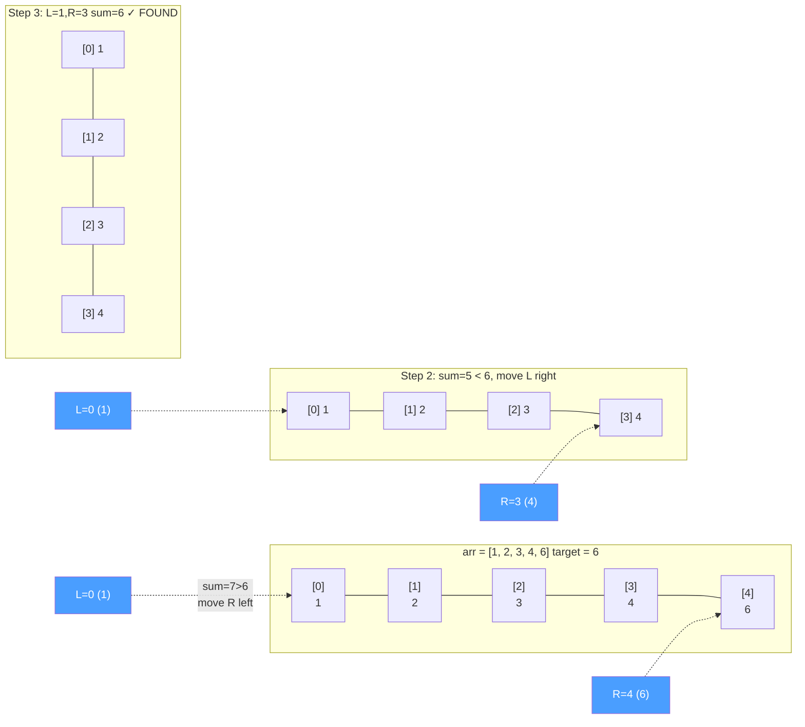

---
title: Two Pointers
aliases: [two pointer technique, left right pointers, slow fast pointers]
tags: [DSA, arrays, two-pointers, technique]
domain: DSA
difficulty: Beginner
created: 2026-07-26
related: [Sliding_Window, Fast_Slow_Pointers, Binary_Search]
status: complete
---

# 👉👈 Two Pointers

> [!abstract] TL;DR
> Two pointers means maintaining **two index variables** that traverse an array — usually from both ends toward the center (left+right), or both from the left at different speeds (slow+fast). This converts many O(n²) brute-force problems into O(n) solutions with O(1) extra space.

## Intuition

Picture **two people walking toward each other** in a long corridor.

- If they each walk from one end toward the middle, together they cover every position in the corridor in O(n) total steps — not O(n²) (which would be every person checking every position with every other person).
- If instead one person jogs at double speed and both start at the same end, the faster one "laps" information the slower one hasn't reached yet — useful for detecting cycles or finding midpoints.

The trick is: **instead of every pair of elements (O(n²))**, you use the structure of the problem (sorted order, in-place constraint, symmetry) to know which pointer to move at each step.

## How It Works

### Pattern 1: Left + Right from Ends (Sorted Array)



**Decision rule for pair sum on sorted array:**
- `arr[L] + arr[R] == target` → found!
- `arr[L] + arr[R] < target` → need a bigger number → move `L` right
- `arr[L] + arr[R] > target` → need a smaller number → move `R` left

This works because the array is **sorted**: moving `L` right always increases the sum; moving `R` left always decreases it.

### Pattern 2: Slow + Fast (In-Place Overwrite)
Used when you want to filter elements in-place without extra space:
- `slow` tracks where the next valid element should be written.
- `fast` scans every element.
- When `fast` finds a valid element, write it at `slow`, increment `slow`.

### When to Reach for Two Pointers
- The input is **sorted** (or can be).
- You need **in-place** operations (O(1) space).
- You're asked about **pairs/triplets** satisfying a condition.
- **Palindrome** checks.
- **Merging** two sorted arrays.

## Complexity Analysis

| Problem | Time | Space | Notes |
|---------|------|-------|-------|
| Pair sum (sorted) | O(n) | O(1) | vs O(n²) brute force |
| Remove duplicates in-place | O(n) | O(1) | slow+fast overwrite |
| Valid palindrome | O(n) | O(1) | left+right compare |
| Three sum | O(n²) | O(1) | sort + outer loop + inner two-ptr |
| Container with most water | O(n) | O(1) | greedy pointer move |
| Trapping rain water | O(n) | O(1) | track max from each side |

## Implementation

```python
from typing import List

# ── 1. Pair Sum in Sorted Array (LeetCode 167) ────────────────────────────────
def two_sum_sorted(numbers: List[int], target: int) -> List[int]:
    """
    Given a 1-indexed sorted array, return indices [l, r] where
    numbers[l-1] + numbers[r-1] == target.
    Time: O(n)  Space: O(1)
    """
    left, right = 0, len(numbers) - 1
    while left < right:
        current_sum = numbers[left] + numbers[right]
        if current_sum == target:
            return [left + 1, right + 1]   # 1-indexed output
        elif current_sum < target:
            left += 1    # need larger sum
        else:
            right -= 1   # need smaller sum
    return []            # no solution (problem guarantees one exists)


# ── 2. Remove Duplicates In-Place (LeetCode 26) ───────────────────────────────
def remove_duplicates(nums: List[int]) -> int:
    """
    Remove duplicates from sorted array in-place.
    Returns the length k of the unique prefix.
    Time: O(n)  Space: O(1)
    """
    if not nums:
        return 0
    slow = 0                          # last written unique position
    for fast in range(1, len(nums)):
        if nums[fast] != nums[slow]:  # found a new unique element
            slow += 1
            nums[slow] = nums[fast]   # write it at slow
    return slow + 1                   # length of unique prefix


# ── 3. Valid Palindrome (LeetCode 125) ────────────────────────────────────────
def is_palindrome(s: str) -> bool:
    """
    Check if s is a palindrome ignoring non-alphanumeric and case.
    Time: O(n)  Space: O(1)
    """
    left, right = 0, len(s) - 1
    while left < right:
        while left < right and not s[left].isalnum():
            left += 1
        while left < right and not s[right].isalnum():
            right -= 1
        if s[left].lower() != s[right].lower():
            return False
        left += 1
        right -= 1
    return True


# ── 4. Three Sum (LeetCode 15) ────────────────────────────────────────────────
def three_sum(nums: List[int]) -> List[List[int]]:
    """
    Find all unique triplets that sum to zero.
    Time: O(n²)  Space: O(1) excluding output
    """
    nums.sort()
    result = []
    for i in range(len(nums) - 2):
        if i > 0 and nums[i] == nums[i - 1]:
            continue                   # skip duplicate outer element
        left, right = i + 1, len(nums) - 1
        while left < right:
            total = nums[i] + nums[left] + nums[right]
            if total == 0:
                result.append([nums[i], nums[left], nums[right]])
                # skip duplicates on both sides
                while left < right and nums[left] == nums[left + 1]:
                    left += 1
                while left < right and nums[right] == nums[right - 1]:
                    right -= 1
                left += 1
                right -= 1
            elif total < 0:
                left += 1
            else:
                right -= 1
    return result


# ── 5. Container With Most Water (LeetCode 11) ────────────────────────────────
def max_area(height: List[int]) -> int:
    """
    Greedy: always move the shorter wall inward — it's the only chance
    to find a taller one that could increase area.
    Time: O(n)  Space: O(1)
    """
    left, right = 0, len(height) - 1
    best = 0
    while left < right:
        width = right - left
        area = min(height[left], height[right]) * width
        best = max(best, area)
        if height[left] <= height[right]:
            left += 1   # shorter side moved
        else:
            right -= 1
    return best
```

## Dry Run / Example Trace

**`three_sum([-1, 0, 1, 2, -1, -4])` → `[[-1,-1,2],[-1,0,1]]`**

After sorting: `[-4, -1, -1, 0, 1, 2]`

| i | nums[i] | L | R | sum | Action |
|---|---------|---|---|-----|--------|
| 0 | -4 | 1 | 5 | -4+-1+2=-3 | < 0 → L++ |
| 0 | -4 | 2 | 5 | -4+-1+2=-3 | < 0 → L++ |
| 0 | -4 | 3 | 5 | -4+0+2=-2 | < 0 → L++ |
| 0 | -4 | 4 | 5 | -4+1+2=-1 | < 0 → L++ |
| 0 | -4 | L>=R | — | — | inner loop done |
| 1 | -1 | 2 | 5 | -1+-1+2=0 | **Found** [-1,-1,2] |
| 1 | -1 | 3 | 4 | -1+0+1=0 | **Found** [-1,0,1] |
| 1 | -1 | L>=R | — | — | done |
| 2 | -1 | dup skip | — | — | nums[2]==nums[1] |
| ... | 0,1 | 0+1+2=3>0 | R-- | ... | no more zeroes |

Result: `[[-1,-1,2], [-1,0,1]]`

## Patterns & LeetCode Applications

| Pattern | Key Insight | LeetCode Problems |
|---------|-------------|------------------|
| Pair sum in sorted | Move toward target sum | 167, 653 |
| Three sum / Four sum | Sort + fix outer + two-ptr inner | 15, 18 |
| Remove duplicates | Slow writes, fast scans | 26, 80, 283 |
| Palindrome check | Converge from both ends | 125, 680 |
| Container / most water | Move shorter wall inward | 11 |
| Trapping rain water | Max from left and right | 42 |
| Merge sorted arrays | Two pointers from both array starts | 88 |

## Common Pitfalls

1. **Using two pointers on unsorted input for pair sum** — the decision of which pointer to move relies on sorted order. Always sort first (O(n log n)) or verify the array is already sorted.
2. **Infinite loop in three sum** — forgetting to advance `left` and `right` after finding a triplet, or not skipping duplicates, can cause infinite loops.
3. **Confusing slow+fast with left+right** — slow+fast both start at 0 and move rightward at different rates; left+right start at opposite ends. Mixing the patterns causes wrong results.
4. **Off-by-one in palindrome** — using `left <= right` instead of `left < right`; when `left == right` (odd-length string middle), comparing a char to itself is always true — harmless but wastes a step. The condition `left < right` is cleaner.
5. **Not handling the empty array / single element** — always add a guard for `len(nums) < 2`.

## Related Concepts

- [[_MOC_Arrays|↑ Section MOC]]
- [[Sliding_Window]] — related "window" idea but the window's two ends don't necessarily converge
- [[Fast_Slow_Pointers]] — slow+fast variant specialized for linked list cycle detection
- [[Binary_Search]] — another O(log n) technique that exploits sorted order
- [[Prefix_Sum]] — alternative for range queries that doesn't require sorted input

## Review Questions (3)

1. **Two Sum on an unsorted array requires O(n) extra space (hash map) for O(n) time. Two Sum II on a sorted array uses O(1) space and O(n) time via two pointers. What property of sorted arrays makes the O(1) space solution possible?**
2. **Why does the "container with most water" problem always move the shorter wall inward, never the taller one? Prove that moving the taller wall can never lead to a larger area.**
3. **Three Sum has O(n²) time complexity even with two pointers. Can it be solved in O(n log n)? Why or why not?**

## Sources

- [LeetCode — Two Pointers Explore Card](https://leetcode.com/explore/learn/card/array-and-string/)
- Neetcode.io — Two Pointers video series
- *Elements of Programming Interviews* — Array chapter

#two-pointers #arrays #in-place #O-n #sorted-array
