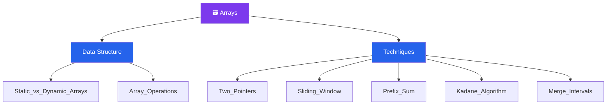

# 🗃 Arrays — Map of Content

> [!abstract] What This Section Covers
> Arrays are the most fundamental data structure in computing and the substrate for a large family of interview problems. This section covers the structural difference between static and dynamic arrays, core array operations and their complexities, and five high-leverage problem-solving techniques that operate directly on arrays: the two-pointer pattern for shrinking search spaces, the sliding window for subarray/substring problems, prefix sums for range queries, Kadane's algorithm for the maximum subarray problem, and merging overlapping intervals. These techniques alone unlock a substantial portion of easy and medium array interview questions.

## Concept Map

## Learning Path

Recommended order to study the notes in this section.

1. [[Static_vs_Dynamic_Arrays]] — Understand memory layout, resizing strategy, and when each is appropriate
2. [[Array_Operations]] — Time complexity of access, search, insert, and delete; cache locality implications
3. [[Prefix_Sum]] — Precompute cumulative sums to answer range-sum queries in O(1) after O(n) preprocessing
4. [[Two_Pointers]] — Collapse O(n²) brute-force pair searches to O(n) with a left/right pointer strategy
5. [[Sliding_Window]] — Maintain a variable- or fixed-size window to solve subarray problems in O(n)
6. [[Kadane_Algorithm]] — Find the maximum-sum contiguous subarray using a single O(n) pass
7. [[Merge_Intervals]] — Sort intervals by start, then sweep and merge overlaps; the gateway to interval-scheduling problems

## All Notes at a Glance

| Note | Summary | Difficulty |
|------|---------|------------|
| [[Static_vs_Dynamic_Arrays]] | Fixed vs. resizable arrays; amortized O(1) append in dynamic arrays | Beginner |
| [[Array_Operations]] | Access O(1), search O(n), insert/delete O(n) with shift; cache effects | Beginner |
| [[Two_Pointers]] | Left/right or fast/slow pointers to solve sorted-array and in-place problems | Beginner |
| [[Sliding_Window]] | Fixed or variable window that slides to track a subarray property in O(n) | Intermediate |
| [[Prefix_Sum]] | Transform an array so range-sum queries become O(1) subtraction | Beginner |
| [[Kadane_Algorithm]] | DP-flavored greedy scan for maximum contiguous subarray sum | Intermediate |
| [[Merge_Intervals]] | Sort-then-sweep to merge/insert overlapping intervals | Intermediate |

## Key Questions This Section Answers

- When should you use a sliding window versus two pointers?
- What preprocessing makes range sum queries O(1) and how much space does it cost?
- How does Kadane's algorithm decide when to start a new subarray vs. extend the current one?
- Why does a dynamic array achieve amortized O(1) append despite occasional O(n) resizing?
- How do you handle the two-pointer pattern on an unsorted array?
- What is the maximum subarray problem and why is it a gateway to dynamic programming thinking?

## Related Sections

- [[_MOC_DSA_Master|↑ DSA Master MOC]]
- [[_MOC_Linked_Lists|→ Linked Lists]] — sequential access structure; contrast with array random access

#MOC #DSA #arrays
