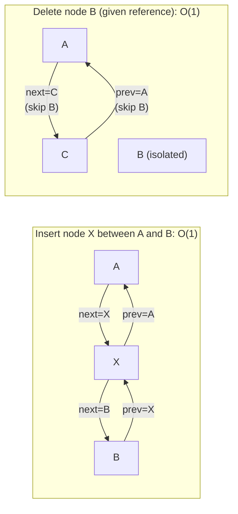

---
title: Doubly Linked List
aliases: [DLL, doubly linked list, deque internals, LRU cache]
tags: [DSA, linked-lists, data-structures, LRU-cache, deque]
domain: DSA
difficulty: Beginner
created: 2026-07-26
related: [Singly_Linked_List, Hash_Table_Fundamentals, Deque]
status: complete
---

# ↔️ Doubly Linked List

> [!abstract] TL;DR
> A doubly linked list augments each node with a `prev` pointer in addition to `next`. The key win: **O(1) delete of any node given its reference** (no predecessor traversal needed). This is the backbone of the **LRU Cache** (combined with a hash map) and Python's `collections.deque`.

## Intuition

Think of a **two-way street** versus a one-way street.

- A **singly linked list** is a one-way street: to remove the car at position k, you must drive from the start to find the car just before it, then redirect traffic.
- A **doubly linked list** is a two-way street: every car knows the car in front AND behind. To remove any car, just tell its neighbors to connect to each other — O(1), no traversal needed.

The cost: every node stores one extra pointer (space), and every insert/delete must update two links instead of one (complexity constant, not asymptotic).

## How It Works

### Node Structure

```
None ←──── prev | val | next ────→ prev | val | next ────→ None
            head                                 tail
```

### Insert and Delete Diagrams



Delete algorithm (given pointer to node `B`):
```python
B.prev.next = B.next
if B.next:
    B.next.prev = B.prev
```
No traversal — **O(1)** because we have `B.prev` directly.

Compare to singly linked list: to delete `B` you need `A` (B's predecessor), which requires traversal from `head` — O(n).

### Sentinel Nodes (Dummy Head + Tail)
A common implementation adds a permanent dummy `head` and `tail` sentinel. Every real node lives between them:
```
dummy_head ↔ real_nodes... ↔ dummy_tail
```
Benefits:
- Insert/delete at head or tail has no edge-case special handling.
- `dummy_head.next` = first real node; `dummy_tail.prev` = last real node.
- No null checks needed for `prev.next` or `next.prev`.

This exact structure is used in the LRU Cache implementation.

## Complexity Analysis

| Operation | DLL | SLL | Notes |
|-----------|-----|-----|-------|
| Access by index | O(n) | O(n) | Traverse from nearer end (DLL) |
| Insert at head | O(1) | O(1) | Update 2 pointers vs 1 |
| Insert at tail | O(1) | O(1) with tail ptr | Both need tail pointer |
| Insert at middle | O(n) | O(n) | Traversal to position |
| Delete given node ref | **O(1)** | O(n) | DLL's key advantage |
| Delete at head | O(1) | O(1) | |
| Delete at tail | O(1) | O(n) | DLL has prev pointer |
| Search | O(n) | O(n) | |
| Reverse traversal | O(n) | Not possible | DLL's second advantage |
| Space per node | O(1) extra | — | One extra pointer |

## Implementation

```python
from __future__ import annotations
from typing import Optional, Any

# ── DLL Node ──────────────────────────────────────────────────────────────────
class DLLNode:
    def __init__(self, key: Any = 0, val: Any = 0):
        self.key = key
        self.val = val
        self.prev: Optional[DLLNode] = None
        self.next: Optional[DLLNode] = None


# ── Doubly Linked List with Sentinels ─────────────────────────────────────────
class DoublyLinkedList:
    """
    DLL with dummy head and tail sentinels.
    All real nodes live between head and tail.
    """
    def __init__(self):
        self.head = DLLNode()          # sentinel: head.next = first real node
        self.tail = DLLNode()          # sentinel: tail.prev = last real node
        self.head.next = self.tail
        self.tail.prev = self.head
        self._size = 0

    def insert_after(self, node: DLLNode, new_node: DLLNode) -> None:
        """Insert new_node immediately after node. O(1)."""
        new_node.prev = node
        new_node.next = node.next
        node.next.prev = new_node
        node.next = new_node
        self._size += 1

    def insert_front(self, node: DLLNode) -> None:
        """Insert at the front (after dummy head). O(1)."""
        self.insert_after(self.head, node)

    def insert_back(self, node: DLLNode) -> None:
        """Insert at the back (before dummy tail). O(1)."""
        self.insert_after(self.tail.prev, node)

    def remove(self, node: DLLNode) -> None:
        """Remove any node in O(1) given its reference."""
        node.prev.next = node.next
        node.next.prev = node.prev
        node.prev = node.next = None   # help GC
        self._size -= 1

    def pop_back(self) -> Optional[DLLNode]:
        """Remove and return the last real node. O(1)."""
        if self._size == 0:
            return None
        node = self.tail.prev
        self.remove(node)
        return node

    def __len__(self) -> int:
        return self._size

    def to_list(self) -> list:
        result, curr = [], self.head.next
        while curr is not self.tail:
            result.append(curr.val)
            curr = curr.next
        return result


# ── LRU Cache (LeetCode 146) ──────────────────────────────────────────────────
class LRUCache:
    """
    O(1) get and put using hash map + doubly linked list.
    Most-recently-used: front (after dummy head)
    Least-recently-used: back (before dummy tail)

    get(key):
      - Cache miss → return -1
      - Cache hit  → move node to front, return val

    put(key, val):
      - If key exists → update val, move to front
      - If key new    → insert at front
        - If over capacity → evict from back (LRU), remove from map
    """
    def __init__(self, capacity: int):
        self.cap = capacity
        self.map: dict[Any, DLLNode] = {}
        self.dll = DoublyLinkedList()

    def get(self, key: Any) -> int:
        if key not in self.map:
            return -1
        node = self.map[key]
        self._move_to_front(node)
        return node.val

    def put(self, key: Any, val: int) -> None:
        if key in self.map:
            node = self.map[key]
            node.val = val
            self._move_to_front(node)
        else:
            node = DLLNode(key, val)
            self.map[key] = node
            self.dll.insert_front(node)
            if len(self.dll) > self.cap:
                evicted = self.dll.pop_back()
                if evicted:
                    del self.map[evicted.key]

    def _move_to_front(self, node: DLLNode) -> None:
        """Remove from current position and insert at front. O(1)."""
        self.dll.remove(node)
        self.dll.insert_front(node)


# ── Demo ──────────────────────────────────────────────────────────────────────
if __name__ == "__main__":
    # DLL demo
    dll = DoublyLinkedList()
    for v in [1, 2, 3]:
        n = DLLNode(val=v)
        dll.insert_back(n)
    print(dll.to_list())    # [1, 2, 3]

    node2 = dll.head.next.next   # node with val=2
    dll.remove(node2)
    print(dll.to_list())    # [1, 3]

    # LRU Cache demo
    cache = LRUCache(2)
    cache.put(1, 1)          # cache: {1:1}
    cache.put(2, 2)          # cache: {1:1, 2:2}
    print(cache.get(1))      # 1 — hits key 1, moves to front
    cache.put(3, 3)          # evicts key 2 (LRU), cache: {1:1, 3:3}
    print(cache.get(2))      # -1 — was evicted
    cache.put(4, 4)          # evicts key 1 (LRU), cache: {3:3, 4:4}
    print(cache.get(1))      # -1
    print(cache.get(3))      # 3
    print(cache.get(4))      # 4
```

## Dry Run / Example Trace

**LRU Cache (capacity=2):** `put(1,1), put(2,2), get(1), put(3,3), get(2)`

| Action | DLL (front→back) | Hash Map | Notes |
|--------|-----------------|----------|-------|
| put(1,1) | [1] | {1:n1} | Insert at front |
| put(2,2) | [2, 1] | {1:n1, 2:n2} | Insert at front |
| get(1) | [1, 2] | {1:n1, 2:n2} | Hit: move 1 to front |
| put(3,3) | [3, 1] | {1:n1, 3:n3} | New key; evict LRU=2 (back) |
| get(2) | [3, 1] | unchanged | **Miss** → return -1 |

The DLL keeps recency order; the hash map gives O(1) node lookup; the combination gives O(1) for both get and put.

## Patterns & LeetCode Applications

| Problem | Technique | LeetCode |
|---------|-----------|----------|
| LRU Cache | DLL + hash map | 146 |
| LFU Cache | DLL + hash map (frequency buckets) | 460 |
| Design Browser History | DLL with current pointer | 1472 |
| Flatten Multilevel DLL | DFS/in-place pointer manipulation | 430 |
| All O(1) Data Structure | Multiple DLLs + hash maps | 432 |

## Common Pitfalls

1. **Updating only one direction** — every pointer change in a DLL affects two links (next and prev). Missing one corrupts the list. Always update both.
2. **Not using sentinels** — without dummy head/tail, every operation needs null checks for the first and last node. Sentinels eliminate all of these.
3. **LRU: evicting before inserting or vice versa** — insert first, then check capacity. If you evict first on a put for an existing key, you may accidentally evict the key you're updating.
4. **LRU: forgetting to remove evicted key from hash map** — the node is removed from the DLL but its key remains in the map, giving stale hits.
5. **DLL node `key` field omission** — when evicting from the DLL in LRU, you need the key to delete from the hash map. Store key in the node.
6. **Cycles in insert_after** — if `node` and `new_node` are the same object, the pointer updates create a self-loop. Guard against inserting a node that's already in the list.

## Related Concepts

- [[_MOC_Linked_Lists|↑ Section MOC]]
- [[Singly_Linked_List]] — predecessor; DLL adds prev pointer and O(1) arbitrary delete
- [[Hash_Table_Fundamentals]] — the other half of LRU cache (O(1) lookup)
- [[Deque]] — Python's `collections.deque` is a DLL under the hood
- [[Fast_Slow_Pointers]] — cycle detection also applies to DLLs
- [[Linked_List_Patterns]] — merge, reverse, and other shared patterns

## Review Questions (3)

1. **Why is "delete given a direct pointer to the node" O(1) in a DLL but O(n) in a SLL? What specific piece of information does `node.prev` give you that eliminates the need for traversal?**
2. **The LRU Cache puts and gets are both O(1). Trace through what happens to the DLL and hash map when you `put` a key that already exists in the cache. How does this differ from inserting a new key?**
3. **Python's `collections.deque` offers O(1) appendleft and popleft. A Python `list` offers O(n) for the same operations. Explain why, and describe under what conditions you'd choose `deque` over `list`.**

## Sources

- [LeetCode 146 — LRU Cache](https://leetcode.com/problems/lru-cache/)
- [Python deque source (CPython)](https://github.com/python/cpython/blob/main/Modules/_collectionsmodule.c)
- Cormen et al. — *CLRS*, Section 10.2

#doubly-linked-list #DLL #LRU-cache #deque #data-structures
