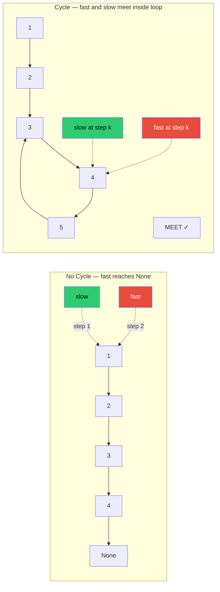

---
title: Fast & Slow Pointers
aliases: [Floyd's cycle detection, tortoise and hare, fast slow pointers, Floyd_Cycle_Detection]
tags: [DSA, linked-lists, two-pointers, Floyd, cycle-detection]
domain: DSA
difficulty: Intermediate
created: 2026-07-26
related: [Singly_Linked_List, Two_Pointers, Floyd_Cycle_Detection]
status: complete
---

# 🐢🐇 Fast & Slow Pointers

> [!abstract] TL;DR
> Fast+slow pointers (Floyd's algorithm) uses **two pointers at different speeds** — slow moves 1 step, fast moves 2 steps. If there's a cycle, they must meet. If there's no cycle, fast hits `None` first. This solves cycle detection, cycle entry, middle-finding, and nth-from-end in O(n) time and O(1) space.

## Intuition

Picture **two runners on a circular track**: one jogs at 1 lap/hour, the other sprints at 2 laps/hour.

- If the track is circular (there's a loop), the faster runner will eventually **lap** the slower one — they'll meet somewhere on the loop.
- If the track is a straight road (no loop), the faster runner reaches the end first and they **never meet**.

No matter how long the loop is, the fast runner gains exactly 1 step on the slow runner per iteration, so they converge within at most `cycle_length` steps.

On a straight track (no cycle), they never meet because fast always stays ahead of slow on a one-way path.

## How It Works

### Cycle Detection Proof



**Why they always meet (if a cycle exists):**
- Let `non_cycle_length = F`, `cycle_length = C`.
- When slow enters the cycle, fast is already `F mod C` steps ahead of slow inside the cycle.
- Each iteration, fast gains 1 step on slow (moves 2, slow moves 1).
- The gap closes by 1 per step → they meet in at most C steps.
- Meeting is guaranteed in O(F + C) = O(n) total steps.

### Finding the Cycle Entry Point

After detecting a meeting point `m`:
1. Reset `slow` to `head`.
2. Keep `fast` at `m`.
3. Advance **both** by 1 step at a time.
4. They meet at the **cycle entry**.

**Mathematical proof:** Let `F` = distance head→entry, `C` = cycle length, `a` = distance entry→meeting point inside cycle. When slow is at entry (F steps), fast has traveled 2F steps = F + (F mod C) inside cycle. The meeting point satisfies: slow traveled `F + a`, fast traveled `2(F + a)`. Extra distance for fast inside cycle = `F + a = kC` for some k. So `a = kC - F`. When we reset slow to head, slow needs `F` more steps to reach entry. Fast is at meeting point, `C - a = C - (kC - F) = F` steps from entry. Both arrive at entry simultaneously after F steps. ∎

### Finding the Middle

- Start slow and fast at `head`.
- Advance: slow 1 step, fast 2 steps.
- When fast reaches end (`None` or last node), slow is at the **middle**.
- For even-length lists, slow lands at the **second middle** (right of center) by default.

### Nth Node from End

- Advance fast `n` steps ahead of slow.
- Move both 1 step at a time.
- When fast reaches `None`, slow is at the **nth node from the end**.

## Complexity Analysis

| Problem | Time | Space | Notes |
|---------|------|-------|-------|
| Detect cycle | O(n) | O(1) | vs O(n) hash set approach |
| Find cycle entry | O(n) | O(1) | Two phases |
| Find middle | O(n) | O(1) | Single pass |
| Find nth from end | O(n) | O(1) | Single pass |
| Palindrome linked list | O(n) | O(1) | Middle + reverse second half |
| Hash set cycle detection | O(n) | O(n) | Slower in practice |

## Implementation

```python
from __future__ import annotations
from typing import Optional

class ListNode:
    def __init__(self, val: int = 0, next: Optional[ListNode] = None):
        self.val = val
        self.next = next


# ── 1. Detect Cycle (LeetCode 141) ────────────────────────────────────────────
def has_cycle(head: Optional[ListNode]) -> bool:
    """
    True if the linked list contains a cycle.
    Time: O(n)  Space: O(1)
    """
    slow = fast = head
    while fast and fast.next:
        slow = slow.next           # 1 step
        fast = fast.next.next      # 2 steps
        if slow is fast:           # identity check, not equality
            return True
    return False


# ── 2. Find Cycle Entry (LeetCode 142) ────────────────────────────────────────
def detect_cycle(head: Optional[ListNode]) -> Optional[ListNode]:
    """
    Return the node where the cycle begins, or None if no cycle.
    Time: O(n)  Space: O(1)
    """
    slow = fast = head

    # Phase 1: find meeting point
    while fast and fast.next:
        slow = slow.next
        fast = fast.next.next
        if slow is fast:
            break
    else:
        return None   # no cycle

    # Phase 2: reset slow to head, advance both 1-step until they meet
    slow = head
    while slow is not fast:
        slow = slow.next
        fast = fast.next

    return slow   # cycle entry node


# ── 3. Find Middle (LeetCode 876) ────────────────────────────────────────────
def middle_node(head: Optional[ListNode]) -> Optional[ListNode]:
    """
    Return the middle node. For even length, return the SECOND middle.
    [1,2,3] → node(2)
    [1,2,3,4] → node(3)  ← second middle
    Time: O(n)  Space: O(1)
    """
    slow = fast = head
    while fast and fast.next:
        slow = slow.next
        fast = fast.next.next
    return slow


# ── 4. Nth Node From End (LeetCode 19 — Remove Nth) ──────────────────────────
def remove_nth_from_end(head: Optional[ListNode], n: int) -> Optional[ListNode]:
    """
    Remove the nth node from the end in one pass.
    Strategy: advance fast n steps ahead, then move both until fast.next=None.
    slow.next is then the node to delete.
    Time: O(n)  Space: O(1)
    """
    dummy = ListNode(0, head)   # dummy head to handle removing actual head
    slow, fast = dummy, dummy

    # Advance fast n+1 steps (so slow stops at predecessor of target)
    for _ in range(n + 1):
        fast = fast.next        # type: ignore

    while fast:
        slow = slow.next        # type: ignore
        fast = fast.next        # type: ignore

    # slow.next is the node to delete
    slow.next = slow.next.next  # type: ignore
    return dummy.next


# ── 5. Palindrome Linked List (LeetCode 234) ──────────────────────────────────
def is_palindrome(head: Optional[ListNode]) -> bool:
    """
    Check if linked list is a palindrome.
    Strategy:
      1. Find middle with fast/slow
      2. Reverse the second half
      3. Compare first and second halves
      4. (Optional) restore the list
    Time: O(n)  Space: O(1)
    """
    # Step 1: find middle
    slow = fast = head
    while fast and fast.next:
        slow = slow.next
        fast = fast.next.next

    # Step 2: reverse second half starting at slow
    prev, curr = None, slow
    while curr:
        nxt = curr.next
        curr.next = prev
        prev = curr
        curr = nxt
    second_half_head = prev

    # Step 3: compare
    p1, p2 = head, second_half_head
    result = True
    while p2:                      # second half is shorter or equal
        if p1.val != p2.val:       # type: ignore
            result = False
            break
        p1 = p1.next               # type: ignore
        p2 = p2.next

    return result


# ── 6. Find Duplicate Number (LeetCode 287) ───────────────────────────────────
def find_duplicate(nums: list[int]) -> int:
    """
    Array of n+1 integers in [1,n]; exactly one duplicate.
    Treat array as a linked list: index i points to nums[i].
    Cycle must exist (pigeonhole) — find its entry = duplicate.
    Time: O(n)  Space: O(1)
    """
    slow = fast = nums[0]
    while True:
        slow = nums[slow]
        fast = nums[nums[fast]]
        if slow == fast:
            break

    slow = nums[0]
    while slow != fast:
        slow = nums[slow]
        fast = nums[fast]

    return slow


# ── Demo ──────────────────────────────────────────────────────────────────────
def make_list(vals: list[int], cycle_pos: int = -1) -> Optional[ListNode]:
    """Helper: build a linked list, optionally with a cycle at cycle_pos."""
    if not vals:
        return None
    nodes = [ListNode(v) for v in vals]
    for i in range(len(nodes) - 1):
        nodes[i].next = nodes[i + 1]
    if cycle_pos >= 0:
        nodes[-1].next = nodes[cycle_pos]
    return nodes[0]


if __name__ == "__main__":
    # Cycle detection
    head_cycle = make_list([1, 2, 3, 4, 5], cycle_pos=2)
    print(has_cycle(head_cycle))          # True
    entry = detect_cycle(head_cycle)
    print(entry.val)                      # 3 (0-indexed: nodes[2])

    # No cycle
    head_no_cycle = make_list([1, 2, 3, 4, 5])
    print(has_cycle(head_no_cycle))       # False

    # Middle
    mid = middle_node(make_list([1, 2, 3, 4, 5]))
    print(mid.val)                        # 3

    mid2 = middle_node(make_list([1, 2, 3, 4]))
    print(mid2.val)                       # 3 (second middle)

    # Palindrome
    print(is_palindrome(make_list([1, 2, 2, 1])))  # True
    print(is_palindrome(make_list([1, 2, 3])))      # False

    # Find duplicate
    print(find_duplicate([1, 3, 4, 2, 2]))  # 2
```

## Dry Run / Example Trace

**`detect_cycle` on `1 → 2 → 3 → 4 → 5 → (back to 3)`**

Phase 1 (find meeting point):

| Step | slow | fast | Meet? |
|------|------|------|-------|
| 0 | 1 | 1 | start |
| 1 | 2 | 3 | no |
| 2 | 3 | 5 | no |
| 3 | 4 | 4 | **YES** (meet at node 4) |

Phase 2 (find entry — reset slow to head, fast stays at 4):

| Step | slow | fast | Meet? |
|------|------|------|-------|
| 0 | 1 | 4 | no |
| 1 | 2 | 5 | no |
| 2 | 3 | 3 | **YES** |

Cycle entry = node **3** ✓

Math check: F=2 (head→entry: 1→2→3), C=3 (3→4→5→3), meeting at node 4 (a=1 from entry). Reset slow: needs 2 steps. Fast at node 4 needs C-a = 3-1 = 2 steps to entry. Both reach 3 in 2 steps. ✓

## Patterns & LeetCode Applications

| Problem | Key Use of Fast/Slow | LeetCode |
|---------|--------------------|---------:|
| Linked List Cycle | Detect meeting → cycle exists | 141 |
| Linked List Cycle II | Phase 2 reset → find entry | 142 |
| Middle of Linked List | slow at middle when fast hits end | 876 |
| Palindrome Linked List | Middle + reverse second half | 234 |
| Remove Nth From End | Gap of n between fast and slow | 19 |
| Find the Duplicate Number | Array-as-linked-list cycle | 287 |
| Reorder List | Middle + reverse + merge | 143 |

## Common Pitfalls

1. **Using `==` instead of `is`** — `slow == fast` compares values; `slow is fast` checks pointer identity. Use `is` — you need the same object, not equal values.
2. **Not handling `fast and fast.next`** — if `fast` is `None`, `fast.next` raises `AttributeError`. Always check both in the `while` condition.
3. **Cycle entry phase: wrong initial condition** — if `slow is fast` is True at start (both at head), you'd falsely detect a "meeting" before any movement on a list with a cycle at node 0. Initialize check AFTER the first move.
4. **Middle node: which middle for even-length** — `fast and fast.next` gives the second middle (right). Use `fast.next and fast.next.next` to get the first middle (left). Know which you need.
5. **Find Duplicate: treating it as a math problem** — the array-to-linked-list mapping only works because values are in `[1, n]` for an array of size `n+1`. Out-of-range values break the mapping.

## Related Concepts

- [[_MOC_Linked_Lists|↑ Section MOC]]
- [[Singly_Linked_List]] — the data structure these pointers traverse
- [[Two_Pointers]] — parent technique (left+right variant for arrays)
- [[Linked_List_Patterns]] — reversal, merge, and other patterns
- [[Floyd_Cycle_Detection]] — mathematical treatment of the proof

## Review Questions (3)

1. **Prove that if a cycle exists of length C, the fast and slow pointers will meet within at most C steps after slow enters the cycle. (Hint: model their relative distance inside the cycle as a function of steps.)**
2. **In the cycle entry detection (Phase 2), why does resetting slow to head (while fast stays at the meeting point) and advancing both 1 step at a time guarantee they meet at the cycle entry — not just anywhere in the cycle?**
3. **LeetCode 287 (Find the Duplicate) maps an array to a linked list. Explain the mapping `index i → nums[i]` and why a duplicate value guarantees a cycle exists in this "virtual" list.**

## Sources

- Floyd, R. W. (1967) — original cycle-detection algorithm
- [LeetCode — Linked List Cycle II](https://leetcode.com/problems/linked-list-cycle-ii/)
- Knuth — *TAOCP Vol. 2*, Section 3.1

#fast-slow-pointers #Floyd-cycle-detection #tortoise-and-hare #linked-list #O-1-space
