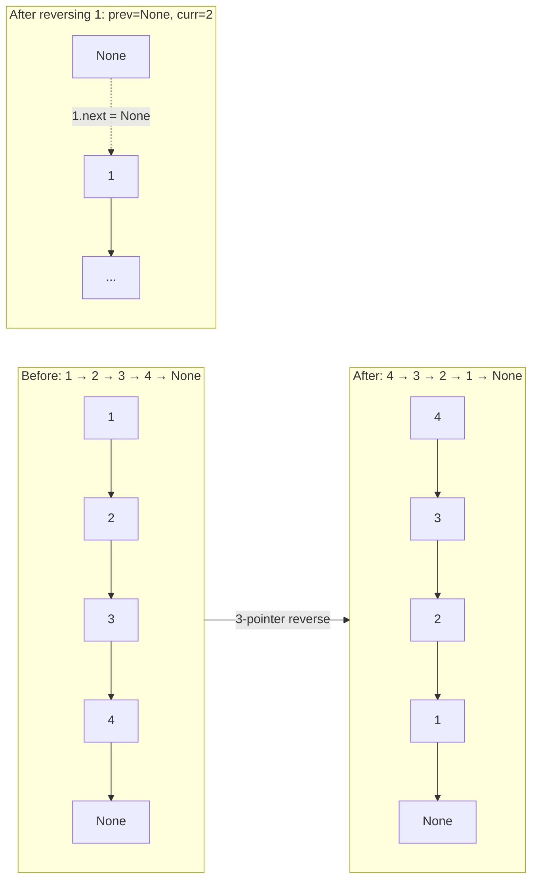

---
title: Linked List Patterns
aliases: [linked list techniques, LL reversal, merge linked lists, LL patterns]
tags: [DSA, linked-lists, patterns, reversal, merge]
domain: DSA
difficulty: Intermediate
created: 2026-07-26
related: [Singly_Linked_List, Fast_Slow_Pointers, Merge_Sort]
status: complete
---

# 🧩 Linked List Patterns

> [!abstract] TL;DR
> Six essential linked list patterns cover ~90% of LL interview problems: **reversal** (iterative/recursive), **merge sorted lists**, **fast-slow pointers** (middle/cycle), **split & reconnect**, **dummy head trick**, and **in-place manipulation without extra space**. Master these building blocks and combine them for complex problems.

## Intuition

Think of a linked list as a **bead necklace** — a sequence of beads connected by string.

- **Reversing** it means disconnecting each bead and restringing it in the opposite order, one bead at a time.
- **Merging** two necklaces means picking the smaller bead from either front and adding it to the output, alternating until both are exhausted.
- **Splitting** means finding the middle bead and cutting the string there.

These physical manipulations translate directly to pointer reassignments.

## How It Works

### Pattern 1: Reversal (Iterative)



Core 3-pointer loop:
```python
prev, curr = None, head
while curr:
    nxt = curr.next    # save next
    curr.next = prev   # reverse the arrow
    prev = curr        # advance prev
    curr = nxt         # advance curr
head = prev            # new head is the old tail
```

### Pattern 2: Merge Sorted Lists

Pick the smaller head from either list, attach it to output, advance that list's pointer.

```python
dummy = ListNode(0)
curr = dummy
while l1 and l2:
    if l1.val <= l2.val:
        curr.next = l1
        l1 = l1.next
    else:
        curr.next = l2
        l2 = l2.next
    curr = curr.next
curr.next = l1 or l2    # attach remaining
return dummy.next
```

### Pattern 3: Fast-Slow Pointers
See [[Fast_Slow_Pointers]] for full treatment. Key use: find middle, detect cycle, find nth from end.

### Pattern 4: Split (Find Middle + Cut)

Find middle, cut at middle, then recurse or process halves:
```python
slow, fast = head, head.next   # fast starts 1 ahead → left middle for even
while fast and fast.next:
    slow = slow.next
    fast = fast.next.next
# slow is now the last node of the LEFT half
second_half = slow.next
slow.next = None               # cut the list
```

### Pattern 5: Dummy Head Trick

Always creates a dummy predecessor node so the "first real node" is never a special case:
```python
dummy = ListNode(0)
dummy.next = head
# ... work with dummy.next as if it's always a predecessor
return dummy.next   # real new head
```
Use when: you might insert/delete at the head of the list, merge outputs, or build a new list node-by-node.

### Pattern 6: In-Place Operations

For problems like "reorder list" — do NOT convert to array, reverse, remerge. Instead:
1. Find middle (fast/slow).
2. Reverse second half in-place.
3. Merge two halves by interleaving pointers in-place.

## Complexity Analysis

| Pattern | Time | Space | Notes |
|---------|------|-------|-------|
| Iterative reversal | O(n) | O(1) | 3 pointers |
| Recursive reversal | O(n) | O(n) | Call stack depth |
| Merge two sorted | O(n+m) | O(1) | Iterative; O(log k) for k lists with heap |
| Split at middle | O(n) | O(1) | Fast/slow pass |
| Dummy head | O(1) overhead | O(1) | Just one extra node |
| Reorder list (in-place) | O(n) | O(1) | Middle + reverse + interleave |

## Implementation

```python
from __future__ import annotations
from typing import Optional, List
import heapq

class ListNode:
    def __init__(self, val: int = 0, next: Optional[ListNode] = None):
        self.val = val
        self.next = next
    def __lt__(self, other: ListNode) -> bool:
        return self.val < other.val   # for heapq


# ── Pattern 1: Reverse Linked List (LeetCode 206) ─────────────────────────────
def reverse_list_iterative(head: Optional[ListNode]) -> Optional[ListNode]:
    """Iterative reversal. Time: O(n)  Space: O(1)"""
    prev, curr = None, head
    while curr:
        nxt = curr.next
        curr.next = prev
        prev = curr
        curr = nxt
    return prev


def reverse_list_recursive(head: Optional[ListNode]) -> Optional[ListNode]:
    """
    Recursive reversal. Time: O(n)  Space: O(n) call stack.
    Base: empty list or single node → already reversed.
    Recursive step: reverse the tail, then make old head the new tail.
    """
    if not head or not head.next:
        return head
    new_head = reverse_list_recursive(head.next)
    head.next.next = head   # make the next node point back to current
    head.next = None        # current is now the tail
    return new_head


# ── Pattern 2: Merge Two Sorted Lists (LeetCode 21) ──────────────────────────
def merge_two_lists(l1: Optional[ListNode], l2: Optional[ListNode]) -> Optional[ListNode]:
    """Time: O(n+m)  Space: O(1) iterative"""
    dummy = ListNode(0)
    curr = dummy
    while l1 and l2:
        if l1.val <= l2.val:
            curr.next = l1
            l1 = l1.next
        else:
            curr.next = l2
            l2 = l2.next
        curr = curr.next
    curr.next = l1 if l1 else l2
    return dummy.next


# ── Pattern 2b: Merge K Sorted Lists (LeetCode 23) ───────────────────────────
def merge_k_lists(lists: List[Optional[ListNode]]) -> Optional[ListNode]:
    """
    Min-heap: push (val, node) for each list head.
    Pop minimum, attach to output, push that node's next if it exists.
    Time: O(N log k) where N = total nodes, k = number of lists
    Space: O(k) heap
    """
    heap: list = []
    for node in lists:
        if node:
            heapq.heappush(heap, (node.val, node))

    dummy = ListNode(0)
    curr = dummy
    while heap:
        val, node = heapq.heappop(heap)
        curr.next = node
        curr = curr.next
        if node.next:
            heapq.heappush(heap, (node.next.val, node.next))

    return dummy.next


# ── Pattern 4+1: Add Two Numbers (LeetCode 2) ────────────────────────────────
def add_two_numbers(l1: Optional[ListNode], l2: Optional[ListNode]) -> Optional[ListNode]:
    """
    Digits stored in reverse order. Add digit by digit with carry.
    Dummy head pattern; process until both lists and carry are exhausted.
    Time: O(max(n,m))  Space: O(max(n,m))
    """
    dummy = ListNode(0)
    curr = dummy
    carry = 0
    while l1 or l2 or carry:
        val = carry
        if l1:
            val += l1.val
            l1 = l1.next
        if l2:
            val += l2.val
            l2 = l2.next
        carry, digit = divmod(val, 10)
        curr.next = ListNode(digit)
        curr = curr.next
    return dummy.next


# ── Pattern 3+4+6: Reorder List (LeetCode 143) ───────────────────────────────
def reorder_list(head: Optional[ListNode]) -> None:
    """
    Reorder: L0→L1→...→Ln becomes L0→Ln→L1→Ln-1→L2→...
    Steps:
      1. Find middle (split)
      2. Reverse second half
      3. Interleave halves
    Time: O(n)  Space: O(1)  Modifies in-place.
    """
    if not head or not head.next:
        return

    # Step 1: Find middle and split
    slow, fast = head, head
    while fast.next and fast.next.next:
        slow = slow.next
        fast = fast.next.next
    second = slow.next
    slow.next = None                    # cut

    # Step 2: Reverse second half
    second = reverse_list_iterative(second)

    # Step 3: Interleave
    first = head
    while second:
        tmp1, tmp2 = first.next, second.next
        first.next = second
        second.next = tmp1
        first = tmp1                    # type: ignore
        second = tmp2


# ── Pattern 5+6: Reverse in K-Groups (LeetCode 25) ───────────────────────────
def reverse_k_group(head: Optional[ListNode], k: int) -> Optional[ListNode]:
    """
    Reverse nodes in groups of k. If remaining nodes < k, leave as-is.
    Time: O(n)  Space: O(1) iterative  (O(n/k) recursive stack)
    """
    # Helper: reverse nodes from start up to (not including) end
    def reverse_segment(start: ListNode, end: Optional[ListNode]) -> ListNode:
        prev, curr = end, start
        while curr is not end:
            nxt = curr.next
            curr.next = prev
            prev = curr
            curr = nxt
        return prev   # new head of segment

    dummy = ListNode(0, head)
    group_prev = dummy

    while True:
        # Check if k nodes remain
        kth = group_prev
        for _ in range(k):
            kth = kth.next               # type: ignore
            if not kth:
                return dummy.next        # fewer than k nodes left

        group_next = kth.next
        # Reverse [group_prev.next ... kth]
        group_prev.next = reverse_segment(group_prev.next, group_next)  # type: ignore
        # Advance group_prev to the end of just-reversed segment
        for _ in range(k):
            group_prev = group_prev.next  # type: ignore

    return dummy.next


# ── Helpers ───────────────────────────────────────────────────────────────────
def list_to_array(head: Optional[ListNode]) -> list:
    res, curr = [], head
    while curr:
        res.append(curr.val)
        curr = curr.next
    return res

def array_to_list(vals: list) -> Optional[ListNode]:
    dummy = ListNode(0)
    curr = dummy
    for v in vals:
        curr.next = ListNode(v)
        curr = curr.next
    return dummy.next


# ── Demo ──────────────────────────────────────────────────────────────────────
if __name__ == "__main__":
    h = array_to_list([1, 2, 3, 4, 5])
    print(list_to_array(reverse_list_iterative(h)))   # [5, 4, 3, 2, 1]

    l1 = array_to_list([1, 2, 4])
    l2 = array_to_list([1, 3, 4])
    print(list_to_array(merge_two_lists(l1, l2)))     # [1, 1, 2, 3, 4, 4]

    n1 = array_to_list([2, 4, 3])    # 342
    n2 = array_to_list([5, 6, 4])    # 465
    print(list_to_array(add_two_numbers(n1, n2)))     # [7, 0, 8] (807)

    h = array_to_list([1, 2, 3, 4, 5])
    reorder_list(h)
    print(list_to_array(h))           # [1, 5, 2, 4, 3]

    h = array_to_list([1, 2, 3, 4, 5])
    print(list_to_array(reverse_k_group(h, 2)))       # [2, 1, 4, 3, 5]
```

## Dry Run / Example Trace

**`reorder_list([1, 2, 3, 4, 5])`**

Step 1 — Find middle and split:
- slow/fast both start at 1; after 2 iterations: slow=3, fast=5.
- `fast.next` is None → stop. Split: `[1→2→3]` and `[4→5]`.

Step 2 — Reverse second half `[4→5]` → `[5→4]`.

Step 3 — Interleave `[1,2,3]` and `[5,4]`:

| first | second | Action |
|-------|--------|--------|
| 1 | 5 | 1.next=5, 5.next=2; first=2, second=4 |
| 2 | 4 | 2.next=4, 4.next=3; first=3, second=None |
| — | None | Loop ends |

Result: `1 → 5 → 2 → 4 → 3 → None` ✓

## Patterns & LeetCode Applications

| Problem | Patterns Used | LeetCode |
|---------|--------------|---------|
| Reverse Linked List | Reversal (iterative) | 206 |
| Reverse Linked List II | Reversal (partial) + dummy head | 92 |
| Reverse Nodes in K-Group | Reversal (k-group) + dummy | 25 |
| Merge Two Sorted Lists | Merge + dummy head | 21 |
| Merge K Sorted Lists | Merge + min-heap | 23 |
| Sort List | Split + merge (merge sort on LL) | 148 |
| Add Two Numbers | Dummy head + carry propagation | 2 |
| Remove Nth Node From End | Fast-slow (gap n) + dummy | 19 |
| Reorder List | Split + reverse + interleave | 143 |
| Palindrome Linked List | Fast-slow + reverse + compare | 234 |

## Common Pitfalls

1. **Losing list in recursive reversal** — `head.next.next = head` before `head.next = None` can create a cycle if done in wrong order. Always set `head.next = None` immediately after.
2. **Merge K lists: comparing ListNode objects** — Python's `heapq` needs `<` operator. Either define `__lt__` on `ListNode` or wrap in a tuple `(val, id, node)` to break ties.
3. **Reorder list: wrong middle for odd/even** — `fast.next and fast.next.next` gives the **first** middle (left half gets the extra node for odd-length), which is correct for reorder. Using `fast and fast.next` gives the second middle.
4. **K-group reversal: not checking if k nodes remain** — if fewer than k nodes are left, they should remain unchanged. Always count k nodes ahead before reversing.
5. **In-place reversal creating dangling pointers** — after `slow.next = None` (split), ensure you've saved the second half reference first.
6. **Add two numbers: missing final carry** — if `carry > 0` after both lists are exhausted, you must append one more node. The `while l1 or l2 or carry` condition handles this.

## Related Concepts

- [[_MOC_Linked_Lists|↑ Section MOC]]
- [[Singly_Linked_List]] — node structure, O(1) head insert, O(n) traversal
- [[Fast_Slow_Pointers]] — Floyd's algorithm for middle/cycle problems
- [[Merge_Sort]] — Sort List (LC 148) is merge sort on a linked list
- [[Doubly_Linked_List]] — O(1) delete given node; LRU cache pattern

## Review Questions (3)

1. **Recursive reversal has O(n) space due to the call stack. The iterative version uses O(1) space. Trace through the recursive reversal on `[1, 2, 3]` step-by-step, showing the call stack at its deepest point and the pointer assignments on the way back up.**
2. **"Sort List" (LeetCode 148) asks you to sort a linked list in O(n log n) time and O(1) space. Explain why merge sort is the natural choice (why not quicksort?), and what makes the O(1) space requirement tricky for recursion-based merge sort.**
3. **"Reverse Nodes in K-Groups" leaves the tail unchanged if fewer than k nodes remain. How does counting k nodes ahead before reversing (rather than reversing and then checking) prevent you from having to un-reverse a segment?**

## Sources

- [LeetCode — Linked List Explore Card](https://leetcode.com/explore/learn/card/linked-list/)
- Neetcode.io — Linked List video series
- *Elements of Programming Interviews* — Chapters 7 & 13

#linked-list #reversal #merge #patterns #in-place #dummy-head
