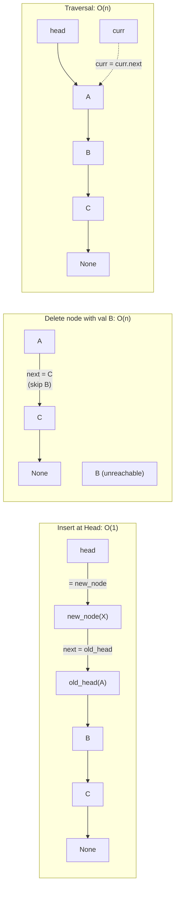

---
title: Singly Linked List
aliases: [singly linked list, linked list, SLL]
tags: [DSA, linked-lists, data-structures, pointers]
domain: DSA
difficulty: Beginner
created: 2026-07-26
related: [Doubly_Linked_List, Fast_Slow_Pointers, Stack, Queue]
status: complete
---

# 🔗 Singly Linked List

> [!abstract] TL;DR
> A singly linked list is a chain of **nodes**, each holding a value and a `next` pointer to the following node. It supports O(1) head insertion and O(n) traversal, search, tail insert (without tail pointer), and delete. Unlike arrays, it has **no random access** and poor cache locality — but it shines when you need O(1) insert/delete at the front or when the size is highly dynamic.

## Intuition

Think of a **treasure hunt** where each clue tells you only where the **next** clue is hidden.

- You can't jump to clue #7 directly — you must follow the chain from clue #1.
- Adding a new clue at the beginning is instant: just write "clue 0 → old clue 1" and hand out clue 0 as the new start.
- Removing a clue in the middle: you must walk to the clue just before it, then rewrite its "next" to skip the removed one.

This is the fundamental trade-off: **insertion/deletion at the head is O(1)**, but **everything else requires traversal** from the head.

## How It Works

### Node Structure
```
val | next ──→ val | next ──→ val | next ──→ None
[A]           [B]           [C]
 head
```

Each node lives at an arbitrary memory address (no contiguity guarantee). Accessing element `i` requires following `i` next-pointers from the head.

### Operations Diagram



### Memory: Why Not Cache-Friendly
Arrays store elements at consecutive addresses: `base + i * size` → the CPU prefetches the next element automatically. Linked list nodes can be anywhere in the heap. Each `curr = curr.next` may cause a **cache miss**, making linked lists 5–10× slower than arrays for sequential access in practice, even though both are O(n) asymptotically.

## Complexity Analysis

| Operation | Time | Space | Notes |
|-----------|------|-------|-------|
| Access by index | O(n) | O(1) | Must traverse from head |
| Search | O(n) | O(1) | Linear scan |
| Insert at head | O(1) | O(1) | Update head pointer |
| Insert at tail (no tail ptr) | O(n) | O(1) | Traverse to end |
| Insert at tail (with tail ptr) | O(1) | O(1) | Maintain tail reference |
| Insert at middle | O(n) | O(1) | O(n) to find position, O(1) to link |
| Delete at head | O(1) | O(1) | Update head |
| Delete at tail | O(n) | O(1) | Must find second-to-last |
| Delete by value | O(n) | O(1) | Find predecessor first |
| Reverse | O(n) | O(1) | Three-pointer iterative |

## Implementation

```python
from __future__ import annotations
from typing import Optional, Any

# ── Node ──────────────────────────────────────────────────────────────────────
class ListNode:
    """Single node in a singly linked list."""
    def __init__(self, val: Any = 0, next: Optional[ListNode] = None):
        self.val = val
        self.next = next

    def __repr__(self) -> str:
        return f"ListNode({self.val})"


# ── Linked List ───────────────────────────────────────────────────────────────
class LinkedList:
    def __init__(self):
        self.head: Optional[ListNode] = None
        self.tail: Optional[ListNode] = None   # O(1) tail insert
        self._size = 0

    def __len__(self) -> int:
        return self._size

    def __repr__(self) -> str:
        vals, curr = [], self.head
        while curr:
            vals.append(str(curr.val))
            curr = curr.next
        return " → ".join(vals) + " → None"

    # ── Insertion ──────────────────────────────────────────────────────────────
    def insert_head(self, val: Any) -> None:
        """O(1)"""
        node = ListNode(val, self.head)
        self.head = node
        if self.tail is None:
            self.tail = node
        self._size += 1

    def insert_tail(self, val: Any) -> None:
        """O(1) with tail pointer."""
        node = ListNode(val)
        if self.tail:
            self.tail.next = node
        else:
            self.head = node
        self.tail = node
        self._size += 1

    def insert_at(self, index: int, val: Any) -> None:
        """O(n) — insert before the node at position index."""
        if index < 0 or index > self._size:
            raise IndexError("index out of range")
        if index == 0:
            self.insert_head(val)
            return
        prev = self._get_node(index - 1)
        node = ListNode(val, prev.next)
        if prev.next is None:           # inserting at tail
            self.tail = node
        prev.next = node
        self._size += 1

    # ── Deletion ───────────────────────────────────────────────────────────────
    def delete_head(self) -> Any:
        """O(1)"""
        if not self.head:
            raise ValueError("list is empty")
        val = self.head.val
        self.head = self.head.next
        if self.head is None:
            self.tail = None
        self._size -= 1
        return val

    def delete_value(self, val: Any) -> bool:
        """O(n) — delete first node with matching value. Returns True if found."""
        dummy = ListNode(0, self.head)   # dummy head simplifies edge cases
        prev, curr = dummy, self.head
        while curr:
            if curr.val == val:
                prev.next = curr.next
                if curr.next is None:    # deleted the tail
                    self.tail = prev if prev is not dummy else None
                self.head = dummy.next
                self._size -= 1
                return True
            prev, curr = curr, curr.next
        return False

    # ── Search ─────────────────────────────────────────────────────────────────
    def search(self, val: Any) -> Optional[int]:
        """O(n) — return index of first match, or None."""
        curr, idx = self.head, 0
        while curr:
            if curr.val == val:
                return idx
            curr = curr.next
            idx += 1
        return None

    # ── Reverse ────────────────────────────────────────────────────────────────
    def reverse(self) -> None:
        """O(n) — reverse the list in-place."""
        prev, curr = None, self.head
        self.tail = self.head           # old head becomes new tail
        while curr:
            nxt = curr.next
            curr.next = prev
            prev = curr
            curr = nxt
        self.head = prev                # old tail becomes new head

    # ── Helper ──────────────────────────────────────────────────────────────────
    def _get_node(self, index: int) -> ListNode:
        curr = self.head
        for _ in range(index):
            curr = curr.next            # type: ignore
        return curr                     # type: ignore


# ── Demo ──────────────────────────────────────────────────────────────────────
if __name__ == "__main__":
    ll = LinkedList()
    for v in [1, 2, 3, 4, 5]:
        ll.insert_tail(v)
    print(ll)               # 1 → 2 → 3 → 4 → 5 → None

    ll.insert_head(0)
    print(ll)               # 0 → 1 → 2 → 3 → 4 → 5 → None

    ll.insert_at(3, 99)
    print(ll)               # 0 → 1 → 2 → 99 → 3 → 4 → 5 → None

    ll.delete_value(99)
    print(ll)               # 0 → 1 → 2 → 3 → 4 → 5 → None

    print(f"Search 3: index {ll.search(3)}")   # index 3
    print(f"Length: {len(ll)}")                # 6

    ll.reverse()
    print(ll)               # 5 → 4 → 3 → 2 → 1 → 0 → None
```

## Dry Run / Example Trace

**`reverse()` on `1 → 2 → 3 → None`:**

| Step | prev | curr | nxt | Action |
|------|------|------|-----|--------|
| Init | None | 1 | — | tail = head (node 1) |
| 1 | None | 1 | 2 | 1.next = None; prev=1, curr=2 |
| 2 | 1 | 2 | 3 | 2.next = 1; prev=2, curr=3 |
| 3 | 2 | 3 | None | 3.next = 2; prev=3, curr=None |
| End | 3 | None | — | head = prev = node 3 |

Result: `3 → 2 → 1 → None` ✓

**Why `dummy` node for deletion?**
Without dummy: deleting the head requires `if curr is head: head = head.next` — a special case. With `dummy.next = head`, the predecessor of the head is always `dummy`, so the code is uniform.

## Patterns & LeetCode Applications

| Pattern | Description | LeetCode Problems |
|---------|-------------|------------------|
| Reverse | Iterative 3-pointer or recursive | 206, 92 (k-groups) |
| Detect cycle | Fast+slow pointers | 141, 142 |
| Find middle | Fast+slow pointers | 876 |
| Merge sorted | Two-pointer merge | 21 |
| nth from end | Two pointers k apart | 19 |
| Dummy head | Simplify head-deletion edge cases | 82, 203 |

## Common Pitfalls

1. **Losing the list by not saving `head`** — in a reverse or any multi-step operation, always store `next` before overwriting `curr.next`.
2. **Not updating tail** — operations that modify the last node must update the `tail` pointer.
3. **Null pointer dereference** — checking `curr.next.val` without first verifying `curr.next is not None` causes `AttributeError`.
4. **Off-by-one in "nth from end"** — using two pointers k apart: advance the lead pointer k steps, then advance both until lead reaches None. The gap is exactly k.
5. **Forgetting the dummy head trick** — head deletion is a common special case; using a dummy predecessor eliminates the branch.
6. **Memory leak** — Python's GC handles this, but in C/C++ you must `free()` deleted nodes.

## Related Concepts

- [[_MOC_Linked_Lists|↑ Section MOC]]
- [[Doubly_Linked_List]] — O(1) delete given node reference; used in LRU cache
- [[Fast_Slow_Pointers]] — Floyd's cycle detection and middle-finding
- [[Stack]] — can be implemented as a linked list (head = top)
- [[Queue]] — FIFO: insert at tail, remove at head with O(1) using head+tail pointers
- [[Linked_List_Patterns]] — consolidated patterns: reversal, merge, dummy head

## Review Questions (3)

1. **A singly linked list has O(1) insert at head but O(n) insert at tail (without a tail pointer). Design an augmented singly linked list with both O(1) insert-head and O(1) insert-tail. What new state do you maintain, and which operations become more complex?**
2. **Compare deleting a node from a singly linked list vs a doubly linked list, given a direct pointer to the node (not its predecessor). Why is it O(n) for singly linked and O(1) for doubly linked?**
3. **The dummy head pattern eliminates head-deletion special cases. Give a concrete example of where omitting the dummy head would cause a bug, and show exactly what the bug is.**

## Sources

- Sedgewick & Wayne — *Algorithms (4th ed.)*, Section 1.3
- [LeetCode — Linked List Explore Card](https://leetcode.com/explore/learn/card/linked-list/)
- Cormen et al. — *CLRS*, Section 10.2

#linked-list #singly-linked-list #pointers #data-structures #traversal
