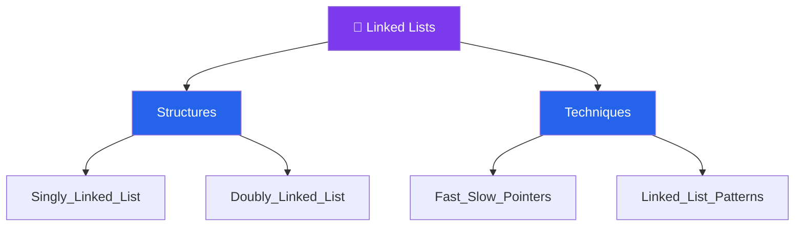

# 🔗 Linked Lists — Map of Content

> [!abstract] What This Section Covers
> Linked lists are the canonical pointer-based data structure and a required foundation for understanding how dynamic memory allocation works at a conceptual level. This section covers both singly and doubly linked lists with their trade-offs, the fast/slow (Floyd's) pointer technique that solves cycle detection and midpoint finding in O(n) time with O(1) space, and a collection of recurring patterns — reversal, merging, partitioning — that appear repeatedly across interview problems. Understanding linked list manipulation deeply also prepares you for tree and graph traversal, which extend the same pointer-manipulation intuition.

## Concept Map

## Learning Path

Recommended order to study the notes in this section.

1. [[Singly_Linked_List]] — Node structure, head pointer, traversal, insertion, and deletion; O(1) prepend vs. O(n) append
2. [[Doubly_Linked_List]] — Bidirectional links; O(1) removal of a known node; cost of extra pointer memory
3. [[Fast_Slow_Pointers]] — Floyd's cycle detection, linked list midpoint, and kth-from-end in one pass
4. [[Linked_List_Patterns]] — In-place reversal, merge two sorted lists, reorder list, partition around value

## All Notes at a Glance

| Note | Summary | Difficulty |
|------|---------|------------|
| [[Singly_Linked_List]] | One-directional chain; O(1) prepend, O(n) search; no random access | Beginner |
| [[Doubly_Linked_List]] | Bidirectional chain; O(1) node removal if pointer held; used in LRU cache | Beginner |
| [[Fast_Slow_Pointers]] | Two pointers at different speeds to detect cycles, find midpoints, nth node | Intermediate |
| [[Linked_List_Patterns]] | Reversal, merge, reorder, palindrome check, and partition patterns | Intermediate |

## Key Questions This Section Answers

- How does cycle detection work with only O(1) extra space (Floyd's algorithm)?
- When should you prefer a linked list over an array — and when is the array almost always better?
- How do you reverse a singly linked list in-place without allocating extra nodes?
- What makes a doubly linked list the right backing structure for an LRU cache?
- How do you find the middle of a linked list in a single pass?
- How do you merge two sorted linked lists without extra allocation?

## Related Sections

- [[_MOC_DSA_Master|↑ DSA Master MOC]]
- [[_MOC_Arrays|← Arrays]] — contrast random-access array with sequential linked list
- [[_MOC_Stacks_Queues|→ Stacks & Queues]] — both can be implemented with linked lists

#MOC #DSA #linked-lists
