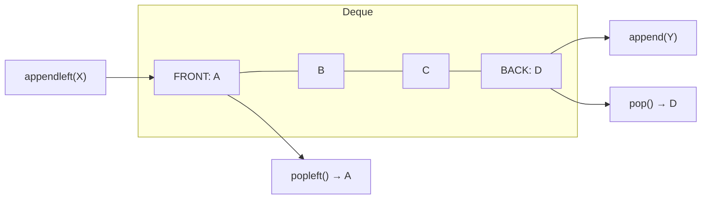

---
title: Deque
aliases: [double-ended queue, deque]
tags: [DSA, deque, queue, stack, sliding-window]
domain: DSA
difficulty: Intermediate
created: 2026-07-26
related: []
status: complete
---

# 🚆 Deque (Double-Ended Queue)

> [!abstract] TL;DR
> A deque (double-ended queue, pronounced "deck") supports **O(1) add and remove at both the front and back**. It generalizes both stack (use one end) and queue (add one end, remove the other). Python's `collections.deque` is implemented as a doubly-linked list of fixed-size blocks. The killer application is the **sliding window maximum** via a monotonic deque — the most important deque technique in competitive programming.

---

## Intuition — analogy FIRST

Picture a **train with a door at each end**. Passengers can board or exit from either the front car or the rear car. If you only use the rear door, it behaves like a stack. If you board at the rear and exit at the front, it behaves like a queue. The deque is the most flexible linear structure precisely because it does both.

In algorithms, the deque's superpower is acting as a **monotonic sliding window**: as the window slides right, old elements drop off the front, and new elements are added to the rear (while popping elements from the rear that can never be the maximum/minimum). Every element touches the deque at most twice — once in, once out.

---

## How It Works + mermaid

### Operations

| Operation | Method in Python | Time |
|-----------|-----------------|------|
| Add to rear | `deque.append(x)` | O(1) |
| Add to front | `deque.appendleft(x)` | O(1) |
| Remove from rear | `deque.pop()` | O(1) |
| Remove from front | `deque.popleft()` | O(1) |
| Peek rear | `deque[-1]` | O(1) |
| Peek front | `deque[0]` | O(1) |
| Random access | `deque[i]` | O(n) |
| Max size cap | `deque(maxlen=k)` | auto-evicts front |

> [!warning] Random access is O(n)
> Unlike a list, deque's underlying doubly-linked block structure means `deque[i]` for arbitrary `i` is O(n). Use deque only when you access the two ends.



### `maxlen` parameter

```python
from collections import deque
d = deque(maxlen=3)
d.append(1)   # [1]
d.append(2)   # [1, 2]
d.append(3)   # [1, 2, 3]
d.append(4)   # [2, 3, 4]  ← 1 auto-evicted from front
```

Useful for "last K items" trackers without manual eviction.

---

## Complexity Analysis

| Operation | collections.deque | list (for comparison) |
|-----------|------------------|-----------------------|
| append (rear) | O(1) | O(1) amortized |
| appendleft (front) | **O(1)** | **O(n)** |
| pop (rear) | O(1) | O(1) |
| popleft (front) | **O(1)** | **O(n)** |
| Random access | O(n) | O(1) |
| Space | O(n) | O(n) |

The deque wins at the front; the list wins at random access. Choose accordingly.

---

## Implementation (Python)

### Basic deque operations

```python
from collections import deque

d = deque([1, 2, 3])

# Stack behavior (use right end)
d.append(4)       # [1, 2, 3, 4]
d.pop()           # 4   → [1, 2, 3]

# Queue behavior (add right, remove left)
d.append(5)       # [1, 2, 3, 5]
d.popleft()       # 1   → [2, 3, 5]

# Prepend
d.appendleft(0)   # [0, 2, 3, 5]

# Rotate (useful for circular buffer simulation)
d.rotate(1)       # [5, 0, 2, 3]  right rotation
d.rotate(-1)      # [0, 2, 3, 5]  left rotation
```

### Sliding Window Maximum (LC 239) — the canonical deque problem

```python
from collections import deque

def maxSlidingWindow(nums: list[int], k: int) -> list[int]:
    """
    Maintain a monotonic decreasing deque of indices.
    Front of deque always holds the index of the current window's maximum.
    """
    dq = deque()   # indices, values decreasing front→back
    result = []

    for i, num in enumerate(nums):
        # 1. Evict indices that have left the window
        if dq and dq[0] <= i - k:
            dq.popleft()

        # 2. Remove from rear all indices with smaller values
        #    (they can never be the max while num is in the window)
        while dq and nums[dq[-1]] < num:
            dq.pop()

        dq.append(i)

        # 3. Window is full — record maximum (front of deque)
        if i >= k - 1:
            result.append(nums[dq[0]])

    return result

# Example
print(maxSlidingWindow([1,3,-1,-3,5,3,6,7], 3))
# Output: [3, 3, 5, 5, 6, 7]
```

### BFS with deque

```python
from collections import deque

def bfs(graph: dict, start: str, target: str) -> int:
    """Returns shortest path length from start to target."""
    visited = {start}
    q = deque([(start, 0)])  # (node, distance)
    while q:
        node, dist = q.popleft()
        if node == target:
            return dist
        for neighbor in graph.get(node, []):
            if neighbor not in visited:
                visited.add(neighbor)
                q.append((neighbor, dist + 1))
    return -1  # not reachable
```

### Jump Game VI (LC 1696) — DP optimized with deque

```python
from collections import deque

def maxResult(nums: list[int], k: int) -> int:
    """
    dp[i] = max score to reach index i.
    dp[i] = nums[i] + max(dp[i-k .. i-1])
    Deque keeps indices of best dp values in window.
    """
    n = len(nums)
    dp = [0] * n
    dp[0] = nums[0]
    dq = deque([0])  # indices, dp values decreasing

    for i in range(1, n):
        # Evict out-of-window indices
        while dq and dq[0] < i - k:
            dq.popleft()
        dp[i] = nums[i] + dp[dq[0]]  # front = best in window
        # Maintain decreasing order of dp values
        while dq and dp[dq[-1]] <= dp[i]:
            dq.pop()
        dq.append(i)

    return dp[-1]
```

---

## Dry Run / Example Trace

**Sliding Window Maximum: `nums = [1, 3, -1, -3, 5, 3]`, `k = 3`**

```
i=0, num=1:  dq=[] → append 0.     dq:[0]         (window not full)
i=1, num=3:  3>nums[0]=1 → pop 0.  dq:[]
             append 1.             dq:[1]         (window not full)
i=2, num=-1: -1 < nums[1]=3 → keep.
             append 2.             dq:[1,2]       → output nums[1]=3
i=3, num=-3: -3 < nums[2]=-1 → keep.
             append 3.             dq:[1,2,3]     → output nums[1]=3
i=4, num=5:  evict idx 1? 1 <= 4-3=1 → YES, popleft. dq:[2,3]
             5>nums[3]=-3 → pop 3. 5>nums[2]=-1 → pop 2. dq:[]
             append 4.             dq:[4]         → output nums[4]=5
i=5, num=3:  3 < nums[4]=5 → keep.
             append 5.             dq:[4,5]       → output nums[4]=5

Result: [3, 3, 5, 5] ✓
```

---

## Patterns & LeetCode Applications

| Pattern | How Deque Helps | Problems |
|---------|----------------|----------|
| Sliding Window Max/Min | Monotonic deque tracks extremum in O(1) per step | LC 239, LC 1438, LC 1696 |
| BFS | O(1) popleft for level-by-level traversal | LC 102, LC 127, LC 994 |
| Palindrome Check | appendleft + pop from both ends | simple check |
| Undo/Redo History | Append recent, popleft old | OS buffer design |
| Circular Buffer | `maxlen` parameter auto-evicts oldest | rate limiting, log last K |

---

## Common Pitfalls

> [!danger] Pitfall 1 — Random access inside a deque
> `deque[i]` is O(n). If you need frequent random access alongside front/back ops, consider a different structure (e.g., list + pointer pair, or segment tree).

> [!warning] Pitfall 2 — Eviction order in sliding window
> In the sliding window max pattern, you must evict **out-of-window indices first** (popleft on front), then **smaller elements from the rear**. Reversing these two steps can corrupt the window.

> [!danger] Pitfall 3 — Deque stores indices, not values
> The monotonic deque stores **indices** so you can check if an element has left the sliding window (`dq[0] <= i - k`). Storing values loses this window-position information.

> [!tip] Pitfall 4 — Deque is not a list
> You cannot slice a deque (`dq[1:3]`). Convert to list first if you need slicing: `list(dq)[1:3]`.

---

## Related Concepts

- [[_MOC_Stacks_Queues|↑ Section MOC]]
- [[Queue]] — a restricted deque (add rear, remove front only)
- [[Stack]] — another restricted deque (add and remove from one end only)
- [[Monotonic_Stack]] — the deque used with a monotonic invariant; the sliding window max pattern is really a "monotonic deque"
- [[Sliding_Window]] — deque is the key structure for variable/fixed window max/min optimization

---

## Review Questions

1. What is the time complexity of `appendleft` on a Python `collections.deque` vs a Python `list`, and why?
2. In the Sliding Window Maximum algorithm, why do we store **indices** in the deque rather than the actual values?
3. Explain how the `maxlen` parameter of `collections.deque` can be used to implement a circular log buffer without manual eviction.

---

## Sources

- [LeetCode — Sliding Window Maximum (LC 239)](https://leetcode.com/problems/sliding-window-maximum/)
- [LeetCode — Jump Game VI (LC 1696)](https://leetcode.com/problems/jump-game-vi/)
- [Python docs — collections.deque](https://docs.python.org/3/library/collections.html#collections.deque)
- [CPython source — deque implementation](https://github.com/python/cpython/blob/main/Modules/_collectionsmodule.c)

#deque #double-ended-queue #sliding-window #DSA #intermediate
