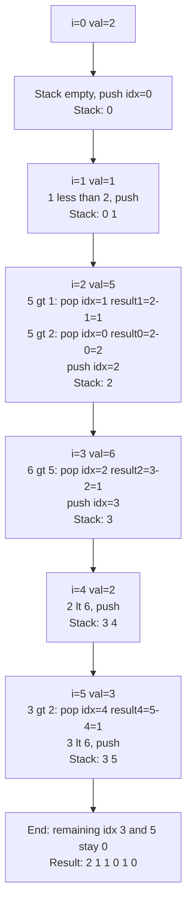

---
title: Monotonic Stack
aliases: [monotone stack]
tags: [DSA, stack, monotonic, patterns]
domain: DSA
difficulty: Intermediate
created: 2026-07-26
related: []
status: complete
---

# 📉 Monotonic Stack

> [!abstract] TL;DR
> A monotonic stack is a regular stack that **maintains a sorted order** (always increasing or always decreasing) by popping elements that violate the invariant when a new element arrives. The key insight: **when you pop element X because element Y arrived, Y is the "next greater/smaller element" for X**. Despite nested loops, it runs in **O(n)** because each element is pushed and popped at most once.

---

## Intuition — analogy FIRST

Imagine a **queue of people watching a parade**, each standing on a numbered platform. A taller person walks in from the right. Every shorter person behind them is now completely blocked — they can no longer see the parade. They become irrelevant and leave (get popped). Only the taller arrivals remain relevant.

This is a **monotonic decreasing stack** (tallest at bottom, shortest at top). When someone taller arrives, they pop all shorter people, and each popped person's "next taller person" is the one who just arrived.

For "next smaller element," flip the logic: maintain an increasing stack, pop elements when a smaller value arrives.

---

## How It Works + mermaid

### Two Types

**Monotonic Decreasing Stack** (bottom → top: large → small)
- Use when you want: **next greater element** to the right
- Pop condition: `stack is not empty AND stack.top() < new_element`

**Monotonic Increasing Stack** (bottom → top: small → large)
- Use when you want: **next smaller element** to the right
- Pop condition: `stack is not empty AND stack.top() > new_element`

### Processing `[2, 1, 5, 6, 2, 3]` for Daily Temperatures



### Why O(n)?

Even though the inner `while` loop looks like it could be O(n) per element, each element is **pushed exactly once** and **popped at most once**. Total push operations = n, total pop operations ≤ n. Overall: O(2n) = O(n).

---

## Complexity Analysis

| Aspect | Value |
|--------|-------|
| Time | O(n) — each element pushed/popped at most once |
| Space | O(n) — worst case all elements on stack (sorted input) |
| Per-element work | O(1) amortized |

---

## Implementation (Python)

### Next Greater Element (LC 496)

```python
def nextGreaterElement(nums1: list[int], nums2: list[int]) -> list[int]:
    # Build a "next greater" map for all elements in nums2
    next_greater = {}
    stack = []  # monotonic decreasing stack (stores values)
    for num in nums2:
        while stack and stack[-1] < num:
            next_greater[stack.pop()] = num
        stack.append(num)
    # Remaining elements on stack have no next greater → -1
    while stack:
        next_greater[stack.pop()] = -1
    return [next_greater[n] for n in nums1]
```

### Daily Temperatures (LC 739)

```python
def dailyTemperatures(temps: list[int]) -> list[int]:
    n = len(temps)
    result = [0] * n
    stack = []  # monotonic decreasing stack (stores indices)
    for i, t in enumerate(temps):
        while stack and temps[stack[-1]] < t:
            j = stack.pop()
            result[j] = i - j  # days until warmer
        stack.append(i)
    return result
```

### Largest Rectangle in Histogram (LC 84)

```python
def largestRectangleArea(heights: list[int]) -> int:
    # Monotonic increasing stack — stores indices
    # When we pop, the popped bar is the shortest in some span
    stack = []
    max_area = 0
    heights = heights + [0]  # sentinel to flush stack at end
    for i, h in enumerate(heights):
        start = i
        while stack and heights[stack[-1]] >= h:
            idx = stack.pop()
            width = i - (stack[-1] if stack else -1) - 1
            max_area = max(max_area, heights[idx] * width)
            start = idx  # this bar extends further left
        stack.append(i)
    return max_area
```

### Trapping Rain Water (LC 42) — Monotonic Stack approach

```python
def trap(height: list[int]) -> int:
    stack = []  # monotonic decreasing
    water = 0
    for i, h in enumerate(height):
        while stack and height[stack[-1]] < h:
            bottom = stack.pop()
            if not stack:
                break
            left = stack[-1]
            width = i - left - 1
            bounded_height = min(height[left], h) - height[bottom]
            water += width * bounded_height
        stack.append(i)
    return water
```

---

## Dry Run / Example Trace

**Largest Rectangle: `heights = [2, 1, 5, 6, 2, 3]`**

```
Appended sentinel 0: [2, 1, 5, 6, 2, 3, 0]

i=0, h=2: stack empty → push 0.          stack: [0]
i=1, h=1: 1 < heights[0]=2 → pop 0
           width = 1 - (-1) - 1 = 1, area = 2*1 = 2
           push 1                          stack: [1]
i=2, h=5: 5 > heights[1]=1 → push 2.     stack: [1,2]
i=3, h=6: 6 > heights[2]=5 → push 3.     stack: [1,2,3]
i=4, h=2: 2 < heights[3]=6 → pop 3
           width = 4 - 2 - 1 = 1, area = 6*1 = 6  ← max so far
           2 < heights[2]=5 → pop 2
           width = 4 - 1 - 1 = 2, area = 5*2 = 10  ← NEW MAX
           2 > heights[1]=1 → push 4.     stack: [1,4]
i=5, h=3: 3 > heights[4]=2 → push 5.     stack: [1,4,5]
i=6, h=0: pop 5: width=6-4-1=1, area=3*1=3
           pop 4: width=6-1-1=4, area=2*4=8
           pop 1: width=6-(-1)-1=6, area=1*6=6

MAX AREA = 10 ✓
```

---

## Patterns & LeetCode Applications

| Problem Family | Stack Type | Key Insight | Example Problems |
|----------------|------------|-------------|-----------------|
| Next Greater Element | Decreasing | Pop when larger arrives | LC 496, LC 503, LC 739 |
| Next Smaller Element | Increasing | Pop when smaller arrives | LC 1475 |
| Rectangle/Area | Increasing | Popped bar is bounded by current and stack top | LC 84, LC 85 |
| Trap Water | Decreasing | Width between left wall and current bar | LC 42 |
| Subarray Minimums | Increasing | Contribution technique | LC 907 |
| Stock Span | Decreasing | Count days since last higher | LC 901 |

---

## Common Pitfalls

> [!danger] Pitfall 1 — Wrong stack type (increasing vs decreasing)
> Monotonic **decreasing** → find **next greater** element (pop when larger arrives).
> Monotonic **increasing** → find **next smaller** element (pop when smaller arrives).
> Mixing them up produces wrong answers that are hard to debug.

> [!danger] Pitfall 2 — Storing values vs indices
> For "next greater element" you often store **values**. For "distance to next greater" (Daily Temperatures) or area calculations, you must store **indices**. Think carefully before choosing.

> [!warning] Pitfall 3 — Forgetting to handle leftover stack elements
> Elements remaining on the stack at the end of iteration have **no next greater/smaller element**. Loop through the remaining stack and assign -1 (or 0 for distance problems).

> [!tip] Pitfall 4 — Sentinel trick
> For histogram-type problems, append `0` or `-inf` to the input to automatically flush the entire stack at the end without extra cleanup code.

---

## Related Concepts

- [[_MOC_Stacks_Queues|↑ Section MOC]]
- [[Stack]] — the underlying structure; understand push/pop O(1) first
- [[Sliding_Window]] — monotonic deque is a sliding-window optimization that uses the same "pop irrelevant elements" idea
- [[Two_Pointers]] — another linear-scan technique that is sometimes an alternative to monotonic stack for trap-water style problems

---

## Review Questions

1. You want to find, for each element in an array, the index of the **next smaller** element to its right. Should you use a monotonic increasing or decreasing stack? What is the pop condition?
2. How does the monotonic stack guarantee O(n) time complexity even though there appears to be a nested loop?
3. In the Largest Rectangle in Histogram problem, when you pop an index `i` from the stack, how do you determine the **width** of the rectangle whose height is `heights[i]`?

---

## Sources

- [LeetCode — Daily Temperatures (LC 739)](https://leetcode.com/problems/daily-temperatures/)
- [LeetCode — Largest Rectangle in Histogram (LC 84)](https://leetcode.com/problems/largest-rectangle-in-histogram/)
- [LeetCode — Trapping Rain Water (LC 42)](https://leetcode.com/problems/trapping-rain-water/)
- [LeetCode — Next Greater Element I (LC 496)](https://leetcode.com/problems/next-greater-element-i/)
- [NeetCode — Monotonic Stack Playlist](https://neetcode.io/)

#monotonic-stack #stack #patterns #DSA #intermediate
