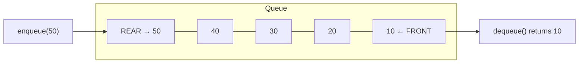
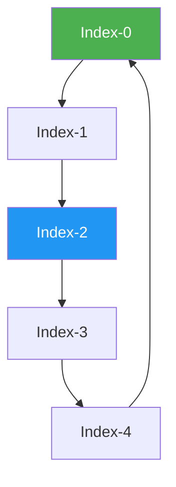

---
title: Queue
aliases: []
tags: [DSA, queue, FIFO, data-structures]
domain: DSA
difficulty: Beginner
created: 2026-07-26
related: []
status: complete
---

# 🚶 Queue

> [!abstract] TL;DR
> A queue is a **FIFO** (First In, First Out) linear data structure. Elements are added at the **rear** (enqueue) and removed from the **front** (dequeue). All core operations are O(1). Queues power BFS, task scheduling, and rate limiting. In Python, always use `collections.deque` — never a plain list for dequeue operations.

---

## Intuition — analogy FIRST

Imagine a **checkout line at a grocery store**. The first customer to join the line is the first to be served. Nobody cuts in the middle. New customers join at the back. This is the essence of FIFO — fair, ordered, sequential.

Compare to a stack (plates) where you always grab from the top. A queue respects order of arrival, making it perfect for "process things in the order they came in" scenarios: network packets, print jobs, BFS levels, sliding windows.

---

## How It Works + mermaid

### Operations

| Operation | Description | Time |
|-----------|-------------|------|
| `enqueue(x)` | Add element to the rear | O(1) |
| `dequeue()` | Remove and return element from front | O(1) |
| `front()` / `peek()` | View front element without removing | O(1) |
| `isEmpty()` | Check if queue has no elements | O(1) |
| `size()` | Number of elements | O(1) |



### Why NOT `list.pop(0)` ?

Python `list.pop(0)` is **O(n)** because it must shift every remaining element one index to the left. Over n operations this is O(n²) — disastrous for BFS on large graphs. `collections.deque` uses a doubly-linked list internally and gives true O(1) popleft.

```python
from collections import deque

# WRONG for queues
q = []
q.append(1)
q.pop(0)   # O(n) — shifts entire list!

# CORRECT
q = deque()
q.append(1)    # enqueue to right
q.popleft()    # dequeue from left — O(1)
```

### Circular Queue

A circular queue wraps the end pointer back to index 0, reusing space freed by dequeued elements. Used in embedded systems and ring buffers. Key invariant: `(rear + 1) % capacity == front` means full.



---

## Complexity Analysis

| Operation | `deque` | Plain list (wrong) | Circular array |
|-----------|---------|-------------------|----------------|
| Enqueue | O(1) | O(1) amortized | O(1) |
| Dequeue | O(1) | **O(n)** | O(1) |
| Peek | O(1) | O(1) | O(1) |
| Space | O(n) | O(n) | O(capacity) |

---

## Implementation (Python)

### Queue using `collections.deque`

```python
from collections import deque

class Queue:
    def __init__(self):
        self._data = deque()

    def enqueue(self, val):
        self._data.append(val)        # add to right (rear)

    def dequeue(self):
        if self.is_empty():
            raise IndexError("dequeue from empty queue")
        return self._data.popleft()   # remove from left (front)

    def front(self):
        if self.is_empty():
            raise IndexError("peek at empty queue")
        return self._data[0]

    def is_empty(self):
        return len(self._data) == 0

    def size(self):
        return len(self._data)
```

### Circular Queue (Fixed Capacity)

```python
class MyCircularQueue:
    def __init__(self, k: int):
        self.data = [0] * k
        self.head = 0
        self.tail = -1
        self.size = 0
        self.capacity = k

    def enQueue(self, val: int) -> bool:
        if self.isFull():
            return False
        self.tail = (self.tail + 1) % self.capacity
        self.data[self.tail] = val
        self.size += 1
        return True

    def deQueue(self) -> bool:
        if self.isEmpty():
            return False
        self.head = (self.head + 1) % self.capacity
        self.size -= 1
        return True

    def Front(self) -> int:
        return -1 if self.isEmpty() else self.data[self.head]

    def Rear(self) -> int:
        return -1 if self.isEmpty() else self.data[self.tail]

    def isEmpty(self) -> bool:
        return self.size == 0

    def isFull(self) -> bool:
        return self.size == self.capacity
```

### BFS Level-Order Traversal

```python
from collections import deque

def levelOrder(root):
    if not root:
        return []
    result = []
    q = deque([root])
    while q:
        level_size = len(q)
        level = []
        for _ in range(level_size):
            node = q.popleft()
            level.append(node.val)
            if node.left:
                q.append(node.left)
            if node.right:
                q.append(node.right)
        result.append(level)
    return result
```

---

## Dry Run / Example Trace

**BFS on a simple graph: find shortest path from A to E**

```
Graph: A→B, A→C, B→D, C→E

Queue: [A]          Visited: {A}
Pop A → enqueue B, C
Queue: [B, C]       Visited: {A, B, C}
Pop B → enqueue D
Queue: [C, D]       Visited: {A, B, C, D}
Pop C → enqueue E ← found E! distance = 2 hops from A
```

BFS guarantees the shortest path in an **unweighted** graph because it explores all neighbors at distance d before any node at distance d+1.

---

## Patterns & LeetCode Applications

| Pattern | Description | Problems |
|---------|-------------|----------|
| BFS Shortest Path | Level-by-level traversal in unweighted graph | LC 102, LC 127, LC 994 |
| BFS Multi-source | Start BFS from multiple sources simultaneously | LC 286, LC 542, LC 1162 |
| Sliding Window Max | Monotonic deque tracks max in O(n) | LC 239 |
| Task Scheduling | Simulate a scheduler with cooldown | LC 621 |
| Queue using Stacks | Implement queue with two stacks | LC 232 |

### Sliding Window Maximum (LC 239) using deque

```python
from collections import deque

def maxSlidingWindow(nums: list[int], k: int) -> list[int]:
    dq = deque()   # stores indices, decreasing by value
    result = []
    for i, n in enumerate(nums):
        # Remove indices outside window
        while dq and dq[0] < i - k + 1:
            dq.popleft()
        # Remove smaller elements from rear — they can't be max
        while dq and nums[dq[-1]] < n:
            dq.pop()
        dq.append(i)
        if i >= k - 1:
            result.append(nums[dq[0]])
    return result
```

---

## Common Pitfalls

> [!danger] Pitfall 1 — Using list.pop(0) for a queue
> This is the single most common queue mistake in Python. It turns O(n) BFS into O(n²). Always use `deque.popleft()`.

> [!danger] Pitfall 2 — Not handling empty queue before dequeue
> Always check `if not q` before `q.popleft()`. BFS loops naturally handle this via `while q`, but standalone queues need guarding.

> [!warning] Pitfall 3 — Confusing `queue.Queue` with `collections.deque`
> Python's `queue.Queue` is thread-safe and meant for producer-consumer threading. For algorithmic problems, use `collections.deque` — it has no locking overhead.

> [!tip] Priority Queue
> When you need to "dequeue the element with the highest priority" (not necessarily the oldest), use a **heap** (`heapq`). Python's `heapq` is a min-heap. For max-heap, negate values.

---

## Related Concepts

- [[_MOC_Stacks_Queues|↑ Section MOC]]
- [[Stack]] — LIFO counterpart; use when you need reverse-order processing
- [[Deque]] — double-ended queue; generalizes both stack and queue with O(1) at both ends
- [[BFS]] — the canonical queue application; explores graph level by level
- [[Binary_Heap]] — the data structure behind priority queues (`heapq`)
- [[Monotonic_Stack]] — the deque used as a monotonic structure for sliding window max

---

## Review Questions

1. Why is `collections.deque` preferred over a Python list for implementing a queue, and what is the time complexity difference?
2. In BFS, why does using a queue guarantee the shortest path in an unweighted graph?
3. How would you implement a queue using only two stacks? What is the amortized time complexity of dequeue?

---

## Sources

- [LeetCode — Design Circular Queue (LC 622)](https://leetcode.com/problems/design-circular-queue/)
- [LeetCode — Sliding Window Maximum (LC 239)](https://leetcode.com/problems/sliding-window-maximum/)
- [LeetCode — Binary Tree Level Order Traversal (LC 102)](https://leetcode.com/problems/binary-tree-level-order-traversal/)
- [Python docs — collections.deque](https://docs.python.org/3/library/collections.html#collections.deque)
- *Introduction to Algorithms* (CLRS), Chapter 10.1

#queue #FIFO #data-structures #DSA #BFS #beginner
