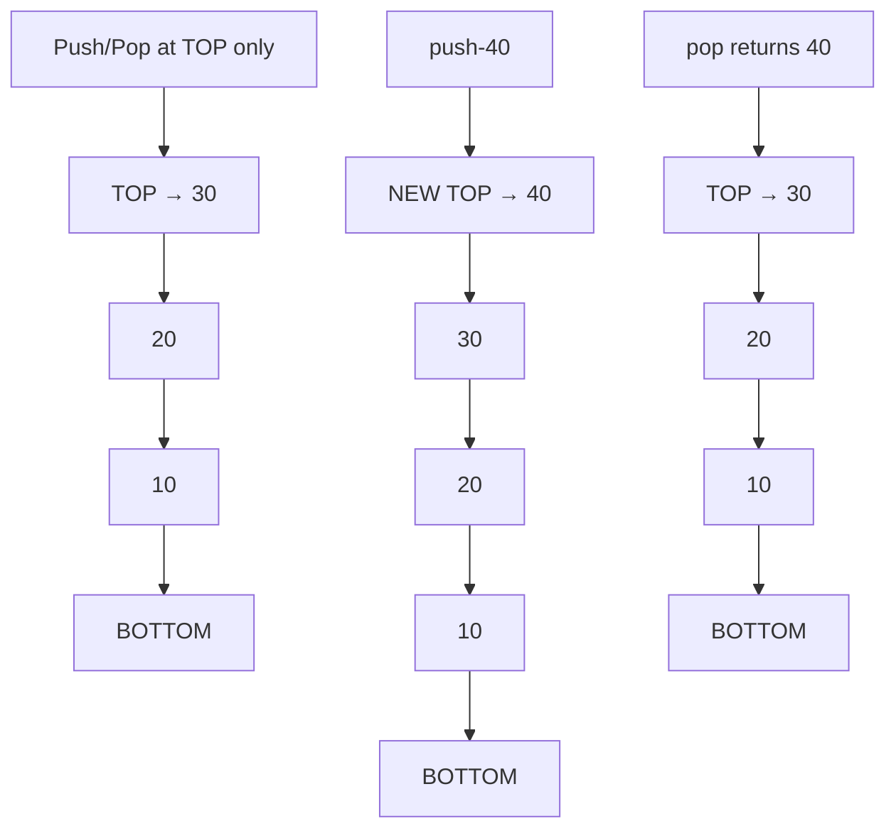

---
title: Stack
aliases: []
tags: [DSA, stack, LIFO, data-structures]
domain: DSA
difficulty: Beginner
created: 2026-07-26
related: []
status: complete
---

# 📚 Stack

> [!abstract] TL;DR
> A stack is a **LIFO** (Last In, First Out) linear data structure where all insertions and deletions happen at one end — the **top**. Push, pop, and peek are all O(1). The call stack in your computer is a stack. It is the go-to structure for anything that needs "reverse order" processing or tracking "what was here most recently."

---

## Intuition — analogy FIRST

Think of a **stack of plates** at a buffet. You can only place a new plate on top, and you can only take the top plate off. You never grab from the middle. The last plate put on is the first plate taken off — that is LIFO in a nutshell.

More concretely: when you press Ctrl+Z to undo in a text editor, the editor pops the most recent action off its undo stack. The actions you took most recently are undone first.

---

## How It Works + mermaid

### Operations

| Operation | Description | Time |
|-----------|-------------|------|
| `push(x)` | Add element to top | O(1) |
| `pop()` | Remove and return top element | O(1) |
| `peek()` / `top()` | View top element without removing | O(1) |
| `isEmpty()` | Check if stack has no elements | O(1) |
| `size()` | Number of elements | O(1) |

### Implementations

**Array-based** — use a dynamic array; `push` appends, `pop` removes last. Python list does this natively.

**Linked-list-based** — maintain a pointer to the head; push/pop at the head. Better when capacity is unbounded and you want guaranteed O(1) without amortized analysis.



### Python's `collections.deque` as a Stack

Python lists work as stacks (`append` / `pop`), but `collections.deque` is preferred in competitive programming because it was designed for stack/queue use and has explicit O(1) guarantees. For a pure stack, both work fine.

```python
from collections import deque
stack = deque()
stack.append(10)   # push
stack.append(20)
top = stack[-1]    # peek → 20
stack.pop()        # pop → 20
```

---

## Complexity Analysis

| Operation | Array-based | Linked-list-based |
|-----------|-------------|-------------------|
| Push | O(1) amortized | O(1) |
| Pop | O(1) | O(1) |
| Peek | O(1) | O(1) |
| Search | O(n) | O(n) |
| Space | O(n) | O(n) |

> [!warning] Amortized vs Worst-Case
> Array `push` is O(1) **amortized** — occasionally the array must be resized (O(n)), but this cost is spread across all pushes. Python's list uses dynamic arrays with a doubling strategy, so resize events are rare.

---

## Implementation (Python)

### Clean Stack class

```python
class Stack:
    def __init__(self):
        self._data = []

    def push(self, val):
        self._data.append(val)

    def pop(self):
        if self.is_empty():
            raise IndexError("pop from empty stack")
        return self._data.pop()

    def peek(self):
        if self.is_empty():
            raise IndexError("peek at empty stack")
        return self._data[-1]

    def is_empty(self):
        return len(self._data) == 0

    def size(self):
        return len(self._data)

    def __repr__(self):
        return f"Stack({self._data})"
```

### Valid Parentheses (LeetCode 20)

```python
def isValid(s: str) -> bool:
    stack = []
    pairs = {')': '(', '}': '{', ']': '['}
    for ch in s:
        if ch in '({[':
            stack.append(ch)
        elif ch in ')}]':
            # Stack must be non-empty and top must match
            if not stack or stack[-1] != pairs[ch]:
                return False
            stack.pop()
    return len(stack) == 0

# Example
print(isValid("()[]{}"))  # True
print(isValid("([)]"))    # False
print(isValid("{[]}"))    # True
```

### Evaluate Reverse Polish Notation (LeetCode 150)

```python
def evalRPN(tokens: list[str]) -> int:
    stack = []
    ops = {
        '+': lambda a, b: a + b,
        '-': lambda a, b: a - b,
        '*': lambda a, b: a * b,
        '/': lambda a, b: int(a / b),  # truncate toward zero
    }
    for tok in tokens:
        if tok in ops:
            b = stack.pop()
            a = stack.pop()
            stack.append(ops[tok](a, b))
        else:
            stack.append(int(tok))
    return stack[0]

# Example: ["2","1","+","3","*"] → (2+1)*3 = 9
print(evalRPN(["2","1","+","3","*"]))  # 9
```

---

## Dry Run / Example Trace

**Valid Parentheses on `"({[]})"`**

```
Input:  ( { [ ] } )
Step 1: '(' → push  → stack: ['(']
Step 2: '{' → push  → stack: ['(', '{']
Step 3: '[' → push  → stack: ['(', '{', '[']
Step 4: ']' → pairs[']']='[', top='[' ✓ → pop → stack: ['(', '{']
Step 5: '}' → pairs['}']='{', top='{' ✓ → pop → stack: ['(']
Step 6: ')' → pairs[')']]='(', top='(' ✓ → pop → stack: []
Result: stack is empty → True ✓
```

---

## Patterns & LeetCode Applications

| Pattern | Description | Problems |
|---------|-------------|----------|
| Bracket Matching | Push open, pop/check on close | LC 20, LC 1249, LC 32 |
| Monotonic Stack | Maintain sorted order for next greater/smaller | LC 739, LC 496, LC 84 |
| Iterative DFS | Replace recursion call stack with explicit stack | LC 94, LC 144, LC 200 |
| Expression Evaluation | Operand stack + operator stack | LC 150, LC 224, LC 227 |
| Min/Max Stack | Augment stack to track running min/max | LC 155, LC 716 |

### Daily Temperatures (LC 739) — Monotonic Decreasing Stack

```python
def dailyTemperatures(temps: list[int]) -> list[int]:
    n = len(temps)
    result = [0] * n
    stack = []  # stores indices
    for i, t in enumerate(temps):
        # pop while current temp is warmer than top of stack
        while stack and temps[stack[-1]] < t:
            j = stack.pop()
            result[j] = i - j
        stack.append(i)
    return result
```

---

## Common Pitfalls

> [!danger] Pitfall 1 — Forgetting to check isEmpty before pop/peek
> Always guard: `if not stack: ...` before any `pop()` or `stack[-1]`. An empty pop raises `IndexError`.

> [!danger] Pitfall 2 — Using list.pop(0) thinking it's a stack
> `list.pop(0)` removes from the **front** — that is O(n), not O(1). For a stack, always use `list.pop()` (removes from back) or `deque.pop()`.

> [!danger] Pitfall 3 — Integer division in RPN
> Python's `//` truncates toward negative infinity. LeetCode requires truncation toward zero. Use `int(a / b)` for the RPN problem.

> [!tip] Pitfall 4 — Confusing stack and queue direction
> Stack: last in, first out — think of depth-first. Queue: first in, first out — think of breadth-first. Mixing them up leads to wrong traversal orders.

---

## Related Concepts

- [[_MOC_Stacks_Queues|↑ Section MOC]]
- [[Queue]] — the FIFO counterpart; use for BFS and scheduling
- [[Monotonic_Stack]] — a stack that maintains a sorted invariant; unlocks next-greater-element family
- [[Deque]] — supports O(1) operations at both ends; generalizes stack and queue
- [[DFS]] — naturally uses the call stack (or explicit stack for iterative DFS)
- [[Recursion_Fundamentals]] — every recursive call is a stack frame pushed onto the call stack

---

## Review Questions

1. You need to implement an "undo" feature where the most recent action is always undone first. Which data structure do you use and why?
2. What is the difference between `list.pop()` and `list.pop(0)` in terms of time complexity, and which one models a stack?
3. In the Valid Parentheses problem, why do we push only opening brackets and not closing brackets onto the stack?

---

## Sources

- [LeetCode — Valid Parentheses (LC 20)](https://leetcode.com/problems/valid-parentheses/)
- [LeetCode — Evaluate Reverse Polish Notation (LC 150)](https://leetcode.com/problems/evaluate-reverse-polish-notation/)
- [LeetCode — Daily Temperatures (LC 739)](https://leetcode.com/problems/daily-temperatures/)
- *Introduction to Algorithms* (CLRS), Chapter 10.1
- [Python docs — collections.deque](https://docs.python.org/3/library/collections.html#collections.deque)

#stack #LIFO #data-structures #DSA #beginner
