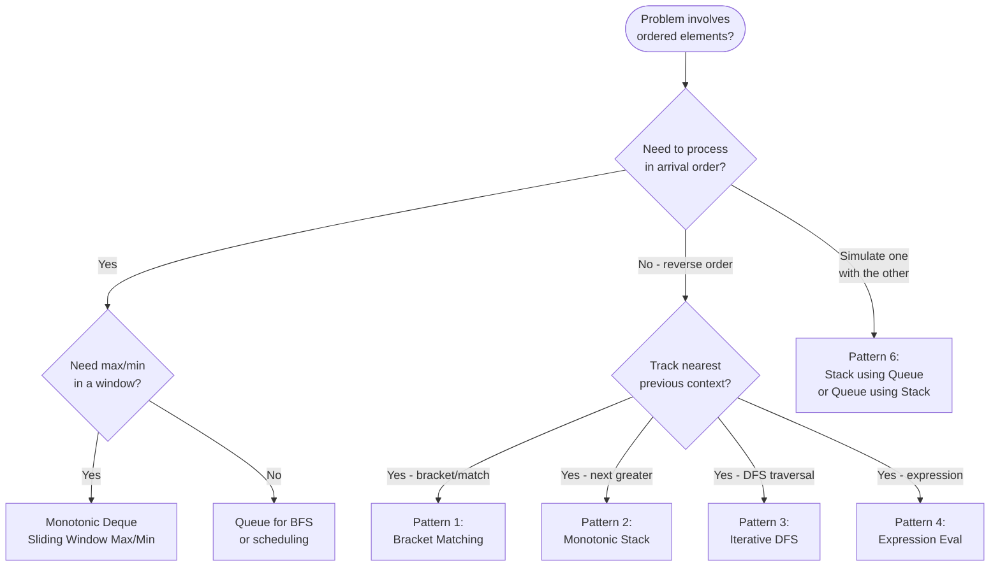

---
title: Stack and Queue Patterns
aliases: [stack patterns, queue patterns]
tags: [DSA, stack, queue, patterns, interview]
domain: DSA
difficulty: Intermediate
created: 2026-07-26
related: []
status: complete
---

# 🗺️ Stack & Queue Patterns

> [!abstract] TL;DR
> Six recurring patterns built on stacks and queues cover the vast majority of interview problems in this family. Master the pattern, not just the problem. The two most tricky (and tested) are **monotonic stack for next-greater/smaller** and the **two-stack queue / two-queue stack** interview classic.

---

## Intuition — analogy FIRST

Think of stacks and queues as **two different personalities of a waiting room**. The stack is an urgent care clinic: the last patient to arrive is seen first (LIFO — most urgent problems demand immediate attention). The queue is the post office: first come, first served (FIFO — fairness matters). Most stack/queue problems are really about choosing which waiting-room personality fits the problem's "urgency model," then applying a known pattern.

---

## How It Works + mermaid



---

## Complexity Analysis

| Pattern | Time | Space | Notes |
|---------|------|-------|-------|
| Bracket Matching | O(n) | O(n) | At most n chars on stack |
| Monotonic Stack | O(n) | O(n) | Each element pushed/popped once |
| Iterative DFS | O(V+E) | O(V) | Same as recursive DFS |
| Expression Eval | O(n) | O(n) | Two stacks or one pass RPN |
| BFS | O(V+E) | O(V) | Level-by-level |
| Queue from 2 Stacks | O(1) amortized | O(n) | Push O(1), pop amortized O(1) |

---

## Implementation (Python)

### Pattern 1 — Bracket Matching / Balanced Parentheses

The universal pattern: **push opening brackets, pop-and-compare on closing brackets**.

```python
def isValid(s: str) -> bool:
    match = {')': '(', '}': '{', ']': '['}
    stack = []
    for ch in s:
        if ch in '({[':
            stack.append(ch)
        elif ch in ')}]':
            if not stack or stack[-1] != match[ch]:
                return False
            stack.pop()
    return not stack

# Variant: longest valid parentheses — store indices on stack
def longestValidParentheses(s: str) -> int:
    stack = [-1]  # sentinel index
    max_len = 0
    for i, ch in enumerate(s):
        if ch == '(':
            stack.append(i)
        else:
            stack.pop()
            if not stack:
                stack.append(i)  # new sentinel
            else:
                max_len = max(max_len, i - stack[-1])
    return max_len
```

### Pattern 2 — Monotonic Stack (Next Greater/Smaller)

```python
def nextGreaterRight(nums: list[int]) -> list[int]:
    """For each element, find the next greater element to its right."""
    result = [-1] * len(nums)
    stack = []  # decreasing monotonic stack (stores indices)
    for i, n in enumerate(nums):
        while stack and nums[stack[-1]] < n:
            result[stack.pop()] = n
        stack.append(i)
    return result

def nextSmallerRight(nums: list[int]) -> list[int]:
    """For each element, find the next smaller element to its right."""
    result = [-1] * len(nums)
    stack = []  # increasing monotonic stack (stores indices)
    for i, n in enumerate(nums):
        while stack and nums[stack[-1]] > n:
            result[stack.pop()] = n
        stack.append(i)
    return result
```

### Pattern 3 — Iterative DFS with explicit stack

```python
def dfs_iterative(graph: dict, start) -> list:
    """Iterative DFS using an explicit stack — mirrors recursive call stack."""
    visited = set()
    stack = [start]
    order = []
    while stack:
        node = stack.pop()
        if node in visited:
            continue
        visited.add(node)
        order.append(node)
        for neighbor in reversed(graph.get(node, [])):
            if neighbor not in visited:
                stack.append(neighbor)
    return order

# Iterative inorder traversal of BST
def inorderIterative(root) -> list[int]:
    result, stack = [], []
    curr = root
    while curr or stack:
        while curr:
            stack.append(curr)
            curr = curr.left
        curr = stack.pop()
        result.append(curr.val)
        curr = curr.right
    return result
```

### Pattern 4 — Expression Evaluation

Two approaches: (a) evaluate RPN directly, (b) convert infix→postfix first then evaluate.

```python
# Evaluate RPN (Reverse Polish Notation) — LC 150
def evalRPN(tokens: list[str]) -> int:
    stack = []
    ops = {'+': lambda a,b: a+b, '-': lambda a,b: a-b,
           '*': lambda a,b: a*b, '/': lambda a,b: int(a/b)}
    for tok in tokens:
        if tok in ops:
            b, a = stack.pop(), stack.pop()
            stack.append(ops[tok](a, b))
        else:
            stack.append(int(tok))
    return stack[0]

# Basic Calculator II — LC 227 (handles +, -, *, /)
def calculate(s: str) -> int:
    stack = []
    num = 0
    op = '+'
    for i, ch in enumerate(s):
        if ch.isdigit():
            num = num * 10 + int(ch)
        if (ch in '+-*/') or i == len(s) - 1:
            if op == '+': stack.append(num)
            elif op == '-': stack.append(-num)
            elif op == '*': stack.append(stack.pop() * num)
            elif op == '/': stack.append(int(stack.pop() / num))
            op = ch
            num = 0
    return sum(stack)
```

### Pattern 5 — Queue-based BFS

```python
from collections import deque

def bfs_shortest_path(grid: list[list[int]], start: tuple, end: tuple) -> int:
    """BFS in a grid — guaranteed shortest path."""
    rows, cols = len(grid), len(grid[0])
    q = deque([(start[0], start[1], 0)])  # (row, col, distance)
    visited = {start}
    dirs = [(0,1),(0,-1),(1,0),(-1,0)]
    while q:
        r, c, dist = q.popleft()
        if (r, c) == end:
            return dist
        for dr, dc in dirs:
            nr, nc = r + dr, c + dc
            if 0 <= nr < rows and 0 <= nc < cols and (nr,nc) not in visited and grid[nr][nc] == 0:
                visited.add((nr, nc))
                q.append((nr, nc, dist + 1))
    return -1
```

### Pattern 6 — Queue using Two Stacks (LC 232) and Stack using Two Queues (LC 225)

**Queue using two stacks — amortized O(1) dequeue:**

```python
class MyQueue:
    """
    Inbox stack receives all pushes.
    Outbox stack is the reversed inbox — when outbox is empty,
    pour all of inbox into outbox (reversal makes inbox-order FIFO).
    """
    def __init__(self):
        self.inbox = []   # new elements go here
        self.outbox = []  # dequeue from here

    def push(self, x: int) -> None:
        self.inbox.append(x)

    def _transfer(self):
        if not self.outbox:
            while self.inbox:
                self.outbox.append(self.inbox.pop())

    def pop(self) -> int:
        self._transfer()
        return self.outbox.pop()

    def peek(self) -> int:
        self._transfer()
        return self.outbox[-1]

    def empty(self) -> bool:
        return not self.inbox and not self.outbox
```

**Stack using two queues — O(n) push, O(1) pop:**

```python
from collections import deque

class MyStack:
    """
    To maintain LIFO with FIFO queues:
    On every push, enqueue the new element, then rotate the queue
    so the new element ends up at the front.
    """
    def __init__(self):
        self.q = deque()

    def push(self, x: int) -> None:
        self.q.append(x)
        # Rotate so newest element is at front
        for _ in range(len(self.q) - 1):
            self.q.append(self.q.popleft())

    def pop(self) -> int:
        return self.q.popleft()

    def top(self) -> int:
        return self.q[0]

    def empty(self) -> bool:
        return not self.q
```

---

## Dry Run / Example Trace

**Queue using two stacks: push 1, 2, 3 then pop twice**

```
push(1): inbox=[1],  outbox=[]
push(2): inbox=[1,2], outbox=[]
push(3): inbox=[1,2,3], outbox=[]
pop():   _transfer → inbox=[], outbox=[3,2,1]
         outbox.pop() → 1  (correct FIFO order)
         outbox=[3,2]
pop():   outbox not empty, skip transfer
         outbox.pop() → 2
         outbox=[3]
peek():  outbox[-1] → 3 (next to be dequeued)
```

Amortized analysis: each element is pushed to inbox once (O(1)) and moved to outbox once (O(1)) and popped from outbox once (O(1)). Total: O(3n) = O(n) across n operations → O(1) amortized per operation.

---

## Patterns & LeetCode Applications

| Pattern | Key Problems |
|---------|-------------|
| Bracket Matching | LC 20, LC 32, LC 1249, LC 301 |
| Monotonic Stack | LC 739, LC 496, LC 84, LC 42, LC 907 |
| Iterative DFS | LC 94, LC 144, LC 145, LC 200, LC 695 |
| Expression Eval | LC 150, LC 224, LC 227, LC 772 |
| BFS | LC 102, LC 127, LC 286, LC 994, LC 1162 |
| Stack↔Queue simulation | LC 232, LC 225 |

---

## Common Pitfalls

> [!danger] Pitfall 1 — Forgetting the transfer in MyQueue
> In the two-stack queue, the transfer from inbox to outbox must only happen when **outbox is empty**. Transferring on every operation makes it O(n) per dequeue instead of amortized O(1).

> [!warning] Pitfall 2 — DFS vs BFS confusion
> Stack → DFS (depth-first, explores deep before wide).
> Queue → BFS (breadth-first, explores level by level).
> The data structure literally determines the traversal order.

> [!tip] Pattern selection tip
> If the problem mentions "nearest", "most recent", "previous context", or "last seen" → think **stack**.
> If it mentions "shortest path", "level by level", "spreading", or "order of arrival" → think **queue**.

---

## Related Concepts

- [[_MOC_Stacks_Queues|↑ Section MOC]]
- [[Stack]] — LIFO fundamentals
- [[Queue]] — FIFO fundamentals
- [[Monotonic_Stack]] — deep dive into Pattern 2
- [[Deque]] — generalizes both; enables sliding window max
- [[BFS]] — canonical queue application
- [[DFS]] — canonical stack application (call stack or explicit stack)

---

## Review Questions

1. In the two-stack queue implementation, why is the amortized cost of `pop()` O(1) even though the first pop after many pushes might cost O(n)?
2. Given a problem asking for "the next greater element to the right for every element," which pattern applies and how do you determine whether to use an increasing or decreasing monotonic stack?
3. You need to implement a calculator that handles parentheses and the four basic operators. Which pattern(s) from above are combined, and in what order?

---

## Sources

- [LeetCode — Implement Queue using Stacks (LC 232)](https://leetcode.com/problems/implement-queue-using-stacks/)
- [LeetCode — Implement Stack using Queues (LC 225)](https://leetcode.com/problems/implement-stack-using-queues/)
- [LeetCode — Basic Calculator II (LC 227)](https://leetcode.com/problems/basic-calculator-ii/)
- [Blind 75 — Stack/Queue category](https://neetcode.io/practice)

#stack #queue #patterns #interview #DSA #intermediate
