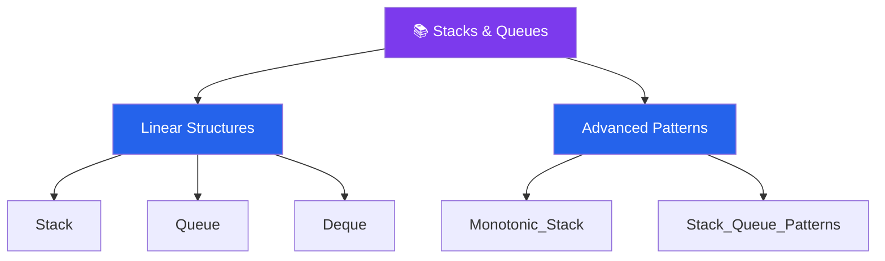

# 📚 Stacks & Queues — Map of Content

> [!abstract] What This Section Covers
> Stacks and queues are the two core restricted-access linear data structures: stacks enforce LIFO (last-in, first-out) order and queues enforce FIFO (first-in, first-out). This section covers both structures from the ground up, then extends into the deque (double-ended queue) that unifies them, and the monotonic stack — one of the most powerful O(n) interview patterns for problems involving "next greater element," trapping rain water, and largest rectangle in histogram. The section closes with a patterns guide that distills the decision logic for when to reach for each structure.

## Concept Map

## Learning Path

Recommended order to study the notes in this section.

1. [[Stack]] — LIFO semantics; push/pop in O(1); call stack analogy; valid parentheses canonical example
2. [[Queue]] — FIFO semantics; enqueue/dequeue in O(1) with linked list; BFS backing structure
3. [[Deque]] — Double-ended queue combining stack and queue; sliding window maximum
4. [[Monotonic_Stack]] — Maintain a stack in sorted order to answer "next greater/smaller" queries in O(n)
5. [[Stack_Queue_Patterns]] — Queue from two stacks, stack from two queues, min-stack, and problem-selection guide

## All Notes at a Glance

| Note | Summary | Difficulty |
|------|---------|------------|
| [[Stack]] | LIFO structure; O(1) push/pop/peek; DFS, expression evaluation, undo systems | Beginner |
| [[Queue]] | FIFO structure; O(1) enqueue/dequeue; BFS traversal, task scheduling | Beginner |
| [[Monotonic_Stack]] | Stack kept in increasing or decreasing order; resolves NGE problems in O(n) | Intermediate |
| [[Deque]] | Both-ends access in O(1); sliding window max/min; palindrome check | Intermediate |
| [[Stack_Queue_Patterns]] | Queue-with-two-stacks, min-stack, circular buffer queue, problem templates | Intermediate |

## Key Questions This Section Answers

- When does a monotonic stack reduce an O(n²) brute-force to O(n)?
- How do you implement a queue using two stacks — and what is the amortized cost of each operation?
- What advantage does a deque have over a plain queue in sliding window problems?
- How is the call stack in recursion modeled as an explicit stack data structure?
- How do you implement a stack that supports O(1) `getMin()` alongside push and pop?
- Why does BFS use a queue while DFS uses a stack?

## Related Sections

- [[_MOC_DSA_Master|↑ DSA Master MOC]]
- [[_MOC_Arrays|← Arrays]] — arrays are a common backing implementation for stacks
- [[_MOC_Linked_Lists|← Linked Lists]] — linked lists provide O(1) enqueue/dequeue for queues
- [[_MOC_Graphs|→ Graphs]] — BFS uses a queue; DFS uses a stack (explicit or call stack)

#MOC #DSA #stacks-queues
