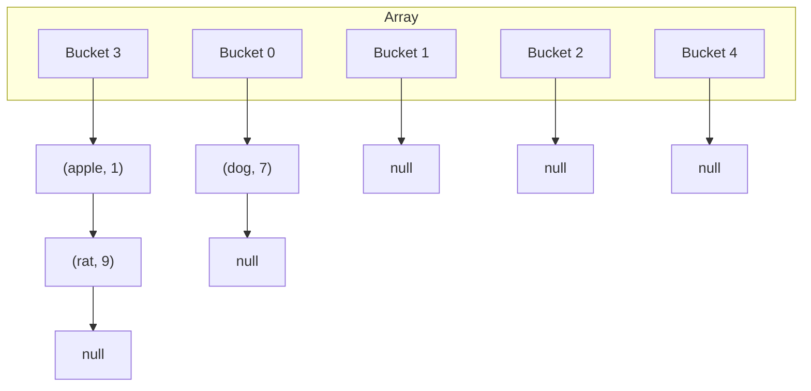
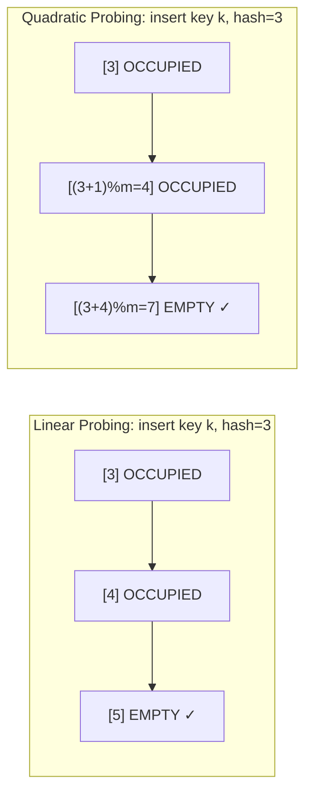

---
title: Collision Resolution
aliases: [chaining, open addressing, linear probing]
tags: [DSA, hash-table, collision, chaining, open-addressing]
domain: DSA
difficulty: Intermediate
created: 2026-07-26
related: []
status: complete
---

# 💥 Collision Resolution

> [!abstract] TL;DR
> When two keys hash to the same bucket — a collision — the hash table must have a resolution strategy. The two families are **chaining** (each bucket holds a linked list of all colliding entries) and **open addressing** (find a different bucket via a probing sequence). Chaining is simpler and tolerates high load factors; open addressing is cache-friendly but sensitive to clustering and requires careful deletion (tombstones).

---

## Intuition — analogy FIRST

**Chaining** is like a **multi-story parking garage at a single address**: when the first spot on the ground floor is taken, you go up to the second floor. Every floor exists at the same address — the bucket — but you get a different slot. You always check the same address first, then scan upward.

**Open addressing** is like **searching for a parking spot in a surface lot**: when your preferred spot is taken, you drive to the next spot, then the next, until you find an empty one. You park somewhere else in the same lot (the same array). This means the lot can never be fuller than the number of spots (load factor must stay below 1).

---

## How It Works + mermaid

### Chaining

Each bucket holds a linked list (or Python list) of `(key, value)` pairs. Multiple keys can coexist in the same bucket indefinitely.



**Pros of chaining:**
- Simple to implement
- Load factor can exceed 1
- Deletion is trivial (just remove from list)
- Degrades gracefully as load increases

**Cons of chaining:**
- Extra memory for list/pointer overhead
- Poor cache locality (list nodes scattered in memory)

### Open Addressing

All entries live in the same array. When a collision occurs, apply a probing function to find the next candidate slot.

```
probe sequence: h(k,0), h(k,1), h(k,2), ...
where h(k,i) = (hash(k) + f(i)) % m
```

**Linear Probing:** `f(i) = i` — try slots `hash+0, hash+1, hash+2, ...`
- Simple and cache-friendly
- Suffers from **primary clustering**: consecutive occupied slots form "clumps," slowing future insertions into the cluster

**Quadratic Probing:** `f(i) = i²` — try `hash+0, hash+1, hash+4, hash+9, ...`
- Reduces primary clustering
- Suffers from **secondary clustering** (all keys with the same hash follow same probe sequence)
- May not probe all slots if m is not prime

**Double Hashing:** `f(i) = i * h₂(k)` where h₂ is a second hash function
- Eliminates both types of clustering
- Most complex to implement
- Best uniform distribution among open addressing variants



### Tombstone Deletion

In open addressing, you cannot simply empty a slot on deletion. Doing so would break probe sequences for keys that were placed further along the same chain.

**Problem:** insert A at slot 3, B at slot 4 (probed from 3), delete A (slot 3 empty). Now searching for B probes slot 3, finds empty, incorrectly reports B not found.

**Solution: tombstones** — mark deleted slots with a sentinel `DELETED` marker. During search, skip tombstones. During insert, reuse the first tombstone slot found.

```
States of each slot:
  EMPTY     — never used, probing stops here
  OCCUPIED  — holds a live (key, value)
  DELETED   — tombstone, probing continues past this
```

---

## Complexity Analysis

| Strategy | Search Avg | Search Worst | Insert Avg | Delete | Space |
|----------|-----------|-------------|-----------|--------|-------|
| Chaining | O(1+α) | O(n) | O(1) | O(1) | O(n+m) |
| Linear Probing | O(1/(1-α)) | O(n) | O(1/(1-α)) | O(1)* | O(m) |
| Quadratic Probing | O(1/(1-α)) | O(n) | O(1/(1-α)) | O(1)* | O(m) |
| Double Hashing | ≈O(1/(1-α)) | O(n) | ≈O(1/(1-α)) | O(1)* | O(m) |

*Deletion requires tombstones; periodic rehashing needed to reclaim tombstone slots.

**Expected probe count formulas (α = load factor):**
- Successful search (linear probing): ½ × (1 + 1/(1-α))
- Unsuccessful search (linear probing): ½ × (1 + 1/(1-α)²)

At α = 0.9: unsuccessful search needs ~50 probes on average — open addressing degrades sharply above α = 0.7.

---

## Implementation (Python)

### Hash Table with Linear Probing + Tombstones

```python
class LinearProbingHashTable:
    _DELETED = object()  # singleton sentinel for tombstones

    def __init__(self, capacity: int = 16):
        self.capacity = capacity
        self.size = 0
        self.keys = [None] * capacity
        self.values = [None] * capacity

    def _hash(self, key) -> int:
        return hash(key) % self.capacity

    def _probe(self, key) -> int:
        """Returns the slot index for key (existing or first available)."""
        idx = self._hash(key)
        first_deleted = None
        for _ in range(self.capacity):
            if self.keys[idx] is None:
                # Empty slot — key not present; insert at first_deleted if any
                return first_deleted if first_deleted is not None else idx
            elif self.keys[idx] is self._DELETED:
                if first_deleted is None:
                    first_deleted = idx  # record first tombstone for reuse
            elif self.keys[idx] == key:
                return idx  # found existing key
            idx = (idx + 1) % self.capacity  # linear probe
        return first_deleted  # table full, but tombstone available

    def put(self, key, value):
        if self.size / self.capacity >= 0.7:
            self._rehash()
        idx = self._probe(key)
        if self.keys[idx] != key:
            self.size += 1
        self.keys[idx] = key
        self.values[idx] = value

    def get(self, key, default=None):
        idx = self._hash(key)
        for _ in range(self.capacity):
            if self.keys[idx] is None:
                return default  # empty slot → not found
            if self.keys[idx] == key:
                return self.values[idx]
            idx = (idx + 1) % self.capacity
        return default

    def remove(self, key):
        idx = self._hash(key)
        for _ in range(self.capacity):
            if self.keys[idx] is None:
                return  # not found
            if self.keys[idx] == key:
                self.keys[idx] = self._DELETED   # place tombstone
                self.values[idx] = None
                self.size -= 1
                return
            idx = (idx + 1) % self.capacity

    def _rehash(self):
        old_keys = self.keys[:]
        old_vals = self.values[:]
        self.capacity *= 2
        self.keys = [None] * self.capacity
        self.values = [None] * self.capacity
        self.size = 0
        for k, v in zip(old_keys, old_vals):
            if k is not None and k is not self._DELETED:
                self.put(k, v)
```

### Hash Table with Chaining

```python
class ChainingHashTable:
    def __init__(self, capacity: int = 16):
        self.capacity = capacity
        self.size = 0
        self.buckets = [[] for _ in range(capacity)]

    def _index(self, key) -> int:
        return hash(key) % self.capacity

    def put(self, key, value):
        bucket = self.buckets[self._index(key)]
        for i, (k, _) in enumerate(bucket):
            if k == key:
                bucket[i] = (key, value)
                return
        bucket.append((key, value))
        self.size += 1
        if self.size / self.capacity > 0.7:
            self._rehash()

    def get(self, key, default=None):
        for k, v in self.buckets[self._index(key)]:
            if k == key:
                return v
        return default

    def remove(self, key):
        bucket = self.buckets[self._index(key)]
        for i, (k, _) in enumerate(bucket):
            if k == key:
                bucket.pop(i)
                self.size -= 1
                return

    def _rehash(self):
        old = [(k, v) for b in self.buckets for k, v in b]
        self.capacity *= 2
        self.buckets = [[] for _ in range(self.capacity)]
        self.size = 0
        for k, v in old:
            self.put(k, v)
```

---

## Dry Run / Example Trace

**Linear Probing with capacity=7: insert "apple"(h=3), "rat"(h=3), "cat"(h=3), delete "rat"**

```
Insert "apple" → h=3: slot[3]=None → place. Array: [_,_,_,apple,_,_,_]
Insert "rat"   → h=3: slot[3]=apple → probe slot[4]=None → place.
                  Array: [_,_,_,apple,rat,_,_]
Insert "cat"   → h=3: slot[3]=apple → slot[4]=rat → slot[5]=None → place.
                  Array: [_,_,_,apple,rat,cat,_]

Delete "rat"   → h=3: slot[3]=apple≠rat → slot[4]=rat ✓ → tombstone.
                  Array: [_,_,_,apple,DELETED,cat,_]

Search "cat"   → h=3: slot[3]=apple≠cat → slot[4]=DELETED (skip, don't stop!)
                  → slot[5]=cat ✓ → found!
                  Without tombstone, slot[4] would be None → would wrongly return not found.
```

---

## Patterns & LeetCode Applications

This is a foundational concept; it rarely appears as a standalone LeetCode problem but is tested in:
- Design HashMap (LC 706) — asked to implement chaining
- Design HashSet (LC 705)
- System design questions about cache eviction, LRU cache (LC 146)

---

## Common Pitfalls

> [!danger] Pitfall 1 — Deleting without tombstones in open addressing
> Simply emptying a slot on deletion silently breaks the hash table for any key that probed past the deleted slot. This is the #1 open addressing bug.

> [!warning] Pitfall 2 — Load factor exceeding 1 in open addressing
> Open addressing physically cannot exceed α = 1 (you run out of slots). Chaining has no such constraint but degrades past α ≈ 1. Always rehash before hitting these limits.

> [!tip] Pitfall 3 — Primary clustering in linear probing
> If your hash function maps many keys to adjacent slots, linear probing catastrophically clusters. Quadratic probing or double hashing mitigates this.

> [!info] Python's actual approach
> CPython uses open addressing with a **pseudo-random probing sequence** (not strictly linear), making clustering much less likely than naive linear probing. The probe step depends on the upper bits of the hash, which decorrelates probes across the table.

---

## Related Concepts

- [[_MOC_Hash_Tables|↑ Section MOC]]
- [[Hash_Table_Fundamentals]] — hash functions, load factor, birthday paradox
- [[HashMap_vs_HashSet]] — practical Python usage of dict and set

---

## Review Questions

1. Why can't you simply empty a slot when deleting a key in an open-addressing hash table? What is the tombstone solution and what are its trade-offs?
2. Compare chaining and linear probing: which is more cache-friendly, which handles high load factors better, and which has simpler deletion?
3. At a load factor of 0.9, roughly how many probes does linear probing require for an unsuccessful search, and why does this matter?

---

## Sources

- *Introduction to Algorithms* (CLRS), Chapter 11.2–11.4
- [Wikipedia — Hash table — Collision resolution](https://en.wikipedia.org/wiki/Hash_table#Collision_resolution)
- [Python dict internals — morepasion.com](https://www.laurentluce.com/posts/python-dictionary-implementation/)
- [LeetCode — Design HashMap (LC 706)](https://leetcode.com/problems/design-hashmap/)

#hash-table #collision #chaining #open-addressing #DSA #intermediate
