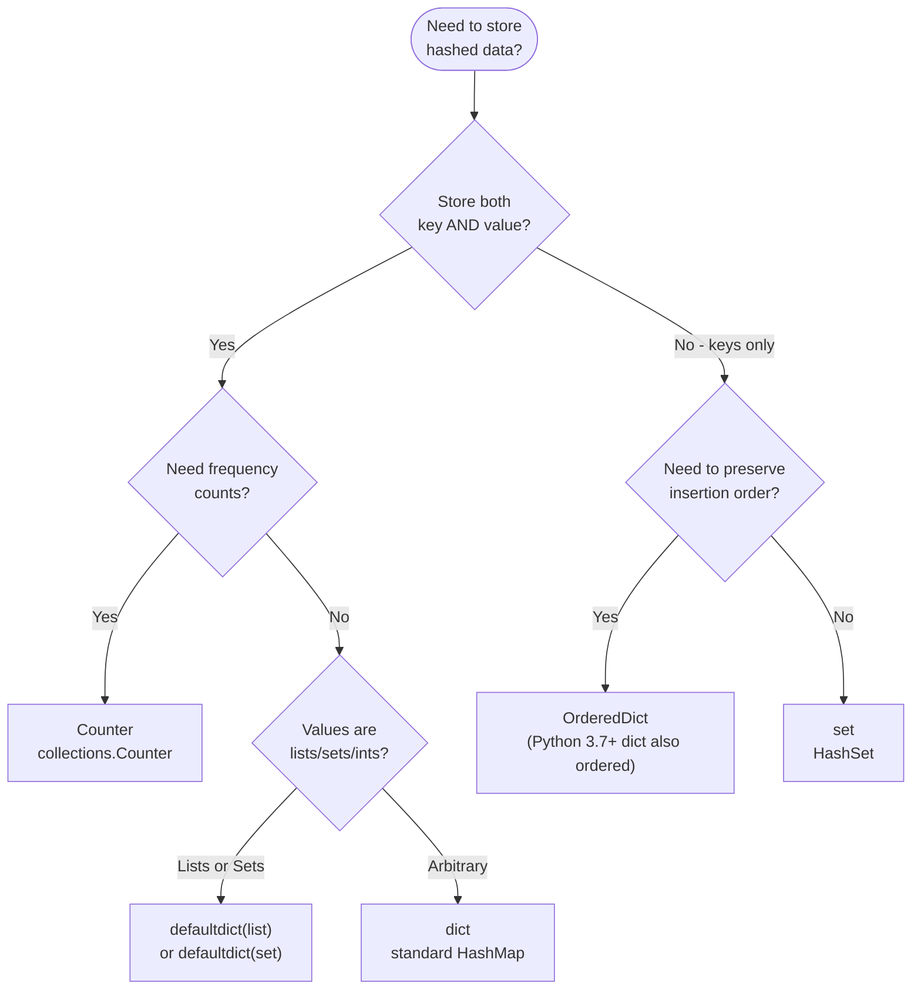

---
title: HashMap vs HashSet
aliases: [dict vs set, counter, defaultdict]
tags: [DSA, hash-table, dict, set, python, patterns]
domain: DSA
difficulty: Beginner
created: 2026-07-26
related: []
status: complete
---

# 🗝️ HashMap vs HashSet

> [!abstract] TL;DR
> A HashMap (Python `dict`) stores **key → value** pairs. A HashSet (Python `set`) stores **keys only** for O(1) membership testing. Python also provides `Counter` (frequency counting), `defaultdict` (no KeyError on missing key), and `OrderedDict` (maintains insertion order explicitly). Choosing the right one often determines whether your solution is 3 lines or 30.

---

## Intuition — analogy FIRST

A **HashMap** is like a **locker room**: each locker (key) holds something specific (value). You use the locker number to get what's inside.

A **HashSet** is like a **guest list at a party**: you only care whether a name is on the list (present/absent), not what's associated with it.

A **Counter** is a clipboard with a tally of how many times you've seen each item — "apples: 3, bananas: 1."

A **defaultdict** is a locker room where new lockers are automatically pre-filled with a default item — no need to check if the locker exists before using it.

---

## How It Works + mermaid



---

## Complexity Analysis

All Python hash-based structures share the same underlying complexity:

| Operation | `dict` | `set` | `Counter` | `defaultdict` |
|-----------|--------|-------|-----------|---------------|
| Insert/update | O(1) avg | O(1) avg | O(1) avg | O(1) avg |
| Lookup | O(1) avg | O(1) avg | O(1) avg | O(1) avg |
| Delete | O(1) avg | O(1) avg | O(1) avg | O(1) avg |
| Iteration | O(n) | O(n) | O(n) | O(n) |
| Union/Intersection | — | O(min(m,n)) | — | — |
| most_common(k) | — | — | O(n log k) | — |

---

## Implementation (Python)

### `dict` — general key→value mapping

```python
# Basic usage
phone_book = {}
phone_book['Alice'] = '555-1234'
phone_book['Bob'] = '555-5678'

print(phone_book.get('Alice'))           # '555-1234'
print(phone_book.get('Charlie', 'N/A'))  # 'N/A' — default, no KeyError
print('Alice' in phone_book)             # True
del phone_book['Bob']

# Safe update pattern
word_count = {}
for word in ['a', 'b', 'a', 'c', 'a']:
    word_count[word] = word_count.get(word, 0) + 1
# {'a': 3, 'b': 1, 'c': 1}

# Dict comprehension
squares = {x: x**2 for x in range(1, 6)}  # {1:1, 2:4, 3:9, 4:16, 5:25}

# Two Sum (LC 1) — canonical dict pattern
def twoSum(nums: list[int], target: int) -> list[int]:
    seen = {}  # value → index
    for i, num in enumerate(nums):
        complement = target - num
        if complement in seen:
            return [seen[complement], i]
        seen[num] = i
    return []
```

### `set` — O(1) membership testing

```python
# Basic usage
seen = set()
seen.add(42)
seen.add(42)   # duplicates ignored
42 in seen     # True — O(1)
seen.discard(99)  # no error if missing

# Set operations — very useful for graph/overlap problems
a = {1, 2, 3, 4}
b = {3, 4, 5, 6}
a & b    # {3, 4}  intersection
a | b    # {1, 2, 3, 4, 5, 6}  union
a - b    # {1, 2}  difference (in a but not b)
a ^ b    # {1, 2, 5, 6}  symmetric difference

# Contains Duplicate (LC 217)
def containsDuplicate(nums: list[int]) -> bool:
    return len(nums) != len(set(nums))

# Longest Consecutive Sequence — O(n) with set
def longestConsecutive(nums: list[int]) -> int:
    num_set = set(nums)
    best = 0
    for n in num_set:
        if n - 1 not in num_set:  # n is the start of a sequence
            length = 1
            while n + length in num_set:
                length += 1
            best = max(best, length)
    return best
```

### `Counter` — automatic frequency counting

```python
from collections import Counter

# Initialization
c = Counter(['a', 'b', 'a', 'c', 'a', 'b'])
# Counter({'a': 3, 'b': 2, 'c': 1})
c = Counter("programming")
c = Counter({'red': 4, 'blue': 2})

# Access (returns 0 for missing keys, no KeyError)
c['z']          # 0  ← unlike dict!
c['a']          # 3

# Useful methods
c.most_common(2)    # [('a', 3), ('b', 2)]  top 2
c.total()           # 6  (Python 3.10+)
list(c.elements())  # ['a', 'a', 'a', 'b', 'b', 'c']

# Arithmetic on Counters
c1 = Counter(a=3, b=1)
c2 = Counter(a=1, b=2)
c1 + c2   # Counter({'a': 4, 'b': 3})
c1 - c2   # Counter({'a': 2})  negatives dropped
c1 & c2   # Counter({'a': 1, 'b': 1})  minimum of each
c1 | c2   # Counter({'a': 3, 'b': 2})  maximum of each

# Anagram check (LC 242)
def isAnagram(s: str, t: str) -> bool:
    return Counter(s) == Counter(t)

# Valid Anagram — manual approach to show the pattern
def isAnagramManual(s: str, t: str) -> bool:
    if len(s) != len(t):
        return False
    count = {}
    for c in s:
        count[c] = count.get(c, 0) + 1
    for c in t:
        if c not in count or count[c] == 0:
            return False
        count[c] -= 1
    return True
```

### `defaultdict` — no KeyError on new keys

```python
from collections import defaultdict

# defaultdict(list) — perfect for grouping
groups = defaultdict(list)
data = [('alice', 'math'), ('bob', 'science'), ('alice', 'art')]
for name, subject in data:
    groups[name].append(subject)  # no need to check if name exists!
# defaultdict(list, {'alice': ['math', 'art'], 'bob': ['science']})

# defaultdict(set)
unique_per_key = defaultdict(set)
unique_per_key['a'].add(1)
unique_per_key['a'].add(1)   # set, so no duplicate

# defaultdict(int) — equivalent to Counter but mutable
freq = defaultdict(int)
for word in ["apple", "banana", "apple"]:
    freq[word] += 1   # freq[word] starts at 0 automatically

# Group Anagrams (LC 49) — canonical defaultdict(list) problem
def groupAnagrams(strs: list[str]) -> list[list[str]]:
    groups = defaultdict(list)
    for s in strs:
        key = tuple(sorted(s))   # canonical form of anagram
        groups[key].append(s)
    return list(groups.values())
```

### `OrderedDict` — explicit insertion-order dict

```python
from collections import OrderedDict

# LRU Cache (LC 146) — OrderedDict moves recently used to end
class LRUCache:
    def __init__(self, capacity: int):
        self.cap = capacity
        self.cache = OrderedDict()

    def get(self, key: int) -> int:
        if key not in self.cache:
            return -1
        self.cache.move_to_end(key)   # mark as recently used
        return self.cache[key]

    def put(self, key: int, value: int) -> None:
        if key in self.cache:
            self.cache.move_to_end(key)
        self.cache[key] = value
        if len(self.cache) > self.cap:
            self.cache.popitem(last=False)   # evict LRU (oldest)
```

---

## Dry Run / Example Trace

**Group Anagrams on `["eat","tea","tan","ate","nat","bat"]`**

```
"eat" → sorted → "aet" → groups["aet"] = ["eat"]
"tea" → sorted → "aet" → groups["aet"] = ["eat","tea"]
"tan" → sorted → "ant" → groups["ant"] = ["tan"]
"ate" → sorted → "aet" → groups["aet"] = ["eat","tea","ate"]
"nat" → sorted → "ant" → groups["ant"] = ["tan","nat"]
"bat" → sorted → "abt" → groups["abt"] = ["bat"]

Result: [["eat","tea","ate"], ["tan","nat"], ["bat"]] ✓
```

---

## Patterns & LeetCode Applications

| Problem Type | Best Tool | Canonical Problems |
|-------------|-----------|-------------------|
| Key→value lookup | `dict` | LC 1 (Two Sum), LC 560 |
| Membership / dedup | `set` | LC 217, LC 128, LC 349 |
| Frequency counting | `Counter` | LC 242, LC 347, LC 451 |
| Grouping by key | `defaultdict(list)` | LC 49, LC 1743 |
| LRU / ordered access | `OrderedDict` | LC 146, LC 460 |
| Prefix sum + map | `dict` | LC 560, LC 974, LC 523 |

---

## Common Pitfalls

> [!danger] Pitfall 1 — `dict[missing_key]` raises KeyError
> Use `.get(key, default)` for safe access. `Counter` and `defaultdict` auto-handle missing keys, but plain `dict` does not.

> [!warning] Pitfall 2 — Counter subtraction drops negatives
> `Counter({'a': 1}) - Counter({'a': 3})` gives `Counter()` — not `Counter({'a': -2})`. Use `subtract()` method if you need negatives.

> [!tip] Pitfall 3 — Using list as dict key
> Lists are unhashable. Use `tuple(sorted(lst))` as a canonical key. Similarly, `frozenset` is the hashable version of `set`.

> [!danger] Pitfall 4 — Modifying a dict while iterating it
> `for k in d: del d[k]` raises `RuntimeError`. Iterate over `list(d.keys())` or collect keys to delete first.

---

## Related Concepts

- [[_MOC_Hash_Tables|↑ Section MOC]]
- [[Hash_Table_Fundamentals]] — how dict and set are implemented internally
- [[Hash_Table_Patterns]] — 7 patterns using these structures on LeetCode

---

## Review Questions

1. When should you use `Counter` instead of a plain `dict` for counting? What does `Counter` provide that `dict` does not?
2. What is the difference between `dict.get(key)`, `dict[key]`, and `defaultdict` behavior when accessing a missing key?
3. In the Group Anagrams problem, why is `tuple(sorted(s))` used as the dictionary key instead of just `sorted(s)`?

---

## Sources

- [Python docs — collections.Counter](https://docs.python.org/3/library/collections.html#collections.Counter)
- [Python docs — collections.defaultdict](https://docs.python.org/3/library/collections.html#collections.defaultdict)
- [Python docs — collections.OrderedDict](https://docs.python.org/3/library/collections.html#collections.OrderedDict)
- [LeetCode — Group Anagrams (LC 49)](https://leetcode.com/problems/group-anagrams/)
- [LeetCode — LRU Cache (LC 146)](https://leetcode.com/problems/lru-cache/)

#hashmap #hashset #dict #set #Counter #defaultdict #DSA #beginner
