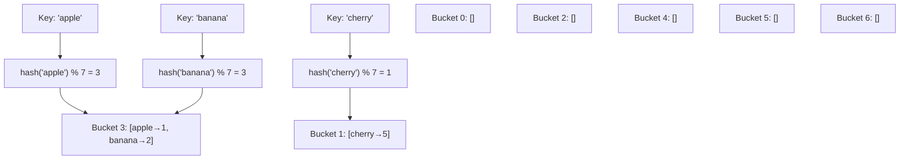

---
title: Hash Table Fundamentals
aliases: [hash table, hash map, hash set]
tags: [DSA, hash-table, fundamentals, data-structures]
domain: DSA
difficulty: Beginner
created: 2026-07-26
related: []
status: complete
---

# 🗂️ Hash Table Fundamentals

> [!abstract] TL;DR
> A hash table maps keys to values via a **hash function** that converts a key into an array index. Average O(1) for insert, lookup, and delete — the best average-case performance of any general-purpose key-value store. Collisions are inevitable (birthday paradox) and handled by chaining or open addressing. Python's `dict` and `set` are hash tables, insertion-ordered since Python 3.7.

---

## Intuition — analogy FIRST

Think of a **library card catalog** (the old wooden drawers). You have a title (the key). A librarian applies a rule — "look at the first letter, go to that drawer" — to find the book's location. Two books starting with the same letter land in the same drawer (collision), so each drawer holds a list of cards. The rule (hash function) must be fast to apply and spread books evenly across drawers. A perfect catalog puts at most one card per drawer — that is a perfect hash function (only possible when all keys are known in advance).

---

## How It Works + mermaid

### Hash Function

A hash function `h(key)` maps any key to an integer index in `[0, m-1]` where `m` is the array size (number of buckets).

```
index = hash(key) % m
```

Good hash functions are:
1. **Deterministic** — same input always yields same output
2. **Fast to compute** — O(1) or O(key length)
3. **Uniform distribution** — minimizes clustering

Python's built-in `hash()`:
- `hash(42)` → 42 (integers map to themselves, with caveats)
- `hash("hello")` → randomized per process (PYTHONHASHSEED)
- Unhashable types: lists, dicts, sets (mutable → hash changes → lookup breaks)

### Collisions are Inevitable

The **birthday paradox** shows that with m buckets and n keys, the probability of at least one collision exceeds 50% when n ≈ √(2m ln 2). For m=365 (days), this is n ≈ 23. Collisions always happen in practice; the hash table must handle them gracefully.

### Load Factor

```
load factor α = n / m   (n = keys stored, m = buckets)
```

- α < 0.7 → fast lookups with chaining
- α > 0.7 → performance degrades rapidly
- Python rehashes when α > 2/3, doubling array size



---

## Complexity Analysis

| Operation | Average | Worst Case | When worst case happens |
|-----------|---------|------------|------------------------|
| Insert | O(1) | O(n) | All keys hash to same bucket |
| Search | O(1) | O(n) | All keys hash to same bucket |
| Delete | O(1) | O(n) | All keys hash to same bucket |
| Space | O(n) | O(n) | — |

> [!info] Expected Collisions Formula
> With n keys and m buckets, the expected number of keys in each bucket is n/m = α. With a good hash function, search costs O(1 + α). Keeping α < 1 ensures O(1) expected performance.

---

## Implementation (Python)

### Custom Hash Table with Chaining

```python
class HashTable:
    def __init__(self, capacity: int = 16):
        self.capacity = capacity
        self.size = 0
        self.buckets = [[] for _ in range(capacity)]  # list of (key, value) pairs

    def _index(self, key) -> int:
        return hash(key) % self.capacity

    def _load_factor(self) -> float:
        return self.size / self.capacity

    def _rehash(self):
        """Double capacity and reinsert all elements."""
        old_buckets = self.buckets
        self.capacity *= 2
        self.buckets = [[] for _ in range(self.capacity)]
        self.size = 0
        for bucket in old_buckets:
            for k, v in bucket:
                self.put(k, v)

    def put(self, key, value):
        if self._load_factor() > 0.7:
            self._rehash()
        idx = self._index(key)
        for i, (k, v) in enumerate(self.buckets[idx]):
            if k == key:
                self.buckets[idx][i] = (key, value)  # update
                return
        self.buckets[idx].append((key, value))        # insert
        self.size += 1

    def get(self, key, default=None):
        idx = self._index(key)
        for k, v in self.buckets[idx]:
            if k == key:
                return v
        return default

    def remove(self, key):
        idx = self._index(key)
        for i, (k, v) in enumerate(self.buckets[idx]):
            if k == key:
                self.buckets[idx].pop(i)
                self.size -= 1
                return

    def __contains__(self, key):
        return self.get(key) is not None

    def __repr__(self):
        pairs = [(k, v) for bucket in self.buckets for k, v in bucket]
        return f"HashTable({pairs})"
```

### Python `dict` and `set` Operations

```python
# dict — key→value hash map
d = {}
d['apple'] = 1        # insert/update: O(1)
val = d.get('apple')  # lookup: O(1), returns None if missing
val = d['apple']      # lookup: O(1), raises KeyError if missing
del d['apple']        # delete: O(1)
'apple' in d          # membership: O(1)

# dict comprehension
squares = {x: x**2 for x in range(10)}

# Iteration (insertion-ordered since Python 3.7)
for key, value in d.items():
    print(key, value)

# set — key-only hash set
s = set()
s.add(42)         # O(1)
s.remove(42)      # O(1), raises KeyError if missing
s.discard(42)     # O(1), no error if missing
42 in s           # O(1) membership test
s1 & s2           # intersection
s1 | s2           # union
s1 - s2           # difference
```

### Python dict Internals (since 3.7)

Python's `dict` uses **open addressing** with a compact indices array and a separate entries array. Keys are stored in insertion order by maintaining the entries array as append-only. This is why iteration order equals insertion order since Python 3.7.

```python
# Python 3.7+ — insertion order guaranteed
d = {}
d['z'] = 1
d['a'] = 2
d['m'] = 3
list(d.keys())  # ['z', 'a', 'm'] — insertion order preserved
```

---

## Dry Run / Example Trace

**Hash table with capacity=5, inserting "cat"→3, "dog"→7, "rat"→9**

```
hash("cat") % 5 = 3   → bucket[3]: [("cat",3)]
hash("dog") % 5 = 0   → bucket[0]: [("dog",7)]
hash("rat") % 5 = 3   → COLLISION! bucket[3]: [("cat",3), ("rat",9)]

Lookup "rat":
  idx = hash("rat") % 5 = 3
  scan bucket[3]: "cat"≠"rat", "rat"=="rat" → return 9  ✓

Load factor = 3/5 = 0.6 → below 0.7 threshold, no rehash needed
```

---

## Patterns & LeetCode Applications

| Use Case | Tool | Example |
|----------|------|---------|
| Key-value mapping | `dict` | Two Sum, Most Frequent |
| Membership test | `set` | Duplicate detection |
| Frequency count | `Counter` | Anagram check |
| Grouped by key | `defaultdict(list)` | Group Anagrams |
| Ordered removal | `OrderedDict` | LRU Cache |

---

## Common Pitfalls

> [!danger] Pitfall 1 — Using mutable objects as dict keys
> Lists, sets, and dicts are not hashable in Python. Use tuples instead: `d[(1,2,3)] = "point"`. This is why `frozenset` exists.

> [!warning] Pitfall 2 — Assuming worst case for hash tables
> In interviews, state "O(1) average, O(n) worst case due to collisions." Most problems assume the average case, but demonstrate you know the distinction.

> [!danger] Pitfall 3 — Relying on dict ordering in Python 2
> In Python 2, dicts are unordered. In Python 3.7+, insertion order is guaranteed. If the code must support Python 2, use `OrderedDict`.

> [!tip] Pitfall 4 — `d[key]` vs `d.get(key)`
> `d[key]` raises `KeyError` for missing keys. `d.get(key, default)` returns the default. In competitive programming, `d.get(key, 0)` is common for counting.

---

## Related Concepts

- [[_MOC_Hash_Tables|↑ Section MOC]]
- [[Collision_Resolution]] — chaining vs open addressing — the two strategies for handling collisions
- [[HashMap_vs_HashSet]] — choosing between dict, set, Counter, defaultdict
- [[Hash_Table_Patterns]] — 7 recurring hash table patterns with canonical LeetCode problems

---

## Review Questions

1. Why are Python lists not valid dictionary keys, but Python tuples are?
2. What is the load factor of a hash table, what is the ideal threshold, and what happens when it is exceeded?
3. Explain why hash table search degrades to O(n) in the worst case, and give a concrete example of an input that would cause this.

---

## Sources

- [Python docs — dict](https://docs.python.org/3/library/stdtypes.html#mapping-types-dict)
- [Python docs — set](https://docs.python.org/3/library/stdtypes.html#set-types-set-frozenset)
- [Raymond Hettinger — Python dict internals (PyCon 2017)](https://www.youtube.com/watch?v=npw4s1QTmPg)
- *Introduction to Algorithms* (CLRS), Chapter 11

#hash-table #fundamentals #data-structures #DSA #beginner
