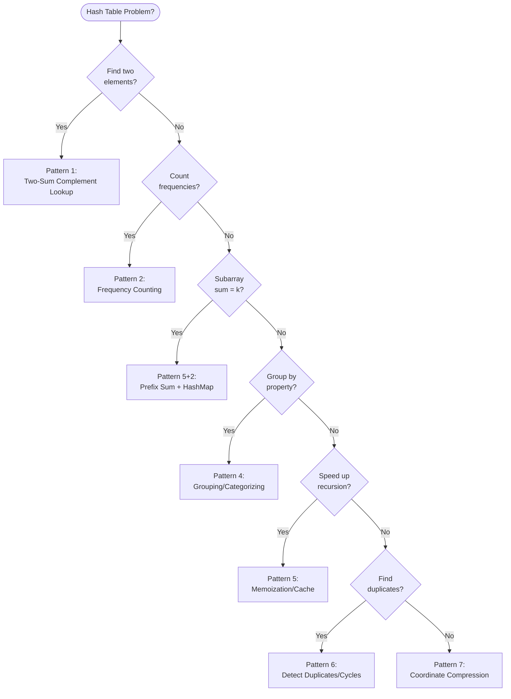

---
title: Hash Table Patterns
aliases: [hash map patterns, hash set patterns]
tags: [DSA, hash-table, patterns, interview, two-sum]
domain: DSA
difficulty: Intermediate
created: 2026-07-26
related: []
status: complete
---

# 🎯 Hash Table Patterns

> [!abstract] TL;DR
> Seven hash table patterns cover the vast majority of interview problems in this family. The most important: **two-sum complement lookup**, **frequency counting**, and **prefix sum + hashmap** (the hidden gem for subarray sum problems). Recognize the pattern from the problem statement, not from the examples.

---

## Intuition — analogy FIRST

A hash table is a **universal translator**: it converts any question of the form "have I seen X before?" or "what corresponds to X?" into an O(1) lookup. Every pattern below is really a different flavour of "pre-process information into a hash table so a future lookup is instant instead of O(n)."

Think of it as a chef's mise en place — chop and organize all ingredients before cooking. The hash table is the organized mise en place; the algorithm is the cooking.

---

## How It Works + mermaid



---

## Complexity Analysis

| Pattern | Time | Space | Key Trade-off |
|---------|------|-------|---------------|
| Two-sum lookup | O(n) | O(n) | O(n²) brute force → O(n) |
| Frequency counting | O(n) | O(k) k=unique | Sorting (O(n log n)) → O(n) |
| Sliding window + map | O(n) | O(k) | Inner loop eliminated |
| Grouping | O(n) | O(n) | One pass instead of nested loop |
| Memoization | O(states) | O(states) | Exponential recursion → polynomial |
| Duplicate detection | O(n) | O(n) | O(n²) nested check → O(n) |
| Coordinate compression | O(n log n) | O(n) | Sort + map to indices |

---

## Implementation (Python)

### Pattern 1 — Two-Sum Complement Lookup

**Core idea:** for each element x, check if `target - x` is already in a hashmap. If yes, found the pair. If no, store x for future use.

```python
# Two Sum (LC 1) — find indices of two numbers that add to target
def twoSum(nums: list[int], target: int) -> list[int]:
    seen = {}  # value → index
    for i, num in enumerate(nums):
        complement = target - num
        if complement in seen:
            return [seen[complement], i]
        seen[num] = i
    return []

# Generalization: Three Sum becomes Two Sum after fixing one element
def threeSum(nums: list[int]) -> list[list[int]]:
    nums.sort()
    result = []
    for i, a in enumerate(nums):
        if i > 0 and nums[i] == nums[i-1]:
            continue   # skip duplicates
        seen = set()
        for j in range(i+1, len(nums)):
            b = nums[j]
            c = -a - b  # need c = -(a+b)
            if c in seen:
                result.append([a, b, c])
                while j + 1 < len(nums) and nums[j] == nums[j+1]:
                    j += 1
            seen.add(b)
    return result
```

### Pattern 2 — Frequency Counting

```python
from collections import Counter

# Valid Anagram (LC 242)
def isAnagram(s: str, t: str) -> bool:
    return Counter(s) == Counter(t)

# Top K Frequent Elements (LC 347) — Counter + bucket sort
def topKFrequent(nums: list[int], k: int) -> list[int]:
    count = Counter(nums)
    # Bucket sort by frequency (index = frequency)
    buckets = [[] for _ in range(len(nums) + 1)]
    for num, freq in count.items():
        buckets[freq].append(num)
    # Collect from highest frequency bucket downward
    result = []
    for freq in range(len(buckets) - 1, 0, -1):
        result.extend(buckets[freq])
        if len(result) >= k:
            return result[:k]
    return result

# Majority Element (LC 169) — Boyer-Moore is O(1) space, but hashmap is clearer
def majorityElement(nums: list[int]) -> int:
    count = Counter(nums)
    return max(count, key=count.get)
```

### Pattern 3 — Sliding Window with HashMap

When a sliding window requires tracking character/element counts inside the window, a hashmap counts frequencies and allows O(1) window-validity checks.

```python
# Minimum Window Substring (LC 76)
def minWindow(s: str, t: str) -> str:
    if not t:
        return ""
    need = Counter(t)          # frequency needed
    have = {}                  # frequency in current window
    have_count = 0             # how many chars satisfy the need
    need_count = len(need)     # how many unique chars needed
    left = 0
    result = ""
    min_len = float('inf')
    for right, ch in enumerate(s):
        have[ch] = have.get(ch, 0) + 1
        if ch in need and have[ch] == need[ch]:
            have_count += 1
        while have_count == need_count:
            # Valid window — try to shrink
            if right - left + 1 < min_len:
                min_len = right - left + 1
                result = s[left:right+1]
            # Shrink left
            left_ch = s[left]
            have[left_ch] -= 1
            if left_ch in need and have[left_ch] < need[left_ch]:
                have_count -= 1
            left += 1
    return result

# Longest Substring Without Repeating Characters (LC 3)
def lengthOfLongestSubstring(s: str) -> int:
    char_idx = {}   # char → last seen index
    left = 0
    max_len = 0
    for right, ch in enumerate(s):
        if ch in char_idx and char_idx[ch] >= left:
            left = char_idx[ch] + 1   # jump left past duplicate
        char_idx[ch] = right
        max_len = max(max_len, right - left + 1)
    return max_len
```

### Pattern 4 — Grouping / Categorizing

```python
from collections import defaultdict

# Group Anagrams (LC 49) — group by sorted-letter canonical form
def groupAnagrams(strs: list[str]) -> list[list[str]]:
    groups = defaultdict(list)
    for s in strs:
        key = tuple(sorted(s))
        groups[key].append(s)
    return list(groups.values())

# Alternative: count-based key (avoids sort, O(26) per string)
def groupAnagramsCount(strs: list[str]) -> list[list[str]]:
    groups = defaultdict(list)
    for s in strs:
        count = [0] * 26
        for ch in s:
            count[ord(ch) - ord('a')] += 1
        groups[tuple(count)].append(s)
    return list(groups.values())
```

### Pattern 5 — Prefix Sum + HashMap (Subarray Sum)

**Key insight:** `prefixSum[j] - prefixSum[i] = k` means subarray `[i+1..j]` sums to k. If we've seen `prefixSum[j] - k` before at index i, we've found a valid subarray.

```python
# Subarray Sum Equals K (LC 560)
def subarraySum(nums: list[int], k: int) -> int:
    prefix_count = {0: 1}   # prefix_sum → count of times seen
    prefix_sum = 0
    count = 0
    for num in nums:
        prefix_sum += num
        # How many previous prefix sums satisfy: prefix_sum - prev = k?
        count += prefix_count.get(prefix_sum - k, 0)
        prefix_count[prefix_sum] = prefix_count.get(prefix_sum, 0) + 1
    return count

# Continuous Subarray Sum (LC 523) — subarray sum divisible by k
def checkSubarraySum(nums: list[int], k: int) -> bool:
    # If (prefix[j] - prefix[i]) % k == 0, then prefix[j] % k == prefix[i] % k
    remainder_idx = {0: -1}  # remainder → first index seen
    prefix = 0
    for i, num in enumerate(nums):
        prefix = (prefix + num) % k
        if prefix in remainder_idx:
            if i - remainder_idx[prefix] >= 2:   # subarray length ≥ 2
                return True
        else:
            remainder_idx[prefix] = i
    return False
```

### Pattern 6 — Detecting Duplicates / Cycles

```python
# Happy Number (LC 202) — detect cycle with set
def isHappy(n: int) -> bool:
    def digit_sq_sum(x):
        return sum(int(d)**2 for d in str(x))
    seen = set()
    while n != 1:
        if n in seen:
            return False   # cycle detected
        seen.add(n)
        n = digit_sq_sum(n)
    return True

# Find the Duplicate Number (LC 287) — Floyd's cycle detection
# (O(1) space version — hashset version is O(n) space but simpler)
def findDuplicate_hashset(nums: list[int]) -> int:
    seen = set()
    for num in nums:
        if num in seen:
            return num
        seen.add(num)
    return -1
```

### Pattern 7 — Coordinate Compression

Map large or sparse values to dense indices `[0, 1, 2, ...]` when you need array indexing but can't allocate a huge array.

```python
# Longest Consecutive Sequence (LC 128)
def longestConsecutive(nums: list[int]) -> int:
    num_set = set(nums)   # O(1) lookup
    best = 0
    for n in num_set:
        if n - 1 not in num_set:   # n is a sequence start
            length = 1
            while n + length in num_set:
                length += 1
            best = max(best, length)
    return best

# Generic coordinate compression
def compress(values: list[int]) -> dict[int, int]:
    """Map each unique value to its sorted rank [0, 1, 2, ...]."""
    sorted_unique = sorted(set(values))
    return {val: idx for idx, val in enumerate(sorted_unique)}

# Usage: turn large values into array indices
coords = [100, 200, 50, 200, 100]
rank = compress(coords)  # {50: 0, 100: 1, 200: 2}
compressed = [rank[v] for v in coords]  # [1, 2, 0, 2, 1]
```

---

## Dry Run / Example Trace

**Subarray Sum Equals K = 3 on `[1, 2, -1, 2, 1]`**

```
prefix_count = {0: 1},  prefix_sum = 0,  count = 0

i=0, num=1: prefix_sum=1, need seen (1-3=-2) → 0 times. Store 1.
             prefix_count = {0:1, 1:1}
i=1, num=2: prefix_sum=3, need seen (3-3=0) → 1 time! count=1.  Store 3.
             prefix_count = {0:1, 1:1, 3:1}
i=2, num=-1: prefix_sum=2, need seen (2-3=-1) → 0 times. Store 2.
             prefix_count = {0:1, 1:1, 3:1, 2:1}
i=3, num=2: prefix_sum=4, need seen (4-3=1) → 1 time! count=2. Store 4.
             prefix_count = {0:1, 1:1, 3:1, 2:1, 4:1}
i=4, num=1: prefix_sum=5, need seen (5-3=2) → 1 time! count=3. Store 5.

Result: 3 subarrays sum to 3: [1,2], [2,-1,2], [-1,2,1+?] Wait...
Subarrays: [1,2]=[0..1], [2,-1,2]=[1..3], [2,1]=[3..4] — wait [2,1]=3 ✓
Actually: [1,2],[2,-1,2],[2,1] → three subarrays each summing to 3 ✓
```

---

## Patterns & LeetCode Applications

| Pattern | Must-Know Problems |
|---------|--------------------|
| Two-Sum Complement | LC 1, LC 167, LC 15, LC 18 |
| Frequency Counting | LC 242, LC 347, LC 169, LC 451 |
| Sliding Window + Map | LC 3, LC 76, LC 567, LC 438 |
| Grouping | LC 49, LC 1743, LC 202 |
| Prefix Sum + Map | LC 560, LC 523, LC 974, LC 525 |
| Duplicate Detection | LC 217, LC 287, LC 202 |
| Coordinate Compression | LC 128, LC 327, LC 315 |

---

## Common Pitfalls

> [!danger] Pitfall 1 — Prefix sum initialization
> Always initialize `prefix_count = {0: 1}` before the loop. The `0: 1` handles subarrays starting from index 0 (a prefix sum that equals k exactly). Missing this gives wrong counts.

> [!warning] Pitfall 2 — Update order in prefix sum pattern
> In subarraySum, **check before updating** the prefix_count. Reversing this order would incorrectly count a single element as a valid "subarray" starting and ending at the same index.

> [!danger] Pitfall 3 — Key type inconsistency
> In groupAnagrams, the key must be a `tuple` (hashable), not a `list` (unhashable). `tuple(sorted(s))` works; `sorted(s)` or `list(...)` causes a `TypeError`.

> [!tip] Pitfall 4 — Using Counter for "at least k" frequency problems
> `Counter.most_common()` returns (element, count) pairs. When filtering by frequency ≥ k, remember `most_common()` is O(n log k) — use it explicitly; don't assume the counter is pre-sorted.

---

## Related Concepts

- [[_MOC_Hash_Tables|↑ Section MOC]]
- [[Hash_Table_Fundamentals]] — how hash tables achieve O(1) operations
- [[HashMap_vs_HashSet]] — which Python type to reach for
- [[Prefix_Sum]] — the mathematical technique that pattern 5 uses
- [[Sliding_Window]] — pattern 3 combines sliding window with a hashmap for validity checking

---

## Review Questions

1. In the Subarray Sum Equals K problem, why must `prefix_count` be initialized with `{0: 1}`, and what bug appears if you initialize it as `{}`?
2. In Group Anagrams, why do we use `tuple(sorted(s))` as the key rather than `sorted(s)` directly?
3. A problem asks: "Find the length of the longest consecutive sequence in an unsorted array in O(n) time." Which pattern applies, and how do you use the hash set to achieve O(n)?

---

## Sources

- [LeetCode — Two Sum (LC 1)](https://leetcode.com/problems/two-sum/)
- [LeetCode — Subarray Sum Equals K (LC 560)](https://leetcode.com/problems/subarray-sum-equals-k/)
- [LeetCode — Minimum Window Substring (LC 76)](https://leetcode.com/problems/minimum-window-substring/)
- [LeetCode — Longest Consecutive Sequence (LC 128)](https://leetcode.com/problems/longest-consecutive-sequence/)
- [LeetCode — Top K Frequent Elements (LC 347)](https://leetcode.com/problems/top-k-frequent-elements/)
- [NeetCode — Hash Map/Set patterns](https://neetcode.io/practice)

#hash-table #patterns #two-sum #prefix-sum #DSA #intermediate
