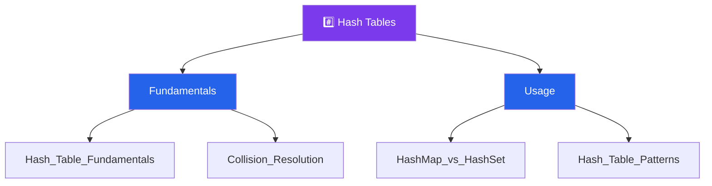

# #️⃣ Hash Tables — Map of Content

> [!abstract] What This Section Covers
> Hash tables are the go-to data structure for achieving O(1) average-case lookup, insertion, and deletion. This section begins with the mechanics of hashing — how keys are mapped to bucket indices — and proceeds to collision resolution strategies (chaining and open addressing). It then clarifies the practical difference between HashMap and HashSet and when each is the right tool. The section closes with a patterns guide covering the high-frequency interview patterns enabled by hash tables: frequency counting, the two-sum complement lookup, grouping/classification, and existence checks that replace O(n) linear scans.

## Concept Map

## Learning Path

Recommended order to study the notes in this section.

1. [[Hash_Table_Fundamentals]] — Hash functions, load factor, amortized O(1) operations, worst-case O(n) pitfalls
2. [[Collision_Resolution]] — Separate chaining vs. open addressing (linear probing, quadratic probing, double hashing)
3. [[HashMap_vs_HashSet]] — When you need key→value mapping (HashMap) vs. pure membership testing (HashSet)
4. [[Hash_Table_Patterns]] — Two-sum pattern, frequency counter, anagram grouping, seen-set existence check

## All Notes at a Glance

| Note | Summary | Difficulty |
|------|---------|------------|
| [[Hash_Table_Fundamentals]] | Hash function design, bucket array, load factor, rehashing | Beginner |
| [[Collision_Resolution]] | Chaining with linked lists vs. open addressing probing strategies | Intermediate |
| [[HashMap_vs_HashSet]] | dict vs. set in Python; when to use Counter vs. defaultdict vs. plain dict | Beginner |
| [[Hash_Table_Patterns]] | Two-sum complement lookup, frequency counting, grouping, sliding window with map | Intermediate |

## Key Questions This Section Answers

- What makes a good hash function and what happens when the load factor grows too large?
- When should you use `Counter` vs. `defaultdict` vs. a plain `dict` in Python?
- What is the two-sum pattern and why does a hash table reduce it from O(n²) to O(n)?
- How does separate chaining differ from open addressing in terms of cache performance and memory?
- How do you detect duplicate elements or find the first non-repeating character using a hash table?
- When does a hash table degrade to O(n) per operation and how do you guard against it?

## Related Sections

- [[_MOC_DSA_Master|↑ DSA Master MOC]]
- [[_MOC_Arrays|← Arrays]] — hash tables often replace O(n) linear scans over arrays

#MOC #DSA #hash-tables
