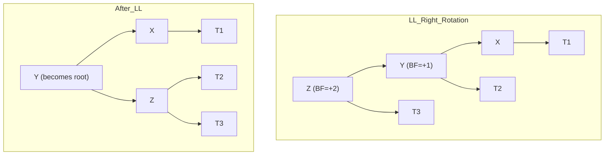
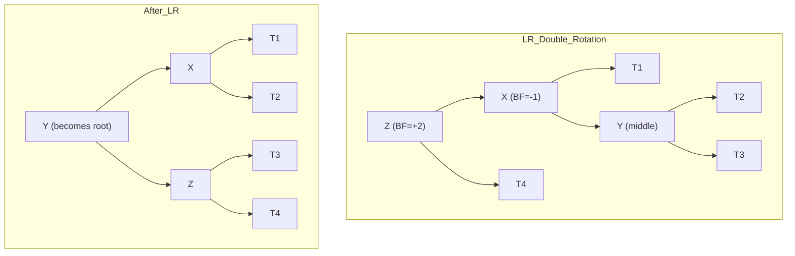

---
title: AVL Tree
aliases: [AVL, Adelson-Velsky Landis Tree]
tags: [DSA, Trees, AVL, SelfBalancing, Advanced]
domain: DSA
difficulty: Advanced
created: 2026-07-26
related: []
status: complete
---

# ⚖️ AVL Tree

> [!abstract] TL;DR
> An AVL tree is a self-balancing BST that maintains the **balance factor** (height of left subtree − height of right subtree) in {−1, 0, +1} for every node. After every insert or delete, at most O(log n) rotations restore balance, guaranteeing height ≤ 1.44 log₂ n and O(log n) for all operations.

---

## Intuition — Analogy First

Imagine a **mobile sculpture hanging from the ceiling** — the kind with balanced arms and ornaments. If you add a heavy ornament to one arm, the whole mobile tilts. To restore balance you either:

1. **Rotate the arm** — a simple single rotation if the tilt is on one side.
2. **Rotate twice** — a double rotation if the tilt is on a "zig-zag" path.

An AVL tree does exactly this after every insert or delete. The "weight" is the subtree height, and the "tilt limit" is 1.

---

## How It Works

### Balance Factor

```
balance_factor(node) = height(node.left) - height(node.right)
```

- BF = 0: perfectly balanced at this node
- BF = +1: left subtree is one level taller — still valid
- BF = -1: right subtree is one level taller — still valid
- |BF| > 1: **violation** — rotation required

### Four Rotation Cases

After inserting/deleting, walk back up to the first unbalanced ancestor and apply:

| Case | Trigger | Fix |
|---|---|---|
| **LL** | BF = +2 and left child BF ≥ 0 (new node in left-left) | Single right rotation |
| **RR** | BF = -2 and right child BF ≤ 0 (new node in right-right) | Single left rotation |
| **LR** | BF = +2 and left child BF < 0 (new node in left-right) | Left rotate left child, then right rotate root |
| **RL** | BF = -2 and right child BF > 0 (new node in right-left) | Right rotate right child, then left rotate root |





### Height Bound Proof Sketch

Let N(h) = minimum number of nodes in an AVL tree of height h:
- N(0) = 1, N(1) = 2
- N(h) = 1 + N(h-1) + N(h-2)  (one child has height h-1, the other h-2 due to BF ≤ 1)

This is a Fibonacci-like recurrence. N(h) ≈ φ^h / √5 where φ ≈ 1.618.

Therefore: h ≤ 1.44 log₂(n + 2) − 0.328

---

## Complexity Analysis

| Operation | Time | Space |
|---|---|---|
| Search | O(log n) guaranteed | O(log n) |
| Insert | O(log n) | O(log n) |
| Delete | O(log n) | O(log n) |
| Rotations per insert | O(1) amortized | O(1) |
| Rotations per delete | O(log n) worst case | O(1) per rotation |
| Height | ≤ 1.44 log₂ n | — |

> AVL trees require O(log n) rotations on delete (unlike O(1) for insert), which is why [[Red_Black_Tree]] is preferred in write-heavy workloads.

---

## Implementation (Python)

```python
from typing import Optional


class AVLNode:
    def __init__(self, val: int):
        self.val = val
        self.left: Optional['AVLNode'] = None
        self.right: Optional['AVLNode'] = None
        self.height: int = 0      # Height of subtree rooted here


class AVLTree:
    """
    Self-balancing BST using AVL rotations.
    Supports insert with automatic rebalancing.
    """

    # ── Height helpers ────────────────────────────────────────────────────────

    def _height(self, node: Optional[AVLNode]) -> int:
        return node.height if node else -1

    def _balance_factor(self, node: Optional[AVLNode]) -> int:
        if node is None:
            return 0
        return self._height(node.left) - self._height(node.right)

    def _update_height(self, node: AVLNode) -> None:
        node.height = 1 + max(self._height(node.left),
                               self._height(node.right))

    # ── Rotations ─────────────────────────────────────────────────────────────

    def _rotate_right(self, z: AVLNode) -> AVLNode:
        """
        LL case: rotate right around z.
             z                y
            / \\              / \\
           y   T3    →      x   z
          / \\                  / \\
         x   T2              T2  T3
        """
        y = z.left
        T2 = y.right

        # Perform rotation
        y.right = z
        z.left = T2

        # Update heights (z first since it's now lower)
        self._update_height(z)
        self._update_height(y)

        return y   # y is the new root of this subtree

    def _rotate_left(self, z: AVLNode) -> AVLNode:
        """
        RR case: rotate left around z.
           z                   y
          / \\                 / \\
         T1   y      →       z   x
             / \\            / \\
            T2   x         T1  T2
        """
        y = z.right
        T2 = y.left

        y.left = z
        z.right = T2

        self._update_height(z)
        self._update_height(y)

        return y

    # ── Rebalance ─────────────────────────────────────────────────────────────

    def _rebalance(self, node: AVLNode) -> AVLNode:
        """Apply the appropriate rotation(s) to restore AVL property."""
        self._update_height(node)
        bf = self._balance_factor(node)

        # LL: Left-Left case
        if bf > 1 and self._balance_factor(node.left) >= 0:
            return self._rotate_right(node)

        # LR: Left-Right case
        if bf > 1 and self._balance_factor(node.left) < 0:
            node.left = self._rotate_left(node.left)   # Step 1
            return self._rotate_right(node)             # Step 2

        # RR: Right-Right case
        if bf < -1 and self._balance_factor(node.right) <= 0:
            return self._rotate_left(node)

        # RL: Right-Left case
        if bf < -1 and self._balance_factor(node.right) > 0:
            node.right = self._rotate_right(node.right) # Step 1
            return self._rotate_left(node)              # Step 2

        return node   # Already balanced

    # ── Insert ────────────────────────────────────────────────────────────────

    def _insert(self, node: Optional[AVLNode], val: int) -> AVLNode:
        # Standard BST insert
        if node is None:
            return AVLNode(val)
        if val < node.val:
            node.left = self._insert(node.left, val)
        elif val > node.val:
            node.right = self._insert(node.right, val)
        else:
            return node  # Duplicate

        return self._rebalance(node)

    def insert(self, val: int) -> None:
        self.root = self._insert(self.root, val)

    # ── Search ────────────────────────────────────────────────────────────────

    def search(self, val: int) -> bool:
        curr = self.root
        while curr:
            if val == curr.val:
                return True
            curr = curr.right if val > curr.val else curr.left
        return False

    # ── Delete ────────────────────────────────────────────────────────────────

    def _find_min(self, node: AVLNode) -> AVLNode:
        while node.left:
            node = node.left
        return node

    def _delete(self, node: Optional[AVLNode], val: int) -> Optional[AVLNode]:
        if node is None:
            return None
        if val < node.val:
            node.left = self._delete(node.left, val)
        elif val > node.val:
            node.right = self._delete(node.right, val)
        else:
            if node.left is None:
                return node.right
            if node.right is None:
                return node.left
            # Two children: replace with inorder successor
            successor = self._find_min(node.right)
            node.val = successor.val
            node.right = self._delete(node.right, successor.val)

        return self._rebalance(node)

    def delete(self, val: int) -> None:
        self.root = self._delete(self.root, val)

    # ── Init ─────────────────────────────────────────────────────────────────

    def __init__(self):
        self.root: Optional[AVLNode] = None

    # ── In-order (should be sorted) ───────────────────────────────────────────

    def inorder(self) -> list:
        result = []
        def _dfs(node):
            if node:
                _dfs(node.left)
                result.append(node.val)
                _dfs(node.right)
        _dfs(self.root)
        return result


# ── Demo ──────────────────────────────────────────────────────────────────────

if __name__ == "__main__":
    avl = AVLTree()

    # Inserting sorted data — would create degenerate BST, but AVL stays balanced
    for val in [1, 2, 3, 4, 5, 6, 7]:
        avl.insert(val)

    print("Inorder:", avl.inorder())            # [1, 2, 3, 4, 5, 6, 7]
    print("Root:", avl.root.val)                # 4 (balanced mid-point)
    print("Root height:", avl.root.height)      # 2 (not 6 as in plain BST)
    print("Balance factor:", avl._balance_factor(avl.root))  # 0

    print("Search 5:", avl.search(5))           # True
    print("Search 9:", avl.search(9))           # False

    avl.delete(4)
    print("After deleting 4:", avl.inorder())   # [1, 2, 3, 5, 6, 7]
    print("New root:", avl.root.val)            # 5 (successor promoted)
```

---

## Dry Run / Example Trace

### Inserting 1, 2, 3 (would produce a degenerate BST — AVL fixes it)

```
Insert 1:
  root = AVLNode(1), height=0, BF=0

Insert 2:
  1.right = AVLNode(2)
  Update heights: 1.height=1
  BF(1) = 0-1 = -1 ← valid, no rotation

Insert 3:
  2.right = AVLNode(3)
  Update heights: 2.height=1, then 1.height=2
  BF(1) = 0-2 = -2 ← VIOLATION! RR case
  Apply rotate_left(1):
    y = 2, T2 = 2.left = None
    2.left = 1, 1.right = None
    Update: 1.height=0, 2.height=1
  New root = 2

Final tree:
       2
      / \
     1   3
  BF(2) = 0 ✓  BF(1) = 0 ✓  BF(3) = 0 ✓
```

### LR (Left-Right) rotation example: Insert 3, 1, 2

```
After inserting 3 and 1:
       3
      /
     1
  BF(3) = 1 ← valid

Insert 2 (goes right of 1):
       3
      /
     1
      \
       2
  BF(3) = 2 ← VIOLATION! BF(1) = -1 → LR case

Step 1: rotate_left(1):
     3
    /
   2
  /
 1

Step 2: rotate_right(3):
     2
    / \
   1   3

Result: perfectly balanced AVL tree ✓
```

---

## Patterns & LeetCode Applications

| Use Case | Notes |
|---|---|
| Ordered statistics | Kth largest/smallest in O(log n) |
| Dynamic sorted sets | When `SortedList` from `sortedcontainers` is not available |
| Interval trees | Augment AVL with max-endpoint for O(log n) interval stabbing |
| BST Iterator | AVL ensures O(log n) traversal steps |

> In Python interviews, `from sortedcontainers import SortedList` internally uses a different structure but gives O(log n) sorted ops. AVL knowledge is tested in design questions.

---

## Common Pitfalls

1. **Updating height before checking balance factor** — always update height bottom-up: children before parent.
2. **Returning the new root after rotation** — rotations change the local root; every recursive call must `return` the (possibly new) root.
3. **Wrong BF threshold for LR vs LL** — LL is triggered when `bf > 1 AND child_bf >= 0`, not just `bf > 1`.
4. **Forgetting to rebalance after delete** — deletion can cause imbalance all the way up to the root; the `_rebalance` call must happen at every recursive frame on the way back up.
5. **AVL vs Red-Black confusion** — AVL is stricter (BF ≤ 1), so it's more balanced but needs more rotations on delete. Red-Black allows slightly less balance but fewer rotations on insert/delete.
6. **Height of None** — always return -1 for `None` nodes so single-node height = 0 and BF calculations are consistent.

---

## Related Concepts

- [[_MOC_Trees|↑ Section MOC]]
- [[Binary_Search_Tree]] — AVL is a self-balancing BST
- [[Red_Black_Tree]] — alternative balancing scheme with fewer rotations on delete

---

## Review Questions

1. When inserting into an AVL tree, at most how many rotations are needed to restore balance, and why? How does this differ from deletion?
2. Describe the LR (Left-Right) double rotation step by step. What makes it a "double" rotation and why can't a single rotation fix it?
3. Given the recurrence N(h) = 1 + N(h-1) + N(h-2) with N(0)=1, N(1)=2, explain why AVL trees of height h have at least Fibonacci(h+3) − 1 nodes, and derive the bound h ≤ 1.44 log₂ n.

---

## Sources

- Adelson-Velsky & Landis (1962) "An algorithm for the organization of information"
- CLRS — Introduction to Algorithms, Chapter 13 (Red-Black as comparison)
- Skiena — Algorithm Design Manual, Section 3.4.1
- [Visualgo AVL Tree](https://visualgo.net/en/bst)

#DSA #Trees #AVL #SelfBalancing #Rotations #Advanced
