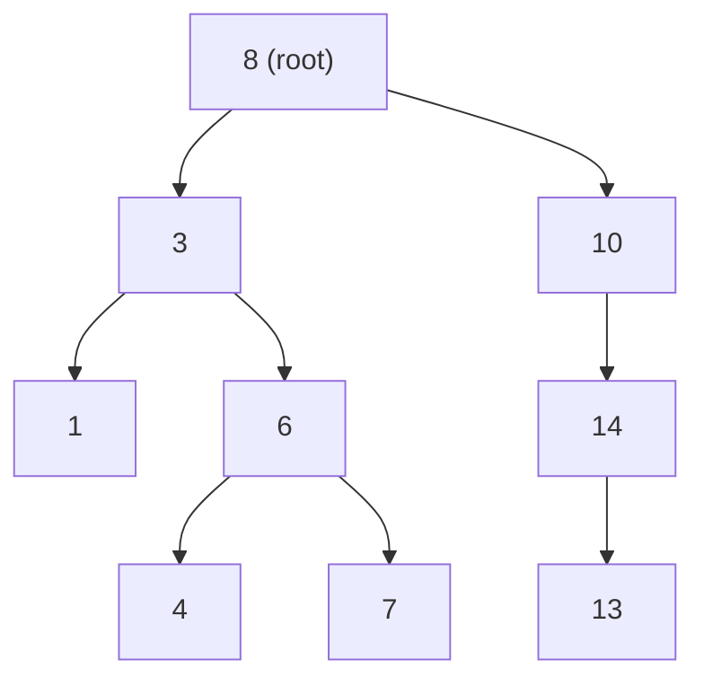

---
title: Binary Search Tree
aliases: [BST]
tags: [DSA, Trees, BST, BinarySearchTree]
domain: DSA
difficulty: Intermediate
created: 2026-07-26
related: []
status: complete
---

# 🔍 Binary Search Tree (BST)

> [!abstract] TL;DR
> A BST is a binary tree where every node satisfies: **all values in the left subtree < node.val < all values in the right subtree**. This one invariant makes search, insert, and delete O(log n) on average — but O(n) on sorted input (degenerate case). Inorder traversal always yields a sorted sequence.

---

## Intuition — Analogy First

Think of a **physical dictionary**. When you look up "Python":
1. You open to the middle — say "M". Python > M, so you discard the left half.
2. Middle of remaining — "T". Python < T, discard right.
3. Middle — "Q". Python < Q, discard right.
4. You find "P" section, then narrow further.

Each step eliminates roughly **half** the search space — that's O(log n). A BST is this process encoded as a pointer structure: instead of pages, you follow left/right pointers.

The catch: if you insert {1, 2, 3, 4, 5} in order, the "dictionary" becomes a single tall column — a degenerate tree with O(n) operations. Self-balancing trees ([[AVL_Tree]], [[Red_Black_Tree]]) fix this.

---

## How It Works

### BST Property (Invariant)

For every node N:
- **All** nodes in `N.left` subtree have values **< N.val**
- **All** nodes in `N.right` subtree have values **> N.val**
- This must hold recursively, not just for immediate children.

> [!warning] Common mistake
> "Left child < node AND right child > node" is NOT sufficient. Consider inserting 5, then 3, then 7, then 6 as the *left* child of 7 — this is invalid because 6 > 5 (the root) but sits in the right subtree, which is fine; the constraint is against the full subtree range, not just the parent.

### Average vs Worst Case

| Scenario | Height | Search/Insert/Delete |
|---|---|---|
| Random insertion order | O(log n) expected | O(log n) |
| Sorted input (1,2,3,...) | O(n) — degenerate | O(n) |
| Self-balancing (AVL/RB) | O(log n) guaranteed | O(log n) |

**Math**: For n random insertions, expected height ≈ 2.77 log₂ n (proven by Devroye, 1986).

### Delete — Three Cases

| Case | Action |
|---|---|
| Node is a leaf | Simply remove it |
| Node has one child | Replace node with its child |
| Node has two children | Replace node's value with its **inorder successor** (smallest in right subtree), then delete the successor |



BST search for 7: 8 → right? No, 7 < 8 → go left to 3 → 7 > 3 → go right to 6 → 7 > 6 → go right to 7 → found!

Delete 6 (two children): successor = leftmost of right subtree of 6 = 7. Replace 6's value with 7, delete original 7 (leaf).

---

## Complexity Analysis

| Operation | Average | Worst (degenerate) | Space |
|---|---|---|---|
| Search | O(log n) | O(n) | O(h) recursive |
| Insert | O(log n) | O(n) | O(h) recursive |
| Delete | O(log n) | O(n) | O(h) recursive |
| Inorder traversal | O(n) | O(n) | O(h) |
| Find min/max | O(h) | O(n) | O(1) iterative |
| Kth smallest | O(h + k) | O(n) | O(h) |
| Build from sorted array | O(n) | O(n) | O(n) |

---

## Implementation (Python)

```python
from typing import Optional, Tuple


class TreeNode:
    def __init__(self, val: int = 0,
                 left: 'Optional[TreeNode]' = None,
                 right: 'Optional[TreeNode]' = None):
        self.val = val
        self.left = left
        self.right = right


# ── Search ──────────────────────────────────────────────────────────────────

def search(root: Optional[TreeNode], target: int) -> Optional[TreeNode]:
    """Iterative BST search — O(h) time, O(1) space."""
    curr = root
    while curr:
        if target == curr.val:
            return curr
        curr = curr.right if target > curr.val else curr.left
    return None


# ── Insert ──────────────────────────────────────────────────────────────────

def insert(root: Optional[TreeNode], val: int) -> TreeNode:
    """
    Recursive insert. Returns root of modified tree.
    Duplicates are ignored (or handle per requirements).
    """
    if root is None:
        return TreeNode(val)
    if val < root.val:
        root.left = insert(root.left, val)
    elif val > root.val:
        root.right = insert(root.right, val)
    # val == root.val: duplicate, do nothing
    return root


def insert_iterative(root: Optional[TreeNode], val: int) -> TreeNode:
    """Iterative insert — avoids recursion depth issues."""
    new_node = TreeNode(val)
    if root is None:
        return new_node

    curr = root
    while True:
        if val < curr.val:
            if curr.left is None:
                curr.left = new_node
                break
            curr = curr.left
        elif val > curr.val:
            if curr.right is None:
                curr.right = new_node
                break
            curr = curr.right
        else:
            break  # Duplicate
    return root


# ── Delete ──────────────────────────────────────────────────────────────────

def delete(root: Optional[TreeNode], val: int) -> Optional[TreeNode]:
    """
    Delete a node from BST. Returns root of modified tree.
    Two-child case: replace with inorder successor.
    """
    if root is None:
        return None

    if val < root.val:
        root.left = delete(root.left, val)
    elif val > root.val:
        root.right = delete(root.right, val)
    else:
        # Found the node to delete
        if root.left is None:
            return root.right          # Case 1 or 2: no left child
        if root.right is None:
            return root.left           # Case 2: no right child

        # Case 3: two children — find inorder successor
        successor = _find_min(root.right)
        root.val = successor.val                       # Copy successor value
        root.right = delete(root.right, successor.val) # Delete successor

    return root


def _find_min(node: TreeNode) -> TreeNode:
    """Find the minimum node (leftmost) in a subtree."""
    while node.left:
        node = node.left
    return node


def _find_max(node: TreeNode) -> TreeNode:
    """Find the maximum node (rightmost) in a subtree."""
    while node.right:
        node = node.right
    return node


# ── Validate BST ─────────────────────────────────────────────────────────────

def is_valid_bst(root: Optional[TreeNode]) -> bool:
    """
    Validate BST by passing min/max bounds down the tree.
    Each node must satisfy: min_bound < node.val < max_bound.
    Time: O(n), Space: O(h)
    """
    def _validate(node: Optional[TreeNode],
                  lo: float, hi: float) -> bool:
        if node is None:
            return True
        if not (lo < node.val < hi):
            return False
        return (_validate(node.left, lo, node.val) and
                _validate(node.right, node.val, hi))

    return _validate(root, float('-inf'), float('inf'))


# ── Kth Smallest ─────────────────────────────────────────────────────────────

def kth_smallest(root: Optional[TreeNode], k: int) -> int:
    """
    Inorder traversal gives sorted order — stop at kth element.
    Iterative to avoid stack overflow.
    Time: O(h + k), Space: O(h)
    """
    stack = []
    curr = root
    count = 0

    while curr or stack:
        while curr:
            stack.append(curr)
            curr = curr.left
        curr = stack.pop()
        count += 1
        if count == k:
            return curr.val
        curr = curr.right

    raise ValueError(f"k={k} exceeds number of nodes")


# ── Build Balanced BST from Sorted Array ─────────────────────────────────────

def sorted_array_to_bst(nums: list) -> Optional[TreeNode]:
    """
    Convert sorted array to height-balanced BST.
    Always pick the middle element as root — halves the problem each time.
    Time: O(n), Space: O(log n) recursion stack
    """
    def _build(lo: int, hi: int) -> Optional[TreeNode]:
        if lo > hi:
            return None
        mid = (lo + hi) // 2
        node = TreeNode(nums[mid])
        node.left = _build(lo, mid - 1)
        node.right = _build(mid + 1, hi)
        return node

    return _build(0, len(nums) - 1)


# ── Inorder Successor / Predecessor ──────────────────────────────────────────

def inorder_successor(root: Optional[TreeNode],
                      p: TreeNode) -> Optional[TreeNode]:
    """
    Inorder successor = smallest node greater than p.
    If p has a right subtree: leftmost of right subtree.
    Else: last ancestor where we came from the left.
    """
    successor = None
    curr = root

    while curr:
        if p.val < curr.val:
            successor = curr     # Candidate: came from left
            curr = curr.left
        else:
            curr = curr.right

    return successor


def inorder_predecessor(root: Optional[TreeNode],
                        p: TreeNode) -> Optional[TreeNode]:
    """Inorder predecessor = largest node smaller than p."""
    predecessor = None
    curr = root

    while curr:
        if p.val > curr.val:
            predecessor = curr   # Candidate: came from right
            curr = curr.right
        else:
            curr = curr.left

    return predecessor


# ── Demo ──────────────────────────────────────────────────────────────────────

if __name__ == "__main__":
    root = None
    for v in [5, 3, 7, 1, 4, 6, 8]:
        root = insert(root, v)

    #      5
    #     / \
    #    3   7
    #   / \ / \
    #  1  4 6  8

    print("Is valid BST:", is_valid_bst(root))        # True
    print("3rd smallest:", kth_smallest(root, 3))     # 4
    print("Search 6:", search(root, 6))               # TreeNode(6)
    print("Search 9:", search(root, 9))               # None

    root = delete(root, 3)
    print("After deleting 3, 3rd smallest:", kth_smallest(root, 3))  # 5

    balanced = sorted_array_to_bst([1, 2, 3, 4, 5, 6, 7])
    print("Balanced BST root:", balanced.val)         # 4
```

---

## Dry Run / Example Trace

### Delete node 3 from the tree [5, 3, 7, 1, 4, 6, 8]

```
Initial tree:
         5
        / \
       3   7
      / \ / \
     1  4 6  8

delete(root=5, val=3):
  3 < 5 → go left
  delete(root=3, val=3):
    3 == 3, two children (1 and 4)
    successor = _find_min(3.right) = 4
    3.val ← 4
    3.right = delete(4, 4) → 4 is a leaf → return None

After:
         5
        / \
       4   7
      /   / \
     1   6   8
```

### Validate BST — detecting a false BST

```
Tree with violation:
         5
        / \
       3   7
      / \
     1   6   ← 6 > 5 but sits in LEFT subtree of 5!

_validate(5, -inf, +inf)
  → _validate(3, -inf, 5)
      → _validate(1, -inf, 3)  → True
      → _validate(6, 3, 5)
          6 < 5? NO → return False  ← caught!
```

---

## Patterns & LeetCode Applications

| Problem | Key Insight |
|---|---|
| LC 98 Validate Binary Search Tree | Pass (lo, hi) bounds — not just parent value |
| LC 230 Kth Smallest Element in BST | Iterative inorder, stop at kth |
| LC 173 BST Iterator | Iterative inorder with lazy stack |
| LC 235 Lowest Common Ancestor of BST | If both < root go left; both > root go right; else root is LCA |
| LC 108 Convert Sorted Array to BST | Always pick middle as root |
| LC 450 Delete Node in BST | Handle 3 cases; successor trick for 2-child |
| LC 700 Search in BST | Basic iterative search |
| LC 1305 All Elements in Two BSTs | Inorder both, merge two sorted lists |

---

## Common Pitfalls

1. **Validating only against immediate parent** — use the (lo, hi) range technique; a node's constraint is inherited from its ancestors.
2. **Forgetting to return the root after insert/delete** — since Python is pass-by-object-reference, always `root.left = insert(root.left, val)`.
3. **Duplicate handling** — BST definition usually requires strict inequality; clarify with interviewer if duplicates are possible.
4. **Delete successor then overwrite** — the order matters: copy successor value first, then delete the successor node; never delete node first.
5. **Worst case on sorted input** — inserting a sorted list into a BST yields a linked list; for production use, shuffle first or use a balanced BST.
6. **Confusing predecessor/successor** — successor is *smallest value greater than p* (go right then leftmost), predecessor is *largest value less than p* (go left then rightmost).

---

## Related Concepts

- [[_MOC_Trees|↑ Section MOC]]
- [[Binary_Tree_Fundamentals]] — node structure, height, balance definitions
- [[AVL_Tree]] — self-balancing BST with O(log n) guaranteed
- [[Red_Black_Tree]] — alternative self-balancing BST with fewer rotations
- [[Tree_Traversals]] — inorder traversal gives sorted BST sequence

---

## Review Questions

1. Why is it insufficient to check only that each node's left child is smaller and right child is larger when validating a BST? Give a concrete counter-example.
2. What is the inorder successor of a node that has a right subtree vs. a node that does not have a right subtree? Describe both cases algorithmically.
3. Given a sorted array of n elements, write the recurrence relation for building a balanced BST and solve it to find the time complexity.

---

## Sources

- CLRS — Introduction to Algorithms, Chapter 12
- Skiena — Algorithm Design Manual, Section 3.4
- LeetCode Explore: Binary Search Tree
- Devroye, L. (1986) "A note on the height of binary search trees"

#DSA #Trees #BST #BinarySearchTree #Search #Insert #Delete #Intermediate
