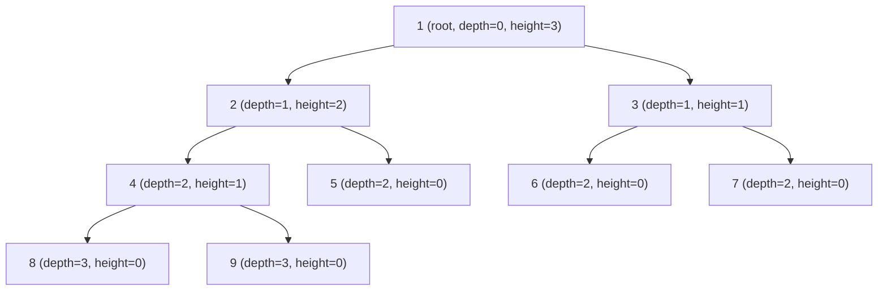

---
title: Binary Tree Fundamentals
aliases: []
tags: [DSA, Trees, BinaryTree, Fundamentals]
domain: DSA
difficulty: Beginner
created: 2026-07-26
related: []
status: complete
---

# 🌳 Binary Tree Fundamentals

> [!abstract] TL;DR
> A binary tree is a hierarchical data structure where each node has at most two children (left and right). Trees power everything from file systems to databases. Key insight: a perfect binary tree of height h has exactly 2^(h+1) − 1 nodes, and level k holds exactly 2^k nodes.

---

## Intuition — Analogy First

Think of a **company org chart**. The CEO sits at the top (root). Each manager can have at most **2 direct reports** (left child, right child). An individual contributor with no reports is a **leaf node**. The CEO's "level" is 0, their direct reports are level 1, and so on.

- Firing someone (deletion) requires re-connecting their reports.
- The "depth" of an employee is how many hops from the CEO they are.
- The "height" of a subtree rooted at a manager is the longest chain of reports below them.

This structure beats arrays when you need **dynamic, sorted insertion** — no shifting elements, just rewiring pointers.

---

## How It Works

### Core Definitions

| Term | Definition |
|---|---|
| **Node** | Stores a value (`val`), a `left` pointer, and a `right` pointer |
| **Root** | The topmost node (no parent) |
| **Leaf** | A node with no children (`left == right == None`) |
| **Height of node** | Longest path from that node down to any leaf |
| **Depth of node** | Distance from the root to that node |
| **Level k** | All nodes at depth k |

### Key Math

| Formula | Value |
|---|---|
| Nodes at level k | 2^k |
| Max nodes in height-h tree | 2^(h+1) − 1 |
| Min height for n nodes | ⌊log₂ n⌋ |
| Leaves in a full binary tree | (n + 1) / 2 |

### Tree Types

| Type | Definition |
|---|---|
| **Full** | Every node has 0 or 2 children |
| **Complete** | All levels filled except possibly the last, filled left to right |
| **Perfect** | All internal nodes have 2 children; all leaves at the same level |
| **Balanced** | Height difference between left and right subtrees ≤ 1 for every node |
| **Degenerate** | Every node has exactly 1 child (degrades to a linked list) |

### Traversal Orders (Overview)

- **Level order**: visit by breadth (BFS) — natural for "row by row" problems
- **Depth order**: DFS variants (inorder, preorder, postorder) — covered in [[Tree_Traversals]]

### When Trees Beat Arrays

| Scenario | Array | Tree |
|---|---|---|
| Sorted insertion | O(n) shift | O(log n) |
| Dynamic resizing | Expensive copy | Pointer rewire |
| Hierarchical data | Awkward | Natural |
| Range queries | O(n) | O(log n) with augmentation |



Level 0: 1 node (2^0), Level 1: 2 nodes (2^1), Level 2: 4 nodes (2^2), Level 3: 2 nodes (incomplete).

---

## Complexity Analysis

| Operation | Time | Space |
|---|---|---|
| Access by value | O(n) | O(h) recursion stack |
| Insert (arbitrary) | O(1) if parent known | O(1) |
| Delete | O(n) to find + O(1) rewire | O(h) |
| Height calculation | O(n) | O(h) |
| Count nodes | O(n) | O(h) |
| Level-order traversal | O(n) | O(w) — w = max width |
| Build from list | O(n) | O(n) |

> h = height of tree. For a balanced tree h = O(log n); for a degenerate tree h = O(n).

---

## Implementation (Python)

```python
from collections import deque
from typing import Optional, List


class TreeNode:
    """Standard binary tree node used in LeetCode and interviews."""
    def __init__(self, val: int = 0,
                 left: 'Optional[TreeNode]' = None,
                 right: 'Optional[TreeNode]' = None):
        self.val = val
        self.left = left
        self.right = right

    def __repr__(self) -> str:
        return f"TreeNode({self.val})"


# ── Build from level-order list (None = missing node) ──────────────────────
def build_tree(values: List[Optional[int]]) -> Optional[TreeNode]:
    """
    Build a binary tree from a level-order list.
    e.g. [1, 2, 3, None, 5] builds:
         1
        / \\
       2   3
        \\
         5
    """
    if not values or values[0] is None:
        return None

    root = TreeNode(values[0])
    queue: deque[TreeNode] = deque([root])
    i = 1

    while queue and i < len(values):
        node = queue.popleft()

        # Left child
        if i < len(values):
            if values[i] is not None:
                node.left = TreeNode(values[i])
                queue.append(node.left)
            i += 1

        # Right child
        if i < len(values):
            if values[i] is not None:
                node.right = TreeNode(values[i])
                queue.append(node.right)
            i += 1

    return root


# ── Height ──────────────────────────────────────────────────────────────────
def height(root: Optional[TreeNode]) -> int:
    """
    Height of the tree = longest path from root to any leaf.
    An empty tree has height -1; a single node has height 0.
    """
    if root is None:
        return -1
    return 1 + max(height(root.left), height(root.right))


# ── Count nodes ─────────────────────────────────────────────────────────────
def count_nodes(root: Optional[TreeNode]) -> int:
    """Count all nodes in O(n) time."""
    if root is None:
        return 0
    return 1 + count_nodes(root.left) + count_nodes(root.right)


def count_nodes_complete(root: Optional[TreeNode]) -> int:
    """
    Optimised count for a *complete* binary tree.
    Uses the property that one of the two subtrees is always perfect.
    Time: O(log^2 n) instead of O(n).
    """
    if root is None:
        return 0

    left_h = _left_height(root)
    right_h = _right_height(root)

    if left_h == right_h:          # Left subtree is perfect
        return (1 << left_h) - 1 + 1 + count_nodes_complete(root.right)
    else:                          # Right subtree is perfect (one level shorter)
        return count_nodes_complete(root.left) + 1 + (1 << right_h) - 1


def _left_height(node: Optional[TreeNode]) -> int:
    h = 0
    while node:
        node = node.left
        h += 1
    return h


def _right_height(node: Optional[TreeNode]) -> int:
    h = 0
    while node:
        node = node.right
        h += 1
    return h


# ── Check if balanced ───────────────────────────────────────────────────────
def is_balanced(root: Optional[TreeNode]) -> bool:
    """Returns True if the tree is height-balanced (|h_left - h_right| <= 1)."""
    def _check(node: Optional[TreeNode]) -> int:
        """Returns height or -2 to signal imbalance."""
        if node is None:
            return -1
        lh = _check(node.left)
        if lh == -2:
            return -2
        rh = _check(node.right)
        if rh == -2:
            return -2
        if abs(lh - rh) > 1:
            return -2
        return 1 + max(lh, rh)

    return _check(root) != -2


# ── Level-order print ───────────────────────────────────────────────────────
def print_level_order(root: Optional[TreeNode]) -> None:
    if not root:
        return
    queue: deque[TreeNode] = deque([root])
    while queue:
        level_size = len(queue)
        row = []
        for _ in range(level_size):
            node = queue.popleft()
            row.append(node.val)
            if node.left:
                queue.append(node.left)
            if node.right:
                queue.append(node.right)
        print(row)


# ── Demo ─────────────────────────────────────────────────────────────────────
if __name__ == "__main__":
    #       1
    #      / \
    #     2   3
    #    / \ / \
    #   4  5 6  7
    tree = build_tree([1, 2, 3, 4, 5, 6, 7])

    print("Level-order:")
    print_level_order(tree)           # [1] [2,3] [4,5,6,7]

    print(f"Height:      {height(tree)}")         # 2
    print(f"Node count:  {count_nodes(tree)}")    # 7
    print(f"Is balanced: {is_balanced(tree)}")    # True
```

---

## Dry Run / Example Trace

Build tree from `[1, 2, 3, None, 5, 6, 7]`:

```
Step 1: root = TreeNode(1), queue = [1]
Step 2: pop 1, left = TreeNode(2), right = TreeNode(3), queue = [2, 3]
Step 3: pop 2, left = None (skip), right = TreeNode(5), queue = [3, 5]
Step 4: pop 3, left = TreeNode(6), right = TreeNode(7), queue = [5, 6, 7]
Step 5: pop 5, i >= len → done

Result:
        1
       / \
      2   3
       \ / \
       5 6  7
```

Height calculation on the above:

```
height(7) = -1+1+1 = 0   (leaf)
height(6) = 0            (leaf)
height(5) = 0            (leaf)
height(3) = 1 + max(0,0) = 1
height(2) = 1 + max(-1,0) = 1
height(1) = 1 + max(1,1) = 2
```

---

## Patterns & LeetCode Applications

| Pattern | Problem | Key Insight |
|---|---|---|
| Height/depth | LC 104 Max Depth | Postorder: compute children first |
| Symmetry | LC 101 Symmetric Tree | Compare mirror nodes recursively |
| Level order | LC 102 Binary Tree Level Order | BFS with queue size snapshot |
| Diameter | LC 543 Diameter of Binary Tree | diameter = max(lh + rh + 2) globally |
| Invert tree | LC 226 Invert Binary Tree | Swap children at every node |
| Path sum | LC 112 Path Sum | Subtract from target as you descend |
| Serialise | LC 297 Serialize and Deserialize | BFS encode + decode with sentinels |

---

## Common Pitfalls

1. **Height vs depth confusion** — height is measured from below (leaf = 0); depth is measured from above (root = 0).
2. **Off-by-one on height** — returning 0 for `None` instead of -1 shifts all heights by 1.
3. **Balanced ≠ complete** — a balanced tree can have leaves on different levels as long as heights differ by at most 1.
4. **Forgetting the `None` case** — always check `if root is None: return` as the base case before accessing `.left` or `.right`.
5. **Stack overflow on skewed trees** — recursive DFS on a 10^5-node degenerate tree hits Python's default recursion limit (1000). Use iterative traversal or `sys.setrecursionlimit`.
6. **`2^(h+1) - 1` is for a perfect tree** — a complete tree may have fewer nodes on the last level.

---

## Related Concepts

- [[_MOC_Trees|↑ Section MOC]]
- [[Tree_Traversals]] — inorder, preorder, postorder, BFS
- [[Binary_Search_Tree]] — BST property and operations
- [[Segment_Tree]] — range queries built on binary tree structure
- [[AVL_Tree]] — self-balancing binary tree

---

## Review Questions

1. A binary tree has height 4. What is the maximum number of nodes it can hold, and what type of tree achieves this maximum?
2. Why does counting nodes in a complete binary tree take O(log² n) rather than O(n), and what property is exploited?
3. A tree has n nodes and is perfectly balanced. What is its height in terms of n, and how does this compare to a degenerate (linked-list) tree?

---

## Sources

- CLRS — Introduction to Algorithms, Chapter 12
- LeetCode Explore: Trees
- Skiena — Algorithm Design Manual, Chapter 3
- [cp-algorithms.com — Trees](https://cp-algorithms.com/graph/depth-first-search.html)

#DSA #Trees #BinaryTree #Fundamentals #DataStructures
