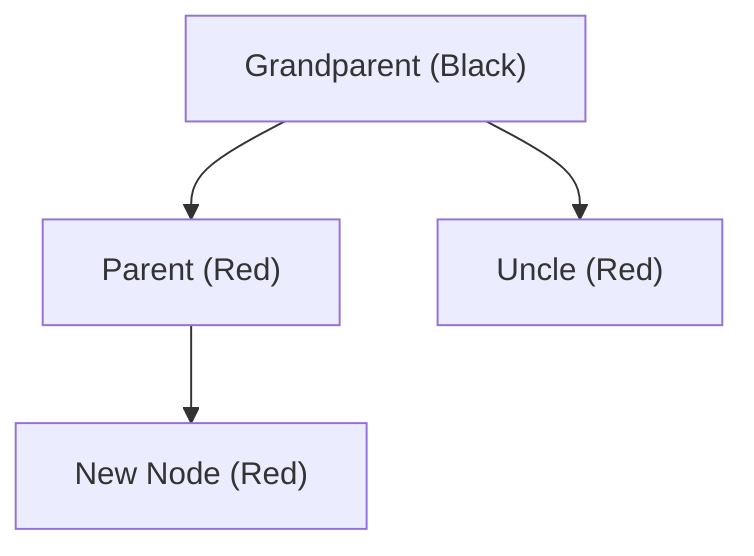
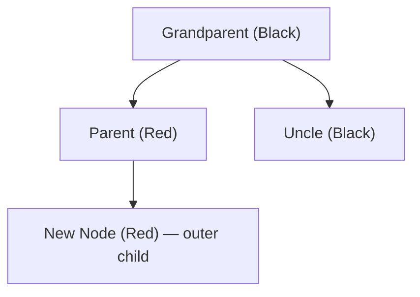

---
title: Red-Black Tree
aliases: [RBT, Red Black Tree]
tags: [DSA, Trees, RedBlackTree, SelfBalancing, Advanced]
domain: DSA
difficulty: Advanced
created: 2026-07-26
related: []
status: complete
---

# 🔴⚫ Red-Black Tree

> [!abstract] TL;DR
> A Red-Black tree is a self-balancing BST with 5 color-based invariants that collectively guarantee height ≤ 2 log₂(n+1). Compared to [[AVL_Tree]], it allows slightly more imbalance but requires **at most 2 rotations** on insert and **at most 3** on delete — making it the industry choice for write-heavy data structures. Java's `TreeMap`/`TreeSet` and C++ STL `std::map` use Red-Black Trees.

---

## Intuition — Analogy First

Think of **traffic light rules** for a balanced tree. Every node is either a red light or a black light:

- **Red lights must stop** — a red node cannot have red children (no two reds in a row). Red nodes must always be "surrounded" by black nodes.
- **Black lights are the backbone** — every path from root to leaf must cross the same number of black nodes (the **black-height**). This ensures no path is more than twice as long as another.
- The **root is always black** — the CEO of the company doesn't take risks.
- **Null leaves are black** — every missing child is a black sentinel.

When you insert a new "red light" into the system, you may violate the rules. The fixup procedure recolors and rotates to restore traffic order — never needing more than 2 rotations.

---

## How It Works

### The 5 Properties (Invariants)

| # | Property |
|---|---|
| 1 | Every node is either **red** or **black** |
| 2 | The **root is black** |
| 3 | All **null (leaf) nodes are black** |
| 4 | If a node is **red**, both its children are **black** (no two consecutive reds) |
| 5 | All paths from any node to its descendant null nodes contain the **same number of black nodes** (black-height is uniform) |

These 5 properties together guarantee: **height ≤ 2 log₂(n + 1)**

### Why These Properties Work

- Property 5 ensures no subtree is "empty" while another is "full" — all paths are equally black-weighted.
- Property 4 means between any two black nodes, there can be at most one red node.
- Therefore, the longest path (alternating red-black) is at most twice the shortest path (all black).
- Maximum height = 2 × black-height ≤ 2 log₂(n+1).

### Insert Fixup Cases

New nodes are always inserted as **red** (to preserve black-height). Then fix violations of Property 4:

| Case | Situation | Action |
|---|---|---|
| **Case 1** | Uncle is red | Recolor parent and uncle to black, grandparent to red; move up to grandparent |
| **Case 2** | Uncle is black, new node is "inner" child (LR or RL) | Rotate parent toward new node (converts to Case 3) |
| **Case 3** | Uncle is black, new node is "outer" child (LL or RR) | Rotate grandparent away, swap colors of parent and grandparent |



Case 1: Recolor GP→Red, P→Black, U→Black. Move fixup pointer to GP.



Case 3: Rotate GP, swap colors of P and GP. P becomes new subtree root (black), GP becomes its child (red).

### AVL vs Red-Black Tree

| Property | AVL | Red-Black |
|---|---|---|
| Balance guarantee | |BF| ≤ 1 — stricter | Height ≤ 2 log(n+1) — looser |
| Rotations on insert | ≤ 2 | ≤ 2 |
| Rotations on delete | O(log n) | ≤ 3 |
| Search speed | Slightly faster (more balanced) | Slightly slower |
| Insert/Delete speed | Slower (more rotations) | Faster |
| Best for | Read-heavy workloads | Write-heavy workloads |
| Used in | — | Java TreeMap, C++ std::map, Linux kernel |

### Real-World Usage

- **Java**: `TreeMap`, `TreeSet` — Red-Black Tree
- **C++ STL**: `std::map`, `std::set` — Red-Black Tree  
- **Python**: `sortedcontainers.SortedList` — uses a B-tree variant
- **Linux kernel**: CFS scheduler, virtual memory management use Red-Black Trees
- **Nginx**: timer management uses Red-Black Trees

---

## Complexity Analysis

| Operation | Time | Space |
|---|---|---|
| Search | O(log n) | O(log n) |
| Insert | O(log n) | O(log n) |
| Delete | O(log n) | O(log n) |
| Max rotations on insert | O(1) — at most 2 | O(1) |
| Max rotations on delete | O(1) — at most 3 | O(1) |
| Height bound | ≤ 2 log₂(n+1) | — |
| Space per node | O(1) extra (1 bit for color) | — |

---

## Implementation (Python)

> [!note] Implementation scope
> A fully correct Red-Black tree with all delete cases is ~300 lines. Below is a complete insert with fixup. Delete is shown as conceptual pseudocode — understanding the cases matters more than memorizing the full implementation for interviews.

```python
from enum import Enum
from typing import Optional


class Color(Enum):
    RED = 0
    BLACK = 1


class RBNode:
    def __init__(self, val: int):
        self.val = val
        self.color = Color.RED        # New nodes start red
        self.left: Optional['RBNode'] = None
        self.right: Optional['RBNode'] = None
        self.parent: Optional['RBNode'] = None


class RedBlackTree:
    """
    Red-Black Tree with insert and fixup.
    Uses a sentinel NIL node (black) instead of None for cleaner code.
    """

    def __init__(self):
        # Sentinel: represents all null leaves, always BLACK
        self.NIL = RBNode(0)
        self.NIL.color = Color.BLACK
        self.root = self.NIL

    def _is_black(self, node: RBNode) -> bool:
        return node is self.NIL or node.color == Color.BLACK

    # ── Rotations ─────────────────────────────────────────────────────────────

    def _rotate_left(self, x: RBNode) -> None:
        """
           x                y
          / \\              / \\
         a   y    →       x   c
            / \\          / \\
           b   c         a   b
        """
        y = x.right
        x.right = y.left
        if y.left is not self.NIL:
            y.left.parent = x
        y.parent = x.parent
        if x.parent is self.NIL:
            self.root = y
        elif x is x.parent.left:
            x.parent.left = y
        else:
            x.parent.right = y
        y.left = x
        x.parent = y

    def _rotate_right(self, y: RBNode) -> None:
        """Mirror of rotate_left."""
        x = y.left
        y.left = x.right
        if x.right is not self.NIL:
            x.right.parent = y
        x.parent = y.parent
        if y.parent is self.NIL:
            self.root = x
        elif y is y.parent.left:
            y.parent.left = x
        else:
            y.parent.right = x
        x.right = y
        y.parent = x

    # ── Insert ────────────────────────────────────────────────────────────────

    def insert(self, val: int) -> None:
        node = RBNode(val)
        node.left = self.NIL
        node.right = self.NIL

        # Standard BST insert
        parent = self.NIL
        curr = self.root

        while curr is not self.NIL:
            parent = curr
            if val < curr.val:
                curr = curr.left
            elif val > curr.val:
                curr = curr.right
            else:
                return  # Duplicate

        node.parent = parent
        if parent is self.NIL:
            self.root = node
        elif val < parent.val:
            parent.left = node
        else:
            parent.right = node

        # Fix RB violations
        self._insert_fixup(node)

    def _insert_fixup(self, z: RBNode) -> None:
        """
        Fix Red-Black violations after inserting z (red node).
        Loop invariant: z is red; only violation possible is z and z.parent both red.
        """
        while z.parent.color == Color.RED:
            if z.parent is z.parent.parent.left:
                uncle = z.parent.parent.right

                if uncle.color == Color.RED:
                    # ── Case 1: Uncle is red → recolor ──────────────────────
                    z.parent.color = Color.BLACK
                    uncle.color = Color.BLACK
                    z.parent.parent.color = Color.RED
                    z = z.parent.parent          # Move up

                else:
                    if z is z.parent.right:
                        # ── Case 2: Uncle black, z is right child (LR) ──────
                        z = z.parent
                        self._rotate_left(z)     # Convert to Case 3

                    # ── Case 3: Uncle black, z is left child (LL) ───────────
                    z.parent.color = Color.BLACK
                    z.parent.parent.color = Color.RED
                    self._rotate_right(z.parent.parent)

            else:
                # Mirror: parent is right child of grandparent
                uncle = z.parent.parent.left

                if uncle.color == Color.RED:
                    # Case 1 mirror
                    z.parent.color = Color.BLACK
                    uncle.color = Color.BLACK
                    z.parent.parent.color = Color.RED
                    z = z.parent.parent

                else:
                    if z is z.parent.left:
                        # Case 2 mirror (RL)
                        z = z.parent
                        self._rotate_right(z)

                    # Case 3 mirror (RR)
                    z.parent.color = Color.BLACK
                    z.parent.parent.color = Color.RED
                    self._rotate_left(z.parent.parent)

        self.root.color = Color.BLACK   # Property 2: root is always black

    # ── Inorder traversal ─────────────────────────────────────────────────────

    def inorder(self) -> list:
        result = []
        def _dfs(node: RBNode) -> None:
            if node is not self.NIL:
                _dfs(node.left)
                result.append((node.val, node.color.name))
                _dfs(node.right)
        _dfs(self.root)
        return result

    # ── Search ────────────────────────────────────────────────────────────────

    def search(self, val: int) -> bool:
        curr = self.root
        while curr is not self.NIL:
            if val == curr.val:
                return True
            curr = curr.right if val > curr.val else curr.left
        return False

    # ── Height ────────────────────────────────────────────────────────────────

    def black_height(self) -> int:
        """Count black nodes from root to leftmost leaf (excluding NIL)."""
        bh = 0
        curr = self.root
        while curr is not self.NIL:
            if curr.color == Color.BLACK:
                bh += 1
            curr = curr.left
        return bh


# ════════════════════════════════════════════════════════════
#  Delete — Conceptual Pseudocode
#  (Full implementation ~150 additional lines — focus on cases)
# ════════════════════════════════════════════════════════════
"""
DELETE FIXUP CASES (when deleted node or its replacement is black):

Case 1: Sibling is RED
   → Rotate toward deleted side, swap sibling and parent colors
   → Converts to Case 2, 3, or 4

Case 2: Sibling is BLACK, both sibling's children are BLACK
   → Recolor sibling to RED, move up (deficit propagates upward)

Case 3: Sibling is BLACK, sibling's "inner" child is RED, "outer" is BLACK
   → Rotate sibling away from deleted side, swap colors
   → Converts to Case 4

Case 4: Sibling is BLACK, sibling's "outer" child is RED
   → Rotate parent toward deleted side
   → Recolor: new parent = old parent color, sibling and outer child = BLACK
   → Done (black-height restored)
"""


# ── Demo ──────────────────────────────────────────────────────────────────────

if __name__ == "__main__":
    rbt = RedBlackTree()

    # Sorted insertion — would create O(n) BST, but RB stays balanced
    for val in [7, 3, 18, 10, 22, 8, 11, 26]:
        rbt.insert(val)

    print("Inorder traversal:")
    for val, color in rbt.inorder():
        print(f"  {val} ({color})")

    print(f"\nRoot: {rbt.root.val} ({rbt.root.color.name})")  # Always BLACK
    print(f"Black-height: {rbt.black_height()}")
    print(f"Search 10: {rbt.search(10)}")    # True
    print(f"Search 5:  {rbt.search(5)}")     # False
```

---

## Dry Run / Example Trace

### Insert sequence: 7, 3, 18

```
Insert 7:  root=7 (BLACK — root forced black)

Insert 3:  3 inserted as RED left child of 7
           7 (B)
          /
         3 (R)
           No violation (parent 7 is black). Done.

Insert 18: 18 inserted as RED right child of 7
           7 (B)
          / \
         3(R) 18(R)
           No violation. Done.
```

### Insert 10 (Case 1 → Case 3)

```
10 goes right of 7, left of 18:
           7 (B)
          / \
         3(R) 18(R)
             /
           10(R)   ← 10 and 18 are both RED → violation!

z=10, z.parent=18(R), grandparent=7(B)
Uncle = 3(R) → Case 1!
  Recolor: 18→B, 3→B, 7→R
  Move z up to 7

z=7, z.parent=NIL → loop ends
root forced BLACK:

           7 (B)
          / \
         3(B) 18(B)
             /
           10(R)   ← Valid! No two consecutive reds.

Black-height = 1 on all paths. ✓
```

---

## Patterns & LeetCode Applications

| Use Case | Notes |
|---|---|
| Ordered map/set | Use Java's `TreeMap` or C++ `std::map` which are Red-Black internally |
| K-th order statistics | Augment with subtree sizes |
| Interval scheduling | Augment with max endpoint |
| LC 218 Skyline Problem | Uses a sorted multiset (internally Red-Black) |
| LC 315 Count of Smaller Numbers After Self | Augmented BST (Red-Black in disguise) |

> In Python interviews, implement using `from sortedcontainers import SortedList` or demonstrate conceptual understanding. Full RB implementation is rarely asked from scratch.

---

## Common Pitfalls

1. **Inserting as black instead of red** — always insert as red; inserting as black immediately violates the uniform black-height property.
2. **Forgetting to force root to black** — the fixup loop may color the root red if it moves the fixup pointer all the way to the root; always set `root.color = BLACK` at the end.
3. **Using None instead of a sentinel NIL node** — sentinel simplifies the code by eliminating None checks in rotations; the sentinel must always be black.
4. **Confusing black-height with tree height** — black-height counts only black nodes on a root-to-null path; tree height counts all nodes.
5. **AVL vs RB rotations** — AVL may need O(log n) rotations on delete; RB needs at most 3. This is the main practical difference.
6. **Property 5 verification** — a common exam mistake is to only verify the immediate parent-child pair; Property 5 must hold for all root-to-null paths.

---

## Related Concepts

- [[_MOC_Trees|↑ Section MOC]]
- [[AVL_Tree]] — stricter balance, more rotations on delete
- [[Binary_Search_Tree]] — Red-Black tree is a self-balancing BST

---

## Review Questions

1. Why are new nodes always inserted as red rather than black? What property would be immediately violated if you inserted as black?
2. Explain Case 1 of the insert fixup: what is the configuration, what action is taken, and why does this not fix the problem locally but "kick it upward"?
3. Red-Black Trees guarantee height ≤ 2 log₂(n+1). Walk through the proof sketch: how do Properties 4 and 5 together enforce this bound?

---

## Sources

- CLRS — Introduction to Algorithms, Chapter 13 (Red-Black Trees)
- Sedgewick, R. — Left-Leaning Red-Black Trees (2008 paper — simpler variant)
- [Visualgo Red-Black Tree](https://visualgo.net/en/bst)
- Oracle Java Docs: `java.util.TreeMap` source code

#DSA #Trees #RedBlackTree #SelfBalancing #Rotations #Advanced
