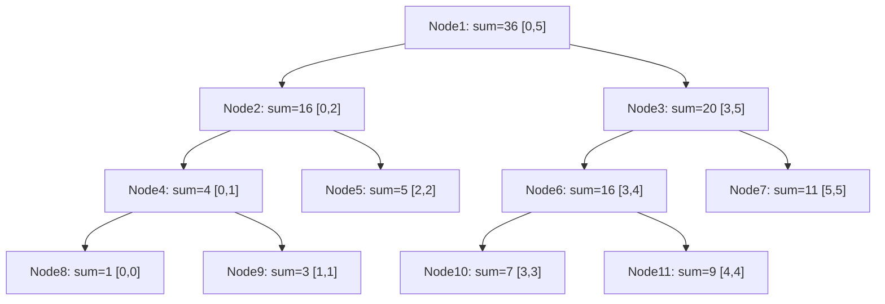

---
title: Segment Tree
aliases: [Segtree, Range Query Tree]
tags: [DSA, Trees, SegmentTree, RangeQuery, Advanced]
domain: DSA
difficulty: Advanced
created: 2026-07-26
related: []
status: complete
---

# 🏆 Segment Tree

> [!abstract] TL;DR
> A Segment Tree answers **range queries** (sum, min, max, GCD, ...) and handles **point updates** in O(log n) each. Build costs O(n). With **lazy propagation**, range updates also cost O(log n). The tree is stored as a 1-indexed array of size 4n. It is more general but heavier than a Fenwick Tree (BIT), which only supports prefix queries on invertible operations.

---

## Intuition — Analogy First

Think of a **tournament bracket**. In each round, two players compete and the winner advances. The "winner" can represent any aggregate — highest score, total points, greatest common divisor.

```
Array:   [1,  3,  5,  7,  9,  11]
          ↓   ↓   ↓   ↓   ↓   ↓
Level 3: [1] [3] [5] [7] [9] [11]   ← individual matches
Level 2: [ 4 ] [ 12] [ 20 ]          ← quarter-final sums
Level 1: [  16  ] [  20  ]           ← semi-final sums
Level 0: [      36       ]           ← final sum (total)
```

To query the sum of elements 2 to 5 (0-indexed), you don't add all 4 elements — you pick the pre-computed bracket results that exactly cover that range.

To update element 2 from 5 to 6, you update the leaf and propagate the change up through all bracket matches involving that element — only O(log n) of them.

---

## How It Works

### Array Representation (1-indexed)

- Node `1` = root (covers entire array)
- Node `i` → left child `2i`, right child `2i+1`
- Leaf nodes cover exactly one array element
- Array size needed: **4n** (safe upper bound; 2 × next power of 2 suffices)

### Node Coverage

For an array of size n, node i covers a range [l, r]:
- Root: [0, n-1]
- Left child: [l, mid]
- Right child: [mid+1, r]
- Leaf: [l, l] = single element

### Build: O(n)

Process bottom-up: each internal node = merge of its two children.

### Query: O(log n)

Three cases at each recursion level:
1. **Segment fully outside range** → return identity (0 for sum, ∞ for min, -∞ for max)
2. **Segment fully inside range** → return stored value
3. **Partial overlap** → recurse both children, merge results

### Point Update: O(log n)

Update leaf → propagate changes up through O(log n) ancestors.

### Lazy Propagation for Range Updates: O(log n)

Without lazy: range update touches O(n) leaves → O(n) per update.

With lazy:
- Store a "pending update" (lazy value) at each node
- When querying, **push down** the lazy value to children before descending
- Only update leaves when you actually need their values



Array: [1, 3, 5, 7, 9, 11]

---

## Complexity Analysis

| Operation | Time | Space |
|---|---|---|
| Build | O(n) | O(n) |
| Point query | O(log n) | O(log n) stack |
| Range query | O(log n) | O(log n) stack |
| Point update | O(log n) | O(log n) stack |
| Range update (no lazy) | O(n) worst | O(log n) stack |
| Range update (with lazy) | O(log n) | O(log n) |
| Space for tree array | O(n) — 4n nodes | — |

### Segment Tree vs Fenwick Tree (BIT)

| Feature | Segment Tree | Fenwick Tree |
|---|---|---|
| Range query | Any mergeable function | Prefix sum (invertible operations) |
| Point update | O(log n) | O(log n) |
| Range update | O(log n) with lazy | O(log n) with difference array |
| Implementation | ~50-100 lines | ~10-15 lines |
| Space constant | 4n | n |
| Best for | Min, max, GCD, custom merge | Sum, XOR, product (invertible) |

---

## Implementation (Python)

```python
from typing import List, Callable, TypeVar

T = TypeVar('T')


# ════════════════════════════════════════════════════════════
#  Part 1: Segment Tree — Range Sum Query + Point Update
# ════════════════════════════════════════════════════════════

class SegmentTree:
    """
    Generic Segment Tree for range queries with point updates.
    Uses 1-indexed internal array of size 4*n.
    """

    def __init__(self, data: List[int]):
        self.n = len(data)
        self.tree = [0] * (4 * self.n)
        if self.n > 0:
            self._build(data, 1, 0, self.n - 1)

    # ── Build ─────────────────────────────────────────────────────────────────

    def _build(self, data: List[int], node: int, lo: int, hi: int) -> None:
        """
        Build the segment tree bottom-up.
        node: current tree node index (1-indexed)
        lo, hi: range of array this node covers
        """
        if lo == hi:
            self.tree[node] = data[lo]
            return
        mid = (lo + hi) // 2
        self._build(data, 2 * node, lo, mid)
        self._build(data, 2 * node + 1, mid + 1, hi)
        self.tree[node] = self.tree[2 * node] + self.tree[2 * node + 1]

    # ── Point Update ──────────────────────────────────────────────────────────

    def update(self, idx: int, val: int) -> None:
        """Update array[idx] to val. O(log n)."""
        self._update(1, 0, self.n - 1, idx, val)

    def _update(self, node: int, lo: int, hi: int, idx: int, val: int) -> None:
        if lo == hi:
            self.tree[node] = val
            return
        mid = (lo + hi) // 2
        if idx <= mid:
            self._update(2 * node, lo, mid, idx, val)
        else:
            self._update(2 * node + 1, mid + 1, hi, idx, val)
        # Propagate change upward
        self.tree[node] = self.tree[2 * node] + self.tree[2 * node + 1]

    # ── Range Query ───────────────────────────────────────────────────────────

    def query(self, l: int, r: int) -> int:
        """Return sum of array[l..r] (inclusive). O(log n)."""
        return self._query(1, 0, self.n - 1, l, r)

    def _query(self, node: int, lo: int, hi: int, l: int, r: int) -> int:
        if r < lo or hi < l:
            return 0           # Fully outside: identity for sum
        if l <= lo and hi <= r:
            return self.tree[node]   # Fully inside: return stored value
        mid = (lo + hi) // 2
        left_sum = self._query(2 * node, lo, mid, l, r)
        right_sum = self._query(2 * node + 1, mid + 1, hi, l, r)
        return left_sum + right_sum


# ════════════════════════════════════════════════════════════
#  Part 2: Segment Tree with Lazy Propagation — Range Update
# ════════════════════════════════════════════════════════════

class LazySegmentTree:
    """
    Segment Tree with lazy propagation for range add + range sum queries.
    lazy[i] = pending addition to all elements in node i's range.
    """

    def __init__(self, data: List[int]):
        self.n = len(data)
        self.tree = [0] * (4 * self.n)
        self.lazy = [0] * (4 * self.n)  # Pending updates
        if self.n > 0:
            self._build(data, 1, 0, self.n - 1)

    def _build(self, data: List[int], node: int, lo: int, hi: int) -> None:
        if lo == hi:
            self.tree[node] = data[lo]
            return
        mid = (lo + hi) // 2
        self._build(data, 2 * node, lo, mid)
        self._build(data, 2 * node + 1, mid + 1, hi)
        self.tree[node] = self.tree[2 * node] + self.tree[2 * node + 1]

    # ── Push Down (propagate lazy to children) ────────────────────────────────

    def _push_down(self, node: int, lo: int, hi: int) -> None:
        """
        Before descending into children, push any pending lazy update downward.
        This ensures children have up-to-date values before we query/update them.
        """
        if self.lazy[node] != 0:
            mid = (lo + hi) // 2
            left, right = 2 * node, 2 * node + 1

            # Apply lazy to children's sums
            self.tree[left] += self.lazy[node] * (mid - lo + 1)
            self.tree[right] += self.lazy[node] * (hi - mid)

            # Pass lazy down to children
            self.lazy[left] += self.lazy[node]
            self.lazy[right] += self.lazy[node]

            # Clear current node's lazy
            self.lazy[node] = 0

    # ── Range Update: add val to all elements in [l, r] ──────────────────────

    def range_update(self, l: int, r: int, val: int) -> None:
        """Add val to every element in array[l..r]. O(log n) with lazy."""
        self._range_update(1, 0, self.n - 1, l, r, val)

    def _range_update(self, node: int, lo: int, hi: int,
                      l: int, r: int, val: int) -> None:
        if r < lo or hi < l:
            return       # Fully outside
        if l <= lo and hi <= r:
            # Fully inside: update this node's sum and record lazy
            self.tree[node] += val * (hi - lo + 1)
            self.lazy[node] += val
            return
        # Partial overlap: push down lazy, recurse
        self._push_down(node, lo, hi)
        mid = (lo + hi) // 2
        self._range_update(2 * node, lo, mid, l, r, val)
        self._range_update(2 * node + 1, mid + 1, hi, l, r, val)
        self.tree[node] = self.tree[2 * node] + self.tree[2 * node + 1]

    # ── Range Query ───────────────────────────────────────────────────────────

    def range_query(self, l: int, r: int) -> int:
        """Sum of array[l..r]. O(log n)."""
        return self._range_query(1, 0, self.n - 1, l, r)

    def _range_query(self, node: int, lo: int, hi: int, l: int, r: int) -> int:
        if r < lo or hi < l:
            return 0
        if l <= lo and hi <= r:
            return self.tree[node]
        self._push_down(node, lo, hi)
        mid = (lo + hi) // 2
        return (self._range_query(2 * node, lo, mid, l, r) +
                self._range_query(2 * node + 1, mid + 1, hi, l, r))


# ════════════════════════════════════════════════════════════
#  Part 3: Segment Tree for Range Minimum Query (RMQ)
# ════════════════════════════════════════════════════════════

class RMQSegmentTree:
    """Range Minimum Query using Segment Tree."""

    def __init__(self, data: List[int]):
        self.n = len(data)
        self.tree = [float('inf')] * (4 * self.n)
        self._build(data, 1, 0, self.n - 1)

    def _build(self, data, node, lo, hi):
        if lo == hi:
            self.tree[node] = data[lo]
            return
        mid = (lo + hi) // 2
        self._build(data, 2 * node, lo, mid)
        self._build(data, 2 * node + 1, mid + 1, hi)
        self.tree[node] = min(self.tree[2 * node], self.tree[2 * node + 1])

    def query(self, l: int, r: int) -> int:
        return self._query(1, 0, self.n - 1, l, r)

    def _query(self, node, lo, hi, l, r):
        if r < lo or hi < l:
            return float('inf')    # Identity for min
        if l <= lo and hi <= r:
            return self.tree[node]
        mid = (lo + hi) // 2
        return min(self._query(2 * node, lo, mid, l, r),
                   self._query(2 * node + 1, mid + 1, hi, l, r))

    def update(self, idx: int, val: int) -> None:
        self._update(1, 0, self.n - 1, idx, val)

    def _update(self, node, lo, hi, idx, val):
        if lo == hi:
            self.tree[node] = val
            return
        mid = (lo + hi) // 2
        if idx <= mid:
            self._update(2 * node, lo, mid, idx, val)
        else:
            self._update(2 * node + 1, mid + 1, hi, idx, val)
        self.tree[node] = min(self.tree[2 * node], self.tree[2 * node + 1])


# ── Demo ──────────────────────────────────────────────────────────────────────

if __name__ == "__main__":
    arr = [1, 3, 5, 7, 9, 11]

    # Basic segment tree
    st = SegmentTree(arr)
    print("Sum [0,5]:", st.query(0, 5))    # 36
    print("Sum [1,3]:", st.query(1, 3))    # 15 (3+5+7)
    print("Sum [2,4]:", st.query(2, 4))    # 21 (5+7+9)

    st.update(1, 10)   # arr[1] = 10 (was 3)
    print("Sum [0,2] after update:", st.query(0, 2))  # 16 (1+10+5)

    # Lazy propagation
    lazy_st = LazySegmentTree([1, 3, 5, 7, 9, 11])
    print("\nLazy - Sum [0,5]:", lazy_st.range_query(0, 5))  # 36
    lazy_st.range_update(1, 3, 2)   # Add 2 to indices 1,2,3 → [1,5,7,9,9,11]
    print("After range_update(1,3,+2):")
    print("  Sum [0,5]:", lazy_st.range_query(0, 5))  # 42 (36 + 2*3)
    print("  Sum [1,3]:", lazy_st.range_query(1, 3))  # 21 (5+7+9)

    # RMQ
    rmq = RMQSegmentTree([2, 4, 3, 1, 6, 7, 8, 9, 1, 7])
    print("\nMin [0,4]:", rmq.query(0, 4))    # 1
    print("Min [5,9]:", rmq.query(5, 9))      # 1
    print("Min [1,3]:", rmq.query(1, 3))      # 1
```

---

## Dry Run / Example Trace

### Build segment tree for [1, 3, 5, 7, 9, 11]

```
_build(node=1, lo=0, hi=5):
  mid=2
  _build(node=2, lo=0, hi=2):
    mid=1
    _build(node=4, lo=0, hi=1):
      mid=0
      _build(node=8, lo=0, hi=0): tree[8] = 1
      _build(node=9, lo=1, hi=1): tree[9] = 3
      tree[4] = 1 + 3 = 4
    _build(node=5, lo=2, hi=2): tree[5] = 5
    tree[2] = 4 + 5 = 9 ← wait, actual sum [0,2] = 1+3+5 = 9
  _build(node=3, lo=3, hi=5):
    mid=4
    _build(node=6, lo=3, hi=4):
      _build(node=12, lo=3, hi=3): tree[12] = 7
      _build(node=13, lo=4, hi=4): tree[13] = 9
      tree[6] = 16
    _build(node=7, lo=5, hi=5): tree[7] = 11
    tree[3] = 16 + 11 = 27
  tree[1] = 9 + 27 = 36 ✓
```

### Range Query [1, 3] (sum of elements at indices 1,2,3 = 3+5+7 = 15)

```
_query(node=1, lo=0, hi=5, l=1, r=3):
  Partial overlap → recurse
  mid=2
  _query(node=2, lo=0, hi=2, l=1, r=3):
    Partial overlap → recurse
    mid=1
    _query(node=4, lo=0, hi=1, l=1, r=3):
      Partial overlap → recurse
      _query(node=8, lo=0, hi=0, l=1, r=3): 0 < 1, outside → return 0
      _query(node=9, lo=1, hi=1, l=1, r=3): 1 in [1,3], full → return 3
      → return 0 + 3 = 3
    _query(node=5, lo=2, hi=2, l=1, r=3): 2 in [1,3], full → return 5
    → return 3 + 5 = 8
  _query(node=3, lo=3, hi=5, l=1, r=3):
    Partial overlap → recurse
    _query(node=6, lo=3, hi=4, l=1, r=3):
      Partial overlap → recurse
      _query(node=12, lo=3, hi=3, l=1, r=3): 3 in [1,3], full → return 7
      _query(node=13, lo=4, hi=4, l=1, r=3): 4 > 3, outside → return 0
      → return 7 + 0 = 7
    _query(node=7, lo=5, hi=5, l=1, r=3): 5 > 3, outside → return 0
    → return 7 + 0 = 7
  Total: 8 + 7 = 15 ✓
```

---

## Patterns & LeetCode Applications

| Problem | Approach |
|---|---|
| LC 307 Range Sum Query - Mutable | Classic segment tree with point update |
| LC 315 Count of Smaller Numbers After Self | Coordinate-compressed segment tree |
| LC 218 The Skyline Problem | Segment tree with lazy (or sorted containers) |
| LC 493 Reverse Pairs | Merge sort or BIT/segment tree |
| LC 699 Falling Squares | Lazy segment tree for max height on intervals |
| LC 850 Rectangle Area II | Coordinate compression + segment tree |
| LC 2276 Count Integers in Ranges | Segment tree or binary search |
| Count of Range Sum | Segment tree or BIT with coordinate compression |

---

## Common Pitfalls

1. **Array size** — allocate `4 * n` nodes, not `2 * n`. For n=5, the tree may need up to 16 nodes.
2. **1-indexed nodes** — node `i` has children `2i` and `2i+1`; this only works with 1-based indexing. Node 0 is unused.
3. **Forgetting push_down before recursing** — in lazy propagation, ALWAYS push down before descending into children; otherwise children have stale values.
4. **Wrong identity element** — sum uses 0, min uses +∞, max uses −∞, product uses 1, GCD uses 0. Using the wrong identity corrupts "outside range" returns.
5. **Off-by-one in range** — the query/update interface should be inclusive on both ends [l, r]; be consistent about 0-indexed vs 1-indexed array positions.
6. **Updating tree without propagating up** — after updating a leaf, always recalculate parent nodes: `tree[node] = tree[2*node] + tree[2*node+1]` at every level on the way back.

---

## Related Concepts

- [[_MOC_Trees|↑ Section MOC]]
- [[Fenwick_Tree]] — simpler, lighter alternative for prefix sum queries
- [[Binary_Tree_Fundamentals]] — segment tree is built on binary tree structure
- [[Prefix_Sum]] — O(1) range sum when no updates; segment tree extends this to O(log n) with updates

---

## Review Questions

1. A segment tree for an array of n elements requires 4n nodes in its internal array representation. Explain why 2n is insufficient and derive why 4n is a safe bound.
2. Explain the "push down" (lazy propagation) mechanism: at what point do you push the lazy value to children, and why is it crucial to do this before querying or updating children?
3. You need to support both range minimum queries and range sum queries on the same array. Can you use a single segment tree, or do you need two? Justify your answer and describe the node structure.

---

## Sources

- CLRS — Introduction to Algorithms, Chapter 14 (Augmented Data Structures)
- Competitive Programmer's Handbook — Antti Laaksonen, Chapter 9
- [cp-algorithms.com — Segment Tree](https://cp-algorithms.com/data_structures/segment_tree.html)
- [cpalgorithms Lazy Propagation](https://cp-algorithms.com/data_structures/segment_tree.html#range-updates-lazy-propagation)

#DSA #Trees #SegmentTree #RangeQuery #LazyPropagation #Advanced #Competitive
