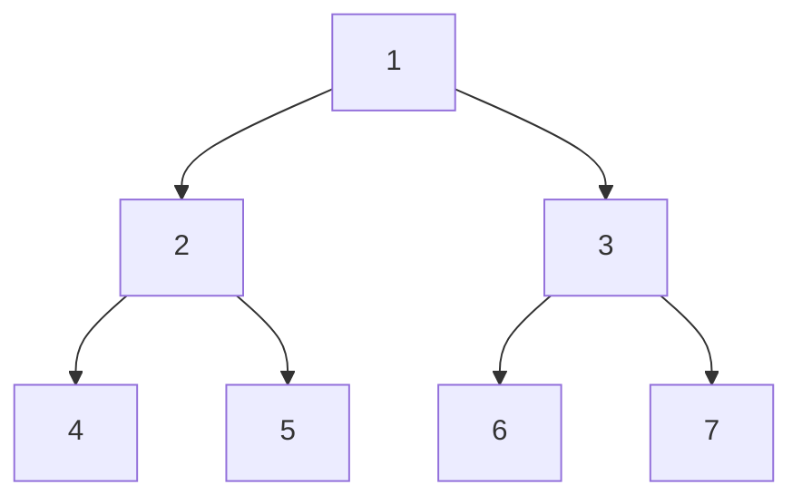

---
title: Tree Traversals
aliases: []
tags: [DSA, Trees, Traversals, DFS, BFS]
domain: DSA
difficulty: Beginner
created: 2026-07-26
related: []
status: complete
---

# 🔄 Tree Traversals

> [!abstract] TL;DR
> Four canonical ways to visit every node: **inorder** (L-Root-R, gives sorted output for BST), **preorder** (Root-L-R, good for copying/serializing), **postorder** (L-R-Root, good for deletion/evaluation), and **level-order** (BFS row by row). Knowing both recursive and iterative versions is essential for interviews. Morris traversal achieves O(1) extra space.

---

## Intuition — Analogy First

Imagine visiting every room in a multi-storey house:

- **Preorder**: You enter a room and announce it *before* exploring any hallways. Like a real-estate agent calling out rooms as they walk in.
- **Inorder**: You explore the entire left wing, announce the central hall, then explore the right wing. Like reading a book shelf left to right.
- **Postorder**: You explore every sub-room *before* calling out the current one. Like a cleaner who tidies children's rooms before the parent's room.
- **Level-order**: You visit every room on floor 1, then floor 2, then floor 3 — an elevator-by-elevator sweep.

---

## How It Works

### Visit Order Summary

For a tree node with left child L and right child R:

| Traversal | Order | Primary Use |
|---|---|---|
| Inorder | L → Root → R | Sorted output (BST), expression trees |
| Preorder | Root → L → R | Copy tree, serialization, prefix expressions |
| Postorder | L → R → Root | Delete tree, evaluate expressions, size computation |
| Level-order | Row by row | Shortest path, right side view, BFS problems |



Visit orders for the tree above:
- **Inorder**: 4 → 2 → 5 → 1 → 6 → 3 → 7
- **Preorder**: 1 → 2 → 4 → 5 → 3 → 6 → 7
- **Postorder**: 4 → 5 → 2 → 6 → 7 → 3 → 1
- **Level-order**: 1 → 2 → 3 → 4 → 5 → 6 → 7

---

## Complexity Analysis

| Traversal | Time | Space (Recursive) | Space (Iterative) | Space (Morris) |
|---|---|---|---|---|
| Inorder | O(n) | O(h) | O(h) | O(1) |
| Preorder | O(n) | O(h) | O(h) | O(1) |
| Postorder | O(n) | O(h) | O(h) | O(1) |
| Level-order | O(n) | — | O(w) — max width | — |

h = tree height. For balanced tree h = O(log n), for skewed tree h = O(n). Max width w ≤ n/2 for a complete binary tree.

---

## Implementation (Python)

```python
from collections import deque
from typing import Optional, List


class TreeNode:
    def __init__(self, val: int = 0,
                 left: 'Optional[TreeNode]' = None,
                 right: 'Optional[TreeNode]' = None):
        self.val = val
        self.left = left
        self.right = right


# ════════════════════════════════════════════════════════════
#  INORDER  (Left → Root → Right)
# ════════════════════════════════════════════════════════════

def inorder_recursive(root: Optional[TreeNode]) -> List[int]:
    result: List[int] = []
    def _dfs(node: Optional[TreeNode]) -> None:
        if node is None:
            return
        _dfs(node.left)
        result.append(node.val)
        _dfs(node.right)
    _dfs(root)
    return result


def inorder_iterative(root: Optional[TreeNode]) -> List[int]:
    """Uses an explicit stack to simulate the call stack."""
    result: List[int] = []
    stack: List[TreeNode] = []
    curr = root

    while curr or stack:
        # Push all left nodes onto the stack
        while curr:
            stack.append(curr)
            curr = curr.left
        # Process node
        curr = stack.pop()
        result.append(curr.val)
        # Move to right subtree
        curr = curr.right

    return result


# ════════════════════════════════════════════════════════════
#  PREORDER  (Root → Left → Right)
# ════════════════════════════════════════════════════════════

def preorder_recursive(root: Optional[TreeNode]) -> List[int]:
    result: List[int] = []
    def _dfs(node: Optional[TreeNode]) -> None:
        if node is None:
            return
        result.append(node.val)
        _dfs(node.left)
        _dfs(node.right)
    _dfs(root)
    return result


def preorder_iterative(root: Optional[TreeNode]) -> List[int]:
    """
    Push right child first so left is processed first (LIFO stack).
    """
    if not root:
        return []
    result: List[int] = []
    stack: List[TreeNode] = [root]

    while stack:
        node = stack.pop()
        result.append(node.val)
        if node.right:           # Push right first
            stack.append(node.right)
        if node.left:            # Left popped first
            stack.append(node.left)

    return result


# ════════════════════════════════════════════════════════════
#  POSTORDER  (Left → Right → Root)
# ════════════════════════════════════════════════════════════

def postorder_recursive(root: Optional[TreeNode]) -> List[int]:
    result: List[int] = []
    def _dfs(node: Optional[TreeNode]) -> None:
        if node is None:
            return
        _dfs(node.left)
        _dfs(node.right)
        result.append(node.val)
    _dfs(root)
    return result


def postorder_iterative(root: Optional[TreeNode]) -> List[int]:
    """
    Two-stack approach: process root→right→left, then reverse.
    Alternatively: modified preorder with result reversed.
    """
    if not root:
        return []
    result: List[int] = []
    stack: List[TreeNode] = [root]

    while stack:
        node = stack.pop()
        result.append(node.val)
        if node.left:            # Push left first (processed next as right of reversed)
            stack.append(node.left)
        if node.right:
            stack.append(node.right)

    return result[::-1]          # Reverse to get L-R-Root order


# ════════════════════════════════════════════════════════════
#  LEVEL-ORDER  (BFS)
# ════════════════════════════════════════════════════════════

def level_order(root: Optional[TreeNode]) -> List[List[int]]:
    """Returns nodes grouped by level."""
    if not root:
        return []
    result: List[List[int]] = []
    queue: deque[TreeNode] = deque([root])

    while queue:
        level_size = len(queue)    # Snapshot: nodes on this level
        level: List[int] = []

        for _ in range(level_size):
            node = queue.popleft()
            level.append(node.val)
            if node.left:
                queue.append(node.left)
            if node.right:
                queue.append(node.right)

        result.append(level)

    return result


def level_order_zigzag(root: Optional[TreeNode]) -> List[List[int]]:
    """Alternates left-to-right and right-to-left by level (LC 103)."""
    if not root:
        return []
    result: List[List[int]] = []
    queue: deque[TreeNode] = deque([root])
    left_to_right = True

    while queue:
        level_size = len(queue)
        level: List[int] = []
        for _ in range(level_size):
            node = queue.popleft()
            level.append(node.val)
            if node.left:
                queue.append(node.left)
            if node.right:
                queue.append(node.right)
        result.append(level if left_to_right else level[::-1])
        left_to_right = not left_to_right

    return result


def right_side_view(root: Optional[TreeNode]) -> List[int]:
    """Return rightmost node visible from the right side (LC 199)."""
    if not root:
        return []
    result: List[int] = []
    queue: deque[TreeNode] = deque([root])

    while queue:
        level_size = len(queue)
        for i in range(level_size):
            node = queue.popleft()
            if i == level_size - 1:    # Last node on this level
                result.append(node.val)
            if node.left:
                queue.append(node.left)
            if node.right:
                queue.append(node.right)

    return result


# ════════════════════════════════════════════════════════════
#  MORRIS TRAVERSAL — O(1) space inorder
# ════════════════════════════════════════════════════════════

def morris_inorder(root: Optional[TreeNode]) -> List[int]:
    """
    Threads the tree temporarily: connects a node's inorder predecessor's
    right pointer back to the node itself. After visiting, the thread is
    removed, restoring the original structure.

    Time: O(n)  —  each node visited at most twice (once to set thread, once to remove)
    Space: O(1) —  no stack or recursion
    """
    result: List[int] = []
    curr = root

    while curr:
        if curr.left is None:
            # No left subtree — visit and go right
            result.append(curr.val)
            curr = curr.right
        else:
            # Find inorder predecessor (rightmost node of left subtree)
            predecessor = curr.left
            while predecessor.right and predecessor.right is not curr:
                predecessor = predecessor.right

            if predecessor.right is None:
                # Thread not set yet — create thread and go left
                predecessor.right = curr
                curr = curr.left
            else:
                # Thread already set — we've come back; remove thread and visit
                predecessor.right = None
                result.append(curr.val)
                curr = curr.right

    return result


# ════════════════════════════════════════════════════════════
#  Demo
# ════════════════════════════════════════════════════════════

if __name__ == "__main__":
    from collections import deque

    def build(vals):
        if not vals:
            return None
        nodes = [TreeNode(v) if v is not None else None for v in vals]
        for i, node in enumerate(nodes):
            if node:
                li, ri = 2 * i + 1, 2 * i + 2
                if li < len(nodes):
                    node.left = nodes[li]
                if ri < len(nodes):
                    node.right = nodes[ri]
        return nodes[0]

    #        1
    #       / \
    #      2   3
    #     / \ / \
    #    4  5 6  7
    root = build([1, 2, 3, 4, 5, 6, 7])

    print("Inorder recursive: ", inorder_recursive(root))    # [4,2,5,1,6,3,7]
    print("Inorder iterative: ", inorder_iterative(root))    # [4,2,5,1,6,3,7]
    print("Morris inorder:    ", morris_inorder(root))       # [4,2,5,1,6,3,7]
    print("Preorder:          ", preorder_iterative(root))   # [1,2,4,5,3,6,7]
    print("Postorder:         ", postorder_iterative(root))  # [4,5,2,6,7,3,1]
    print("Level-order:       ", level_order(root))          # [[1],[2,3],[4,5,6,7]]
    print("Right side view:   ", right_side_view(root))      # [1,3,7]
```

---

## Dry Run / Example Trace

### Iterative Inorder on tree [1, 2, 3, 4, 5]

```
Tree:
        1
       / \
      2   3
     / \
    4   5

stack=[], curr=1
  → push 1, curr=2
  → push 2, curr=4
  → push 4, curr=None
  → pop 4, visit 4, curr=None       result=[4]
  → pop 2, visit 2, curr=5          result=[4,2]
  → push 5, curr=None
  → pop 5, visit 5, curr=None       result=[4,2,5]
  → pop 1, visit 1, curr=3          result=[4,2,5,1]
  → push 3, curr=None
  → pop 3, visit 3, curr=None       result=[4,2,5,1,3]

Final: [4, 2, 5, 1, 3]  ✓ (BST would be sorted)
```

### Morris Inorder — threading step by step

```
curr=1, left=2 exists
  predecessor of 1 in left subtree = 5 (rightmost of subtree rooted at 2)
  5.right = None → set thread: 5.right = 1, move curr=2

curr=2, left=4 exists
  predecessor = 4 (rightmost of subtree rooted at 4 = 4 itself)
  4.right = None → set thread: 4.right = 2, move curr=4

curr=4, left=None → visit 4, curr=4.right=2 (thread!)  result=[4]

curr=2, left=4, predecessor=4, 4.right==2 (thread set)
  → remove thread: 4.right=None, visit 2, curr=5          result=[4,2]

curr=5, left=None → visit 5, curr=5.right=1 (thread!)    result=[4,2,5]

curr=1, left=2, predecessor=5, 5.right==1 (thread set)
  → remove thread: 5.right=None, visit 1, curr=3          result=[4,2,5,1]

curr=3, left=None → visit 3, curr=None                   result=[4,2,5,1,3]
```

---

## Patterns & LeetCode Applications

| Problem | Traversal | Key Trick |
|---|---|---|
| LC 94 Binary Tree Inorder Traversal | Inorder | Classic stack simulation |
| LC 144 Binary Tree Preorder Traversal | Preorder | Stack: push right then left |
| LC 145 Binary Tree Postorder Traversal | Postorder | Reverse of modified preorder |
| LC 102 Binary Tree Level Order | Level-order | Queue with level-size snapshot |
| LC 103 Zigzag Level Order | Level-order | Alternate reversal each level |
| LC 199 Binary Tree Right Side View | Level-order | Last node of each level |
| LC 104 Maximum Depth | DFS/BFS | Depth = level count − 1 |
| LC 112 Path Sum | Preorder | Carry remaining target downward |
| LC 297 Serialize & Deserialize | Preorder | BFS or preorder with sentinels |
| LC 543 Diameter of Binary Tree | Postorder | Track max lh+rh globally |

---

## Common Pitfalls

1. **Forgetting `level_size = len(queue)` snapshot** in level-order — if you check `while queue` inside the level loop, newly added children get included in the current level.
2. **Stack order in preorder** — push *right* before *left* so left is popped first (LIFO).
3. **Postorder reversal correctness** — the two-stack / reverse-preorder trick gives Root-R-L reversed = L-R-Root, which is correct postorder.
4. **Morris traversal breaks on concurrent access** — it temporarily modifies the tree; never use in multi-threaded code without locking.
5. **Confusing inorder of BST property** — inorder gives sorted output *only* if the BST property holds at every node (not just each node vs its immediate parent).
6. **Recursion depth** — Python default limit is 1000. For tall trees, use iterative or `sys.setrecursionlimit(200000)`.

---

## Related Concepts

- [[_MOC_Trees|↑ Section MOC]]
- [[Binary_Tree_Fundamentals]] — tree structure, height, node definitions
- [[Binary_Search_Tree]] — inorder traversal gives sorted sequence
- [[Stack]] — powers iterative DFS traversals
- [[Queue]] — powers BFS / level-order traversal

---

## Review Questions

1. You need to serialize a binary tree to a string so it can be exactly reconstructed. Which traversal do you use, and what sentinel value do you use for missing children? Why does inorder alone fail for this task?
2. What is the key difference between the iterative inorder and the Morris inorder in terms of space complexity, and what structural modification does Morris make to the tree during traversal?
3. Given a BST, you want to find all nodes with values in the range [lo, hi] as efficiently as possible. Which traversal and pruning strategy do you use?

---

## Sources

- CLRS — Introduction to Algorithms, Chapter 12.1
- LeetCode Explore: Binary Tree
- Morris, J.M. (1979) "Traversing binary trees simply and cheaply"
- [cp-algorithms.com — Tree traversals](https://cp-algorithms.com/)

#DSA #Trees #Traversals #DFS #BFS #Inorder #Preorder #Postorder #LevelOrder #Morris
