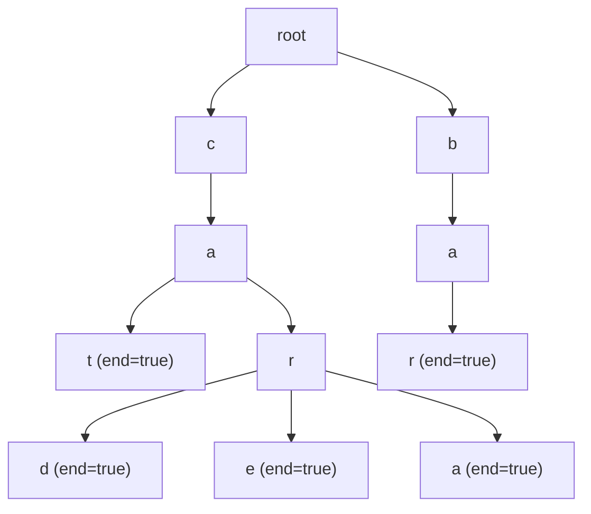

---
title: Trie
aliases: [Prefix Tree, Digital Tree]
tags: [DSA, Trees, Trie, PrefixTree, Strings]
domain: DSA
difficulty: Intermediate
created: 2026-07-26
related: []
status: complete
---

# 🔤 Trie (Prefix Tree)

> [!abstract] TL;DR
> A Trie is a tree where each node represents one character and each root-to-leaf path represents a word. All words sharing a prefix share the same path. Insert, search, and startsWith all run in **O(m)** where m is the word length — independent of how many words are stored. This makes Tries the go-to structure for autocomplete, spell checking, and IP routing.

---

## Intuition — Analogy First

Think of a **file system directory**:

```
/home/
  alice/
    documents/
    photos/
  bob/
    documents/
```

`/home/alice/documents` and `/home/bob/documents` share the `/home` prefix path. Adding a new path `/home/alice/music` only adds the `music` node — the `/home/alice` path already exists.

A Trie works identically with characters instead of directory names. The words `cat`, `car`, and `card` share the path `c → a`. `card` and `care` further share `c → a → r`. Each character costs exactly one node — shared prefixes cost nothing extra.

---

## How It Works

### Node Structure

Each TrieNode contains:
- **children**: a mapping from character → TrieNode (dict or fixed array of 26)
- **is_end**: boolean marking whether this node completes a valid word

### Operations

| Operation | Description | Time |
|---|---|---|
| `insert(word)` | Follow/create character nodes one by one, mark last as `is_end=True` | O(m) |
| `search(word)` | Follow character nodes; return `is_end` of last node | O(m) |
| `startsWith(prefix)` | Follow character nodes; return True if all found (don't check `is_end`) | O(m) |
| `delete(word)` | Find word, unmark `is_end`, prune dead branches bottom-up | O(m) |

### Space Analysis

- Worst case: O(ALPHABET_SIZE × average_word_length × num_words) — no shared prefixes
- Best case: O(ALPHABET_SIZE × longest_word) — all words share a prefix
- For 26-char alphabet, 1000 words of avg length 10: up to 260,000 nodes



Words stored: `cat`, `car`, `card`, `care`, `cara`, `bar`

---

## Complexity Analysis

| Operation | Time | Space |
|---|---|---|
| Insert | O(m) | O(m) new nodes worst case |
| Search | O(m) | O(1) |
| StartsWith | O(m) | O(1) |
| Delete | O(m) | O(1) per node freed |
| Build trie from n words | O(n × m) | O(n × m) |
| Autocomplete (list all with prefix) | O(p + k) — p=prefix len, k=results | O(p + output) |

m = length of word/prefix. All operations are independent of the total number of words stored.

---

## Implementation (Python)

```python
from typing import Optional, List


# ════════════════════════════════════════════════════════════
#  Implementation 1: Dict-based children (flexible alphabet)
# ════════════════════════════════════════════════════════════

class TrieNode:
    def __init__(self):
        self.children: dict[str, 'TrieNode'] = {}
        self.is_end: bool = False
        self.count: int = 0    # Optional: how many words end here


class Trie:
    """
    Prefix tree using dictionary children.
    Supports insert, search, startsWith, delete, autocomplete.
    """

    def __init__(self):
        self.root = TrieNode()

    # ── Insert ────────────────────────────────────────────────────────────────

    def insert(self, word: str) -> None:
        """Insert a word into the trie. O(m) time and space."""
        curr = self.root
        for ch in word:
            if ch not in curr.children:
                curr.children[ch] = TrieNode()
            curr = curr.children[ch]
        curr.is_end = True
        curr.count += 1

    # ── Search ────────────────────────────────────────────────────────────────

    def search(self, word: str) -> bool:
        """Return True if the exact word exists in the trie."""
        node = self._find_node(word)
        return node is not None and node.is_end

    def starts_with(self, prefix: str) -> bool:
        """Return True if any word in the trie starts with the given prefix."""
        return self._find_node(prefix) is not None

    def _find_node(self, prefix: str) -> Optional[TrieNode]:
        """Helper: traverse the trie following prefix characters."""
        curr = self.root
        for ch in prefix:
            if ch not in curr.children:
                return None
            curr = curr.children[ch]
        return curr

    # ── Delete ────────────────────────────────────────────────────────────────

    def delete(self, word: str) -> bool:
        """
        Delete a word from the trie.
        Returns True if word was found and deleted.
        Prunes dead branches (nodes that lead nowhere after deletion).
        """
        def _delete_helper(node: TrieNode, word: str, depth: int) -> bool:
            """
            Returns True if the current node should be deleted
            (it has no children and is not the end of another word).
            """
            if depth == len(word):
                if not node.is_end:
                    return False    # Word not in trie
                node.is_end = False
                node.count = 0
                return len(node.children) == 0  # Delete if leaf

            ch = word[depth]
            if ch not in node.children:
                return False        # Word not in trie

            should_delete_child = _delete_helper(node.children[ch], word, depth + 1)

            if should_delete_child:
                del node.children[ch]
                # Delete this node too if it's not an end and has no other children
                return not node.is_end and len(node.children) == 0

            return False

        return _delete_helper(self.root, word, 0)

    # ── Autocomplete ──────────────────────────────────────────────────────────

    def autocomplete(self, prefix: str) -> List[str]:
        """Return all words in the trie that start with prefix."""
        results: List[str] = []
        start_node = self._find_node(prefix)

        if start_node is None:
            return results

        def _dfs(node: TrieNode, current: str) -> None:
            if node.is_end:
                results.append(current)
            for ch, child in sorted(node.children.items()):
                _dfs(child, current + ch)

        _dfs(start_node, prefix)
        return results

    # ── Count words with prefix ───────────────────────────────────────────────

    def count_with_prefix(self, prefix: str) -> int:
        """Count how many words start with the given prefix."""
        start_node = self._find_node(prefix)
        if start_node is None:
            return 0

        count = 0
        def _count(node: TrieNode) -> None:
            nonlocal count
            if node.is_end:
                count += 1
            for child in node.children.values():
                _count(child)

        _count(start_node)
        return count


# ════════════════════════════════════════════════════════════
#  Implementation 2: Array-based children (lowercase a-z only)
#  Faster lookups; fixed 26-slot array instead of dict
# ════════════════════════════════════════════════════════════

class TrieNodeArray:
    ALPHABET_SIZE = 26

    def __init__(self):
        self.children: List[Optional['TrieNodeArray']] = [None] * self.ALPHABET_SIZE
        self.is_end: bool = False

    def _idx(self, ch: str) -> int:
        return ord(ch) - ord('a')


class TrieArray:
    """Array-based trie. O(1) child lookup (index arithmetic)."""

    def __init__(self):
        self.root = TrieNodeArray()

    def insert(self, word: str) -> None:
        curr = self.root
        for ch in word:
            idx = curr._idx(ch)
            if curr.children[idx] is None:
                curr.children[idx] = TrieNodeArray()
            curr = curr.children[idx]
        curr.is_end = True

    def search(self, word: str) -> bool:
        curr = self.root
        for ch in word:
            idx = curr._idx(ch)
            if curr.children[idx] is None:
                return False
            curr = curr.children[idx]
        return curr.is_end

    def starts_with(self, prefix: str) -> bool:
        curr = self.root
        for ch in prefix:
            idx = curr._idx(ch)
            if curr.children[idx] is None:
                return False
            curr = curr.children[idx]
        return True


# ════════════════════════════════════════════════════════════
#  Word Search II (LC 212) — Trie + Backtracking
# ════════════════════════════════════════════════════════════

def find_words(board: List[List[str]], words: List[str]) -> List[str]:
    """
    Find all words from list that exist in the board (adjacent cells, no reuse).
    Naive: O(W × M × N × 4^L) — check each word separately.
    With Trie: O(M × N × 4^L) — prune non-prefix branches early.
    W=words, M×N=board size, L=word length.
    """
    trie = Trie()
    for word in words:
        trie.insert(word)

    rows, cols = len(board), len(board[0])
    found: set = set()

    def backtrack(node: TrieNode, r: int, c: int, path: str) -> None:
        ch = board[r][c]
        if ch not in node.children:
            return

        next_node = node.children[ch]
        new_path = path + ch

        if next_node.is_end:
            found.add(new_path)
            # Don't return: there may be longer words with this prefix

        board[r][c] = '#'    # Mark visited
        for dr, dc in [(-1,0),(1,0),(0,-1),(0,1)]:
            nr, nc = r + dr, c + dc
            if 0 <= nr < rows and 0 <= nc < cols and board[nr][nc] != '#':
                backtrack(next_node, nr, nc, new_path)
        board[r][c] = ch     # Restore

    for r in range(rows):
        for c in range(cols):
            backtrack(trie.root, r, c, "")

    return list(found)


# ── Demo ──────────────────────────────────────────────────────────────────────

if __name__ == "__main__":
    trie = Trie()
    words_to_insert = ["cat", "car", "card", "care", "cara", "bar", "bare", "bat"]
    for w in words_to_insert:
        trie.insert(w)

    print("search('car'):", trie.search("car"))          # True
    print("search('ca'):", trie.search("ca"))            # False (not a word)
    print("starts_with('ca'):", trie.starts_with("ca"))  # True
    print("starts_with('xyz'):", trie.starts_with("xyz"))# False

    print("autocomplete('car'):", trie.autocomplete("car"))  # ['car','cara','card','care']
    print("autocomplete('ba'):", trie.autocomplete("ba"))    # ['bar','bare','bat']

    print("count_with_prefix('ca'):", trie.count_with_prefix("ca")) # 5

    trie.delete("car")
    print("After delete 'car':")
    print("  search('car'):", trie.search("car"))        # False
    print("  search('card'):", trie.search("card"))      # True (card still exists)
    print("  autocomplete('car'):", trie.autocomplete("car"))  # ['cara','card','care']
```

---

## Dry Run / Example Trace

### Insert "cat", "car", "card" then search/startsWith

```
Insert "cat":
  root → create 'c' → create 'a' → create 't' (is_end=True)

Insert "car":
  root → existing 'c' → existing 'a' → create 'r' (is_end=True)

Insert "card":
  root → 'c' → 'a' → existing 'r' → create 'd' (is_end=True)

Trie structure:
root
└── c
    └── a
        ├── t (end)
        └── r (end)
            └── d (end)

search("car"):
  root → c ✓ → a ✓ → r ✓, is_end=True → return True

search("ca"):
  root → c ✓ → a ✓, is_end=False → return False

starts_with("ca"):
  root → c ✓ → a ✓ → node found, return True (don't check is_end)

starts_with("cab"):
  root → c ✓ → a ✓ → 'b' not in children → return False
```

### Delete "car" (prune dead branch)

```
Before: r node has children={d: ...} and is_end=True
delete("car"):
  depth=3, node=r, is_end=True → set is_end=False
  children={'d': ...} → not empty → don't prune r
  Return False (don't delete r)

After: r node has children={d: ...} and is_end=False ← correct!
       "card" still reachable through r → d
```

---

## Patterns & LeetCode Applications

| Problem | Approach |
|---|---|
| LC 208 Implement Trie | Direct implementation |
| LC 211 Design Add and Search Words | `.` wildcard: DFS all children when `'.'` encountered |
| LC 212 Word Search II | Trie + backtracking on board |
| LC 820 Short Encoding of Words | Build trie, count leaves (non-shared suffixes) |
| LC 1268 Search Suggestions System | Autocomplete: maintain top 3 with sort |
| LC 745 Prefix and Suffix Search | Dual trie or `#`-separated trie |
| LC 472 Concatenated Words | Trie + DFS word segmentation |
| Replace Words (Easy) | Trie: find shortest root prefix for each word |

---

## Common Pitfalls

1. **Confusing `search` and `starts_with`** — `search` requires `is_end=True` at the last character; `starts_with` only requires the path to exist.
2. **Not handling empty string** — inserting `""` sets `root.is_end = True`; decide per problem whether to allow it.
3. **Delete without pruning** — simply setting `is_end=False` leaks memory; prune leaf nodes that are no longer needed.
4. **Case sensitivity** — by default, tries are case-sensitive; normalize input with `.lower()` if needed.
5. **Memory with array-based children** — each node allocates 26 slots even if only 2 are used; dict-based is more memory-efficient for sparse alphabets.
6. **Word Search II TLE** — using a trie but not pruning found words (`next_node.is_end = False` optimization) causes repeated traversals; prune the trie as words are found.

---

## Related Concepts

- [[_MOC_Trees|↑ Section MOC]]
- [[Hash_Table_Fundamentals]] — hash maps can simulate trie nodes; compare tradeoffs
- [[Backtracking_Patterns]] — trie + DFS is the backbone of Word Search II
- [[Binary_Search_Tree]] — compare: BST for key-value ordering; trie for prefix operations

---

## Review Questions

1. A hash map can also support O(1) exact search. What does a trie offer that a hash map cannot? Give two scenarios where a trie strictly outperforms a hash map.
2. Describe how to implement a wildcard search (e.g., `.at` matches `cat`, `bat`, `hat`) in a trie. What is the worst-case time complexity?
3. In the Word Search II problem, why is building a trie from the word list and searching the board more efficient than searching for each word individually? What is the asymptotic improvement?

---

## Sources

- LeetCode Explore: Trie
- Skiena — Algorithm Design Manual, Section 12.3 (Suffix Trees and Tries)
- [Trie Wikipedia](https://en.wikipedia.org/wiki/Trie)
- [cp-algorithms.com — Trie](https://cp-algorithms.com/string/suffix-array.html)

#DSA #Trees #Trie #PrefixTree #Strings #Autocomplete #Intermediate
