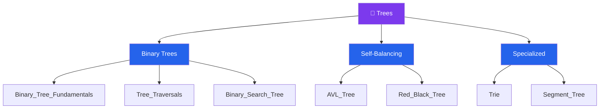

# 🌳 Trees — Map of Content

> [!abstract] What This Section Covers
> Trees are hierarchical data structures built from nodes connected by directed edges, with no cycles. This section spans the full tree curriculum: binary tree structure and properties, the four canonical traversal orders (pre-, in-, post-order, and level-order), the binary search tree invariant and its O(log n) operations, self-balancing variants (AVL and Red-Black trees) that guarantee that bound in the worst case, the Trie for prefix-based string problems, and the Segment Tree for efficient range queries and point updates. Trees also serve as the conceptual backbone for heaps, graphs, and several dynamic programming patterns.

## Concept Map

## Learning Path

Recommended order to study the notes in this section.

1. [[Binary_Tree_Fundamentals]] — Node, root, leaf, height, depth, full/complete/perfect tree definitions
2. [[Tree_Traversals]] — Pre-order, in-order, post-order (recursive and iterative), and BFS level-order
3. [[Binary_Search_Tree]] — BST invariant; O(log n) search, insert, delete on balanced trees; successor/predecessor
4. [[Trie]] — Prefix tree for autocomplete, word search, and longest common prefix problems
5. [[Segment_Tree]] — Range sum/min/max queries and point updates in O(log n); lazy propagation overview
6. [[AVL_Tree]] — Height-balanced BST with rotations; strict O(log n) guarantee via balance factors
7. [[Red_Black_Tree]] — Approximately balanced BST; fewer rotations than AVL; backing structure of most standard library maps

## All Notes at a Glance

| Note | Summary | Difficulty |
|------|---------|------------|
| [[Binary_Tree_Fundamentals]] | Node structure, tree properties, height vs. depth, complete vs. full | Beginner |
| [[Tree_Traversals]] | DFS (pre/in/post) and BFS level-order; recursive and iterative implementations | Beginner |
| [[Binary_Search_Tree]] | Left < root < right invariant; operations degrade to O(n) when unbalanced | Intermediate |
| [[AVL_Tree]] | Self-balancing via balance factor; single and double rotations on insert/delete | Advanced |
| [[Red_Black_Tree]] | 5-property coloring scheme; guaranteed O(log n) with fewer rotations than AVL | Advanced |
| [[Trie]] | Character-indexed tree for prefix lookups in O(L); space-intensive | Intermediate |
| [[Segment_Tree]] | Array-backed binary tree for O(log n) range queries and updates | Advanced |

## Key Questions This Section Answers

- Which traversal order produces a sorted sequence when applied to a BST?
- Why do we need self-balancing trees — what pathological input breaks a plain BST?
- When should you use a Trie instead of a hash map for string storage?
- What is the difference between height and depth in a tree?
- How do you implement iterative in-order traversal without recursion?
- What is lazy propagation in a segment tree and when is it necessary?

## Related Sections

- [[_MOC_DSA_Master|↑ DSA Master MOC]]
- [[_MOC_Graphs|→ Graphs]] — trees are acyclic connected graphs; graph traversal extends tree traversal
- [[_MOC_Heaps|→ Heaps]] — heap is a complete binary tree with the heap property
- [[_MOC_Dynamic_Programming|→ Dynamic Programming]] — many DP problems are defined on tree structures

#MOC #DSA #trees
