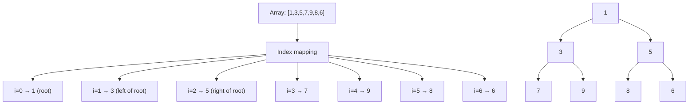

---
title: Binary Heap
aliases: [Min Heap, Max Heap, Heap Data Structure]
tags: [DSA, Heaps, Trees, Arrays]
domain: DSA
difficulty: Intermediate
created: 2026-07-26
related: [Priority_Queue, Heap_Sort_Algorithm, Top_K_Pattern]
status: complete
---

# 🏆 Binary Heap

> [!abstract] TL;DR
> A binary heap is a **complete binary tree** stored compactly in an array where every parent satisfies a fixed ordering with its children (min-heap: parent ≤ children; max-heap: parent ≥ children). Insert costs O(log n) via heapify-up; extract-min costs O(log n) via heapify-down; building a heap from scratch costs O(n) — not O(n log n).

---

## Intuition — Analogy First

Think of a **sports tournament bracket** where every match result is enforced top-to-bottom. The champion (smallest or largest element) always sits at the root. When a new player enters, they start at the bottom and "bubble up" by beating each opponent above them — that is heapify-up. When the champion is removed, the last player takes the top spot and "sinks down" by losing to stronger opponents — that is heapify-down.

The key insight: unlike a sorted array, you don't need perfect order everywhere — you only need the champion to be findable in O(1) and replaceable in O(log n).

---

## How It Works

### Array Indexing (0-indexed)

For a node at index `i`:
- **Parent**: `(i - 1) // 2`
- **Left child**: `2*i + 1`
- **Right child**: `2*i + 2`

The **complete binary tree** property (all levels full except the last, filled left-to-right) ensures these formulas always work and the array has no gaps.

### Min-Heap Property
Every node's value is ≤ both of its children's values. The minimum element is always at index 0.

### Heapify-Up (after insert)
1. Append new element to end of array.
2. Compare with parent; if smaller, swap.
3. Repeat until heap property is restored or root is reached.

### Heapify-Down (after extract-min)
1. Replace root with the last element; shrink array by 1.
2. Compare root with its two children; swap with the smaller child if it's smaller than root.
3. Repeat until heap property is restored or a leaf is reached.

### Build Heap in O(n)
Start heapify-down from the **last internal node** (`n//2 - 1`) down to index 0. This is O(n) because most nodes are near leaves and require very little work.

**Proof sketch:** The total work is proportional to the sum of heights of all nodes.
$$\sum_{h=0}^{\lfloor \log n \rfloor} \lceil \frac{n}{2^{h+1}} \rceil \cdot h \leq n \sum_{h=0}^{\infty} \frac{h}{2^h} = 2n = O(n)$$

The infinite series $\sum h/2^h$ converges to 2, giving us O(n) total work.

**Height of heap** = $\lfloor \log_2 n \rfloor$



---

## Complexity Analysis

| Operation      | Time       | Notes                                          |
|---------------|------------|------------------------------------------------|
| Peek (min/max) | O(1)      | Root is always the extremum                    |
| Insert         | O(log n)  | Append + heapify-up                            |
| Extract-min    | O(log n)  | Swap root with last + heapify-down             |
| Delete         | O(log n)  | Replace node + heapify-up or heapify-down      |
| Build heap     | O(n)      | Not O(n log n) — heapify from last internal node |
| Search         | O(n)      | No ordering guarantee between siblings         |
| Space          | O(n)      | Stored in-place as array                       |

---

## Implementation (Python)

```python
# ─── From-scratch Min-Heap ───────────────────────────────────────────────────

class MinHeap:
    def __init__(self):
        self.heap = []

    def _parent(self, i):
        return (i - 1) // 2

    def _left(self, i):
        return 2 * i + 1

    def _right(self, i):
        return 2 * i + 2

    def _swap(self, i, j):
        self.heap[i], self.heap[j] = self.heap[j], self.heap[i]

    def _heapify_up(self, i):
        """Bubble element at i up until heap property holds."""
        while i > 0:
            p = self._parent(i)
            if self.heap[p] > self.heap[i]:
                self._swap(p, i)
                i = p
            else:
                break

    def _heapify_down(self, i):
        """Sink element at i down until heap property holds."""
        n = len(self.heap)
        while True:
            smallest = i
            left, right = self._left(i), self._right(i)

            if left < n and self.heap[left] < self.heap[smallest]:
                smallest = left
            if right < n and self.heap[right] < self.heap[smallest]:
                smallest = right

            if smallest != i:
                self._swap(i, smallest)
                i = smallest
            else:
                break

    def push(self, val):
        """Insert element. O(log n)."""
        self.heap.append(val)
        self._heapify_up(len(self.heap) - 1)

    def pop(self):
        """Remove and return minimum. O(log n)."""
        if not self.heap:
            raise IndexError("Heap is empty")
        # Swap root with last element
        self._swap(0, len(self.heap) - 1)
        min_val = self.heap.pop()
        if self.heap:
            self._heapify_down(0)
        return min_val

    def peek(self):
        """Return minimum without removing. O(1)."""
        if not self.heap:
            raise IndexError("Heap is empty")
        return self.heap[0]

    @classmethod
    def build_from_list(cls, arr):
        """Build heap in O(n) via heapify-down from last internal node."""
        h = cls()
        h.heap = arr[:]
        n = len(h.heap)
        # Start from last internal node
        for i in range(n // 2 - 1, -1, -1):
            h._heapify_down(i)
        return h


# ─── Python's built-in heapq (min-heap only) ────────────────────────────────

import heapq

# Basic operations
heap = []
heapq.heappush(heap, 5)
heapq.heappush(heap, 1)
heapq.heappush(heap, 3)

print(heap[0])          # Peek: 1 (O(1))
print(heapq.heappop(heap))  # Extract-min: 1 (O(log n))

# Build heap from list in O(n)
data = [5, 3, 8, 1, 9, 2]
heapq.heapify(data)     # In-place transformation to min-heap
print(data[0])          # 1

# ─── Max-Heap trick: negate values ──────────────────────────────────────────

max_heap = []
for val in [5, 1, 3, 8, 2]:
    heapq.heappush(max_heap, -val)   # Push negated

max_val = -heapq.heappop(max_heap)   # Negate on pop: 8
print(max_val)

# For objects, use tuple (priority, item)
tasks = []
heapq.heappush(tasks, (1, "low priority task"))
heapq.heappush(tasks, (10, "critical task"))
heapq.heappush(tasks, (5, "medium task"))
priority, task = heapq.heappop(tasks)  # (1, "low priority task")
```

---

## Dry Run / Example Trace

**Build heap from `[9, 4, 7, 2, 8, 1, 5]` using O(n) method:**

Initial array (as tree): `[9, 4, 7, 2, 8, 1, 5]`

```
        9
      /   \
     4     7
    / \   / \
   2   8 1   5
```

Last internal node: index `n//2 - 1 = 2` (value 7)

**Step 1:** Heapify-down index 2 (value 7): children are 1 and 5. Min child = 1. Swap 7 and 1.
Array: `[9, 4, 1, 2, 8, 7, 5]`

**Step 2:** Heapify-down index 1 (value 4): children are 2 and 8. Min child = 2. Swap 4 and 2.
Array: `[9, 2, 1, 4, 8, 7, 5]`

**Step 3:** Heapify-down index 0 (value 9): children are 2 and 1. Min child = 1. Swap 9 and 1.
Array: `[1, 2, 9, 4, 8, 7, 5]`

Heapify-down index 2 (value 9): children are 7 and 5. Min child = 5. Swap 9 and 5.
Array: `[1, 2, 5, 4, 8, 7, 9]`

Final heap (min-heap property verified):
```
        1
      /   \
     2     5
    / \   / \
   4   8 7   9
```

---

## Patterns & LeetCode Applications

| Pattern | Description | Key Insight |
|---------|-------------|-------------|
| Top K Elements | Maintain min-heap of size k | Smaller heap = faster per-element cost |
| K-way Merge | Merge k sorted lists/arrays | Push (val, list_idx, elem_idx) into heap |
| Sliding Window Median | Two heaps (max + min) | Balance sizes to find median in O(log n) |
| Dijkstra's Shortest Path | Priority queue of (cost, node) | Always expand the cheapest frontier node |
| Meeting Rooms II | Min-heap of end times | If earliest-ending < new start, reuse room |

**Representative LeetCode problems:**
- 703 — Kth Largest Element in a Stream (min-heap of size k)
- 215 — Kth Largest Element in Array
- 23 — Merge K Sorted Lists (k-way merge)
- 295 — Find Median from Data Stream (two heaps)
- 743 — Network Delay Time (Dijkstra)

---

## Common Pitfalls

1. **Off-by-one in index formulas**: With 0-indexed arrays, parent is `(i-1)//2`, NOT `i//2`. The 1-indexed version uses `i//2` — mixing these up silently corrupts the heap.
2. **heapq is always min-heap**: Python's `heapq` does not have a max-heap mode. Always negate values or use `(-val, val)` tuples.
3. **Mutating heap elements**: Changing a heap element's value without re-heapifying breaks the heap invariant. Use `heapq.heappushpop` or manually fix the index.
4. **Treating heapq as sorted**: `heap[1]` and `heap[2]` are NOT the 2nd and 3rd smallest — only `heap[0]` is guaranteed.
5. **O(n log n) build confusion**: Calling `heappush` n times is O(n log n). `heapify()` is O(n). Use `heapify` when building from an existing list.
6. **Stable ordering with tuples**: If two items have equal priority in a tuple `(priority, item)`, Python compares `item` next. If items are not comparable (e.g., custom objects), add a tie-breaker counter: `(priority, counter, item)`.

---

## Related Concepts

- [[_MOC_Heaps|↑ Section MOC]]
- [[Priority_Queue]] — the abstract data type that heaps implement
- [[Heap_Sort_Algorithm]] — sorting using heap properties
- [[Top_K_Pattern]] — common heap interview pattern
- [[Binary_Search_Tree]] — alternative for ordered data (but O(log n) for all ops vs O(1) peek)
- [[Merge_Sort]] — comparison for sorting algorithms

---

## Review Questions

1. Why does building a heap from an array cost O(n) rather than O(n log n)? Describe the key mathematical insight involving the sum of node heights.

2. After calling `heapq.heappop()` on a Python min-heap, the implementation swaps the root with the last element and then calls heapify-down. Why is this swap necessary, and what would go wrong if you simply removed the root and heapify-down from scratch?

3. You have a max-heap stored in an array. Write the index formulas for parent, left child, and right child (0-indexed), and explain why the complete binary tree property is essential to make array storage work without gaps or wasted space.

---

## Sources

- CLRS Chapter 6 — Heapsort
- Python docs: [`heapq` — Heap queue algorithm](https://docs.python.org/3/library/heapq.html)
- [NeetCode — Heap / Priority Queue](https://neetcode.io/roadmap)
- Sedgewick & Wayne — *Algorithms* (4th ed.), Chapter 2.4

#DSA #Heaps #BinaryHeap #DataStructures #Intermediate
