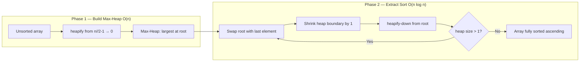

---
title: Heap Sort Algorithm
aliases: [Heapsort]
tags: [DSA, Heaps, Sorting]
domain: DSA
difficulty: Intermediate
created: 2026-07-26
related: [Binary_Heap, Merge_Sort, Quick_Sort]
status: complete
---

# 🔃 Heap Sort Algorithm

> [!abstract] TL;DR
> Heapsort sorts in-place in **O(n log n)** worst case with **O(1)** extra space. Phase 1: build a max-heap in O(n). Phase 2: repeatedly extract the max by swapping it to the end and heapifying down, n times at O(log n) each. It is not stable and has poor cache performance compared to quicksort, but its guaranteed O(n log n) worst case makes it useful in hybrid algorithms like Introsort (C++ `std::sort`).

---

## Intuition — Analogy First

Imagine a **leaderboard competition** run in two rounds:

**Round 1 (Build Max-Heap):** All participants are arranged into a bracket where every team above another is at least as strong. The strongest team floats to the top. This setup takes surprisingly little work — O(n).

**Round 2 (Extract Sorted):** The champion (max) is moved to a "hall of fame" at the end of the array. The runner-up is promoted to the top, re-evaluated, and the new champion is again moved to the hall of fame (one spot before the previous). Repeat until everyone is ranked. The hall of fame builds from right to left, giving a fully sorted array.

At every step, the "active" part of the array is a valid heap; the right side is the sorted, finalized result.

---

## How It Works

### Phase 1: Build Max-Heap — O(n)
Call heapify-down on every internal node from `n//2 - 1` down to `0`. The root will hold the largest element.

### Phase 2: Sort — O(n log n)
For `i` from `n-1` down to `1`:
1. Swap `arr[0]` (current max) with `arr[i]` (last element in heap region).
2. Reduce heap size by 1 (the swapped element is now in its final sorted position).
3. Heapify-down from root over the reduced heap.

After `n-1` extractions, the array is sorted ascending.



### Heapsort vs Other Sorting Algorithms

| Algorithm   | Best      | Average    | Worst      | Space   | Stable | Cache-friendly |
|------------|-----------|------------|------------|---------|--------|----------------|
| Heapsort   | O(n log n)| O(n log n) | O(n log n) | O(1)    | No     | Poor           |
| Quicksort  | O(n log n)| O(n log n) | O(n²)      | O(log n)| No     | Excellent      |
| Merge Sort | O(n log n)| O(n log n) | O(n log n) | O(n)    | Yes    | Good           |
| Timsort    | O(n)      | O(n log n) | O(n log n) | O(n)    | Yes    | Good           |

**When heapsort beats quicksort:** Adversarial inputs — heapsort's worst case is always O(n log n), while naive quicksort degrades to O(n²) on sorted/reverse-sorted arrays.

**When quicksort beats heapsort in practice:** Memory access patterns. Quicksort accesses nearby memory (sequential array regions), which is cache-friendly. Heapsort jumps between parent/child indices (e.g., i=0 to i=500 in a 1000-element heap), causing frequent cache misses.

**Introsort (used by C++ `std::sort`):** Starts with quicksort, switches to heapsort if recursion depth exceeds 2 log n (guarding against O(n²) worst case), and uses insertion sort for small subarrays. Best of all three.

---

## Complexity Analysis

| Phase               | Time        | Space  |
|--------------------|-------------|--------|
| Build max-heap     | O(n)        | O(1)   |
| n extractions      | O(n log n)  | O(1)   |
| Total              | O(n log n)  | O(1)   |
| Worst case         | O(n log n)  | O(1)   |
| Best case          | O(n log n)  | O(1)   |
| Stable?            | No          | —      |

---

## Implementation (Python)

```python
# ─── Heapsort (in-place, ascending order) ────────────────────────────────────

def heapsort(arr):
    n = len(arr)

    # ── Phase 1: Build max-heap ───────────────────────────────────────────────
    # Start from last internal node, heapify-down toward root
    for i in range(n // 2 - 1, -1, -1):
        _heapify_down(arr, n, i)

    # ── Phase 2: Extract elements one by one ─────────────────────────────────
    for end in range(n - 1, 0, -1):
        arr[0], arr[end] = arr[end], arr[0]  # Move current max to sorted region
        _heapify_down(arr, end, 0)            # Restore heap property (reduced heap)

    return arr


def _heapify_down(arr, heap_size, i):
    """Sink arr[i] down within arr[0..heap_size-1]."""
    largest = i
    left  = 2 * i + 1
    right = 2 * i + 2

    if left < heap_size and arr[left] > arr[largest]:
        largest = left
    if right < heap_size and arr[right] > arr[largest]:
        largest = right

    if largest != i:
        arr[i], arr[largest] = arr[largest], arr[i]
        _heapify_down(arr, heap_size, largest)


# ─── Descending order: use min-heap instead ──────────────────────────────────

def _heapify_down_min(arr, heap_size, i):
    smallest = i
    left  = 2 * i + 1
    right = 2 * i + 2

    if left < heap_size and arr[left] < arr[smallest]:
        smallest = left
    if right < heap_size and arr[right] < arr[smallest]:
        smallest = right

    if smallest != i:
        arr[i], arr[smallest] = arr[smallest], arr[i]
        _heapify_down_min(arr, heap_size, smallest)


def heapsort_descending(arr):
    n = len(arr)
    for i in range(n // 2 - 1, -1, -1):
        _heapify_down_min(arr, n, i)
    for end in range(n - 1, 0, -1):
        arr[0], arr[end] = arr[end], arr[0]
        _heapify_down_min(arr, end, 0)
    return arr


# ─── Comparison with merge sort and Python's built-in sort ───────────────────

import random, time

def mergesort(arr):
    if len(arr) <= 1:
        return arr
    mid = len(arr) // 2
    left  = mergesort(arr[:mid])
    right = mergesort(arr[mid:])
    # Merge
    result, i, j = [], 0, 0
    while i < len(left) and j < len(right):
        if left[i] <= right[j]:
            result.append(left[i]); i += 1
        else:
            result.append(right[j]); j += 1
    return result + left[i:] + right[j:]


# Benchmark on 100,000 random integers
data = [random.randint(0, 10**6) for _ in range(100_000)]

t0 = time.perf_counter()
heapsort(data[:])
print(f"Heapsort:   {time.perf_counter() - t0:.3f}s")

t0 = time.perf_counter()
mergesort(data[:])
print(f"Mergesort:  {time.perf_counter() - t0:.3f}s")

t0 = time.perf_counter()
sorted(data[:])
print(f"Timsort:    {time.perf_counter() - t0:.3f}s")
# Typical output: Heapsort ~0.25s, Timsort ~0.05s (cache effects visible)


# ─── Verify correctness ───────────────────────────────────────────────────────
test = [3, 1, 4, 1, 5, 9, 2, 6, 5, 3]
assert heapsort(test) == sorted(test), "Heapsort incorrect!"
print("Heapsort correct:", heapsort([5, 3, 8, 1, 2]))  # [1, 2, 3, 5, 8]
```

---

## Dry Run / Example Trace

**Input: `[4, 10, 3, 5, 1]`**

**Phase 1 — Build Max-Heap:**
Internal nodes: indices 0, 1 (n//2-1 = 1)

Heapify-down index 1 (value 10): children at 3 (5) and 4 (1). 10 > 5 and 10 > 1 → no swap.
Array: `[4, 10, 3, 5, 1]`

Heapify-down index 0 (value 4): children at 1 (10) and 2 (3). Max child = 10. Swap 4 and 10.
Array: `[10, 4, 3, 5, 1]`

Heapify-down index 1 (value 4): children at 3 (5) and 4 (1). Max child = 5. Swap 4 and 5.
Array: `[10, 5, 3, 4, 1]`

Max-heap built: `[10, 5, 3, 4, 1]`

**Phase 2 — Extract:**

| Round | Swap            | Heap Region      | Sorted Region |
|-------|-----------------|------------------|---------------|
| 1     | arr[0] ↔ arr[4] | [1,5,3,4] → [5,1,3,4] | ...**10** |
|       | heapify-down 0  | [5,4,3,1]        |               |
| 2     | arr[0] ↔ arr[3] | [1,4,3] → [4,1,3] | ...**5,10** |
|       | heapify-down 0  | [4,1,3]          |               |
| 3     | arr[0] ↔ arr[2] | [3,1] → [3,1]    | ...**4,5,10** |
|       | heapify-down 0  | [3,1]            |               |
| 4     | arr[0] ↔ arr[1] | [1]              | **1,3,4,5,10** |

Final: `[1, 3, 4, 5, 10]` ✓

---

## Patterns & LeetCode Applications

Heapsort itself is rarely asked directly. Its underlying patterns appear constantly:

| Concept from Heapsort | LeetCode Application |
|----------------------|---------------------|
| Build max-heap O(n)  | Any top-k problem using heapify |
| Extract max n times  | Sort Characters By Frequency (347 variant) |
| In-place sorting     | Sort an Array (912) |
| Partial extraction   | Kth Largest Element (215) |
| Guaranteed O(n log n)| When you need worst-case guarantees |

**912 — Sort an Array** is the cleanest heapsort exercise. The interviewer sometimes asks you to implement a comparison-based O(n log n) sort without using the built-in.

---

## Common Pitfalls

1. **Phase 1 starting index**: Start heapify-down from `n//2 - 1`, NOT `n//2` or `n-1`. Starting too far right wastes work; starting too far left (e.g., at 0) still works but misses the O(n) optimisation framing.
2. **Wrong heap type for sort direction**: For ascending sort, build a **max**-heap and extract max to the end. Beginners sometimes build a min-heap, which produces descending order.
3. **Forgetting to pass heap_size to heapify-down**: The heap shrinks each round. If you always heapify over the full array, you'll move sorted elements back into the heap.
4. **Heapsort is not stable**: Elements with equal values may change relative order. Do not use heapsort when stability is required (use mergesort or Timsort).
5. **Recursion depth on large inputs**: The recursive heapify-down risks stack overflow for n > ~10,000 in Python. Use the iterative version for production code.

---

## Related Concepts

- [[_MOC_Heaps|↑ Section MOC]]
- [[Binary_Heap]] — the data structure heapsort is built on
- [[Merge_Sort]] — also O(n log n) but stable, O(n) space
- [[Quick_Sort]] — faster in practice (cache), O(n²) worst case
- [[Priority_Queue]] — heap as an ADT; heapsort exploits the extract-max operation
- [[Top_K_Pattern]] — partial heapsort: extract only k maximums

---

## Review Questions

1. Heapsort is O(n log n) in both the average and worst case, yet quicksort is generally preferred in practice. Explain the cache-locality argument: why does accessing `arr[0]` and `arr[n//2]` in heapsort's inner loop perform worse than quicksort's sequential access pattern?

2. After Phase 1 of heapsort (build max-heap), is the array fully sorted? Is it partially sorted? What exactly can you guarantee about the positions of elements?

3. Why does heapsort start the Phase 2 extractions by swapping `arr[0]` with `arr[n-1]` rather than simply appending to a new array? What property of in-place sorting makes this the right choice?

---

## Sources

- CLRS Chapter 6 — Heapsort (the canonical treatment)
- [Wikipedia — Heapsort](https://en.wikipedia.org/wiki/Heapsort)
- [Introsort — Wikipedia](https://en.wikipedia.org/wiki/Introsort) — see how heapsort is used as a fallback in C++ `std::sort`
- LeetCode 912 — Sort an Array

#DSA #Heaps #Sorting #HeapSort #Intermediate
