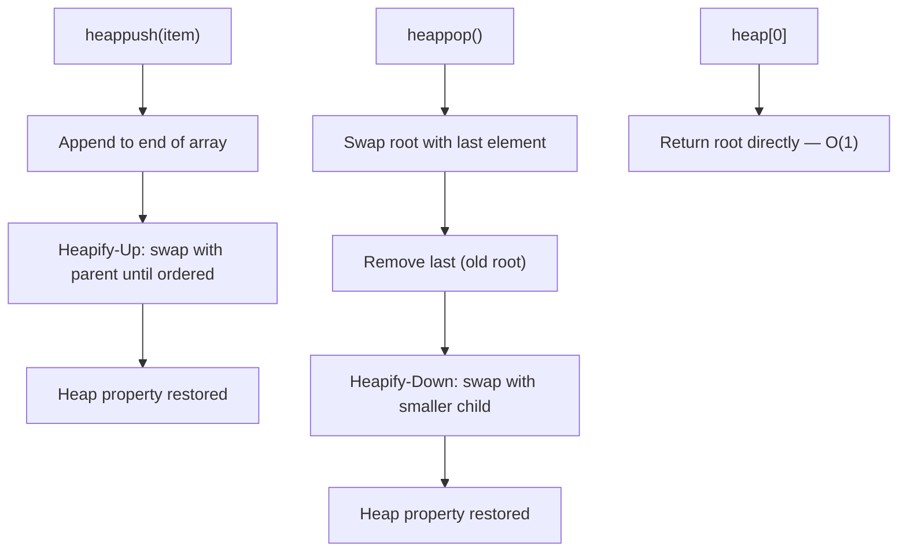

---
title: Priority Queue
aliases: [PQ, Priority Queue ADT]
tags: [DSA, Heaps, AbstractDataType]
domain: DSA
difficulty: Intermediate
created: 2026-07-26
related: [Binary_Heap, Top_K_Pattern, Dijkstra]
status: complete
---

# 🚑 Priority Queue

> [!abstract] TL;DR
> A priority queue is an **abstract data type** that always serves the highest-priority element first, regardless of insertion order. Implemented with a heap, it gives O(1) peek, O(log n) insert, and O(log n) extract. Python's `heapq` is a min-heap; use negation or tuples for custom priority. Classic uses: Dijkstra, task scheduling, median maintenance.

---

## Intuition — Analogy First

Imagine an **emergency room triage desk**. Patients don't get seen in the order they arrived — the nurse constantly reprioritizes: a patient having a heart attack jumps to the front even if they just walked in. A patient with a sprained ankle waits, no matter how long they've been there.

That's a priority queue. The "line" is not FIFO (first-in-first-out) like a regular queue — it's always ordered by urgency (priority). Under the hood, the hospital uses a heap-based tracking board so the most critical patient can be found in O(1) and removed/updated in O(log n).

---

## How It Works

### Abstract Interface
- **push(item, priority)** — insert item with a given priority
- **pop()** — remove and return the highest-priority item
- **peek()** — view highest-priority item without removing it
- **is_empty()** — check if queue has elements

### Standard Implementation: Binary Heap
A min-heap where the smallest value = highest priority. For max-priority (largest = highest), negate the value before pushing.

### Python heapq Cheat Sheet

```
heapq.heappush(heap, item)          # O(log n)
heapq.heappop(heap)                 # O(log n) — removes min
heapq.heapreplace(heap, item)       # O(log n) — pop + push atomically (faster)
heapq.heappushpop(heap, item)       # O(log n) — push then pop (returns min of both)
heap[0]                             # O(1) — peek min, no removal
heapq.nlargest(k, iterable)        # O(n + k log n) — k largest elements
heapq.nsmallest(k, iterable)       # O(n + k log n) — k smallest elements
heapq.heapify(list)                 # O(n) — transform list in-place
```

### Tuple Trick for Custom Priority
Python compares tuples lexicographically. Use `(priority, item)` tuples:

```python
# Lower number = higher priority (min-heap = highest priority first)
heapq.heappush(pq, (1, "critical"))
heapq.heappush(pq, (5, "low"))
priority, item = heapq.heappop(pq)  # (1, "critical")

# If items aren't comparable, add a monotonic counter as tiebreaker
import itertools
counter = itertools.count()
heapq.heappush(pq, (priority, next(counter), item))
```



---

## Complexity Analysis

| Operation             | Time       | Notes                                       |
|-----------------------|------------|---------------------------------------------|
| peek / heap[0]        | O(1)       | Root always holds min (or max if negated)   |
| heappush              | O(log n)   | Heapify-up from leaf                        |
| heappop               | O(log n)   | Heapify-down from root                      |
| heapreplace           | O(log n)   | Faster than pop + push (saves one heapify)  |
| heapify (build)       | O(n)       | Not O(n log n)                              |
| nlargest / nsmallest  | O(n + k log n) | Uses heap internally                    |
| Search for arbitrary  | O(n)       | No positional ordering guarantee            |
| Space                 | O(n)       |                                             |

---

## Implementation (Python)

```python
import heapq

# ─── 1. Basic min-heap priority queue ────────────────────────────────────────

pq = []
heapq.heappush(pq, 5)
heapq.heappush(pq, 1)
heapq.heappush(pq, 3)

print(pq[0])                  # Peek: 1
print(heapq.heappop(pq))      # Pop: 1
print(heapq.heappop(pq))      # Pop: 3

# ─── 2. Max-heap using negation ──────────────────────────────────────────────

max_heap = []
for val in [5, 1, 8, 3]:
    heapq.heappush(max_heap, -val)

max_val = -heapq.heappop(max_heap)  # 8

# ─── 3. Task scheduler with custom priority ──────────────────────────────────

class Task:
    def __init__(self, name, priority):
        self.name = name
        self.priority = priority  # lower = more urgent

import itertools

class PriorityQueue:
    def __init__(self):
        self._heap = []
        self._counter = itertools.count()  # monotonic tiebreaker

    def push(self, item, priority):
        # Tiebreaker ensures FIFO for same-priority items (stable)
        heapq.heappush(self._heap, (priority, next(self._counter), item))

    def pop(self):
        priority, _, item = heapq.heappop(self._heap)
        return item, priority

    def peek(self):
        priority, _, item = self._heap[0]
        return item, priority

    def __len__(self):
        return len(self._heap)

    def __bool__(self):
        return bool(self._heap)

# Usage
scheduler = PriorityQueue()
scheduler.push("Deploy hotfix", priority=1)
scheduler.push("Write docs", priority=10)
scheduler.push("Fix critical bug", priority=1)   # same priority as hotfix

task, p = scheduler.pop()   # "Deploy hotfix" (FIFO tiebreak among p=1 tasks)
task, p = scheduler.pop()   # "Fix critical bug"

# ─── 4. Median from Data Stream (Two Heaps) ──────────────────────────────────
#
# Maintain two heaps:
#   max_heap (left half) — stores smaller half; Python: negate values
#   min_heap (right half) — stores larger half
#
# Invariant: len(max_heap) == len(min_heap)  OR
#            len(max_heap) == len(min_heap) + 1
# Median: max_heap top if odd total, average of both tops if even.

class MedianFinder:
    def __init__(self):
        self.max_heap = []   # left half (negated for max-heap behavior)
        self.min_heap = []   # right half (regular min-heap)

    def addNum(self, num: int) -> None:
        # Step 1: push to max_heap (left)
        heapq.heappush(self.max_heap, -num)

        # Step 2: ensure max(left) <= min(right)
        if self.max_heap and self.min_heap and (-self.max_heap[0] > self.min_heap[0]):
            heapq.heappush(self.min_heap, -heapq.heappop(self.max_heap))

        # Step 3: rebalance sizes (max_heap can have at most 1 extra)
        if len(self.max_heap) > len(self.min_heap) + 1:
            heapq.heappush(self.min_heap, -heapq.heappop(self.max_heap))
        elif len(self.min_heap) > len(self.max_heap):
            heapq.heappush(self.max_heap, -heapq.heappop(self.min_heap))

    def findMedian(self) -> float:
        if len(self.max_heap) > len(self.min_heap):
            return -self.max_heap[0]
        return (-self.max_heap[0] + self.min_heap[0]) / 2.0

# Trace:
mf = MedianFinder()
mf.addNum(1)   # median = 1.0
mf.addNum(2)   # median = 1.5
mf.addNum(3)   # median = 2.0
print(mf.findMedian())  # 2.0

# ─── 5. heapq.nlargest / nsmallest ──────────────────────────────────────────

data = [3, 1, 4, 1, 5, 9, 2, 6]
print(heapq.nlargest(3, data))   # [9, 6, 5]
print(heapq.nsmallest(3, data))  # [1, 1, 2]

# With key function
records = [("Alice", 90), ("Bob", 75), ("Carol", 88)]
top2 = heapq.nlargest(2, records, key=lambda x: x[1])
# [("Alice", 90), ("Carol", 88)]
```

---

## Dry Run / Example Trace

**Median from Data Stream: insert 6, 2, 1, 5, 3**

| Step | Inserted | max_heap (left) | min_heap (right) | Median |
|------|----------|-----------------|------------------|--------|
| 1    | 6        | [6]             | []               | 6.0    |
| 2    | 2        | [2]             | [6]              | 4.0    |
| 3    | 1        | [2, 1]          | [6]              | 2.0    |
| 4    | 5        | [2, 1]          | [5, 6]           | 3.5    |
| 5    | 3        | [3, 2, 1]       | [5, 6]           | 3.0    |

After insert 3: max_heap top = 3, min_heap top = 5. Sizes 3 and 2, so odd — median = max_heap top = **3.0**.

---

## Patterns & LeetCode Applications

| Problem | LeetCode # | Pattern |
|---------|-----------|---------|
| Kth Largest Element in Array | 215 | Min-heap of size k |
| Top K Frequent Elements | 347 | Min-heap of size k by frequency |
| Find Median from Data Stream | 295 | Two heaps (max + min) |
| Task Scheduler | 621 | Max-heap of task frequencies |
| Merge K Sorted Lists | 23 | Min-heap with (val, list_idx, elem_idx) |
| Meeting Rooms II | 253 | Min-heap of end times |
| K Closest Points to Origin | 973 | Max-heap of size k by distance |
| Reorganize String | 767 | Max-heap of char frequencies |
| Ugly Number II | 264 | Min-heap for next candidate |

---

## Common Pitfalls

1. **Forgetting heapq is min-heap only**: Always negate for max-priority; or use `(-priority, item)` tuples.
2. **Tuple comparison on non-comparable objects**: If two entries share the same priority and the item doesn't support `<`, Python raises `TypeError`. Always include a unique integer tiebreaker.
3. **heapreplace vs heappushpop**: `heapreplace` pops first then pushes (errors on empty heap); `heappushpop` pushes first then pops (safe on empty but may return the pushed item immediately).
4. **Using nlargest/nsmallest for small k on large n**: These are O(n + k log n). If k is close to n, just sort instead (O(n log n) but simpler and often faster in practice due to lower constants).
5. **Two-heap median: forgetting to rebalance**: After every insertion you must enforce both the ordering invariant (max of left ≤ min of right) AND the size invariant. Forgetting either gives wrong medians.
6. **Checking emptiness before peek**: `heap[0]` raises `IndexError` on an empty list. Always guard with `if heap`.

---

## Related Concepts

- [[_MOC_Heaps|↑ Section MOC]]
- [[Binary_Heap]] — the standard implementation of a priority queue
- [[Top_K_Pattern]] — common interview pattern using priority queues
- [[Dijkstra]] — shortest-path algorithm driven by a priority queue
- [[Queue]] — FIFO version; priority queue is a generalization
- [[Heap_Sort_Algorithm]] — sorting via priority queue extraction

---

## Review Questions

1. Explain why Python's `heapq` needs a tiebreaker counter when storing non-comparable objects as `(priority, item)` tuples. What error occurs without it, and how does the counter fix it?

2. In the two-heap approach for finding the running median, what are the two invariants that must hold after every insertion? Walk through what happens when you insert a value that violates the ordering invariant.

3. When should you use `heapq.nlargest(k, data)` versus maintaining a min-heap of size k manually? What is the time complexity of each, and at what value of k relative to n does the tradeoff shift?

---

## Sources

- Python docs: [`heapq` — Heap queue algorithm](https://docs.python.org/3/library/heapq.html)
- LeetCode 295 — [Find Median from Data Stream](https://leetcode.com/problems/find-median-from-data-stream/)
- [NeetCode — Heap / Priority Queue playlist](https://neetcode.io/roadmap)
- Cormen et al., CLRS — Chapter 6 (Heapsort) & Chapter 19 (Fibonacci Heaps)

#DSA #Heaps #PriorityQueue #AbstractDataType #Intermediate
