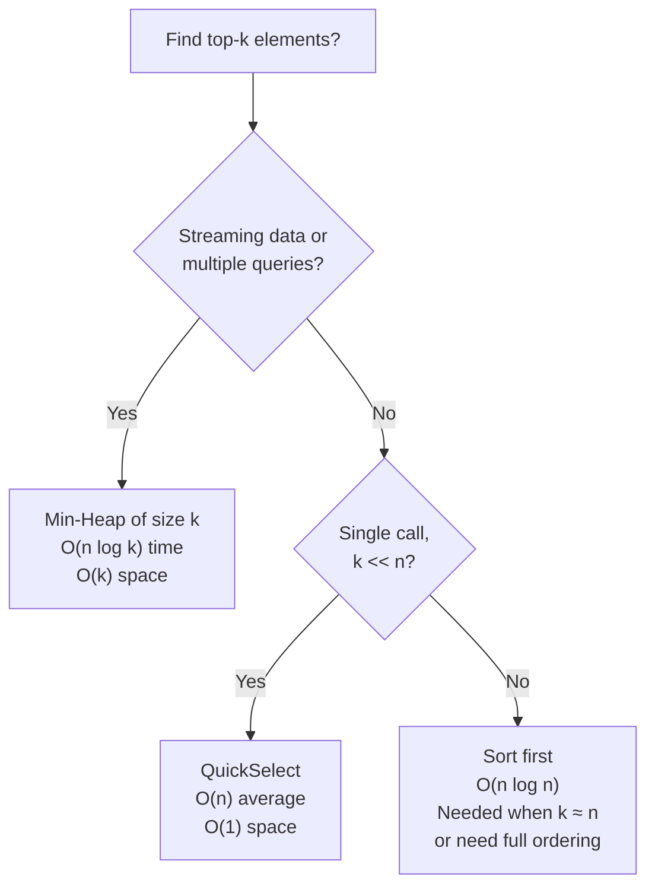

---
title: Top K Pattern
aliases: [Top K Elements, Kth Largest, Kth Smallest]
tags: [DSA, Heaps, Patterns, QuickSelect]
domain: DSA
difficulty: Intermediate
created: 2026-07-26
related: [Priority_Queue, Binary_Heap, Quick_Sort]
status: complete
---

# 🎵 Top K Pattern

> [!abstract] TL;DR
> Finding the k largest/smallest elements is one of the most common DSA patterns. Three main approaches: **min-heap of size k** for O(n log k) streaming top-k; **QuickSelect** for O(n) average one-shot kth element; **full sort** at O(n log n) only when k ≈ n. For streaming data or external queries, use the heap. For a single call on an array you own, QuickSelect is fastest.

---

## Intuition — Analogy First

Think about **Grammy Award nominations**. There are 10,000 albums released this year, but only 5 get nominated. You don't need to rank all 10,000 — you just need the top 5.

Strategy 1 (Min-Heap of size k): Maintain a running shortlist of 5 nominees. For each new album, compare it with the *worst* album on the shortlist. If the new album is better, kick out the worst and add the new one. After checking all 10,000 albums, your shortlist is the top 5. This is your **min-heap of size k** approach.

Strategy 2 (QuickSelect): Randomly pick a judge's "pivot" album, split the 10,000 into "better than pivot" and "worse than pivot." If you now have exactly 4 better ones, the pivot is #5. If you have 7 better ones, recurse on that group of 7. Never process the whole list — just the side that contains your target rank.

Strategy 3 (Sort first): Only if you need all 10,000 ranked anyway.

---

## How It Works

### Approach 1: Min-Heap of Size k (Top-k-Largest)

**Key insight:** The *minimum* of the top-k-largest set is the sentinel — any element smaller than it cannot be in the top k.

1. Push first k elements into a min-heap.
2. For each remaining element, if it is larger than `heap[0]` (current minimum of top-k): pop the min and push the new element.
3. At the end, the heap contains exactly the k largest elements.

Time: O(n log k) — n comparisons, each O(log k) heap op.
Space: O(k).

**For top-k-smallest:** Use a max-heap of size k (negate values in Python). Kick out the max if new element is smaller.

### Approach 2: QuickSelect — O(n) Average

Like one step of quicksort: pick a pivot, partition the array so all elements larger than pivot are to the left, and all smaller are to the right. If the pivot lands at index k-1 (0-indexed), it's the kth largest. Otherwise, recurse only on the relevant partition.

Average case O(n): each partition halves the search space on average.
Worst case O(n²): bad pivot (already-sorted input). Randomise pivot to avoid.

### Approach 3: Sort First

`sorted(arr, reverse=True)[:k]` — O(n log n). Only makes sense when k ≈ n or when you need a fully ordered top-k.



---

## Complexity Analysis

| Approach                | Time        | Space    | When to Use                              |
|------------------------|-------------|----------|------------------------------------------|
| Min-heap of size k     | O(n log k)  | O(k)     | Streaming, external, multiple queries    |
| QuickSelect            | O(n) avg    | O(1)     | Single call, array fits in memory        |
| QuickSelect worst case | O(n²)       | O(1)     | (Use randomised pivot to avoid)          |
| Sort then slice        | O(n log n)  | O(n)     | k ≈ n, or need sorted order             |
| heapq.nlargest(k)      | O(n + k log n) | O(k)  | Convenience; internally uses heap        |

**Rule of thumb:**
- k = 1 → single scan O(n)
- k is small relative to n → QuickSelect (O(n))
- k unknown in advance / streaming → Min-heap of size k (O(n log k))
- k ≈ n → just sort (O(n log n))

---

## Implementation (Python)

```python
import heapq
import random

# ─── 1. Top-k Largest using Min-Heap of size k ───────────────────────────────

def top_k_largest_heap(nums, k):
    """
    Returns the k largest elements (not necessarily sorted).
    Time: O(n log k), Space: O(k)
    """
    min_heap = []

    for num in nums:
        heapq.heappush(min_heap, num)
        if len(min_heap) > k:
            heapq.heappop(min_heap)  # Remove smallest; heap stays size k

    return min_heap  # Contains k largest elements


def kth_largest_heap(nums, k):
    """Returns only the kth largest element. O(n log k)."""
    return top_k_largest_heap(nums, k)[0]  # Root of min-heap = kth largest


# ─── 2. Kth Largest in a Stream ──────────────────────────────────────────────

class KthLargest:
    """LC 703 — Kth Largest Element in a Stream."""

    def __init__(self, k: int, nums: list[int]):
        self.k = k
        self.heap = []
        for num in nums:
            self.add(num)

    def add(self, val: int) -> int:
        heapq.heappush(self.heap, val)
        if len(self.heap) > self.k:
            heapq.heappop(self.heap)
        return self.heap[0]  # Root = kth largest


stream = KthLargest(3, [4, 5, 8, 2])
print(stream.add(3))   # k=3: [4,5,8] → still 4
print(stream.add(5))   # k=3: [5,5,8] → 5
print(stream.add(10))  # k=3: [5,8,10] → 5


# ─── 3. QuickSelect — Kth Largest, O(n) average ──────────────────────────────

def quickselect_kth_largest(nums, k):
    """
    Finds the kth largest element.
    Modifies the array in-place (use a copy if needed).
    Time: O(n) average, O(n²) worst. Space: O(1).
    """
    # kth largest = (n - k)th smallest (0-indexed)
    target = len(nums) - k

    def partition(left, right):
        # Randomise pivot to avoid O(n²) worst case
        pivot_idx = random.randint(left, right)
        nums[pivot_idx], nums[right] = nums[right], nums[pivot_idx]
        pivot = nums[right]

        store = left
        for i in range(left, right):
            if nums[i] <= pivot:
                nums[store], nums[i] = nums[i], nums[store]
                store += 1

        nums[store], nums[right] = nums[right], nums[store]
        return store

    left, right = 0, len(nums) - 1
    while left <= right:
        pivot_pos = partition(left, right)
        if pivot_pos == target:
            return nums[pivot_pos]
        elif pivot_pos < target:
            left = pivot_pos + 1
        else:
            right = pivot_pos - 1

    return -1  # Should never reach here


print(quickselect_kth_largest([3, 2, 1, 5, 6, 4], k=2))   # 5
print(quickselect_kth_largest([3, 2, 3, 1, 2, 4, 5, 5, 6], k=4))  # 4


# ─── 4. Top K Frequent Elements (LC 347) ────────────────────────────────────

from collections import Counter

def top_k_frequent(nums, k):
    """
    O(n log k) with heap; O(n) with bucket sort.
    """
    counts = Counter(nums)  # {num: frequency}

    # Min-heap by frequency; (freq, num) tuple
    heap = []
    for num, freq in counts.items():
        heapq.heappush(heap, (freq, num))
        if len(heap) > k:
            heapq.heappop(heap)

    return [num for freq, num in heap]

print(top_k_frequent([1,1,1,2,2,3], k=2))  # [1, 2]


# ─── 5. K Closest Points to Origin (LC 973) ─────────────────────────────────

def k_closest(points, k):
    """
    Max-heap of size k: keep k smallest distances.
    Negate distance for max-heap trick.
    O(n log k)
    """
    max_heap = []
    for x, y in points:
        dist = x*x + y*y  # No need for sqrt (monotone)
        heapq.heappush(max_heap, (-dist, x, y))
        if len(max_heap) > k:
            heapq.heappop(max_heap)

    return [[x, y] for (_, x, y) in max_heap]

print(k_closest([[1,3],[-2,2]], k=1))  # [[-2, 2]]


# ─── 6. Bucket sort approach for Top-K Frequent — O(n) ──────────────────────

def top_k_frequent_bucket(nums, k):
    counts = Counter(nums)
    # Bucket: index = frequency, value = list of nums with that frequency
    bucket = [[] for _ in range(len(nums) + 1)]
    for num, freq in counts.items():
        bucket[freq].append(num)

    result = []
    for freq in range(len(bucket) - 1, 0, -1):
        for num in bucket[freq]:
            result.append(num)
            if len(result) == k:
                return result
    return result
```

---

## Dry Run / Example Trace

**Top-2 largest from `[3, 1, 5, 12, 2, 11]` using min-heap of size 2:**

| Element | Action              | Heap state (min at top) | Note                    |
|---------|---------------------|------------------------|-------------------------|
| 3       | push 3              | [3]                    | size < k=2              |
| 1       | push 1              | [1, 3]                 | size == k               |
| 5       | 5 > heap[0]=1 → pop 1, push 5 | [3, 5]    | New element beats min   |
| 12      | 12 > heap[0]=3 → pop 3, push 12 | [5, 12] | New element beats min  |
| 2       | 2 < heap[0]=5 → skip | [5, 12]              | Can't enter top-2       |
| 11      | 11 > heap[0]=5 → pop 5, push 11 | [11, 12] | New element beats min |

Result: `[11, 12]` — the 2 largest elements. Heap root (11) = 2nd largest.

---

## Patterns & LeetCode Applications

| Problem | # | Approach | Key Trick |
|---------|---|----------|-----------|
| Kth Largest Element in Array | 215 | QuickSelect or min-heap | If asked for O(n), use QuickSelect |
| Top K Frequent Elements | 347 | Min-heap by freq | Counter + heap or bucket sort |
| Find K Closest Points to Origin | 973 | Max-heap by distance (negated) | Skip sqrt (distance² is monotone) |
| Kth Largest in a Stream | 703 | Min-heap of size k, persistent | Stream updates use add() |
| Kth Smallest in Sorted Matrix | 378 | Min-heap with (val, row, col) | Push first column; expand right/down |
| K Pairs with Smallest Sums | 373 | Min-heap with (sum, i, j) | Lazily expand candidates |
| Sort Characters by Frequency | 451 | Max-heap by char count | heapq.nlargest |
| Task Scheduler | 621 | Max-heap of task counts + cooldown | Greedy with heap |
| Ugly Number II | 264 | Min-heap for next ugly | Push 2x, 3x, 5x multiples |

---

## Common Pitfalls

1. **Min-heap vs max-heap confusion**: For top-k-largest, use a **min-heap** (so you can quickly evict the smallest of your top-k candidates). For top-k-smallest, use a **max-heap**.
2. **QuickSelect modifies the input**: `quickselect` partitions in-place. If you need the original order preserved, copy the array first.
3. **QuickSelect worst case without randomization**: Always on a sorted or reverse-sorted input if you always pick the last element as pivot. Randomize the pivot index before every partition call.
4. **Using sort when QuickSelect is expected**: In interviews, if the problem says O(n) time, the intended solution is QuickSelect. `sorted()` is O(n log n) and will not pass.
5. **heapq.nlargest vs manual heap**: `heapq.nlargest(k, data)` is convenient but always scans the entire list. If you're inserting elements one at a time (streaming), maintain your own heap.
6. **Distance comparison with sqrt**: For closest-points problems, comparing `x² + y²` is sufficient — sqrt is monotone and unnecessary. Skipping it avoids floating-point issues and is faster.

---

## Related Concepts

- [[_MOC_Heaps|↑ Section MOC]]
- [[Priority_Queue]] — the mechanism that powers the heap approach
- [[Binary_Heap]] — the underlying data structure
- [[Quick_Sort]] — QuickSelect is the selection version of the same partition logic
- [[Heap_Sort_Algorithm]] — sorting by exhaustive extraction from a heap
- [[Sliding_Window]] — another common interview pattern for range queries

---

## Review Questions

1. You need to find the top-100 elements from a stream of 1 billion integers that arrives one at a time. You can only use O(100) extra memory. Which approach do you use, and what is the time complexity per element? Why is QuickSelect not applicable here?

2. QuickSelect has O(n) average time and O(n²) worst case. Explain exactly what input sequence triggers the worst case for a naive (always-last-element) pivot, and how randomizing the pivot selection reduces the expected time to O(n).

3. For "Top K Frequent Elements," there is a bucket-sort approach that achieves O(n) instead of O(n log k). Describe the bucket structure, explain why O(n) is achievable, and identify the constraint that makes it possible (hint: what limits the maximum frequency?).

---

## Sources

- LeetCode 215 — [Kth Largest Element in an Array](https://leetcode.com/problems/kth-largest-element-in-an-array/)
- LeetCode 347 — [Top K Frequent Elements](https://leetcode.com/problems/top-k-frequent-elements/)
- LeetCode 703 — [Kth Largest Element in a Stream](https://leetcode.com/problems/kth-largest-element-in-a-stream/)
- [NeetCode — Heap / Priority Queue](https://neetcode.io/roadmap)
- CLRS Chapter 9 — Medians and Order Statistics (QuickSelect)

#DSA #Heaps #TopK #QuickSelect #Patterns #Intermediate
