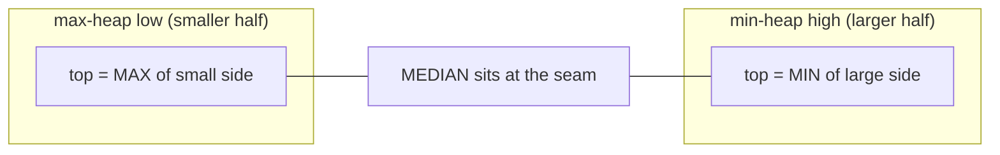
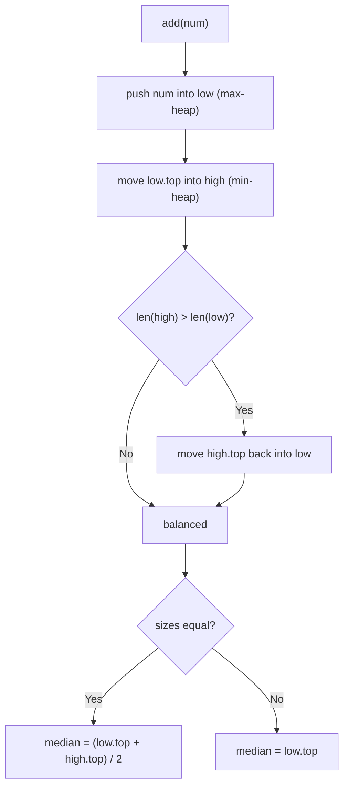

# ⚖️ Two Heaps Pattern

> [!abstract] TL;DR
> To track the **median of a growing stream** you don't need to sort anything. Split the data into two balanced halves: a **max-heap holding the smaller half** (its top = the largest of the small numbers) and a **min-heap holding the larger half** (its top = the smallest of the big numbers). The median lives right at the boundary — it's the top of the larger heap, or the average of the two tops when sizes are equal. Insertion is **O(log n)** (heap push + one rebalancing move) and reading the median is **O(1)**. Keep the heap sizes within 1 of each other and the two tops always sandwich the middle of the data.

---

## Intuition — Analogy First

Picture people lining up by height, and you constantly want to know the **height of the middle person** even as newcomers keep joining. Re-sorting the whole line every time someone arrives is wasteful.

Instead, split the line into two groups at the middle: a **"shorter half"** and a **"taller half."** You only ever care about two people — the **tallest of the shorter half** and the **shortest of the taller half** — because the median is one of them (or their average). A **max-heap** instantly gives you the tallest of the shorter half; a **min-heap** instantly gives you the shortest of the taller half. When a newcomer arrives, drop them into the correct half and, if one half now has two more people than the other, move the boundary person across to rebalance. You never sort the whole line — you only nudge the two people standing at the seam.

That seam is the median, and the two heaps are just fast ways to always know who's standing at it.

---

## How It Works + Mermaid

Two heaps, meeting at the median:

- `low` = **max-heap** of the smaller half (Python uses a min-heap of *negated* values).
- `high` = **min-heap** of the larger half.

**Invariants after every insert:**
1. Every value in `low` ≤ every value in `high` (ordering across the seam).
2. `len(low) - len(high) ∈ {0, 1}` (sizes differ by at most 1; keep `low` the bigger-or-equal one).

**Insert routine:** push into `low`, then move `low`'s top over to `high` (so the cross-heap ordering can't be violated), then if `high` grew larger than `low`, move `high`'s top back. This "push-then-shuffle" guarantees both invariants.





Reading the median is O(1): if sizes are equal, average the two tops; otherwise the extra element sits in `low`, so its top **is** the median.

---

## When to Recognize This Pattern (signal keywords)

- "**Median** of a **data stream** / running median / online median."
- "Find the median as numbers **arrive one at a time**" (can't sort once up front).
- "**[[Sliding_Window|Sliding window]] median**" (two heaps + lazy deletion).
- Needing the value **at the middle** of a dynamic set, repeatedly and cheaply.
- Problems that want to **balance two groups by size while keeping one group's max ≤ the other's min** — e.g., IPO / scheduling where you separate "affordable now" vs "too expensive yet."
- More generally: any time you'd otherwise re-sort on each update just to peek at a boundary element.

---

## Python Implementation / Template

```python
import heapq

# ── Find Median from Data Stream (LeetCode 295) ───────────────────────────────
class MedianFinder:
    """
    low  = max-heap of the smaller half (store negatives, since heapq is a min-heap)
    high = min-heap of the larger half
    Invariant: len(low) == len(high)  OR  len(low) == len(high) + 1
    addNum:    O(log n)   findMedian: O(1)
    """

    def __init__(self):
        self.low = []    # max-heap via negation; low[0] = -(max of small half)
        self.high = []   # min-heap; high[0] = min of large half

    def addNum(self, num: int) -> None:
        # 1) Always push into low first.
        heapq.heappush(self.low, -num)
        # 2) Move low's max over to high to preserve cross-heap ordering.
        heapq.heappush(self.high, -heapq.heappop(self.low))
        # 3) Rebalance so low is the larger-or-equal heap.
        if len(self.high) > len(self.low):
            heapq.heappush(self.low, -heapq.heappop(self.high))

    def findMedian(self) -> float:
        if len(self.low) > len(self.high):
            return -self.low[0]                      # odd count -> extra sits in low
        return (-self.low[0] + self.high[0]) / 2.0    # even count -> average the two tops


# quick check
mf = MedianFinder()
for x in [5, 15, 1, 3]:
    mf.addNum(x)
print(mf.findMedian())   # sorted so far: [1,3,5,15] -> (3+5)/2 = 4.0


# ── Sliding Window Median (LeetCode 480) — two heaps + lazy deletion ──────────
from collections import defaultdict

def median_sliding_window(nums, k):
    """
    Median of every window of size k. Uses two heaps and a 'to-delete' map:
    we don't remove from the middle of a heap; we mark stale entries and skip
    them lazily when they surface at a heap top. Time ~ O(n log k).
    """
    low, high = [], []               # low = max-heap (neg), high = min-heap
    to_delete = defaultdict(int)     # value -> pending deletions
    result = []

    def prune(heap):                 # discard stale tops
        while heap:
            val = -heap[0] if heap is low else heap[0]
            if to_delete[val] > 0:
                to_delete[val] -= 1
                heapq.heappop(heap)
            else:
                break

    balance = 0                      # size(low) - size(high) counting live elements
    for i, num in enumerate(nums):
        # add
        if not low or num <= -low[0]:
            heapq.heappush(low, -num); balance += 1
        else:
            heapq.heappush(high, num); balance -= 1
        # remove the element leaving the window
        if i >= k:
            out = nums[i - k]
            to_delete[out] += 1
            if out <= -low[0]:
                balance -= 1
            else:
                balance += 1
        # rebalance sizes (net, ignoring stale)
        if balance > 1:
            heapq.heappush(high, -heapq.heappop(low)); balance -= 2
        elif balance < 0:
            heapq.heappush(low, -heapq.heappop(high)); balance += 2
        prune(low); prune(high)
        # record median once the window is full
        if i >= k - 1:
            if k % 2:
                result.append(float(-low[0]))
            else:
                result.append((-low[0] + high[0]) / 2.0)
    return result
```

---

## Dry Run / Trace

**Stream `5, 15, 1, 3` through `MedianFinder`** (`low` shown as real values, i.e. negated back):

| add | after step 1 push low | after step 2 (low.top → high) | rebalance | low (max-heap) | high (min-heap) | median |
|-----|----------------------|-------------------------------|-----------|----------------|-----------------|--------|
| 5 | low=[5] | low=[], high=[5] | high bigger → move back | [5] | [] | 5 |
| 15 | low=[5,15] | low=[5], high=[15] | balanced | [5] | [15] | (5+15)/2 = 10 |
| 1 | low=[5,1] | low=[1], high=[5,15] | high bigger → move 5 back | [5,1] | [15] | 5 |
| 3 | low=[5,1,3] | low=[3,1], high=[5,15] | balanced | [3,1] | [5,15] | (3+5)/2 = 4 |

Every median read is just a peek at one or two heap tops — O(1) — while each insert did at most two heap ops — O(log n).

---

## Patterns & LeetCode Applications

| Problem | Two-Heap Role | Extra Machinery | LeetCode |
|---------|---------------|-----------------|----------|
| Find Median from Data Stream | max-heap low + min-heap high | balance by size | 295 |
| Sliding Window Median | same, per window | **lazy deletion** map for evicted elements | 480 |
| IPO (maximize capital) | min-heap by capital + max-heap by profit | pop all affordable into profit heap, take best | 502 |
| Maximize Capital / scheduling | "unlocked" vs "locked" split | move items across as a threshold advances | — |
| Median maintenance (general) | balanced halves | O(1) median, O(log n) update | — |

Contrast with the [[Top_K_Pattern]]: Top-K keeps **one** heap of size k to hold the extremes; Two Heaps keeps **two** heaps to hold the **middle**.

---

## Common Pitfalls

1. **Python has no max-heap.** `heapq` is min-only. Store **negated** values in `low` and negate again when reading `-low[0]`. Forgetting a sign flip silently corrupts the median.
2. **Rebalancing size but not order.** Just keeping sizes equal is not enough — every element in `low` must be ≤ every element in `high`. The safe recipe is *push into low → move low's top to high → move back if high got bigger*, which fixes ordering and size together.
3. **Off-by-one on which heap holds the extra element.** Pick a convention (here `low` is the larger-or-equal heap on odd counts) and read the median from it. Mixing conventions gives the wrong single median.
4. **Integer division for the even median.** In Python 2 or with `//`, `(a + b) // 2` truncates. Use `/ 2.0` (or `/ 2` in Python 3) to return a float.
5. **True deletion from a heap for sliding window.** Heaps can't remove an arbitrary interior element in O(log n). Use **lazy deletion**: mark the value as stale in a map and skip it only when it bubbles to a top. Trying to `heap.remove()` is O(n) and defeats the pattern.
6. **Empty-heap peeks.** Guard `findMedian` (and window medians) before the heaps are populated; peeking `low[0]` on an empty list raises `IndexError`.

---

## Related Concepts

- [[_MOC_Heaps|↑ Section MOC]]
- [[Binary_Heap]] — the underlying data structure both heaps are built on
- [[Priority_Queue]] — the abstract interface (`push`/`pop-min` or `pop-max`) the pattern uses
- [[Top_K_Pattern]] — the *other* headline heap pattern: one heap of size k for the extremes, vs two heaps for the middle
- [[Heap_Sort_Algorithm]] — sorting by repeated heap extraction; shares the sift-up/down internals

---

## Review Questions (3)

1. State the two invariants the Two Heaps pattern maintains after every insertion, and explain precisely why the "push into `low`, move `low`'s top to `high`, move back if `high` is larger" sequence restores *both* invariants in O(log n).
2. Sliding Window Median needs to remove the element that leaves the window, but heaps can't delete an interior element efficiently. Describe the **lazy deletion** scheme and argue why the amortized cost per window stays O(log k).
3. Compare the Two Heaps pattern with maintaining a single balanced BST / order-statistics tree for the running median. What does each give you in time and code complexity, and when would you prefer the BST?

---

## Sources

- LeetCode 295 — [Find Median from Data Stream](https://leetcode.com/problems/find-median-from-data-stream/)
- LeetCode 480 — [Sliding Window Median](https://leetcode.com/problems/sliding-window-median/)
- LeetCode 502 — [IPO](https://leetcode.com/problems/ipo/)
- Grokking the Coding Interview — Two Heaps pattern
- Python docs — [`heapq`](https://docs.python.org/3/library/heapq.html)

#DSA #Patterns #heaps #two-heaps #median #priority-queue #streaming
