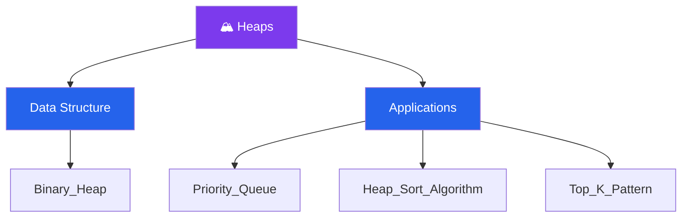

# 🏔 Heaps — Map of Content

> [!abstract] What This Section Covers
> A heap is a complete binary tree stored implicitly in an array that enforces a simple ordering property: every parent is smaller (min-heap) or larger (max-heap) than its children. This single invariant enables O(log n) insert and extract-min/max, and O(n) construction — a non-obvious result that makes heaps uniquely efficient for priority-driven scheduling, selection, and sorting. This section covers the binary heap in depth, the priority queue abstraction built on top of it, heap sort, and the top-K pattern — one of the most common interview applications of heaps.

## Concept Map

## Learning Path

Recommended order to study the notes in this section.

1. [[Binary_Heap]] — Array representation, parent/child index formulas, heapify-up, heapify-down, O(n) build-heap
2. [[Priority_Queue]] — Abstract interface over a heap; `heapq` in Python; use in Dijkstra, A*, task scheduling
3. [[Heap_Sort_Algorithm]] — In-place O(n log n) sort using build-heap then repeated extract-max; why not cache-friendly
4. [[Top_K_Pattern]] — Use a min-heap of size k to find top-k largest; two-heap trick for median of stream

## All Notes at a Glance

| Note | Summary | Difficulty |
|------|---------|------------|
| [[Binary_Heap]] | Complete binary tree in array form; O(log n) insert/extract, O(n) build | Intermediate |
| [[Priority_Queue]] | Heap-backed queue that always dequeues the min or max element first | Intermediate |
| [[Heap_Sort_Algorithm]] | Comparison-based, in-place O(n log n) sort; not stable; poor cache locality | Intermediate |
| [[Top_K_Pattern]] | Min-heap of size k for top-k largest; two-heap split for streaming median | Intermediate |

## Key Questions This Section Answers

- Why is `build-heap` O(n) when you might expect O(n log n) from n insertions?
- When do you use a min-heap of size k to find the top-k largest elements — and why does it work?
- What advantage does heap sort offer over quick sort, and why is quick sort usually preferred in practice?
- How does `heapq` in Python implement a min-heap and how do you simulate a max-heap with it?
- How do you find the running median of a stream of numbers using two heaps?
- Where does Dijkstra's algorithm use a heap and what complexity does it enable?

## Related Sections

- [[_MOC_DSA_Master|↑ DSA Master MOC]]
- [[_MOC_Trees|← Trees]] — heap is a specialized complete binary tree; understand trees first
- [[_MOC_Graphs|→ Graphs]] — Dijkstra's shortest path algorithm uses a min-heap as its priority queue

#MOC #DSA #heaps
