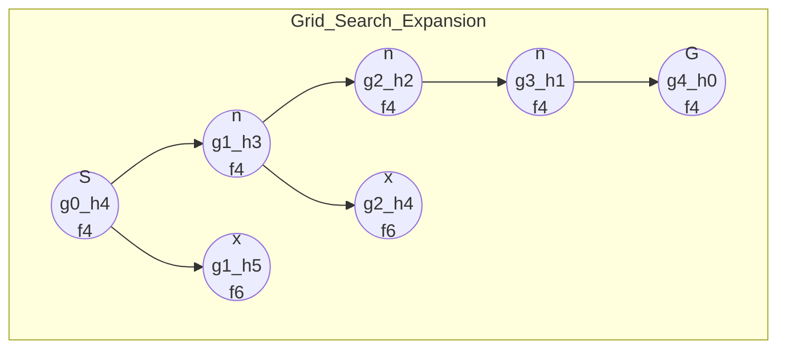

# ⭐ A* Search Algorithm

> [!abstract] TL;DR
> A* is an **informed** shortest-path search that expands nodes in order of `f(n) = g(n) + h(n)`, where `g(n)` is the true cost from the start and `h(n)` is a **heuristic** estimate of the cost remaining to the goal. When `h` is **admissible** (never overestimates), A* returns an optimal path while exploring far fewer nodes than [[Dijkstra]]. In fact, **Dijkstra is A\* with `h = 0`**.

---

## Intuition — Analogy First

Imagine you are driving from Los Angeles to New York with a paper map. Plain [[Dijkstra]] is like a driver with no sense of direction: it explores roads in every direction equally, radiating outward as a growing circle until it happens to reach New York.

A* is a driver who **glances at the compass**. It still counts the miles already driven (`g`), but it also adds a rough guess of the straight-line miles still to go (`h`). Given two equally-driven routes, it prefers the one whose remaining guess points toward New York — so it stretches its search into an **ellipse aimed at the goal** instead of a blind circle. The compass guess (`h`) is what turns a blind flood into a purposeful march.

The magic rule: as long as the compass **never lies by promising a shortcut that doesn't exist** (never overestimates), A* is guaranteed to find the truly shortest route.

---

## How It Works + Mermaid

**The evaluation function:**
```
f(n) = g(n) + h(n)
       │      │
       │      └── heuristic: estimated cost from n to goal
       └───────── g: known cheapest cost from start to n
```

**Core steps (grid pathfinding):**
1. Push the start into a min-heap keyed by `f = g + h`.
2. Pop the node with the smallest `f`.
3. If it is the goal → reconstruct and return the path.
4. Otherwise, for each neighbor: compute a tentative `g`. If it improves the neighbor's known `g`, update `g`, set `f = g + h`, record the parent, and push it.
5. Repeat until the goal is popped or the heap empties (no path).

**Heuristic properties:**

| Property | Definition | Guarantees |
|----------|-----------|-----------|
| **Admissible** | `h(n) ≤ true cost(n → goal)` for all `n` | Optimal path found |
| **Consistent** (monotone) | `h(u) ≤ w(u,v) + h(v)` for every edge | Optimal **and** no node ever needs reopening |

Consistency implies admissibility. With a consistent `h`, once a node is popped its `g` is final — just like Dijkstra.

**Common grid heuristics:**

| Movement | Heuristic | Formula |
|----------|-----------|---------|
| 4-directional | **Manhattan** | `|dx| + |dy|` |
| Any-angle / Euclidean cost | **Euclidean** | `√(dx² + dy²)` |
| 8-directional (diagonals allowed) | **Chebyshev** | `max(|dx|, |dy|)` |



Nodes with `f = 4` (on the ideal straight line toward the goal) are expanded first; the `f = 6` detours are deprioritized and often never expanded at all.

---

## Complexity Analysis

| Aspect | Value | Notes |
|--------|-------|-------|
| Time (worst case) | O((V+E) log V) | Degenerates to Dijkstra when `h = 0` |
| Time (good heuristic) | Much smaller in practice | Explores an ellipse, not a full circle |
| Space | O(V) | Open set (heap) + closed set + `g` map + parent map |
| Optimality | Guaranteed if `h` is admissible | — |
| Node reopening | Never, if `h` is consistent | May reopen if merely admissible |

- **`h = 0`** → A* = Dijkstra (uninformed, still optimal, slowest).
- **`h = true remaining cost`** → A* is perfectly informed and expands only nodes on an optimal path.
- **`h` overestimates** → A* becomes **greedy best-first**: fast but may return a sub-optimal path.
- **Weighted A\*** (`f = g + w·h`, `w > 1`) trades optimality for speed — bounded by factor `w`.

---

## Python Implementation

```python
import heapq
from typing import List, Tuple, Optional

def a_star_grid(
    grid: List[List[int]],          # 0 = free cell, 1 = obstacle
    start: Tuple[int, int],
    goal: Tuple[int, int],
) -> Optional[List[Tuple[int, int]]]:
    """
    A* shortest path on a 4-directional grid with obstacles.
    Returns the list of cells from start to goal, or None if unreachable.
    """
    rows, cols = len(grid), len(grid[0])

    def h(cell: Tuple[int, int]) -> int:
        # Manhattan distance — admissible & consistent for 4-dir movement
        return abs(cell[0] - goal[0]) + abs(cell[1] - goal[1])

    # heap entries: (f, g, cell)
    open_heap = [(h(start), 0, start)]
    g_score = {start: 0}            # best known cost from start
    parent = {start: None}          # for path reconstruction
    closed = set()                  # finalized cells

    while open_heap:
        f, g, cur = heapq.heappop(open_heap)

        if cur == goal:
            return _reconstruct(parent, goal)

        if cur in closed:           # stale duplicate — skip
            continue
        closed.add(cur)

        r, c = cur
        for dr, dc in ((1, 0), (-1, 0), (0, 1), (0, -1)):
            nr, nc = r + dr, c + dc
            if not (0 <= nr < rows and 0 <= nc < cols):
                continue
            if grid[nr][nc] == 1:               # obstacle
                continue
            neighbor = (nr, nc)
            tentative_g = g + 1                  # uniform edge cost = 1
            if tentative_g < g_score.get(neighbor, float('inf')):
                g_score[neighbor] = tentative_g
                parent[neighbor] = cur
                f_new = tentative_g + h(neighbor)
                heapq.heappush(open_heap, (f_new, tentative_g, neighbor))

    return None                                  # goal unreachable


def _reconstruct(parent, goal):
    path = []
    node = goal
    while node is not None:
        path.append(node)
        node = parent[node]
    path.reverse()
    return path


# ---- Example ----
grid = [
    [0, 0, 0, 0],
    [1, 1, 0, 1],
    [0, 0, 0, 0],
    [0, 1, 1, 0],
]
print(a_star_grid(grid, (0, 0), (3, 3)))
# [(0,0),(0,1),(0,2),(1,2),(2,2),(2,3),(3,3)]
```

---

## Dry Run / Trace

**Grid** (`.` free, `#` obstacle), start `S=(0,0)`, goal `G=(2,2)`, Manhattan `h`:
```
S . .
# # .
. . G
```

```
h(cell) = |r-2| + |c-2|

Pop (f=4,g=0,(0,0)):  h=4  -> push (0,1):f=0+1+3=4 ; (1,0) blocked by #
Pop (f=4,g=1,(0,1)):  push (0,2): g=2, h=2, f=4
Pop (f=4,g=2,(0,2)):  push (1,2): g=3, h=1, f=4
Pop (f=4,g=3,(1,2)):  push (2,2)=G: g=4, h=0, f=4
Pop (f=4,g=4,(2,2)):  == goal  ->  DONE
```
Every popped node had `f = 4` — A* walked the straight optimal corridor and never explored the empty bottom-left, which a blind Dijkstra would have flooded. Path: `(0,0)→(0,1)→(0,2)→(1,2)→(2,2)`, length 4.

---

## Patterns & LeetCode Applications

| Problem | LC # | A* Angle |
|---------|------|----------|
| Shortest Path in Binary Matrix | 1091 | 8-dir grid → Chebyshev heuristic beats plain BFS |
| Sliding Puzzle | 773 | State-space A*; `h` = sum of Manhattan distances of tiles |
| Shortest Path in Grid with Obstacles Elimination | 1293 | State = (cell, obstacles_left); `h` = Manhattan |
| Minimum Cost to Reach Destination in Time | — | A* with time budget as a constraint dimension |
| Word Ladder | 127 | `h` = characters differing from target word |

**Meta-pattern:** whenever BFS/Dijkstra times out on a large map or huge state space **and** you can cheaply estimate the remaining distance, swap in A*. Games, GPS routing, and robotics motion planning are the canonical real-world uses.

---

## Common Pitfalls

1. **Inadmissible heuristic** → wrong (sub-optimal) answer, silently. Always confirm `h` never overestimates. Manhattan on an 8-directional grid overestimates diagonals — use Chebyshev instead.
2. **Wrong heuristic for the movement model:** Euclidean on a 4-dir grid is admissible but weaker (loses ties poorly); Manhattan is tighter.
3. **Reopening with merely-admissible `h`:** if `h` is admissible but not consistent, a node popped from `closed` may still need a cheaper `g` — either use a consistent heuristic or allow reopening.
4. **Storing `f` in the heap but comparing on stale entries:** always re-check `if cur in closed` (or `g > g_score[cur]`) after popping.
5. **Ties causing thrashing:** break ties by preferring larger `g` (deeper nodes) to reduce expansions.
6. **Assuming A* is always faster:** with `h = 0` or a poor heuristic it is just Dijkstra plus overhead.

---

## Related Concepts

- [[_MOC_Graphs|↑ Section MOC]]
- [[Dijkstra]] — the uninformed special case (`h = 0`); A* is Dijkstra + heuristic
- [[BFS]] — A* on an unweighted graph with `h = 0` reduces to BFS
- [[Priority_Queue]] — the min-heap that orders the open set by `f`
- [[Graph_Representation]] — grids and state spaces as implicit graphs

---

## Review Questions

1. **Prove that A\* with an admissible heuristic returns an optimal path.** Where in the argument does admissibility get used?
2. **What is the difference between an admissible and a consistent heuristic?** Give a heuristic that is admissible but not consistent, and explain the consequence for node reopening.
3. **You run A\* on an 8-directional grid using the Manhattan heuristic and get a path that is not shortest.** Diagnose the bug and propose the correct heuristic.

---

## Sources

- Hart, Nilsson & Raphael (1968) — *A Formal Basis for the Heuristic Determination of Minimum Cost Paths*
- Russell & Norvig — *Artificial Intelligence: A Modern Approach*, Ch. 3 (Informed Search)
- [Red Blob Games — Introduction to A*](https://www.redblobgames.com/pathfinding/a-star/introduction.html)
- [Amit Patel — Heuristics for Grid Maps](http://theory.stanford.edu/~amitp/GameProgramming/Heuristics.html)
- LeetCode #1091, #773, #1293

#astar #graphs #shortestpath #heuristic #pathfinding #heapq
