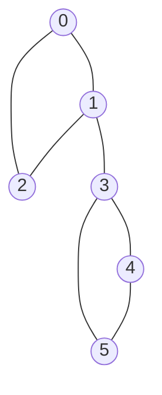

# 🔩 Articulation Points and Bridges

> [!abstract] TL;DR
> In an **undirected** graph, an **articulation point** (cut vertex) is a vertex whose removal **increases the number of connected components** — a single point of failure. A **bridge** (cut edge) is an edge whose removal does the same. Both are found in a **single [[DFS]]** using **discovery times** `disc[]` and **low-link** values `low[]`. The rule for a bridge `(u,v)` (with `u` the parent) is `low[v] > disc[u]`; the articulation-point rule is nearly identical with a special case for the DFS root.

---

## Intuition — Analogy First

Imagine a **network of islands connected by bridges**. A **bridge** is a link so critical that if it collapses, some islands are cut off entirely — there's no alternate route. An **articulation point** is an island whose destruction (say a hub airport) strands other islands from each other.

During a depth-first walk you keep a stopwatch: `disc[v]` is the timestamp you *first* stepped onto island `v`. The key insight is `low[v]` — the **earliest-discovered island** you can slip back to from `v`'s subtree using **tree edges plus one back edge**. If, from everything below `v`, the earliest you can climb back to is *still `v` or later* (`low[v] ≥ disc[v]`), then `v`'s only lifeline to the rest of the graph runs **through its parent** — cut that link (or that parent) and the subtree is marooned. That "can I escape my subtree without going through my parent?" question is the whole algorithm.

---

## How It Works + Mermaid

**Definitions during DFS from a root**
- `disc[v]` — discovery time (order first visited).
- `low[v]` — `min` of: `disc[v]`, `disc[w]` for every **back edge** `(v,w)`, and `low[c]` for every **child** `c` in the DFS tree.

**Bridge rule.** For a tree edge `u → v` (u is v's DFS parent):
```
(u, v) is a BRIDGE  ⇔  low[v] > disc[u]
```
Meaning: nothing in `v`'s subtree can reach `u` or anything above it *except through this very edge*.

**Articulation-point rules.**
- **Non-root `u`** is an articulation point ⇔ it has a child `v` with `low[v] ≥ disc[u]` (the subtree can't bypass `u`).
- **Root** of the DFS tree is an articulation point ⇔ it has **≥ 2 DFS-tree children** (it joins otherwise-separate subtrees).

Note the subtle difference: bridges use strict `>`, articulation points use `≥`.



- Cycle `0-1-2-0` and cycle `3-4-5-3` are joined only through vertex `1` and edge `1-3`.
- **Bridge:** `(1,3)` — removing it splits `{0,1,2}` from `{3,4,5}`.
- **Articulation points:** `1` and `3` — removing either disconnects the graph.
- Edges inside a cycle (e.g. `0-1`) are **not** bridges because a back edge provides an alternate route.

---

## Complexity Analysis

| Quantity | Value | Notes |
|----------|-------|-------|
| Time | O(V + E) | Single DFS over the whole graph |
| Space | O(V + E) | Adjacency list + `disc`/`low` arrays + recursion stack |
| Bridges found | up to O(E) | A tree (no cycles) has every edge a bridge |
| Articulation points | up to O(V) | A path graph makes every internal vertex a cut vertex |

The `low`-link machinery is the **undirected cousin** of [[Strongly_Connected_Components|Tarjan's SCC]] algorithm — same discovery/low-link idea, different acceptance condition. Grouping edges by bridges yields **2-edge-connected components**; grouping by articulation points yields **biconnected components (blocks)**.

---

## Python Implementation

```python
from collections import defaultdict
from typing import Dict, List, Set, Tuple

def find_bridges_and_articulation(
    graph: Dict[int, List[int]], n: int
) -> Tuple[List[Tuple[int, int]], Set[int]]:
    """
    Returns (bridges, articulation_points) for an undirected graph.
    Single DFS, O(V + E).
    """
    disc = [-1] * n          # discovery time, -1 = unvisited
    low = [0] * n
    timer = [0]
    bridges: List[Tuple[int, int]] = []
    articulation: Set[int] = set()

    def dfs(u: int, parent: int) -> None:
        disc[u] = low[u] = timer[0]
        timer[0] += 1
        children = 0                       # count of DFS-tree children of u

        for v in graph[u]:
            if v == parent:
                continue                   # skip the edge we came in on (once)
            if disc[v] == -1:              # tree edge -> recurse
                children += 1
                dfs(v, u)
                low[u] = min(low[u], low[v])

                # bridge test (strict >)
                if low[v] > disc[u]:
                    bridges.append((u, v))

                # articulation test for a NON-root (>=)
                if parent != -1 and low[v] >= disc[u]:
                    articulation.add(u)
            else:                          # back edge -> update low with disc[v]
                low[u] = min(low[u], disc[v])

        # articulation test for the ROOT: 2+ DFS children
        if parent == -1 and children > 1:
            articulation.add(u)

    for start in range(n):
        if disc[start] == -1:
            dfs(start, -1)

    return bridges, articulation


# ---- Example ----
edges = [(0,1),(1,2),(2,0),(1,3),(3,4),(4,5),(5,3)]
g = defaultdict(list)
for a, b in edges:
    g[a].append(b)
    g[b].append(a)

bridges, aps = find_bridges_and_articulation(g, 6)
print(bridges)   # [(1, 3)]
print(sorted(aps))  # [1, 3]
```

> Note: with multi-edges (two edges between the same pair), pass an **edge id** instead of `parent` so the second parallel edge is not skipped — it can serve as an escape route.

---

## Dry Run / Trace

Graph: triangle `0-1-2-0`, then `1-3`, triangle `3-4-5-3`. DFS from `0`:

```
disc: assign as we visit
0: disc=low=0
 1: disc=low=1
  2: disc=low=2 ; back edge 2→0 -> low[2]=min(2, disc[0]=0)=0
  back in 1: low[1]=min(1, low[2]=0)=0
  edge 1→3 (tree):
   3: disc=low=3
    4: disc=low=4
     5: disc=low=5 ; back edge 5→3 -> low[5]=min(5, disc[3]=3)=3
     back in 4: low[4]=min(4, low[5]=3)=3
     bridge test (4,5): low[5]=3 > disc[4]=4 ? NO
    back in 3: low[3]=min(3, low[4]=3)=3
    bridge test (3,4): low[4]=3 > disc[3]=3 ? NO
   back in 1: low[1]=min(0, low[3]=3)=0
   bridge test (1,3): low[3]=3 > disc[1]=1 ? YES -> BRIDGE (1,3) ✅
   AP test at 1 (non-root): low[3]=3 >= disc[1]=1 ? YES -> AP {1} ✅
 back in 0: bridge (0,1)? low[1]=0 > disc[0]=0 ? NO
0 is root; children of 0 in DFS tree = 1 -> not an AP by root rule
(AP 3 detected via child 4: low[4]=3 >= disc[3]=3 -> AP {3}) ✅
```
Result: bridge `(1,3)`; articulation points `{1, 3}`.

---

## Patterns & LeetCode Applications

| Problem | LC # | Angle |
|---------|------|-------|
| Critical Connections in a Network | 1192 | **Find all bridges** — verbatim application |
| Minimize Malware Spread | 924 | Removing a cut vertex isolates infected clusters |
| Redundant Connection | 684 | Non-bridge edges are the "redundant" ones in a cycle |
| Network reliability / SPOF analysis | — | Articulation points = single points of failure |
| Biconnected components / 2-edge-connected components | — | Group edges between consecutive bridges |
| Road/utility resilience planning | — | Which links, if cut, strand a region |

**Meta-pattern:** any question about "which single vertex/edge, if removed, disconnects the graph" or "which connections are critical/redundant" is a `disc`/`low` DFS.

---

## Common Pitfalls

1. **`>` vs `≥`:** bridges use **strict** `low[v] > disc[u]`; articulation points use `low[v] ≥ disc[u]`. Swapping them is the #1 bug.
2. **Root special case:** the DFS root is an articulation point **only** if it has ≥ 2 tree children — the general non-root rule doesn't apply to it.
3. **Updating `low` with `low[v]` for back edges:** for a **back edge** use `disc[v]`, not `low[v]` (mirrors Tarjan's SCC subtlety).
4. **Parallel edges:** skipping the parent by *vertex* wrongly ignores a second edge to the parent that provides redundancy — track by edge id instead.
5. **Disconnected graphs:** loop over all vertices as DFS roots so every component is covered.
6. **Recursion depth:** deep/large graphs overflow Python's default limit — raise it or go iterative.

---

## Related Concepts

- [[_MOC_Graphs|↑ Section MOC]]
- [[DFS]] — the single traversal that computes `disc` and `low`
- [[Strongly_Connected_Components]] — Tarjan's directed analogue of the same low-link idea
- [[Union_Find]] — alternative for *offline* connectivity / detecting non-bridge cycle edges
- [[Graph_Representation]] — undirected adjacency lists with edge ids for multigraphs

---

## Review Questions

1. **Define `low[v]` precisely and explain why `low[v] > disc[u]` characterizes a bridge but `low[v] ≥ disc[u]` characterizes an articulation point.**
2. **Why does the DFS root require a separate articulation-point rule (≥ 2 children) instead of the general one?**
3. **Give a small graph where an edge lies on a cycle and is therefore *not* a bridge; show which back edge saves it.**

---

## Sources

- CLRS — *Introduction to Algorithms*, Ch. 22 (Elementary Graph Algorithms)
- Tarjan (1972) — *Depth-First Search and Linear Graph Algorithms*
- [CP-Algorithms — Finding Bridges](https://cp-algorithms.com/graph/bridge-searching.html)
- [CP-Algorithms — Finding Articulation Points](https://cp-algorithms.com/graph/cutpoints.html)
- LeetCode #1192, #924, #684

#articulationpoints #bridges #graphs #dfs #lowlink #connectivity
