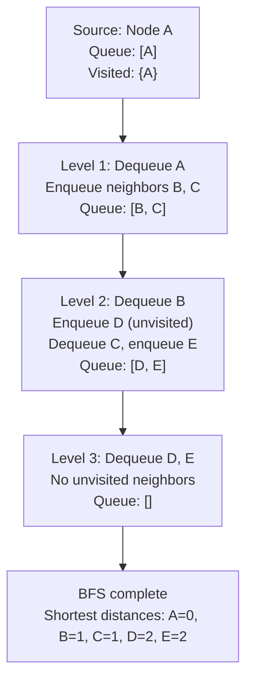

---
title: Breadth-First Search
aliases: [BFS, Breadth First Search, Level Order Traversal]
tags: [DSA, Graphs, BFS, ShortestPath]
domain: DSA
difficulty: Beginner
created: 2026-07-26
related: [DFS, Queue, Dijkstra, Graph_Representation]
status: complete
---

# 🌊 Breadth-First Search (BFS)

> [!abstract] TL;DR
> BFS explores a graph **level by level** using a queue, guaranteeing the **shortest path** in unweighted graphs. Time and space are O(V+E). Key variants: multi-source BFS (multiple starting nodes simultaneously), 0-1 BFS (deque for 0/1 weighted edges), and grid BFS (four/eight directions). Whenever a problem asks for "minimum steps," "fewest moves," or "shortest path in an unweighted graph," BFS is the answer.

---

## Intuition — Analogy First

Drop a stone in a still pond. Ripples spread outward in **concentric circles** — all points at distance 1 from the drop are reached before any point at distance 2, all at distance 2 before distance 3, and so on.

BFS works the same way. Start at a source node (the drop). Visit all nodes 1 hop away (first ring), then all nodes 2 hops away (second ring), and so on. The first time you reach a node, you've found the shortest path to it — you can't arrive sooner because you expand all closer nodes first.

This is exactly why BFS guarantees shortest paths in unweighted graphs. Dijkstra is BFS's weighted generalization (replacing the queue with a priority queue).

---

## How It Works

1. Initialize a queue with the source node(s). Mark source as visited.
2. While the queue is not empty:
   a. Dequeue the front node `u`.
   b. For each unvisited neighbor `v` of `u`:
      - Mark `v` as visited.
      - Record `v`'s parent as `u` (for path reconstruction).
      - Enqueue `v`.
3. Each "round" of the queue (processing all nodes enqueued at a given step) corresponds to one level/distance from the source.

**Why use a queue (FIFO)?** Nodes are processed in the order they were discovered. First in, first out ensures we finish processing level d before starting level d+1. Using a stack instead gives DFS.



---

## Complexity Analysis

| Metric        | Value   | Explanation                                        |
|--------------|---------|----------------------------------------------------|
| Time         | O(V+E)  | Each vertex enqueued once; each edge examined once |
| Space        | O(V)    | Queue + visited set, up to V nodes in queue        |
| Shortest path | O(V+E) | Same traversal; reconstruct via parent pointers    |
| Multi-source  | O(V+E) | All sources added to queue at start; same complexity|
| Grid BFS (R×C)| O(R×C) | V = R×C cells, E = O(R×C) for 4-directional       |

---

## Implementation (Python)

```python
from collections import deque

# ─── 1. BFS on a graph (adjacency list) ─────────────────────────────────────

def bfs(graph, start):
    """
    Visits all reachable nodes from start.
    graph: dict of {node: [neighbors]}
    Returns: dict of {node: distance_from_start}
    """
    distances = {start: 0}
    queue = deque([start])

    while queue:
        node = queue.popleft()
        for neighbor in graph[node]:
            if neighbor not in distances:
                distances[neighbor] = distances[node] + 1
                queue.append(neighbor)

    return distances


graph = {
    'A': ['B', 'C'],
    'B': ['A', 'D', 'E'],
    'C': ['A', 'F'],
    'D': ['B'],
    'E': ['B', 'F'],
    'F': ['C', 'E'],
}
print(bfs(graph, 'A'))
# {'A': 0, 'B': 1, 'C': 1, 'D': 2, 'E': 2, 'F': 2}


# ─── 2. BFS Shortest Path with path reconstruction ──────────────────────────

def bfs_shortest_path(graph, start, end):
    """Returns the shortest path from start to end, or [] if unreachable."""
    if start == end:
        return [start]

    parent = {start: None}
    queue = deque([start])

    while queue:
        node = queue.popleft()
        for neighbor in graph[node]:
            if neighbor not in parent:
                parent[neighbor] = node
                if neighbor == end:
                    # Reconstruct path
                    path = []
                    cur = end
                    while cur is not None:
                        path.append(cur)
                        cur = parent[cur]
                    return path[::-1]
                queue.append(neighbor)

    return []  # Unreachable

print(bfs_shortest_path(graph, 'A', 'F'))  # ['A', 'C', 'F']


# ─── 3. BFS on Grid (4-directional) ─────────────────────────────────────────

def bfs_grid(grid, start, end):
    """
    Shortest path in a binary grid (0=open, 1=wall).
    grid: 2D list. start/end: (row, col) tuples.
    Returns: minimum steps, or -1 if unreachable.
    """
    rows, cols = len(grid), len(grid[0])
    sr, sc = start
    er, ec = end

    if grid[sr][sc] == 1 or grid[er][ec] == 1:
        return -1

    directions = [(0,1),(0,-1),(1,0),(-1,0)]
    visited = {start}
    queue = deque([(sr, sc, 0)])  # (row, col, steps)

    while queue:
        r, c, steps = queue.popleft()
        if (r, c) == end:
            return steps
        for dr, dc in directions:
            nr, nc = r + dr, c + dc
            if 0 <= nr < rows and 0 <= nc < cols and (nr, nc) not in visited and grid[nr][nc] == 0:
                visited.add((nr, nc))
                queue.append((nr, nc, steps + 1))

    return -1


grid = [
    [0, 0, 0, 0],
    [1, 1, 0, 1],
    [0, 0, 0, 0],
    [0, 1, 1, 0],
]
print(bfs_grid(grid, (0, 0), (3, 3)))  # 7


# ─── 4. Multi-Source BFS ─────────────────────────────────────────────────────
# Classic: "Rotting Oranges" (LC 994)
# All rotten oranges rot their fresh neighbors simultaneously each minute.

def oranges_rotting(grid):
    rows, cols = len(grid), len(grid[0])
    queue = deque()
    fresh = 0

    # Seed BFS with ALL rotten oranges at once
    for r in range(rows):
        for c in range(cols):
            if grid[r][c] == 2:
                queue.append((r, c, 0))  # (row, col, time)
            elif grid[r][c] == 1:
                fresh += 1

    if fresh == 0:
        return 0

    directions = [(0,1),(0,-1),(1,0),(-1,0)]
    max_time = 0

    while queue:
        r, c, time = queue.popleft()
        for dr, dc in directions:
            nr, nc = r + dr, c + dc
            if 0 <= nr < rows and 0 <= nc < cols and grid[nr][nc] == 1:
                grid[nr][nc] = 2       # Mark rotten
                fresh -= 1
                max_time = max(max_time, time + 1)
                queue.append((nr, nc, time + 1))

    return max_time if fresh == 0 else -1


# ─── 5. Level-by-level BFS (when level separation matters) ──────────────────

def bfs_by_level(graph, start):
    """Processes nodes level by level; useful for word ladder, min turns problems."""
    visited = {start}
    current_level = [start]
    level = 0

    while current_level:
        next_level = []
        for node in current_level:
            for neighbor in graph.get(node, []):
                if neighbor not in visited:
                    visited.add(neighbor)
                    next_level.append(neighbor)
        print(f"Level {level}: {current_level}")
        current_level = next_level
        level += 1


# ─── 6. 0-1 BFS (deque for 0-weight and 1-weight edges) ─────────────────────
# When edges are either weight 0 or weight 1:
# - 0-weight edges: push to front of deque (free moves)
# - 1-weight edges: push to back of deque (costly moves)
# Gives shortest path in O(V+E), faster than Dijkstra's O((V+E) log V)

def bfs_01(graph_01, start, n):
    """
    graph_01[u] = [(v, w)] where w is 0 or 1.
    Returns shortest distances from start.
    """
    INF = float('inf')
    dist = [INF] * n
    dist[start] = 0
    dq = deque([start])

    while dq:
        u = dq.popleft()
        for v, w in graph_01[u]:
            if dist[u] + w < dist[v]:
                dist[v] = dist[u] + w
                if w == 0:
                    dq.appendleft(v)   # Free move — process next
                else:
                    dq.append(v)       # Costly move — process later

    return dist
```

---

## Dry Run / Example Trace

**BFS on graph: `{A:[B,C], B:[D,E], C:[F], D:[], E:[F], F:[]}`  from A:**

| Queue (front → back) | Dequeued | Action               | Distances         |
|---------------------|----------|----------------------|-------------------|
| [A]                 | A        | Enqueue B(dist=1), C(dist=1) | A:0      |
| [B, C]              | B        | Enqueue D(dist=2), E(dist=2) | B:1      |
| [C, D, E]           | C        | Enqueue F(dist=2)    | C:1               |
| [D, E, F]           | D        | No unvisited neighbors | D:2             |
| [E, F]              | E        | F already visited    | E:2               |
| [F]                 | F        | No unvisited neighbors | F:2             |
| []                  | —        | Done                 |                   |

Result: `{A:0, B:1, C:1, D:2, E:2, F:2}`. Path A→F: `A→C→F` (length 2).

---

## Patterns & LeetCode Applications

| Problem | # | BFS Variant | Key Insight |
|---------|---|-------------|-------------|
| Binary Tree Level Order Traversal | 102 | Level BFS | Process queue size per level |
| Shortest Path in Binary Matrix | 1091 | Grid BFS | 8-directional movement |
| Rotting Oranges | 994 | Multi-source BFS | Seed with all sources |
| Word Ladder | 127 | Implicit graph BFS | Each word = node; 1-letter diff = edge |
| Walls and Gates | 286 | Multi-source BFS | Seed BFS with all gate cells |
| Jump Game III | 1306 | BFS on index graph | Neighbors are i±arr[i] |
| Minimum Knight Moves | 1197 | Grid BFS | 8 possible L-shaped moves |
| Open the Lock | 752 | State BFS | Each lock state = node |
| Snakes and Ladders | 909 | BFS on state | Board cell = node |
| Pacific Atlantic Water Flow | 417 | Multi-source BFS | From both oceans inward |

---

## Common Pitfalls

1. **Marking visited before enqueuing, not after dequeuing**: If you mark visited only when dequeuing, the same node can be enqueued multiple times before it's processed. Always mark as visited (or set distance) at the moment you enqueue.

2. **Using a list instead of deque**: `queue.pop(0)` on a Python list is O(n) because every element shifts. Always use `collections.deque` with `popleft()` for O(1) dequeue.

3. **Multi-source BFS — seeding with all sources at the start**: Don't BFS from each source separately (that's O(S × (V+E))). Add all sources to the queue simultaneously at distance 0 and run a single BFS — this gives "distance to nearest source" for all nodes.

4. **Forgetting to handle disconnected components**: If the graph isn't fully connected, BFS from one source won't visit all nodes. Wrap BFS in a loop over all nodes if you need to process every component.

5. **Grid BFS — mutating the grid to mark visited vs separate set**: Mutating `grid[r][c] = -1` to mark visited is faster but modifies the input. If the problem requires the original grid, use a separate `visited` set.

6. **Word Ladder — building full adjacency list upfront**: For n words of length L, building all pairs costs O(n² × L). Instead, generate all possible one-letter transforms per word and check against a word set — O(n × 26 × L) total, much faster.

---

## Related Concepts

- [[_MOC_Graphs|↑ Section MOC]]
- [[DFS]] — uses a stack instead of queue; not shortest path but uses less memory on sparse graphs
- [[Queue]] — the core data structure enabling BFS's level-by-level behavior
- [[Dijkstra]] — BFS generalized to weighted graphs using a priority queue
- [[Graph_Representation]] — adjacency list is the standard input format for BFS
- [[Topological_Sort]] — Kahn's algorithm is BFS-based (using in-degree counts)

---

## Review Questions

1. BFS guarantees the shortest path in an **unweighted** graph. Why does this guarantee break down for weighted graphs? Construct a small weighted graph where BFS gives the wrong answer, then explain how Dijkstra fixes it.

2. In multi-source BFS (e.g., Rotting Oranges), all source nodes are seeded into the queue at time 0 before BFS begins. Why is this equivalent to adding a virtual "super-source" node with zero-weight edges to each real source? What happens if you run BFS from each source independently and take the minimum?

3. The 0-1 BFS algorithm uses a deque: 0-weight edges go to the front, 1-weight edges go to the back. Explain why this maintains the BFS invariant that nodes are always processed in non-decreasing order of their tentative distances.

---

## Sources

- CLRS Chapter 22.2 — Breadth-First Search
- [NeetCode — Graphs BFS playlist](https://neetcode.io/roadmap)
- LeetCode 994 — [Rotting Oranges](https://leetcode.com/problems/rotting-oranges/)
- LeetCode 127 — [Word Ladder](https://leetcode.com/problems/word-ladder/)
- [CP-Algorithms — BFS](https://cp-algorithms.com/graph/breadth-first-search.html)

#DSA #Graphs #BFS #ShortestPath #Beginner
