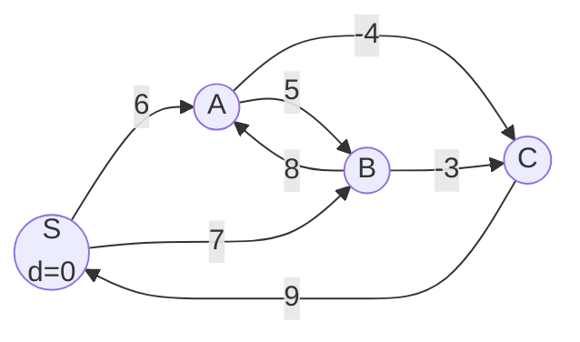

---
title: Bellman-Ford Algorithm
aliases: [Bellman Ford, BF, Negative Weight Shortest Path]
tags: [DSA, Graphs, ShortestPath, DynamicProgramming]
domain: DSA
difficulty: Intermediate
created: 2026-07-26
related: [Dijkstra, Floyd_Warshall, Graph_Representation]
status: complete
---

# 📡 Bellman-Ford Algorithm

> [!abstract] TL;DR
> Bellman-Ford finds single-source shortest paths in graphs with **negative edge weights** (but no negative-weight cycles reachable from the source). It relaxes all edges V-1 times in O(VE). A V-th relaxation that still updates a distance indicates a **negative cycle**. Slower than Dijkstra but far more general.

---

## Intuition — Analogy First

Imagine spreading a rumor through a social network. In **round 1**, only your direct friends hear it. In **round 2**, their friends hear it. After **V-1 rounds**, the rumor has potentially traveled the longest possible simple path (which can have at most V-1 edges). Each round, everyone passes the "best deal" they know to their neighbors.

Now imagine some friendships have "negative cost" — like a discount coupon. After V-1 rounds, everyone knows their cheapest route. If in **round V** someone's cost still decreases... they've found an infinite discount loop — a **negative cycle**. The distance can be made arbitrarily small by going around forever.

---

## How It Works + Mermaid

**Core Algorithm:**
1. Initialize `dist[source] = 0`, all others `= ∞`.
2. Repeat **V-1 times**: for every edge (u, v, w), relax: `if dist[u] + w < dist[v]: dist[v] = dist[u] + w`.
3. One more pass (V-th): if any edge still relaxes, a negative cycle exists.

**Correctness Proof (by induction):**
After k relaxation rounds, `dist[v]` holds the shortest path from source to `v` using **at most k edges**. Base case: k=0, dist[source]=0. Inductive step: if `dist[u]` is correct for k-1 edges, then relaxing (u,v,w) gives the correct answer for paths of k edges ending at v. Since the longest simple path in a V-vertex graph has V-1 edges, V-1 rounds suffice.



**Relaxation Rounds on above graph (source = S):**

| Round | dist[S] | dist[A] | dist[B] | dist[C] |
|-------|---------|---------|---------|---------|
| Init  | 0       | ∞       | ∞       | ∞       |
| 1     | 0       | 6       | 7       | ∞       |
| 2     | 0       | 6       | 7       | 2       |
| 3     | 0       | 6       | 4       | 2       |
| 4     | 0       | 6       | 4       | 2       |

No change in round 4 (V-1=3 rounds were sufficient). No negative cycle.

---

## Complexity Analysis

| Algorithm         | Time      | Space | Notes                                       |
|-------------------|-----------|-------|---------------------------------------------|
| Bellman-Ford      | O(VE)     | O(V)  | Works with negative edges, no neg cycles    |
| Dijkstra (heap)   | O((V+E)logV) | O(V+E) | Faster, but no negative edges             |
| SPFA (optimized)  | O(kE) avg | O(V)  | Bellman-Ford with queue; faster in practice |
| Modified BF (K stops) | O(KE) | O(V)  | Run only K iterations for "at most K edges" |

**SPFA (Shortest Path Faster Algorithm):**
Optimization: only relax edges from nodes whose distance actually changed. Use a queue instead of iterating all edges blindly. Average case much faster than O(VE), but worst case is still O(VE).

---

## Implementation (Python)

```python
from typing import List, Tuple, Optional

def bellman_ford(
    n: int,
    edges: List[Tuple[int, int, int]],  # (u, v, weight)
    source: int
) -> Tuple[List[float], bool]:
    """
    Returns (dist, has_negative_cycle).
    dist[v] = shortest distance from source to v.
    has_negative_cycle = True if a negative cycle is reachable from source.
    """
    INF = float('inf')
    dist = [INF] * n
    dist[source] = 0

    # Relax all edges V-1 times
    for _ in range(n - 1):
        updated = False
        for u, v, w in edges:
            if dist[u] != INF and dist[u] + w < dist[v]:
                dist[v] = dist[u] + w
                updated = True
        if not updated:
            break  # Early termination: converged

    # V-th relaxation: detect negative cycle
    has_negative_cycle = False
    for u, v, w in edges:
        if dist[u] != INF and dist[u] + w < dist[v]:
            has_negative_cycle = True
            break

    return dist, has_negative_cycle


def bellman_ford_with_path(
    n: int,
    edges: List[Tuple[int, int, int]],
    source: int
) -> Tuple[List[float], List[int]]:
    """Bellman-Ford that also tracks predecessors for path reconstruction."""
    INF = float('inf')
    dist = [INF] * n
    prev = [-1] * n
    dist[source] = 0

    for _ in range(n - 1):
        for u, v, w in edges:
            if dist[u] != INF and dist[u] + w < dist[v]:
                dist[v] = dist[u] + w
                prev[v] = u

    return dist, prev


# ---- K-step variant (Cheapest Flights Within K Stops) ----
def cheapest_flights_k_stops(
    n: int,
    flights: List[List[int]],  # [from, to, price]
    src: int,
    dst: int,
    k: int
) -> int:
    """
    Modified Bellman-Ford: run exactly K+1 iterations (at most K stops = K+1 edges).
    CRITICAL: use a copy of dist at start of each round to avoid using
    updates from the SAME round (which would allow > k+1 edges).
    """
    INF = float('inf')
    dist = [INF] * n
    dist[src] = 0

    for _ in range(k + 1):  # at most k+1 edges
        temp = dist[:]       # snapshot — don't use intra-round updates
        for u, v, price in flights:
            if dist[u] != INF and dist[u] + price < temp[v]:
                temp[v] = dist[u] + price
        dist = temp

    return dist[dst] if dist[dst] != INF else -1


# ---- SPFA Optimization ----
from collections import deque

def spfa(
    graph: dict,  # adj list: node -> [(neighbor, weight)]
    n: int,
    source: int
) -> Tuple[List[float], bool]:
    """SPFA: Bellman-Ford with queue for faster average performance."""
    INF = float('inf')
    dist = [INF] * n
    in_queue = [False] * n
    count = [0] * n  # times each node has been relaxed
    dist[source] = 0

    q = deque([source])
    in_queue[source] = True

    while q:
        u = q.popleft()
        in_queue[u] = False

        for v, w in graph.get(u, []):
            if dist[u] + w < dist[v]:
                dist[v] = dist[u] + w
                count[v] += 1
                if count[v] >= n:
                    return dist, True  # negative cycle
                if not in_queue[v]:
                    q.append(v)
                    in_queue[v] = True

    return dist, False
```

---

## Dry Run / Example Trace

**Graph:** 4 nodes, edges: (0→1, w=1), (0→2, w=4), (1→2, w=-3), (1→3, w=2), (2→3, w=3)  
**Source:** 0

```
Initial: dist = [0, inf, inf, inf]

Round 1 — relax all edges:
  (0→1, 1): dist[1] = min(inf, 0+1) = 1
  (0→2, 4): dist[2] = min(inf, 0+4) = 4
  (1→2,-3): dist[2] = min(4, 1-3) = -2
  (1→3, 2): dist[3] = min(inf, 1+2) = 3
  (2→3, 3): dist[3] = min(3, -2+3) = 1
  dist = [0, 1, -2, 1]

Round 2 — no changes (all paths already optimal)
  dist = [0, 1, -2, 1]

Round 3 (V-1=3) — no changes.

Negative cycle check (Round 4): no edge improves → NO negative cycle.
Final: dist = [0, 1, -2, 1]
```

---

## Patterns & LeetCode Applications

| Problem                           | LC #  | Key Insight                                             |
|-----------------------------------|-------|---------------------------------------------------------|
| Cheapest Flights Within K Stops   | 787   | BF with exactly K+1 iterations; copy dist each round   |
| Find Negative Cycle               | —     | Check V-th relaxation round                             |
| Bellman-Ford vs Dijkstra choice   | —     | Negative edges → BF; non-negative → Dijkstra            |
| Currency Arbitrage                | —     | Take log of exchange rates; negative cycle = arbitrage  |
| Network with Negative Delays      | —     | BF when weights can be negative                         |

**When to use Bellman-Ford over Dijkstra:**
- Graph has negative edge weights
- Need to detect negative cycles
- Need shortest path with at most K edges (modified K-iteration BF)
- Graph is small enough that O(VE) is acceptable

---

## Common Pitfalls

1. **Not copying dist in K-stops variant:** Using the same `dist` array intra-round allows paths of more than K+1 edges in a single iteration — wrong answer.
2. **Reachability from source:** BF only detects negative cycles reachable from source. Unreachable negative cycles don't affect correctness.
3. **Forgetting `dist[u] != INF` guard:** Relaxing from an unreachable node (`INF + w` overflows in fixed-size integers; Python floats handle it correctly but the logic is wrong).
4. **Edge direction:** In undirected graphs, add both (u,v,w) and (v,u,w) to the edge list.
5. **Early termination:** If no update happens in a round, you can break early — important optimization for sparse graphs.

---

## Related Concepts

- [[_MOC_Graphs|↑ Section MOC]]
- [[Dijkstra]] — faster (O((V+E)logV)) but requires non-negative weights
- [[Floyd_Warshall]] — all-pairs version, also handles negative edges, O(V³)
- [[Graph_Representation]] — BF iterates over an explicit edge list, not adjacency list

---

## Review Questions

1. **Why does Bellman-Ford need exactly V-1 relaxation rounds?** What property of simple paths guarantees this is sufficient?
2. **Explain the "copy dist" trick in the K-stops variant of Bellman-Ford.** What goes wrong if you update `dist` in-place within the same round?
3. **SPFA achieves better average-case performance than standard Bellman-Ford. What is its worst-case time complexity, and on what type of graph does it degenerate to that?**

---

## Sources

- CLRS — Introduction to Algorithms, Ch. 24.1 (The Bellman-Ford Algorithm)
- [CP-Algorithms — Bellman-Ford](https://cp-algorithms.com/graph/bellman_ford.html)
- LeetCode #787 (Cheapest Flights Within K Stops)
- [NeetCode — Graph Series](https://neetcode.io)

#bellmanford #graphs #shortestpath #negativeedges #dynamicprogramming
