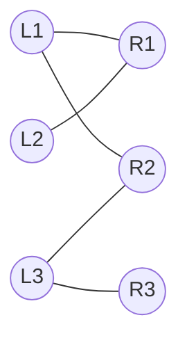

# 💞 Bipartite Matching

> [!abstract] TL;DR
> A **matching** is a set of edges with no shared endpoints. In a **bipartite** graph (vertices split into two sides `L` and `R`, edges only crossing between them), the **maximum matching** pairs up as many `L`–`R` vertices as possible. **Kuhn's algorithm** finds it by repeatedly searching for **augmenting paths** with [[DFS]], in **O(V·E)**. **Hopcroft-Karp** speeds this to **O(E·√V)**. Deep theory: **König's theorem** (max matching = min vertex cover in bipartite graphs) and **Hall's marriage theorem** (when a perfect matching exists). Matching also reduces directly to [[Network_Flow]].

---

## Intuition — Analogy First

Think of **job assignment**: candidates on the left, jobs on the right, an edge if a candidate is qualified for a job. You want to fill as many jobs as possible with one candidate each.

Greedily pairing people leaves you stuck: candidate A took job 1, but now candidate B (who *only* qualifies for job 1) is unemployed — even though A also qualified for job 2. The fix is an **augmenting path**: start from unmatched B, walk to job 1, "bump" A off it, send A to job 2 instead. This alternating chain — *unmatched → matched → unmatched → …* — ends at a free job and flips every edge along it, **increasing the total matches by exactly one**. Keep finding such chains until none remain; you've reached the maximum. It's the same "undo a past choice to do better" idea as residual edges in flow, just specialized.

---

## How It Works + Mermaid

**Augmenting-path characterization (Berge's lemma).** A matching is maximum **iff** the graph contains **no augmenting path** — an alternating path that starts and ends at unmatched vertices.

**Kuhn's algorithm**
```
match_R[r] = None for all right vertices
for each left vertex u:
    reset "visited" for right vertices
    try_kuhn(u)              # DFS for an augmenting path from u

try_kuhn(u):
    for each right neighbor v of u:
        if v not visited:
            mark v visited
            if match_R[v] is None or try_kuhn(match_R[v]):
                match_R[v] = u     # (re)assign v to u
                return True
    return False
```
Each successful `try_kuhn` augments the matching by one edge. At most `|L|` DFS calls, each O(E) → **O(V·E)**.

**Hopcroft-Karp** (mention): alternates a **[[BFS]] phase** (build layered graph, find *all* shortest augmenting paths at once) with a **DFS phase** (augment along them), giving **O(E·√V)** — the fastest general bipartite matcher.



Matching `L1–R1`, `L3–R2` leaves `L2` and `R3` free. Augmenting path from `L2`: `L2 → R1` (matched to L1) → bump `L1 → R2` (matched to L3) → bump `L3 → R3` (free!). Flip all edges → new matching `L2–R1, L1–R2, L3–R3`, size **3** (perfect).

---

## Complexity Analysis

| Algorithm | Time | Space | Notes |
|-----------|------|-------|-------|
| **Kuhn** (DFS augmenting paths) | O(V·E) | O(V+E) | Simple; great up to ~10⁴ vertices |
| **Hopcroft-Karp** | O(E·√V) | O(V+E) | Batch shortest augmenting paths |
| Via [[Network_Flow]] (Dinic) | O(E·√V) | O(V+E) | Unit-capacity flow = Hopcroft-Karp |
| Hungarian (weighted) | O(V³) | O(V²) | Min-cost **assignment**, not just cardinality |

**König's theorem** (bipartite only): `max matching = min vertex cover`. Consequently `max independent set = V − max matching`. This turns many covering/independence problems into matching.

**Hall's marriage theorem:** a perfect matching saturating `L` exists **iff** for every subset `S ⊆ L`, `|N(S)| ≥ |S|` (every group of candidates collectively qualifies for at least as many jobs).

---

## Python Implementation

```python
from collections import defaultdict
from typing import Dict, List

def kuhn_max_matching(
    adj: Dict[int, List[int]],   # adj[u] = right-vertices reachable from left u
    left_n: int,
    right_n: int,
) -> Dict[int, int]:
    """
    Maximum bipartite matching via Kuhn's augmenting-path DFS. O(V * E).
    Returns match_R: right-vertex -> matched left-vertex.
    """
    match_R = [-1] * right_n          # which left vertex owns each right vertex

    def try_augment(u: int, visited: List[bool]) -> bool:
        for v in adj[u]:
            if not visited[v]:
                visited[v] = True
                # v is free, OR its current owner can be rehoused elsewhere
                if match_R[v] == -1 or try_augment(match_R[v], visited):
                    match_R[v] = u
                    return True
        return False

    matching_size = 0
    for u in range(left_n):
        visited = [False] * right_n   # fresh visited set per left vertex
        if try_augment(u, visited):
            matching_size += 1

    # build result dict of matched pairs
    result = {v: match_R[v] for v in range(right_n) if match_R[v] != -1}
    return result


# ---- Example ----
# Left {0,1,2}, Right {0,1,2}
adj = {
    0: [0, 1],
    1: [0],
    2: [1, 2],
}
m = kuhn_max_matching(adj, left_n=3, right_n=3)
print(m)              # {0: 1, 1: 0, 2: 2}  (right -> left)  size 3
print(len(m))         # 3  (perfect matching)
```

---

## Dry Run / Trace

Left `{0,1,2}`, edges `0-{r0,r1}`, `1-{r0}`, `2-{r1,r2}`. Kuhn:

```
u=0: visited reset; r0 free -> match_R[0]=0        matching={r0:L0}
u=1: visited reset; r0 taken by L0 -> recurse try(L0):
        L0's other edge r1 free -> match_R[1]=0    (rehouse L0 to r1)
     back: match_R[0]=1                             matching={r0:L1, r1:L0}
u=2: visited reset; r1 taken by L0 -> recurse try(L0):
        L0's edges r0 (taken by L1) -> try(L1): L1 only edge r0, r0 visited -> fail
        L0 has no other option -> fail
     L2's next edge r2 free -> match_R[2]=2         matching={r0:L1, r1:L0, r2:L2}
Result: 3 pairs -> PERFECT matching
```

---

## Patterns & LeetCode Applications

| Problem | LC # | Matching Angle |
|---------|------|----------------|
| Maximum Students Taking Exam | 1349 | [[Bitmask_DP\|Bitmask DP]] *or* matching of compatible seats |
| Broken Calculator / task assignment | — | Assign workers ↔ tasks, maximize completions |
| Minimum Number of Lines / cover problems | — | König: min cover = max matching |
| Campus Bikes II | 1066 | Weighted assignment (Hungarian / min-cost flow) |
| Maximum Number of Accepted Invitations | 1820 | Direct max bipartite matching |
| Domino / board tiling | — | Cells 2-colored → dominoes = matching edges |

**Meta-pattern:** "assign items of set A to items of set B, at most one-to-one, maximize pairs (or minimize cost)" is bipartite matching. Board-tiling and independent-set/cover problems on bipartite structure also reduce here via König.

---

## Common Pitfalls

1. **Resetting `visited` at the wrong scope.** `visited` must be reset **once per left vertex** (before each top-level `try_augment`), not inside the recursion.
2. **Confusing which side `match_R` indexes.** Keep a single convention (here: right → left) to avoid double-booking.
3. **Applying König/Hall to non-bipartite graphs.** Both theorems hold **only** for bipartite graphs; general max matching needs Blossom's algorithm.
4. **Recursion depth** on large left sides — raise the limit or use Hopcroft-Karp/flow.
5. **Weighted vs cardinality:** Kuhn maximizes the *number* of pairs, not total weight — use the Hungarian algorithm or min-cost max-flow for weighted assignment.
6. **Directed edges:** matching needs the bipartite adjacency `left → right`; don't feed it a symmetric undirected list without partitioning the sides first.

---

## Related Concepts

- [[_MOC_Graphs|↑ Section MOC]]
- [[Network_Flow]] — matching reduces to unit-capacity max-flow; Dinic ≈ Hopcroft-Karp
- [[DFS]] — the augmenting-path search inside Kuhn's algorithm
- [[BFS]] — powers Hopcroft-Karp's layered shortest-augmenting-path phase
- [[Graph_Representation]] — bipartite adjacency lists partitioned into L and R

---

## Review Questions

1. **State Berge's lemma and use it to argue Kuhn's algorithm terminates at a maximum matching.** What does an augmenting path do to the matching size?
2. **Explain König's theorem and give one problem it converts from "minimum cover" into "maximum matching".**
3. **Show the reduction from maximum bipartite matching to max-flow:** what are the source, sink, and edge capacities, and why does an integral max flow give a valid matching?

---

## Sources

- CLRS — *Introduction to Algorithms*, Ch. 26.3 (Maximum Bipartite Matching)
- Hopcroft & Karp (1973); Kuhn / König / Hall classical results
- [CP-Algorithms — Kuhn's Algorithm for Maximum Bipartite Matching](https://cp-algorithms.com/graph/kuhn_maximum_bipartite_matching.html)
- [CP-Algorithms — Hopcroft-Karp](https://cp-algorithms.com/graph/hopcroft_karp.html)
- LeetCode #1349, #1820, #1066

#bipartitematching #matching #graphs #kuhn #hopcroftkarp #konig #hall
