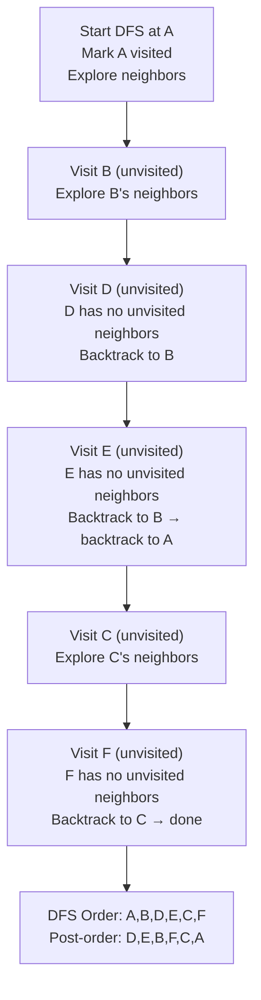

---
title: Depth-First Search
aliases: [DFS, Depth First Search, Graph DFS]
tags: [DSA, Graphs, DFS, Backtracking]
domain: DSA
difficulty: Beginner
created: 2026-07-26
related: [BFS, Stack, Topological_Sort, Union_Find]
status: complete
---

# 🌲 Depth-First Search (DFS)

> [!abstract] TL;DR
> DFS explores as far as possible along each path before backtracking. Time and space are O(V+E). Use the **recursive** version for clean code; use the **iterative** (explicit stack) version to avoid Python's recursion limit. DFS is the foundation for cycle detection, topological sort, connected components, flood fill, and backtracking. Whenever you need to explore all possibilities or paths, DFS is the tool.

---

## Intuition — Analogy First

Imagine **exploring a maze by always turning left**. You commit fully to one path, going deeper and deeper until you hit a dead end. Then you backtrack to the last junction and take the next available turn. You never revisit a path you've already fully explored. Eventually, you've seen every reachable part of the maze.

This is DFS. The "always turn left" rule is the stack — it remembers where you came from so you can backtrack. The key difference from BFS (which explores all corridors at the current depth before going deeper) is that DFS commits to one full path before trying alternatives.

**Pre-order DFS:** "Note this room when I first enter." (Used for copying, pathfinding)
**Post-order DFS:** "Note this room when I leave and all sub-paths are exhausted." (Used for topological sort, cycle detection)

---

## How It Works

### Recursive DFS
1. Mark current node as visited.
2. Record entry time (optional, for cycle detection / topological sort).
3. Recurse on each unvisited neighbor.
4. Record exit/finish time (post-order).

### Iterative DFS (explicit stack)
1. Push source to stack. Mark as visited.
2. While stack is not empty:
   a. Pop node `u`.
   b. For each unvisited neighbor `v`: mark visited, push `v`.
3. **Note:** iterative DFS visits neighbors in reverse order compared to recursive DFS (LIFO). This matters if order is important.

### DFS Tree Concepts
- **Discovery time (d[u]):** when node u is first visited
- **Finish time (f[u]):** when all descendants of u have been visited
- **Back edge:** edge from u to an ancestor in the DFS tree → **cycle** in directed graph
- **Forward/Cross edge:** appear only in directed graphs



---

## Complexity Analysis

| Metric                  | Value   | Explanation                                      |
|------------------------|---------|--------------------------------------------------|
| Time                   | O(V+E)  | Each vertex and edge visited exactly once        |
| Space (recursive)      | O(V)    | Call stack depth up to V in worst case           |
| Space (iterative)      | O(V)    | Explicit stack can hold up to V nodes            |
| Cycle detection        | O(V+E)  | Same traversal, check for back edges             |
| Connected components   | O(V+E)  | Run DFS for each unvisited node                  |
| Grid DFS (R×C)         | O(R×C)  | V = R×C cells                                    |

---

## Implementation (Python)

```python
# ─── 1. Recursive DFS ────────────────────────────────────────────────────────

def dfs_recursive(graph, start, visited=None):
    """
    DFS traversal. Returns list of nodes in visit order.
    graph: dict of {node: [neighbors]}
    """
    if visited is None:
        visited = set()

    visited.add(start)
    result = [start]

    for neighbor in graph[start]:
        if neighbor not in visited:
            result += dfs_recursive(graph, neighbor, visited)

    return result


graph = {
    0: [1, 2],
    1: [0, 3, 4],
    2: [0, 5],
    3: [1],
    4: [1],
    5: [2],
}
print(dfs_recursive(graph, 0))  # [0, 1, 3, 4, 2, 5]


# ─── 2. Iterative DFS (explicit stack) ──────────────────────────────────────

def dfs_iterative(graph, start):
    """Iterative DFS using an explicit stack."""
    visited = set()
    stack = [start]
    result = []

    while stack:
        node = stack.pop()
        if node in visited:
            continue
        visited.add(node)
        result.append(node)
        # Push neighbors in reverse order to match recursive DFS order
        for neighbor in reversed(graph[node]):
            if neighbor not in visited:
                stack.append(neighbor)

    return result


# ─── 3. DFS for Cycle Detection in Directed Graph ───────────────────────────
#
# Three states per node:
#   WHITE (0): unvisited
#   GRAY  (1): currently being processed (in the current DFS path)
#   BLACK (2): fully processed
#
# A back edge (GRAY → GRAY) means a cycle.

def has_cycle_directed(adj, n):
    """
    adj: adjacency list (dict or list of lists)
    n: number of nodes (0 to n-1)
    Returns: True if directed graph has a cycle.
    """
    WHITE, GRAY, BLACK = 0, 1, 2
    color = [WHITE] * n

    def dfs(u):
        color[u] = GRAY
        for v in adj.get(u, []):
            if color[v] == GRAY:   # Back edge → cycle
                return True
            if color[v] == WHITE and dfs(v):
                return True
        color[u] = BLACK
        return False

    return any(dfs(u) for u in range(n) if color[u] == WHITE)


# ─── 4. DFS for Number of Islands (Grid) ────────────────────────────────────
# Classic flood fill: mark all connected '1's as visited

def num_islands(grid):
    """
    LC 200. grid: List[List[str]] with '1' and '0'.
    Returns number of connected island regions.
    """
    if not grid:
        return 0

    rows, cols = len(grid), len(grid[0])
    count = 0

    def dfs(r, c):
        if r < 0 or r >= rows or c < 0 or c >= cols or grid[r][c] != '1':
            return
        grid[r][c] = '#'   # Mark visited by mutating grid
        dfs(r+1, c)
        dfs(r-1, c)
        dfs(r, c+1)
        dfs(r, c-1)

    for r in range(rows):
        for c in range(cols):
            if grid[r][c] == '1':
                dfs(r, c)
                count += 1

    return count


grid = [
    ["1","1","0","0","0"],
    ["1","1","0","0","0"],
    ["0","0","1","0","0"],
    ["0","0","0","1","1"],
]
print(num_islands([row[:] for row in grid]))  # 3


# ─── 5. DFS with Discovery/Finish Times ─────────────────────────────────────
# Useful for topological sort (post-order) and cycle detection

def dfs_with_timestamps(graph, n):
    visited = [False] * n
    disc = [0] * n    # Discovery time
    fin  = [0] * n    # Finish time
    timer = [0]
    topo_order = []

    def dfs(u):
        visited[u] = True
        timer[0] += 1
        disc[u] = timer[0]

        for v in graph.get(u, []):
            if not visited[v]:
                dfs(v)

        timer[0] += 1
        fin[u] = timer[0]
        topo_order.append(u)   # Post-order → reverse for topo sort

    for u in range(n):
        if not visited[u]:
            dfs(u)

    return disc, fin, topo_order[::-1]


# ─── 6. Connected Components with DFS ───────────────────────────────────────

def count_components(adj, n):
    """Count connected components in undirected graph."""
    visited = [False] * n
    components = 0

    def dfs(u):
        visited[u] = True
        for v in adj.get(u, []):
            if not visited[v]:
                dfs(v)

    for u in range(n):
        if not visited[u]:
            dfs(u)
            components += 1

    return components


# ─── 7. DFS Backtracking Template ───────────────────────────────────────────
# General pattern for permutations, combinations, subsets

def backtrack(path, choices, result):
    """
    Generic DFS backtracking template.
    path: current partial solution
    choices: remaining available options
    result: collect complete solutions
    """
    if is_complete(path):
        result.append(path[:])
        return

    for choice in choices:
        if is_valid(path, choice):
            path.append(choice)            # Make choice
            backtrack(path, choices, result)  # Explore
            path.pop()                     # Undo choice (backtrack)

# is_complete and is_valid are problem-specific
def is_complete(path): pass
def is_valid(path, choice): pass
```

---

## Dry Run / Example Trace

**DFS on directed graph, cycle detection:**
Graph: `0→1, 1→2, 2→0` (cycle), `0→3`

| Step | Node | Color Before | Action           | Color After |
|------|------|-------------|------------------|-------------|
| 1    | 0    | WHITE       | Start DFS, enter | GRAY        |
| 2    | 1    | WHITE       | Visit from 0     | GRAY        |
| 3    | 2    | WHITE       | Visit from 1     | GRAY        |
| 4    | 0    | GRAY        | Edge 2→0 found: 0 is GRAY! | → **CYCLE DETECTED** |

Result: `True`. The back edge 2→0 reveals the cycle 0→1→2→0.

**DFS Order vs BFS Order (same graph `{A:[B,C], B:[D,E], C:[F]}`)**

| Algorithm | Order Visited | Key Property |
|-----------|---------------|--------------|
| DFS       | A, B, D, E, C, F | Deep path before backtracking |
| BFS       | A, B, C, D, E, F | Full level before next level |

---

## Patterns & LeetCode Applications

| Problem | # | DFS Pattern | Key Trick |
|---------|---|-------------|-----------|
| Number of Islands | 200 | Flood fill DFS | Mutate grid to mark visited |
| Clone Graph | 133 | DFS with hash map | Map old node → new node |
| Course Schedule | 207 | Cycle detection | 3-color DFS (WHITE/GRAY/BLACK) |
| Course Schedule II | 210 | Topological sort | Post-order DFS, reverse |
| Pacific Atlantic Water Flow | 417 | Reverse DFS from both coasts | DFS inward from ocean borders |
| Time to Inform Employees | 1376 | Tree DFS, find max depth | DFS accumulating time |
| Word Search | 79 | Grid backtracking DFS | Mark visited, backtrack |
| Path Sum II | 113 | Tree DFS, collect paths | Backtrack path list |
| All Paths Source to Target | 797 | DAG path enumeration | DFS with path tracking |
| Surrounded Regions | 130 | Border-connected DFS | DFS from border 'O's first |

---

## Common Pitfalls

1. **Python recursion limit**: Python's default recursion limit is ~1000. For graphs with thousands of nodes, recursive DFS will hit `RecursionError`. Use iterative DFS or `sys.setrecursionlimit(200000)` (with caution — can crash interpreter).

2. **Forgetting to mark visited BEFORE recursing**: If you mark visited after the recursive call, other paths can reach the same node and cause infinite recursion or revisiting.

3. **Using a visited list vs set**: For dense graphs with integer nodes 0..n-1, a boolean list `visited = [False]*n` is faster than a set. For arbitrary node IDs (strings, tuples), use a set.

4. **Grid DFS out-of-bounds**: Always check bounds before accessing `grid[r][c]`. The base case of the grid DFS should handle out-of-bounds, wall cells, and already-visited cells.

5. **3-color vs 2-color cycle detection**: For **undirected** graphs, a simple visited set suffices — any back-edge (to a visited non-parent) is a cycle. For **directed** graphs, you must use the 3-color approach (WHITE/GRAY/BLACK) because you need to distinguish "in current path" from "fully finished."

6. **Post-order for topological sort**: Topological sort requires nodes to be appended to the result **after** all their neighbors are processed (post-order). Appending in pre-order gives the wrong answer.

---

## Related Concepts

- [[_MOC_Graphs|↑ Section MOC]]
- [[BFS]] — queue-based; finds shortest path in unweighted graphs; DFS finds any path
- [[Stack]] — the implicit (recursive call stack) or explicit data structure behind DFS
- [[Topological_Sort]] — post-order DFS in reverse; only valid on DAGs
- [[Union_Find]] — alternative for connected components (often faster for dynamic graphs)
- [[Backtracking]] — structured form of DFS that undoes choices to explore all possibilities

---

## Review Questions

1. Explain the difference between 2-color and 3-color DFS for cycle detection. Why does the 2-color approach (mark visited/not-visited) correctly detect cycles in undirected graphs but fail for directed graphs? Give a concrete example where it produces a false positive.

2. The iterative DFS using an explicit stack does NOT always produce the same traversal order as recursive DFS. Explain why, and describe a simple modification to the iterative version that restores the same order.

3. In the flood fill / Number of Islands problem, you mutate the input grid (marking `'1'` to `'#'`) to track visited cells. What are the trade-offs of this approach versus maintaining a separate `visited` set, in terms of space, time, and code safety?

---

## Sources

- CLRS Chapter 22.3 — Depth-First Search
- [NeetCode — Graph DFS playlist](https://neetcode.io/roadmap)
- LeetCode 200 — [Number of Islands](https://leetcode.com/problems/number-of-islands/)
- LeetCode 207 — [Course Schedule](https://leetcode.com/problems/course-schedule/)
- [CP-Algorithms — DFS and Topological Sort](https://cp-algorithms.com/graph/depth-first-search.html)

#DSA #Graphs #DFS #Backtracking #CycleDetection #Beginner
