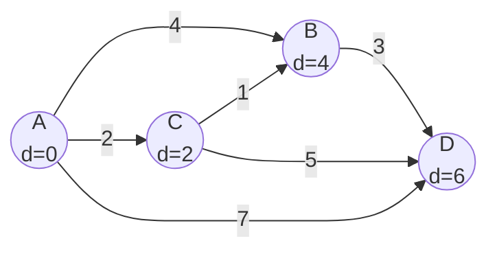

---
title: Dijkstra's Algorithm
aliases: [Dijkstra, Single Source Shortest Path, SSSP]
tags: [DSA, Graphs, ShortestPath, Greedy, PriorityQueue]
domain: DSA
difficulty: Intermediate
created: 2026-07-26
related: [BFS, Bellman_Ford, Priority_Queue, Graph_Representation]
status: complete
---

# 🗺️ Dijkstra's Algorithm

> [!abstract] TL;DR
> Dijkstra finds the shortest path from a single source to all other vertices in a weighted graph with **non-negative edge weights**. It greedily expands the nearest unvisited node using a min-heap, achieving O((V+E) log V) time. It **cannot** handle negative weights — use Bellman-Ford for that.

---

## Intuition — Analogy First

Imagine you are Google Maps routing from your house to every city in a country. You always expand the **closest city you haven't finalized yet**. Once you've locked in a city's shortest distance, it never changes — no shorter path can arrive later because all edge weights are non-negative. You ripple outward like a growing circle on a map, finalizing cities in order of distance from the source.

This greedy "always pick the minimum so far" guarantee is exactly what breaks when negative weights appear — a later edge could make a previously "finalized" city even closer.

---

## How It Works + Mermaid

**Core Steps:**
1. Initialize `dist[source] = 0`, all others `= ∞`.
2. Push `(0, source)` into a min-heap.
3. Pop the smallest `(d, u)`. If `d > dist[u]`, skip (lazy deletion).
4. For each neighbor `v` of `u`: **relax** the edge — if `dist[u] + w(u,v) < dist[v]`, update `dist[v]` and push `(dist[v], v)` to the heap.
5. Repeat until the heap is empty.

**Relaxation formula:**
```
if dist[u] + w(u, v) < dist[v]:
    dist[v] = dist[u] + w(u, v)
    prev[v] = u          # for path reconstruction
```

**Greedy Invariant (correctness proof sketch):**
When a node `u` is popped from the min-heap with distance `d`, `d` is the true shortest distance to `u`. Proof by induction: the first node popped is the source (dist=0, trivially correct). For any subsequent node, any alternative path would have to go through another unprocessed node — but unprocessed nodes have distance ≥ current `d` (min-heap property), and weights are non-negative, so no alternative can be shorter.



**Step-by-step trace (source = A):**

| Step | Popped | dist[A] | dist[B] | dist[C] | dist[D] |
|------|--------|---------|---------|---------|---------|
| Init | —      | 0       | ∞       | ∞       | ∞       |
| 1    | A(0)   | 0       | 4       | 2       | 7       |
| 2    | C(2)   | 0       | 3       | 2       | 7       |
| 3    | B(3)   | 0       | 3       | 2       | 6       |
| 4    | D(6)   | 0       | 3       | 2       | 6       |

Final shortest distances from A: B=3 (via C), C=2, D=6 (via B).

---

## Complexity Analysis

| Variant                    | Time Complexity | Space Complexity | Notes                                        |
|----------------------------|-----------------|------------------|----------------------------------------------|
| Dijkstra (binary heap)     | O((V+E) log V)  | O(V+E)           | Standard; best for sparse graphs             |
| Dijkstra (Fibonacci heap)  | O(E + V log V)  | O(V+E)           | Theoretical; complex to implement            |
| Dijkstra (dense, matrix)   | O(V²)           | O(V²)            | Better than heap when E ≈ V²                 |
| Bidirectional Dijkstra     | O((V+E) log V)  | O(V+E)           | ~2x speedup in practice on large graphs      |

- **Lazy deletion** pattern: instead of updating heap entries in-place, push duplicate `(new_dist, v)` and skip stale entries when popped. Simpler to implement; may have O(E) heap entries instead of O(V).
- **Negative weights**: Dijkstra fails because the greedy invariant breaks — a negative edge arriving later could reduce the distance of an already-finalized node.

---

## Implementation (Python)

```python
import heapq
from collections import defaultdict
from typing import List, Dict, Tuple, Optional

def dijkstra(
    graph: Dict[int, List[Tuple[int, int]]],  # adj list: node -> [(neighbor, weight)]
    source: int,
    n: int
) -> Tuple[List[float], List[int]]:
    """
    Returns (dist, prev) where dist[v] = shortest distance from source to v,
    and prev[v] = previous node on that shortest path (for reconstruction).
    """
    INF = float('inf')
    dist = [INF] * n
    prev = [-1] * n
    dist[source] = 0

    # min-heap: (distance, node)
    heap = [(0, source)]

    while heap:
        d, u = heapq.heappop(heap)

        # Lazy deletion: skip if we already found a better path
        if d > dist[u]:
            continue

        for v, w in graph[u]:
            new_dist = dist[u] + w
            if new_dist < dist[v]:
                dist[v] = new_dist
                prev[v] = u
                heapq.heappush(heap, (new_dist, v))

    return dist, prev


def reconstruct_path(prev: List[int], source: int, target: int) -> List[int]:
    """Reconstruct path from source to target using prev array."""
    path = []
    node = target
    while node != -1:
        path.append(node)
        node = prev[node]
    path.reverse()
    # If path doesn't start at source, target is unreachable
    return path if path[0] == source else []


# ---- Example Usage ----
# Weighted directed graph: 5 nodes (0-indexed)
g = defaultdict(list)
edges = [(0,1,4),(0,2,1),(2,1,2),(1,3,1),(2,3,5)]
for u, v, w in edges:
    g[u].append((v, w))

dist, prev = dijkstra(g, source=0, n=4)
print(dist)   # [0, 3, 1, 4]
path = reconstruct_path(prev, 0, 3)
print(path)   # [0, 2, 1, 3]
```

**Network Delay Time (LC 743) — direct application:**
```python
def networkDelayTime(times: List[List[int]], n: int, k: int) -> int:
    graph = defaultdict(list)
    for u, v, w in times:
        graph[u].append((v, w))

    dist, _ = dijkstra(graph, source=k, n=n+1)  # 1-indexed nodes

    ans = max(dist[1:n+1])  # all nodes must receive signal
    return ans if ans < float('inf') else -1
```

---

## Dry Run / Example Trace

**Graph:** A→B(4), A→C(2), C→B(1), B→D(3), C→D(5)  
**Source:** A

```
heap = [(0, A)]
dist = {A:0, B:inf, C:inf, D:inf}

Pop (0, A):
  Relax A→B: dist[B] = 0+4 = 4  → push (4, B)
  Relax A→C: dist[C] = 0+2 = 2  → push (2, C)
  heap = [(2,C), (4,B)]

Pop (2, C):
  Relax C→B: dist[B] = min(4, 2+1) = 3 → push (3, B)
  Relax C→D: dist[D] = min(inf, 2+5) = 7 → push (7, D)
  heap = [(3,B), (4,B), (7,D)]

Pop (3, B):
  Relax B→D: dist[D] = min(7, 3+3) = 6 → push (6, D)
  heap = [(4,B), (6,D), (7,D)]

Pop (4, B): d=4 > dist[B]=3 → SKIP (lazy deletion)

Pop (6, D): no outgoing edges → finalized
  heap = [(7,D)]

Pop (7, D): d=7 > dist[D]=6 → SKIP (lazy deletion)

Result: dist = {A:0, B:3, C:2, D:6}
```

---

## Patterns & LeetCode Applications

| Problem                              | LC #  | Key Insight                                               |
|--------------------------------------|-------|-----------------------------------------------------------|
| Network Delay Time                   | 743   | Direct SSSP — answer is max of all distances             |
| Cheapest Flights Within K Stops      | 787   | Modified Dijkstra with stop count; or Bellman-Ford K iter |
| Path With Minimum Effort             | 1631  | Dijkstra where "weight" = max height diff on path        |
| Swim in Rising Water                 | 778   | Dijkstra where "weight" = max cell value on path         |
| The Maze II                          | 505   | Dijkstra with rolling ball simulation as edges           |
| Minimum Cost to Reach Destination    | —     | Dijkstra on multi-layer graph (state = node + constraint) |

**Common pattern:** "Minimize the maximum" or "minimize some path aggregate" → redefine the distance as that aggregate and run Dijkstra.

---

## Common Pitfalls

1. **Negative weights:** Dijkstra gives wrong answers silently — always verify non-negative constraint before applying.
2. **Forgetting lazy deletion:** Not skipping stale heap entries leads to extra work but is usually still correct; can become O(E log E) instead of O(E log V).
3. **0-indexed vs 1-indexed:** LeetCode graphs are often 1-indexed — be consistent with your array sizes.
4. **Integer overflow (other languages):** In Java/C++, use `long` for distance accumulation; Python ints are arbitrary precision.
5. **Undirected graphs:** Add edges in both directions when building the adjacency list.
6. **Disconnected nodes:** `dist[v] = INF` means unreachable — check before using.

---

## Related Concepts

- [[_MOC_Graphs|↑ Section MOC]]
- [[BFS]] — Dijkstra generalizes BFS (BFS is Dijkstra with all weights = 1)
- [[Bellman_Ford]] — handles negative weights; O(VE)
- [[Floyd_Warshall]] — all-pairs shortest path; O(V³)
- [[Priority_Queue]] — the min-heap driving Dijkstra
- [[Graph_Representation]] — adjacency list vs matrix trade-offs

---

## Review Questions

1. **Why does Dijkstra fail with negative edge weights?** Construct a small 3-node counter-example where Dijkstra gives the wrong answer.
2. **What is lazy deletion in the context of Dijkstra's heap implementation, and what problem does it solve?** What is the downside compared to a decrease-key heap?
3. **Dijkstra runs in O((V+E) log V) with a binary heap. Under what graph density conditions is the O(V²) matrix-based version faster, and why?**

---

## Sources

- CLRS — Introduction to Algorithms, Ch. 24 (Single-Source Shortest Paths)
- [NeetCode — Dijkstra's Algorithm](https://neetcode.io)
- [CP-Algorithms — Dijkstra](https://cp-algorithms.com/graph/dijkstra.html)
- LeetCode #743, #787, #1631

#dijkstra #graphs #shortestpath #greedy #priorityqueue #heapq
