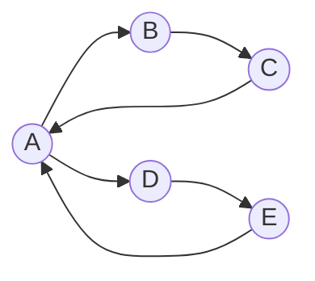

# ✏️ Eulerian Path and Circuit

> [!abstract] TL;DR
> An **Eulerian path** uses **every edge exactly once**; an **Eulerian circuit** is an Eulerian path that returns to its start. Existence is decided purely by **degree parity and connectivity**: a circuit needs *all* even degrees; a path needs *exactly 0 or 2* odd-degree vertices. **Hierholzer's algorithm** constructs one in **O(E)**. Do not confuse this with the **Hamiltonian** path (visit every **vertex** once) — that problem is **NP-hard**.

---

## Intuition — Analogy First

You're a **snowplow driver** who must clear **every street** in town exactly once, without repeating any — that's an Eulerian path. When can you? Think about any intersection you *pass through*: every time you drive *in* on one street you must drive *out* on another, consuming streets in **pairs**. So a pass-through intersection needs an **even** number of streets. The only intersections allowed an **odd** count are your **start** and **end** (you leave the start without arriving, and arrive at the end without leaving). Hence: 0 odd vertices → you can start anywhere and loop back (circuit); exactly 2 odd vertices → you must start at one and finish at the other.

This is literally how **Euler settled the Seven Bridges of Königsberg (1736)**: all four landmasses had an odd number of bridges, so no walk crossing each bridge once was possible — the birth of graph theory.

---

## How It Works + Mermaid

### Existence conditions

| Graph type | Eulerian **Circuit** | Eulerian **Path** |
|------------|----------------------|-------------------|
| **Undirected** | Connected (non-zero-degree vertices) **and** every vertex has **even** degree | Connected **and** exactly **0 or 2** vertices of **odd** degree |
| **Directed** | Strongly connected (among non-isolated) **and** `in-deg == out-deg` for every vertex | Connected **and** at most one vertex with `out−in = +1` (start) and one with `in−out = +1` (end); all others balanced |

### Hierholzer's algorithm (O(E))
1. Pick a valid start (an odd-degree vertex for a path; any vertex for a circuit).
2. Follow **unused** edges, marking each as used, until you get stuck (returned to a vertex with no unused edges).
3. While backtracking, whenever a vertex still has unused edges, splice a **new sub-tour** starting there into the route.
4. The reversed order in which vertices get "finalized" (fully stuck) is the Eulerian trail.



Every vertex has `in-deg == out-deg` (A: in2/out2, others 1/1) and the graph is strongly connected → an **Eulerian circuit** exists, e.g. `A → B → C → A → D → E → A`. Each of the 6 edges is used exactly once and we return to `A`.

### Contrast: Hamiltonian
- **Eulerian** = every **edge** once → **polynomial** (O(E)), decided by degrees.
- **Hamiltonian** = every **vertex** once → **NP-hard**, no known efficient existence test.

---

## Complexity Analysis

| Task | Time | Space | Notes |
|------|------|-------|-------|
| Check existence (degrees + connectivity) | O(V + E) | O(V) | Count parities; verify connectivity via [[DFS]]/[[Union_Find]] |
| Hierholzer construction | **O(E)** | O(E) | Each edge pushed/popped once |
| Fleury's algorithm | O(E²) | O(E) | Simpler idea (avoid bridges) but slower — avoid |
| Hamiltonian path existence | NP-hard | — | Held-Karp DP is O(2ⁿ·n) |

Hierholzer visits each edge exactly once; the explicit stack replaces recursion so deep graphs don't overflow.

---

## Python Implementation

```python
from collections import defaultdict
from typing import Dict, List, Optional

def eulerian_path_directed(
    edges: List[tuple], start: Optional[int] = None
) -> Optional[List[int]]:
    """
    Hierholzer's algorithm for a DIRECTED Eulerian path/circuit. O(E).
    Returns the vertex sequence, or None if no Eulerian trail exists.
    """
    graph: Dict[int, List[int]] = defaultdict(list)
    out_deg = defaultdict(int)
    in_deg = defaultdict(int)
    nodes = set()

    for u, v in edges:
        graph[u].append(v)
        out_deg[u] += 1
        in_deg[v] += 1
        nodes.add(u); nodes.add(v)

    # choose a start vertex satisfying the directed conditions
    plus_one = [x for x in nodes if out_deg[x] - in_deg[x] == 1]
    minus_one = [x for x in nodes if in_deg[x] - out_deg[x] == 1]
    if start is None:
        if len(plus_one) == 1 and len(minus_one) == 1:
            start = plus_one[0]                 # Eulerian path
        elif not plus_one and not minus_one:
            start = next(iter(nodes))           # Eulerian circuit
        else:
            return None                         # degree condition violated

    # use a pointer per node so each edge is consumed once (amortized O(1))
    ptr = defaultdict(int)
    stack = [start]
    route: List[int] = []

    while stack:
        u = stack[-1]
        if ptr[u] < len(graph[u]):
            v = graph[u][ptr[u]]
            ptr[u] += 1                         # consume edge u->v
            stack.append(v)
        else:
            route.append(stack.pop())           # u is stuck -> finalize

    route.reverse()
    # valid only if we used every edge exactly once
    return route if len(route) == len(edges) + 1 else None


# ---- Example: Reconstruct Itinerary (LC 332) flavor ----
tickets = [(0,1),(1,2),(2,0),(0,3),(3,4),(4,0)]
print(eulerian_path_directed(tickets, start=0))
# [0, 1, 2, 0, 3, 4, 0]  -- uses all 6 edges once, returns to start (circuit)


def eulerian_path_undirected(n: int, edges: List[tuple]) -> Optional[List[int]]:
    """Hierholzer for an UNDIRECTED graph; edges consumed via a used[] flag."""
    graph = defaultdict(list)      # store (neighbor, edge_id)
    for i, (u, v) in enumerate(edges):
        graph[u].append((v, i))
        graph[v].append((u, i))

    degree = {x: len(graph[x]) for x in graph}
    odd = [x for x in degree if degree[x] % 2 == 1]
    if len(odd) not in (0, 2):
        return None                # no Eulerian trail
    start = odd[0] if odd else next(iter(graph))

    used = [False] * len(edges)
    ptr = defaultdict(int)
    stack = [start]
    route = []
    while stack:
        u = stack[-1]
        advanced = False
        while ptr[u] < len(graph[u]):
            v, eid = graph[u][ptr[u]]
            ptr[u] += 1
            if not used[eid]:
                used[eid] = True
                stack.append(v)
                advanced = True
                break
        if not advanced:
            route.append(stack.pop())
    route.reverse()
    return route if len(route) == len(edges) + 1 else None
```

---

## Dry Run / Trace

Directed graph, edges `0→1, 1→2, 2→0, 0→3, 3→4, 4→0` (start `0`). Hierholzer with a stack:

```
stack=[0]           route=[]
 0 -> 1 (edge0)     stack=[0,1]
 1 -> 2 (edge1)     stack=[0,1,2]
 2 -> 0 (edge2)     stack=[0,1,2,0]
 0 -> 3 (edge3)     stack=[0,1,2,0,3]     (0's ptr now points past edge to 1)
 3 -> 4 (edge4)     stack=[..,3,4]
 4 -> 0 (edge5)     stack=[..,4,0]
 0 stuck            pop 0  route=[0]
 4 stuck            pop 4  route=[0,4]
 3 stuck            pop 3  route=[0,4,3]
 0 stuck (edges done) pop 0 route=[0,4,3,0]
 2 stuck            pop 2  route=[0,4,3,0,2]
 1 stuck            pop 1  route=[0,4,3,0,2,1]
 0 stuck            pop 0  route=[0,4,3,0,2,1,0]
reverse -> [0,1,2,0,3,4,0]   ✅ all 6 edges once, returns to 0
```

---

## Patterns & LeetCode Applications

| Problem | LC # | Angle |
|---------|------|-------|
| Reconstruct Itinerary | 332 | Eulerian path; Hierholzer with lexicographic edge order |
| Valid Arrangement of Pairs | 2097 | Directed Eulerian path over pairs |
| Cracking the Safe | 753 | **De Bruijn sequence** = Eulerian circuit on a de Bruijn graph |
| DNA / genome assembly | — | Overlapping k-mers → de Bruijn graph → Eulerian path stitches reads |
| Route/street-sweeping planning | — | Chinese Postman: duplicate fewest edges to make all degrees even |
| Seven Bridges of Königsberg | — | Historical: 4 odd-degree vertices → no Eulerian walk |

**Meta-pattern:** if a task says "use every connection/transition exactly once" (tickets, k-mer overlaps, safe combinations), it's Eulerian, and Hierholzer builds the answer in O(E). "Visit every place once" is Hamiltonian instead — expect exponential methods.

---

## Common Pitfalls

1. **Confusing Eulerian with Hamiltonian:** edges-once (easy, degree-based) vs vertices-once (NP-hard). Read the problem carefully.
2. **Skipping the connectivity check:** even degrees alone aren't enough — the edges must all lie in one connected component (isolated vertices excluded).
3. **Wrong start vertex:** for an Eulerian **path** you must start at an odd-degree (or `out−in = +1`) vertex, not an arbitrary one.
4. **Reusing edges (undirected):** track a per-**edge** `used[]` flag; marking a *vertex* visited is wrong here.
5. **O(E²) blowup:** re-scanning neighbor lists each visit is quadratic — keep a per-node pointer (`ptr[u]`) so each edge is examined once.
6. **Forgetting to reverse the route,** or forgetting to validate `len(route) == E + 1` before trusting the output.

---

## Related Concepts

- [[_MOC_Graphs|↑ Section MOC]]
- [[DFS]] — Hierholzer is a DFS that consumes edges and finalizes on backtrack
- [[Graph_Representation]] — adjacency lists with per-edge ids / pointers
- [[Topological_Sort]] — another edge-ordering traversal on directed graphs
- [[Union_Find]] — a quick way to verify the graph is connected before running Hierholzer

---

## Review Questions

1. **State the exact existence conditions for an Eulerian circuit vs an Eulerian path, for both directed and undirected graphs, and explain the degree-parity argument.**
2. **Why is finding an Eulerian path O(E) while finding a Hamiltonian path is NP-hard,** even though both "traverse everything once"?
3. **Walk through Hierholzer's algorithm on a small graph** and explain why splicing sub-tours during backtracking yields a single trail using every edge once.

---

## Sources

- Euler (1736) — *Solutio problematis ad geometriam situs pertinentis* (Seven Bridges of Königsberg)
- Hierholzer (1873) — constructive Eulerian circuit proof
- [CP-Algorithms — Euler Path](https://cp-algorithms.com/graph/euler_path.html)
- Competitive Programmer's Handbook (Laaksonen), Ch. 19 (Paths and circuits)
- LeetCode #332, #753, #2097

#eulerianpath #euleriancircuit #graphs #hierholzer #debruijn #dfs
