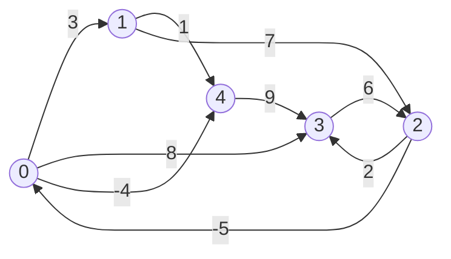

---
title: Floyd-Warshall Algorithm
aliases: [Floyd Warshall, All Pairs Shortest Path, APSP]
tags: [DSA, Graphs, ShortestPath, DynamicProgramming, AllPairs]
domain: DSA
difficulty: Intermediate
created: 2026-07-26
related: [Dijkstra, Bellman_Ford]
status: complete
---

# 🔄 Floyd-Warshall Algorithm

> [!abstract] TL;DR
> Floyd-Warshall computes **all-pairs shortest paths** in O(V³) time and O(V²) space using dynamic programming. It handles negative edges (but not negative cycles — detected via diagonal < 0). Use it when V is small (≤ 500), you need all-pairs distances, or you have negative weights. A single extra loop over intermediate vertices is the entire algorithm.

---

## Intuition — Analogy First

Imagine you have a table showing the direct flight costs between every pair of cities. You want to find the cheapest way to travel between any two cities (possibly with layovers).

Floyd-Warshall works by progressively asking: **"Does routing through city k make any trip cheaper?"** You try each city as an intermediate stop in turn (city 1, city 2, ..., city V). After considering city k, you know the cheapest routes that can use cities 1 through k as layovers. After all V cities, you have the global optimum.

The insight is that the optimal path between i and j either:
- Doesn't pass through vertex k (use the previous answer), or
- Passes through vertex k (combine i→k and k→j).

---

## How It Works + Mermaid

**DP Formulation:**

Let `dp[i][j][k]` = shortest path from i to j using only vertices {1, 2, ..., k} as intermediates.

- Base case: `dp[i][j][0]` = direct edge weight (or ∞ if no edge, 0 if i==j)
- Recurrence: `dp[i][j][k] = min(dp[i][j][k-1], dp[i][k][k-1] + dp[k][j][k-1])`

In practice, we collapse the k-dimension since `dp[i][k]` and `dp[k][j]` are unchanged when processing intermediate k:

```
for k in range(V):
    for i in range(V):
        for j in range(V):
            dp[i][j] = min(dp[i][j], dp[i][k] + dp[k][j])
```

**Negative Cycle Detection:** After running FW, check `dp[i][i] < 0` for any i. A vertex that has a negative-cost path back to itself lies on a negative cycle.

**Transitive Closure:** Replace min/+ with OR/AND. `reach[i][j] = reach[i][j] OR (reach[i][k] AND reach[k][j])`.



**Matrix evolution through k (simplified 4-node example: 0→1 weight 5, 0→2 weight 10, 1→2 weight 2, 2→3 weight 1, 0→3 weight ∞):**

| After k= | dist[0][3] | Via          |
|----------|------------|--------------|
| k=-1     | ∞          | No path      |
| k=0      | ∞          | No path      |
| k=1      | ∞          | No path      |
| k=2      | 8          | 0→1→2→3 (5+2+1) |
| k=3      | 8          | No improvement |

---

## Complexity Analysis

| Algorithm        | Time    | Space   | Negative Edges | All-Pairs | Notes                             |
|------------------|---------|---------|----------------|-----------|-----------------------------------|
| Floyd-Warshall   | O(V³)   | O(V²)   | Yes            | Yes       | Simple code; V ≤ 500 practical    |
| Dijkstra × V     | O(V·(V+E)logV) | O(V²) | No          | Yes       | Faster for sparse, non-neg graphs |
| Bellman-Ford × V | O(V²·E) | O(V²)   | Yes            | Yes       | Slower; rarely used for APSP      |
| Johnson's Alg    | O(VE + V²logV) | O(V²) | Yes          | Yes       | Reweights to non-neg, then Dijkstra |

**When to choose Floyd-Warshall:**
- V is small (≤ 300–500 nodes)
- You need all-pairs distances
- Graph has negative edges (but no negative cycles)
- Simplicity of implementation matters (it's 6 lines)
- Need transitive closure (reachability between all pairs)

---

## Implementation (Python)

```python
from typing import List, Optional

INF = float('inf')

def floyd_warshall(
    n: int,
    edges: List[List[int]]  # [u, v, weight] (directed)
) -> List[List[float]]:
    """
    Returns dist[i][j] = shortest path from i to j.
    dist[i][j] = INF if unreachable.
    """
    # Initialize distance matrix
    dist = [[INF] * n for _ in range(n)]
    for i in range(n):
        dist[i][i] = 0

    for u, v, w in edges:
        dist[u][v] = min(dist[u][v], w)  # handle parallel edges

    # Core: try each vertex k as intermediate
    for k in range(n):
        for i in range(n):
            for j in range(n):
                if dist[i][k] + dist[k][j] < dist[i][j]:
                    dist[i][j] = dist[i][k] + dist[k][j]

    return dist


def floyd_warshall_negative_cycle(n: int, edges: List[List[int]]) -> Optional[List[List[float]]]:
    """
    Returns dist matrix, or None if a negative cycle exists.
    """
    dist = floyd_warshall(n, edges)

    # Negative cycle detected if any diagonal is negative
    for i in range(n):
        if dist[i][i] < 0:
            return None

    return dist


def floyd_warshall_path_reconstruction(
    n: int,
    edges: List[List[int]]
) -> tuple:
    """
    Returns (dist, next_node) where next_node[i][j] gives the next hop
    from i toward j on the shortest path.
    """
    dist = [[INF] * n for _ in range(n)]
    nxt = [[None] * n for _ in range(n)]

    for i in range(n):
        dist[i][i] = 0
        nxt[i][i] = i

    for u, v, w in edges:
        if w < dist[u][v]:
            dist[u][v] = w
            nxt[u][v] = v

    for k in range(n):
        for i in range(n):
            for j in range(n):
                if dist[i][k] + dist[k][j] < dist[i][j]:
                    dist[i][j] = dist[i][k] + dist[k][j]
                    nxt[i][j] = nxt[i][k]

    return dist, nxt


def reconstruct_path(nxt: List[List], u: int, v: int) -> List[int]:
    if nxt[u][v] is None:
        return []
    path = [u]
    while u != v:
        u = nxt[u][v]
        path.append(u)
    return path


def transitive_closure(n: int, edges: List[List[int]]) -> List[List[bool]]:
    """
    Returns reach[i][j] = True if j is reachable from i.
    Used for: Course Schedule IV (reachability queries).
    """
    reach = [[False] * n for _ in range(n)]
    for i in range(n):
        reach[i][i] = True
    for u, v, _ in edges:
        reach[u][v] = True

    for k in range(n):
        for i in range(n):
            for j in range(n):
                reach[i][j] = reach[i][j] or (reach[i][k] and reach[k][j])

    return reach


# ---- Find the City With Smallest Number of Neighbors (LC 1334) ----
def findTheCity(n: int, edges: List[List[int]], distanceThreshold: int) -> int:
    dist = floyd_warshall(n, edges)
    # Also need symmetric (undirected graph)
    for u, v, w in edges:
        dist[v][u] = min(dist[v][u], w)
    # Re-run FW after adding reverse edges (simpler: build symmetric from start)

    # For each city, count reachable neighbors within threshold
    best_city = -1
    min_neighbors = n + 1

    for city in range(n):
        neighbors = sum(
            1 for j in range(n)
            if j != city and dist[city][j] <= distanceThreshold
        )
        if neighbors <= min_neighbors:
            min_neighbors = neighbors
            best_city = city

    return best_city
```

---

## Dry Run / Example Trace

**4 nodes, edges:** 0→1(3), 0→3(7), 1→0(8), 1→2(2), 2→3(1), 3→0(4)

**Initial dist matrix:**
```
     0    1    2    3
0  [ 0,   3,   ∞,   7  ]
1  [ 8,   0,   2,   ∞  ]
2  [ ∞,   ∞,   0,   1  ]
3  [ 4,   ∞,   ∞,   0  ]
```

**After k=0 (route through node 0):**
- dist[1][3]: min(∞, dist[1][0]+dist[0][3]) = min(∞, 8+7) = 15
- dist[3][1]: min(∞, dist[3][0]+dist[0][1]) = min(∞, 4+3) = 7
- dist[3][3]: min(0, 4+7) = 0 (no change)

**After k=1 (route through node 1):**
- dist[0][2]: min(∞, 3+2) = 5
- dist[1][3]: min(15, 0+∞) = 15 (no change yet)

**After k=2 (route through node 2):**
- dist[0][3]: min(7, dist[0][2]+dist[2][3]) = min(7, 5+1) = 6
- dist[1][3]: min(15, 2+1) = 3

**After k=3 (route through node 3):**
- dist[0][0]: min(0, 6+4) = 0 (no change — no negative cycle)
- dist[2][0]: min(∞, 1+4) = 5

**Final dist matrix:**
```
     0    1    2    3
0  [ 0,   3,   5,   6  ]
1  [ 8,   0,   2,   3  ]
2  [ 5,   8,   0,   1  ]
3  [ 4,   7,   9,   0  ]
```

---

## Patterns & LeetCode Applications

| Problem                                         | LC #  | Key Insight                                              |
|-------------------------------------------------|-------|----------------------------------------------------------|
| Find the City With Smallest Number of Neighbors | 1334  | APSP then count reachable cities per node                |
| Course Schedule IV                              | 1462  | Transitive closure (reachability between all pairs)      |
| Network Delay Time                              | 743   | SSSP (Dijkstra preferred, FW works for small n)          |
| Evaluate Division                               | 399   | APSP on ratio graph (multiply instead of add)            |
| Shortest Path in a Grid with Obstacles         | 1293  | BFS preferred; FW for tiny grids                         |

---

## Common Pitfalls

1. **Negative cycles:** Always check the diagonal after running FW. If `dist[i][i] < 0`, the algorithm's output is meaningless for nodes on or reachable from the cycle.
2. **In-place update safety:** The standard FW with the 2D matrix works correctly in-place because `dist[i][k]` and `dist[k][j]` for a given k are not modified during the k-th iteration (only when i=k or j=k, which doesn't cause issues).
3. **Initialization of unreachable pairs:** Must be `INF`, not 0 — using 0 causes wrong relaxation.
4. **Parallel edges:** Use `min` when building the initial matrix.
5. **1-indexed input:** Subtract 1 when building the matrix for 0-indexed arrays.
6. **Space for large V:** O(V²) is infeasible for V > 10,000 — use Dijkstra from each source instead.

---

## Related Concepts

- [[_MOC_Graphs|↑ Section MOC]]
- [[Dijkstra]] — single-source; O((V+E)logV); no negative edges
- [[Bellman_Ford]] — single-source; O(VE); handles negative edges

---

## Review Questions

1. **Explain why the order of the three nested loops matters in Floyd-Warshall — specifically, why the k (intermediate vertex) loop must be outermost.** What goes wrong if k is innermost?
2. **Floyd-Warshall can detect negative cycles. How? What does a negative value on the diagonal of the dist matrix mean?**
3. **Given a graph with V=1000 nodes and you need all-pairs shortest paths with no negative edges, would you choose Floyd-Warshall or running Dijkstra V times? Justify your answer with complexity analysis.**

---

## Sources

- CLRS — Introduction to Algorithms, Ch. 25.2 (The Floyd-Warshall Algorithm)
- [CP-Algorithms — Floyd-Warshall](https://cp-algorithms.com/graph/all-pair-shortest-path-floyd-warshall.html)
- LeetCode #1334, #1462
- [NeetCode — Advanced Graphs](https://neetcode.io)

#floydwarshall #graphs #shortestpath #allpairs #dynamicprogramming #apsp
