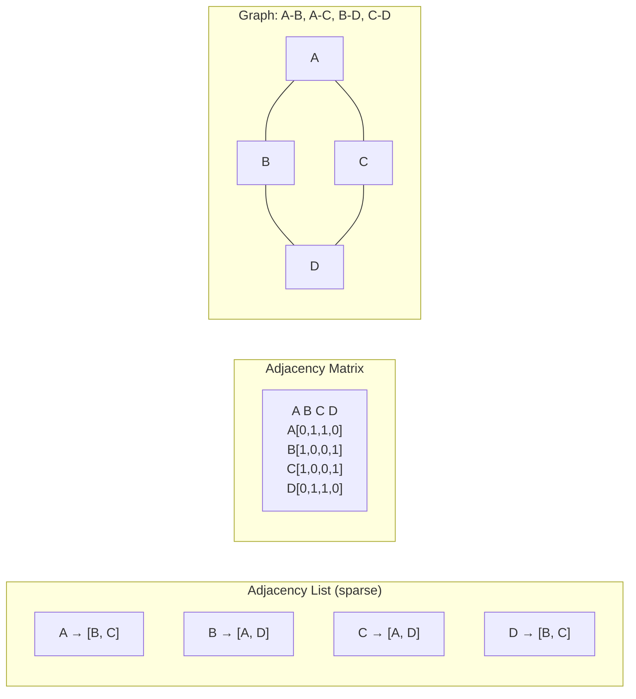

---
title: Graph Representation
aliases: [Adjacency List, Adjacency Matrix, Graph Storage]
tags: [DSA, Graphs, Representation]
domain: DSA
difficulty: Beginner
created: 2026-07-26
related: [BFS, DFS, Dijkstra, Topological_Sort]
status: complete
---

# 🗺️ Graph Representation

> [!abstract] TL;DR
> A graph is vertices (nodes) connected by edges. Store it as an **adjacency list** (dict of lists) for sparse graphs — O(V+E) space, standard for almost all interview problems. Use an **adjacency matrix** only when edges are dense or you need O(1) edge lookups. Implicit graphs (grids, word ladders) don't store adjacency at all — neighbors are computed on the fly.

---

## Intuition — Analogy First

Think of a **road map**: cities are vertices, roads are edges. Two ways to represent which cities connect:

**Adjacency Matrix** = a printed connection grid. You look up row "Denver", column "Chicago" and see a 1 (connected) or 0 (not connected). Fast lookup, but the grid is V × V — massive for a country with thousands of cities, mostly filled with zeros.

**Adjacency List** = each city's own signpost listing only its direct neighbors. "Denver → [Chicago, Salt Lake City, Albuquerque]." Compact when roads are sparse (most cities don't connect directly to most others).

Most real graphs are **sparse** (E << V²), so adjacency lists are the default.

---

## How It Works

### Graph Types

| Type | Description | Example |
|------|-------------|---------|
| Undirected | Edges have no direction (A—B means A↔B) | Social network friendship |
| Directed (Digraph) | Edges have direction (A→B ≠ B→A) | Web page links, Twitter follows |
| Weighted | Edges carry a numeric weight/cost | Road distances, flight prices |
| Unweighted | All edges treated as equal | Maze paths, friend connections |
| Cyclic | Contains at least one cycle | General graphs |
| Acyclic | No cycles | Trees, DAGs |
| DAG | Directed Acyclic Graph | Task dependencies, course prereqs |

### Representation 1: Adjacency Matrix
2D array `adj[u][v] = 1` if edge u→v exists (or weight if weighted). `adj[u][v] = 0` otherwise.

**Pros:** O(1) edge existence check.
**Cons:** O(V²) space — prohibitive for sparse graphs. Iterating over all neighbors of u costs O(V) even if u has 2 neighbors.

### Representation 2: Adjacency List
Dictionary (or array of lists) where `adj[u]` contains all neighbors of u.

**Pros:** O(V+E) space. Iterating over neighbors of u costs O(degree(u)).
**Cons:** Checking if specific edge (u,v) exists costs O(degree(u)) — linear scan.

### Representation 3: Edge List
Simply a list of all edges: `[(u1, v1), (u2, v2), ...]`. Used in Kruskal's MST (sort edges by weight) and rarely elsewhere.

### Implicit Graphs
No stored adjacency at all — the graph is defined by a function that computes neighbors dynamically:
- **Grid graph:** cell `(r, c)` has neighbors `(r±1, c)` and `(r, c±1)`.
- **Word ladder:** each word connects to all words differing by one letter.
- **State space search:** each state connects to reachable next states.



---

## Complexity Analysis

| Operation              | Adj Matrix | Adj List          |
|-----------------------|------------|-------------------|
| Space                 | O(V²)      | O(V + E)          |
| Add edge              | O(1)       | O(1)              |
| Remove edge           | O(1)       | O(degree(u))      |
| Check edge (u, v)     | O(1)       | O(degree(u))      |
| Iterate neighbors of u | O(V)      | O(degree(u))      |
| Iterate all edges     | O(V²)      | O(V + E)          |

**When to use which:**
- Sparse graph (E << V²): adjacency list
- Dense graph (E ≈ V²): adjacency matrix
- Floyd-Warshall all-pairs shortest path: adjacency matrix
- Most interview problems (BFS, DFS, Dijkstra): adjacency list

---

## Implementation (Python)

```python
from collections import defaultdict

# ─── 1. Adjacency List (undirected, unweighted) ──────────────────────────────

def build_adj_list_undirected(edges, n):
    """
    edges: list of (u, v) pairs
    n: number of vertices (0-indexed, 0 to n-1)
    """
    adj = defaultdict(list)
    for u, v in edges:
        adj[u].append(v)
        adj[v].append(u)   # Both directions for undirected
    return adj

edges = [(0, 1), (0, 2), (1, 3), (2, 3)]
adj = build_adj_list_undirected(edges, 4)
# adj = {0: [1, 2], 1: [0, 3], 2: [0, 3], 3: [1, 2]}


# ─── 2. Adjacency List (directed, unweighted) ────────────────────────────────

def build_adj_list_directed(edges, n):
    adj = defaultdict(list)
    for u, v in edges:
        adj[u].append(v)   # Only one direction
    return adj


# ─── 3. Adjacency List (directed, weighted) ──────────────────────────────────

def build_adj_list_weighted(edges, n):
    """edges: list of (u, v, weight)"""
    adj = defaultdict(list)
    for u, v, w in edges:
        adj[u].append((v, w))    # Directed
        # adj[v].append((u, w)) # Add this line for undirected
    return adj

weighted_edges = [(0, 1, 4), (0, 2, 1), (2, 1, 2), (1, 3, 1)]
adj_w = build_adj_list_weighted(weighted_edges, 4)
# adj_w = {0: [(1, 4), (2, 1)], 2: [(1, 2)], 1: [(3, 1)]}


# ─── 4. Adjacency Matrix ─────────────────────────────────────────────────────

def build_adj_matrix(edges, n):
    """Returns n×n matrix. adj[u][v] = 1 if edge exists."""
    adj = [[0] * n for _ in range(n)]
    for u, v in edges:
        adj[u][v] = 1
        adj[v][u] = 1   # Remove for directed
    return adj

matrix = build_adj_matrix([(0,1),(0,2),(1,3),(2,3)], 4)
# [[0,1,1,0],[1,0,0,1],[1,0,0,1],[0,1,1,0]]


# ─── 5. Edge List ────────────────────────────────────────────────────────────

# Simplest — just the raw edges, optionally sorted by weight for Kruskal
edges_sorted = sorted([(4,0,1),(1,0,2),(2,2,1),(1,1,3)], key=lambda x: x[0])
# Use in Kruskal's MST


# ─── 6. Implicit Graph: Grid as Graph ────────────────────────────────────────

def get_neighbors_grid(r, c, rows, cols):
    """4-directional neighbors for grid cell (r, c)."""
    directions = [(0, 1), (0, -1), (1, 0), (-1, 0)]
    return [
        (r + dr, c + dc)
        for dr, dc in directions
        if 0 <= r + dr < rows and 0 <= c + dc < cols
    ]

# For 8-directional (diagonal moves allowed):
def get_neighbors_8dir(r, c, rows, cols):
    directions = [(dr, dc) for dr in [-1,0,1] for dc in [-1,0,1] if (dr, dc) != (0,0)]
    return [
        (r + dr, c + dc)
        for dr, dc in directions
        if 0 <= r + dr < rows and 0 <= c + dc < cols
    ]


# ─── 7. Implicit Graph: Word Ladder ──────────────────────────────────────────

def get_word_neighbors(word, word_set):
    """Returns all words in word_set differing from word by exactly one letter."""
    neighbors = []
    for i in range(len(word)):
        for c in 'abcdefghijklmnopqrstuvwxyz':
            if c != word[i]:
                candidate = word[:i] + c + word[i+1:]
                if candidate in word_set:
                    neighbors.append(candidate)
    return neighbors

# In BFS: instead of building adj list upfront, call this per-node


# ─── 8. Degree and basic graph properties ────────────────────────────────────

def graph_info(adj, directed=False):
    all_nodes = set(adj.keys())
    for neighbors in adj.values():
        all_nodes.update(neighbors)

    total_degree = sum(len(v) for v in adj.values())
    num_edges = total_degree if directed else total_degree // 2

    print(f"Vertices: {len(all_nodes)}")
    print(f"Edges: {num_edges}")
    print(f"Degrees: { {node: len(adj[node]) for node in all_nodes} }")
```

---

## Dry Run / Example Trace

**Build adjacency list from edges: `[(0,1),(1,2),(2,0),(1,3)]` (directed graph)**

| Edge | Action                      | adj after     |
|------|-----------------------------|---------------|
| 0→1  | adj[0].append(1)            | {0:[1]}       |
| 1→2  | adj[1].append(2)            | {0:[1],1:[2]} |
| 2→0  | adj[2].append(0)            | +{2:[0]}      |
| 1→3  | adj[1].append(3)            | adj[1]=[2,3]  |

Final: `{0: [1], 1: [2, 3], 2: [0]}`

Verify: node 1 has out-degree 2 (points to 2 and 3); node 3 has in-degree 1 (from 1) but out-degree 0.

---

## Patterns & LeetCode Applications

| Graph Type | Representation | Common Algorithms |
|-----------|---------------|-------------------|
| Sparse undirected | Adj list | BFS, DFS, Union-Find |
| Sparse directed | Adj list | Topological sort, DFS cycle detection |
| Weighted | Adj list with (v, w) | Dijkstra, Bellman-Ford, Prim |
| Dense | Adj matrix | Floyd-Warshall |
| Grid | Implicit (directions) | BFS/DFS on grid |
| String/State space | Implicit (computed) | Word Ladder, BFS |

**Representative LeetCode problems:**
- 133 — Clone Graph (adj list traversal)
- 207 — Course Schedule (directed graph + cycle detection)
- 743 — Network Delay Time (weighted adj list + Dijkstra)
- 200 — Number of Islands (implicit grid graph)
- 127 — Word Ladder (implicit word graph + BFS)

---

## Common Pitfalls

1. **Forgetting bidirectional edges for undirected graphs**: `adj[u].append(v)` without `adj[v].append(u)` creates a directed graph silently.
2. **Zero-indexing vs one-indexing**: Many LeetCode problems give edges with 1-indexed nodes. Always check if you need to subtract 1, or initialize your adjacency structure with enough slots.
3. **Disconnected components**: Not all nodes may appear as keys in a defaultdict. Always iterate over all nodes (0 to n-1), not just `adj.keys()`.
4. **Grid out-of-bounds**: Always check `0 <= r < rows and 0 <= c < cols` before adding a grid neighbor.
5. **Mutable default argument**: Never use `def build(adj={})` — Python reuses the same dict across calls. Use `defaultdict(list)` inside the function or pass it as a parameter.
6. **Confusing in-degree and out-degree**: In directed graphs, `adj[u]` lists nodes u points TO (out-neighbors). In-degree of a node requires a separate count.

---

## Related Concepts

- [[_MOC_Graphs|↑ Section MOC]]
- [[BFS]] — level-by-level traversal using adjacency list
- [[DFS]] — depth-first traversal using adjacency list
- [[Dijkstra]] — shortest path using weighted adjacency list
- [[Topological_Sort]] — ordering of a DAG
- [[Union_Find]] — alternative for connected-component queries
- [[Minimum_Spanning_Tree]] — uses edge list (Kruskal) or adj list (Prim)

---

## Review Questions

1. A social network has 500 million users and the average user has 200 friends. What is the total space used by an adjacency matrix versus an adjacency list? Compute both and explain why the adjacency list is the only feasible option.

2. You are given a grid where `0` = open and `1` = wall, and you need to find the shortest path from top-left to bottom-right using BFS. Explain why this is a graph problem without any explicit adjacency list, and write the `get_neighbors` function that replaces adj list lookup.

3. In an adjacency list for a directed graph, how would you compute the in-degree of every node efficiently? What is the time complexity, and why is this harder with an adjacency list than with an adjacency matrix?

---

## Sources

- CLRS Chapter 22 — Elementary Graph Algorithms
- [NeetCode — Graph playlist](https://neetcode.io/roadmap)
- Sedgewick & Wayne — *Algorithms* (4th ed.), Chapter 4.1–4.2
- [CP-Algorithms — Graph representation](https://cp-algorithms.com/graph/graph-basics.html)

#DSA #Graphs #Representation #AdjacencyList #AdjacencyMatrix #Beginner
