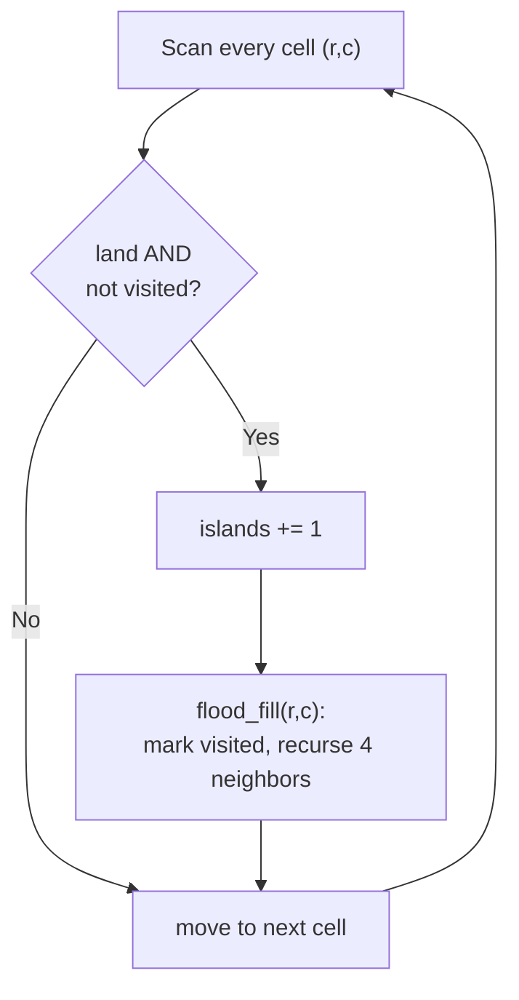
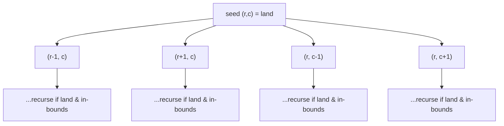

# 🏝️ Island Traversal

> [!abstract] TL;DR
> A 2D grid **is a graph in disguise**: each cell is a node, and adjacent cells (up/down/left/right) are edges. The "island" family of problems — count islands, measure the largest, compute perimeter, capture surrounded regions, spread rot — are all **connected-components + flood fill** on that implicit graph. Sweep the grid; whenever you hit an unvisited "land" cell, launch a **DFS or BFS flood fill** that consumes the entire connected region, marking cells visited (best done in place). Each flood fill = one component. Everything runs in **O(rows × cols)** because each cell is visited once.

---

## Intuition — Analogy First

Imagine an **aerial photo of the ocean dotted with land**. You want to count how many separate islands there are. You put your finger on the first patch of land you see and **trace outward** — walk to every land cell you can reach without stepping into water, painting each one you touch a different color so you don't recount it. When you can't reach any more connected land, you've fully outlined **one** island; increment your counter. Then you keep scanning the photo for the next unpainted land cell and repeat.

That "drop onto a cell, flood outward to fill the whole connected blob, mark as done" motion is **flood fill** — exactly how a paint-bucket tool works in an image editor. Counting islands is just counting how many times you had to *start* a new flood fill.

The only real choice is *how* you flood: **DFS** (dive deep along one direction, recursion or an explicit stack) or **BFS** (expand ring by ring with a queue). Same result; different traversal order and different failure modes (recursion depth vs queue memory).

---

## How It Works + Mermaid

The outer scan + inner flood-fill skeleton:

1. For every cell `(r, c)` in the grid:
2. If it is **land** and **not yet visited** → increment component count, then **flood fill** from `(r, c)`.
3. Flood fill visits the cell, marks it visited (overwrite `'1'`→`'0'` in place, or use a `visited` set), and recurses/enqueues its **4 neighbors** that are in-bounds and still land.



The 4-directional spread from a seed cell:



**In place vs visited set.** Overwriting land to water (`'1'`→`'0'`) needs no extra memory but mutates the input. A separate `visited` set keeps the grid pristine at O(rows×cols) space. **4- vs 8-directional:** most island problems use 4 neighbors; some ("Number of Distinct Islands II," certain "regions" problems) use all 8 (add the diagonals). **Multi-source BFS** (Rotting Oranges) seeds the queue with *all* starting cells at once and counts levels to get a simultaneous time-to-spread.

---

## When to Recognize This Pattern (signal keywords)

- The input is a **2D grid / matrix / board** of chars or 0/1.
- "**Number of islands**," "connected regions," "clusters," "blobs," "provinces."
- "**Flood fill**," "paint bucket," "fill connected area of same color."
- "**Largest / max area** of connected cells," "size of the region."
- "**Perimeter**" of a shape on a grid.
- "**Surrounded** regions," "capture," "cells that can/can't reach the border."
- "**Rotting / spreading**" over time from multiple sources → multi-source BFS, count minutes.
- "**Word search**" / path existence on a grid → DFS with backtracking.
- Neighbors defined by "**adjacent horizontally or vertically**" (or "including diagonals" → 8-dir).

---

## Python Implementation / Template

```python
from typing import List
from collections import deque

# ── 1. Number of Islands — DFS flood fill in place (LeetCode 200) ─────────────
def num_islands(grid: List[List[str]]) -> int:
    """
    Count connected components of '1's (4-directional).
    Time: O(R*C)  Space: O(R*C) recursion worst case
    """
    if not grid:
        return 0
    rows, cols = len(grid), len(grid[0])

    def dfs(r: int, c: int) -> None:
        # out of bounds or water -> stop
        if r < 0 or r >= rows or c < 0 or c >= cols or grid[r][c] != '1':
            return
        grid[r][c] = '0'                     # mark visited by sinking the land
        dfs(r + 1, c); dfs(r - 1, c)
        dfs(r, c + 1); dfs(r, c - 1)         # spread to 4 neighbors

    islands = 0
    for r in range(rows):
        for c in range(cols):
            if grid[r][c] == '1':            # new, unvisited land -> new island
                islands += 1
                dfs(r, c)
    return islands


# ── 2. Number of Islands — BFS flood fill (iterative, no deep recursion) ──────
def num_islands_bfs(grid: List[List[str]]) -> int:
    if not grid:
        return 0
    rows, cols = len(grid), len(grid[0])
    islands = 0
    for sr in range(rows):
        for sc in range(cols):
            if grid[sr][sc] != '1':
                continue
            islands += 1
            q = deque([(sr, sc)])
            grid[sr][sc] = '0'
            while q:
                r, c = q.popleft()
                for dr, dc in ((1, 0), (-1, 0), (0, 1), (0, -1)):
                    nr, nc = r + dr, c + dc
                    if 0 <= nr < rows and 0 <= nc < cols and grid[nr][nc] == '1':
                        grid[nr][nc] = '0'   # mark on enqueue to avoid double-adding
                        q.append((nr, nc))
    return islands


# ── 3. Max Area of Island (LeetCode 695) — DFS returns region size ────────────
def max_area_of_island(grid: List[List[int]]) -> int:
    rows, cols = len(grid), len(grid[0])

    def dfs(r: int, c: int) -> int:
        if r < 0 or r >= rows or c < 0 or c >= cols or grid[r][c] != 1:
            return 0
        grid[r][c] = 0                        # visit
        return 1 + dfs(r+1, c) + dfs(r-1, c) + dfs(r, c+1) + dfs(r, c-1)

    return max((dfs(r, c) for r in range(rows) for c in range(cols)), default=0)


# ── 4. Flood Fill (LeetCode 733) — recolor a connected region ─────────────────
def flood_fill(image: List[List[int]], sr: int, sc: int, color: int) -> List[List[int]]:
    rows, cols = len(image), len(image[0])
    start = image[sr][sc]
    if start == color:                        # nothing to do, avoids infinite loop
        return image

    def dfs(r: int, c: int) -> None:
        if r < 0 or r >= rows or c < 0 or c >= cols or image[r][c] != start:
            return
        image[r][c] = color
        dfs(r+1, c); dfs(r-1, c); dfs(r, c+1); dfs(r, c-1)

    dfs(sr, sc)
    return image


# ── 5. Rotting Oranges (LeetCode 994) — MULTI-SOURCE BFS, count minutes ───────
def oranges_rotting(grid: List[List[int]]) -> int:
    rows, cols = len(grid), len(grid[0])
    q = deque()
    fresh = 0
    for r in range(rows):
        for c in range(cols):
            if grid[r][c] == 2:
                q.append((r, c, 0))           # all rotten cells seed the queue at t=0
            elif grid[r][c] == 1:
                fresh += 1

    minutes = 0
    while q:
        r, c, t = q.popleft()
        minutes = max(minutes, t)
        for dr, dc in ((1, 0), (-1, 0), (0, 1), (0, -1)):
            nr, nc = r + dr, c + dc
            if 0 <= nr < rows and 0 <= nc < cols and grid[nr][nc] == 1:
                grid[nr][nc] = 2              # this fresh orange rots at t+1
                fresh -= 1
                q.append((nr, nc, t + 1))
    return minutes if fresh == 0 else -1      # -1 if any orange can never rot


# ── 6. Surrounded Regions (LeetCode 130) — flood from borders inward ──────────
def solve_surrounded(board: List[List[str]]) -> None:
    if not board:
        return
    rows, cols = len(board), len(board[0])

    def dfs(r: int, c: int) -> None:
        if r < 0 or r >= rows or c < 0 or c >= cols or board[r][c] != 'O':
            return
        board[r][c] = '#'                     # mark border-connected 'O' as safe
        dfs(r+1, c); dfs(r-1, c); dfs(r, c+1); dfs(r, c-1)

    # Any 'O' touching the border (and its region) is NOT surrounded.
    for r in range(rows):
        dfs(r, 0); dfs(r, cols - 1)
    for c in range(cols):
        dfs(0, c); dfs(rows - 1, c)

    for r in range(rows):
        for c in range(cols):
            if board[r][c] == 'O':            # enclosed -> flip
                board[r][c] = 'X'
            elif board[r][c] == '#':          # safe -> restore
                board[r][c] = 'O'
```

---

## Dry Run / Trace

**`num_islands` on this 4×5 grid** (`'1'`=land):

```
1 1 0 0 0
1 1 0 0 0
0 0 1 0 0
0 0 0 1 1
```

- Scan reaches `(0,0)='1'` → **islands = 1**, DFS sinks the whole top-left 2×2 block: `(0,0)(0,1)(1,0)(1,1)` all become `'0'`.
- Scan skips the now-`'0'` cells; reaches `(2,2)='1'` → **islands = 2**, DFS sinks just `(2,2)` (its neighbors are water).
- Scan reaches `(3,3)='1'` → **islands = 3**, DFS sinks `(3,3)` and `(3,4)` (connected horizontally).
- No more land. **Answer: 3 islands.** Each of the 20 cells was inspected O(1) times → O(R·C).

---

## Patterns & LeetCode Applications

| Problem | Technique | Twist | LeetCode |
|---------|-----------|-------|----------|
| Number of Islands | DFS/BFS flood fill | count flood-fill launches | 200 |
| Max Area of Island | DFS returning size | accumulate `1 + children` | 695 |
| Flood Fill | DFS recolor | guard `start == newColor` | 733 |
| Island Perimeter | scan or DFS | each land–water/edge border = +1 | 463 |
| Surrounded Regions | DFS from **borders** | invert: mark reachable-from-edge safe | 130 |
| Rotting Oranges | **multi-source BFS** | seed all rotten, count levels | 994 |
| Pacific Atlantic Water Flow | DFS from both oceans | intersect two reachable sets | 417 |
| Word Search | DFS + **backtracking** | unmark on the way out | 79 |
| Number of Distinct Islands | DFS + shape signature | hash the relative path | 694 |
| Number of Provinces | DFS on adjacency / Union-Find | matrix is explicit graph | 547 |

---

## Common Pitfalls

1. **Not marking visited (or marking too late).** In BFS, mark a cell visited **when you enqueue it**, not when you dequeue it — otherwise the same cell gets added multiple times, blowing up the queue and the runtime.
2. **Recursion depth overflow.** A grid that is one giant island (e.g., 200×200 all land) can recurse 40,000 deep and hit Python's recursion limit. Use the **BFS/iterative-stack** version for large grids.
3. **Off-by-one / out-of-bounds.** Always bounds-check `0 <= nr < rows and 0 <= nc < cols` *before* indexing. Baking the check into the flood-fill base case (as above) is cleanest.
4. **Flood Fill infinite loop.** If `newColor == startColor`, recoloring never changes a cell, so the visited test never trips → infinite recursion. Guard it up front.
5. **Surrounded Regions done backwards.** Don't flood the enclosed regions — flood from the **border** to mark the *safe* `'O'`s, then flip everything still `'O'`. Trying to detect "is this region surrounded?" per-region is far more error-prone.
6. **Rotting Oranges single-source.** You must seed **every** rotten orange into the queue at time 0 (multi-source). Running BFS from one source and adding times gives wrong minutes.
7. **Word Search forgetting to backtrack.** Path problems must **unmark** the cell when the recursion returns, unlike counting problems where marking is permanent.
8. **4 vs 8 directions.** Read whether diagonals count. Using 4 where 8 is required (or vice versa) changes the component count.

---

## Related Concepts

- [[_MOC_Graphs|↑ Section MOC]]
- [[BFS]] — the ring-by-ring flood fill; foundation of the multi-source Rotting Oranges variant
- [[DFS]] — the dive-deep flood fill; the default for counting and area problems
- [[Union_Find]] — alternative for counting components, especially with dynamic connectivity / merges
- [[Graph_Representation]] — the grid is an implicit adjacency structure
- [[Backtracking]] — Word Search adds unmark-on-return to the grid DFS

---

## Review Questions (3)

1. Both DFS and BFS flood fill run in O(R·C). Give a concrete grid shape where the **recursive DFS** risks a stack overflow but BFS does not, and one where BFS's queue memory is the larger concern.
2. In "Surrounded Regions," why is it correct and simpler to flood-fill starting from the border `'O'`s (marking them safe) instead of trying to determine, region by region, whether a given `'O'` blob is enclosed?
3. "Rotting Oranges" needs **multi-source** BFS. Explain what would go wrong if you instead ran a separate single-source BFS from each rotten orange and took the maximum of the resulting distances.

---

## Sources

- LeetCode 200 — [Number of Islands](https://leetcode.com/problems/number-of-islands/)
- LeetCode 695 — [Max Area of Island](https://leetcode.com/problems/max-area-of-island/)
- LeetCode 994 — [Rotting Oranges](https://leetcode.com/problems/rotting-oranges/)
- LeetCode 130 — [Surrounded Regions](https://leetcode.com/problems/surrounded-regions/)
- LeetCode 417 — [Pacific Atlantic Water Flow](https://leetcode.com/problems/pacific-atlantic-water-flow/)
- NeetCode — Graphs roadmap (Islands / Flood Fill)

#DSA #Patterns #graphs #grid #flood-fill #bfs #dfs #islands #connected-components
