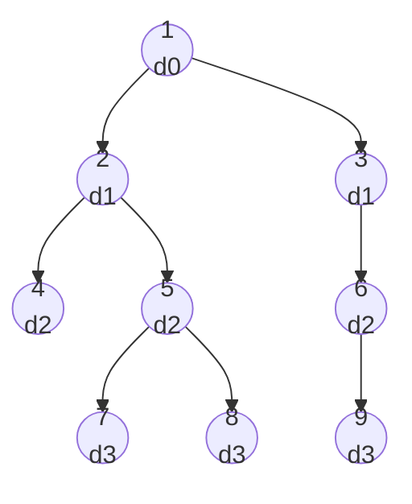

# 🌳 Lowest Common Ancestor (LCA)

> [!abstract] TL;DR
> The **lowest common ancestor** of two nodes `u` and `v` in a rooted tree is the **deepest** node that is an ancestor of both. The workhorse technique is **binary lifting**: precompute `up[node][k]` = the `2ᵏ`-th ancestor of `node` in **O(n log n)**, then answer each LCA query in **O(log n)** by jumping the deeper node up and then lifting both together. An alternative is **Euler tour + [[Sparse_Table]]** (RMQ), giving **O(1)** queries after O(n log n) preprocessing.

---

## Intuition — Analogy First

Picture a **family tree**. Two cousins want to find their most recent shared ancestor — the closest grandparent-type figure they both descend from. If one cousin is standing further down the tree than the other, they first climb up until both are on the **same generation (depth)**. Then they climb **in lockstep**, one generation at a time, until they're standing on the same person — that person is the LCA.

Climbing "one generation at a time" is slow for a tall tree. **Binary lifting** is like having pre-built ladders of lengths 1, 2, 4, 8, … generations. To climb 13 generations you don't take 13 single steps — you take the 8-ladder, then the 4-ladder, then the 1-ladder (`13 = 8 + 4 + 1`). Any climb collapses into at most `log n` ladder jumps. That's binary representation applied to ancestry.

---

## How It Works + Mermaid

### Binary lifting — preprocessing
- Root the tree, run a [[DFS]] to record each node's `depth` and its immediate parent `up[node][0]`.
- Fill the sparse ancestor table with the identity:
  ```
  up[node][k] = up[ up[node][k-1] ][k-1]
  ```
  (the `2ᵏ`-th ancestor is the `2ᵏ⁻¹`-th ancestor *of* the `2ᵏ⁻¹`-th ancestor).

### Binary lifting — query `lca(u, v)`
1. **Level them:** lift the deeper node up until `depth[u] == depth[v]`, using the binary decomposition of the depth difference.
2. If now `u == v`, that node is the LCA (one was an ancestor of the other).
3. Otherwise **lift both together**: for `k` from high to low, if `up[u][k] != up[v][k]`, jump both up by `2ᵏ`. This stops them **just below** the LCA.
4. The answer is `up[u][0]` — their common parent.

### Applications
- **Distance in a tree:** `dist(u, v) = depth[u] + depth[v] − 2 · depth[lca(u, v)]`.
- **Path queries** (max edge, sum, count) split at the LCA into two vertical segments.
- **Kth ancestor** queries reuse the same `up` table directly.



`lca(7, 9)`: node 7 is at depth 3 under 5→2; node 9 is at depth 3 under 6→3. Lift both together — they diverge at the root, so `lca(7,9) = 1`. `lca(7, 8) = 5` (their common parent). `dist(7,8) = 3 + 3 − 2·2 = 2`.

---

## Complexity Analysis

| Method | Preprocess | Query | Space | Notes |
|--------|-----------|-------|-------|-------|
| Naive parent-climb | O(n) | O(n) | O(n) | Simple; too slow for many queries |
| **Binary lifting** | O(n log n) | O(log n) | O(n log n) | Best general-purpose; supports Kth-ancestor |
| Euler tour + [[Sparse_Table]] | O(n log n) | **O(1)** | O(n log n) | LCA reduces to Range-Min-Query on the tour |
| Tarjan offline LCA | O((n+q) α(n)) | amortized | O(n) | [[Union_Find]]-based; all queries known upfront |

`log n` here means `⌈log₂ n⌉` — the number of ancestor levels stored per node.

---

## Python Implementation

```python
from collections import defaultdict
from typing import List, Dict

class LCA:
    """Binary-lifting LCA. O(n log n) build, O(log n) query."""

    def __init__(self, tree: Dict[int, List[int]], n: int, root: int = 0):
        self.LOG = max(1, (n - 1).bit_length())   # number of ancestor levels
        self.depth = [0] * n
        # up[node][k] = 2^k-th ancestor of node (-1 = above the root)
        self.up = [[-1] * self.LOG for _ in range(n)]

        # ---- DFS to set depth and immediate parent (up[..][0]) ----
        # iterative to avoid recursion-depth limits
        stack = [(root, -1, 0)]
        while stack:
            node, par, d = stack.pop()
            self.depth[node] = d
            self.up[node][0] = par
            for child in tree[node]:
                if child != par:
                    stack.append((child, node, d + 1))

        # ---- fill the ancestor table ----
        for k in range(1, self.LOG):
            for node in range(n):
                mid = self.up[node][k - 1]
                self.up[node][k] = self.up[mid][k - 1] if mid != -1 else -1

    def kth_ancestor(self, node: int, k: int) -> int:
        for i in range(self.LOG):
            if k & (1 << i):
                node = self.up[node][i]
                if node == -1:
                    return -1
        return node

    def query(self, u: int, v: int) -> int:
        # 1) bring u and v to the same depth
        if self.depth[u] < self.depth[v]:
            u, v = v, u
        diff = self.depth[u] - self.depth[v]
        u = self.kth_ancestor(u, diff)
        if u == v:
            return u
        # 2) lift both together until just below the LCA
        for k in range(self.LOG - 1, -1, -1):
            if self.up[u][k] != self.up[v][k]:
                u = self.up[u][k]
                v = self.up[v][k]
        return self.up[u][0]

    def dist(self, u: int, v: int) -> int:
        w = self.query(u, v)
        return self.depth[u] + self.depth[v] - 2 * self.depth[w]


# ---- Example ----
edges = [(0,1),(0,2),(1,3),(1,4),(2,5),(4,6),(4,7),(5,8)]
tree = defaultdict(list)
for a, b in edges:
    tree[a].append(b)
    tree[b].append(a)          # undirected adjacency; DFS uses parent to avoid backtracking

lca = LCA(tree, n=9, root=0)
print(lca.query(6, 8))   # 0
print(lca.query(6, 7))   # 4
print(lca.dist(6, 8))    # depth6=3 + depth8=3 - 2*depth0=0 = 6
```

---

## Dry Run / Trace

Tree rooted at `0`: `0-1-4-6`, `0-1-4-7`, `0-2-5-8`. Query `lca(6, 7)`:

```
depth[6] = depth[7] = 3   -> already level, diff = 0
u=6, v=7, u != v
k=1: up[6][1] (2nd ancestor of 6 = node 1) ; up[7][1] = node 1 ; EQUAL -> don't jump
k=0: up[6][0] = 4 ; up[7][0] = 4 ; EQUAL -> don't jump
loop ends -> answer = up[6][0] = 4    ✅ lca(6,7)=4
```

Query `lca(6, 8)`:
```
depth[6]=3, depth[8]=3 -> level, diff=0
k=1: up[6][1]=1 , up[8][1]=2 -> DIFFER -> jump both: u=1, v=2
k=0: up[1][0]=0 , up[2][0]=0 -> EQUAL -> don't jump
answer = up[1][0] = 0     ✅ lca(6,8)=0
dist(6,8) = 3 + 3 - 2*0 = 6
```

---

## Patterns & LeetCode Applications

| Problem | LC # | LCA Angle |
|---------|------|-----------|
| Lowest Common Ancestor of a Binary Tree | 236 | Recursive post-order LCA (no preprocessing) |
| LCA of a [[Binary_Search_Tree\|BST]] | 235 | Exploit BST ordering — O(h) walk |
| LCA of Deepest Leaves | 1123 | LCA + depth bookkeeping |
| Kth Ancestor of a Tree Node | 1483 | **Binary lifting** table is the intended solution |
| Minimum Edge Reversals / tree path queries | — | Distance via `depth[u]+depth[v]-2·depth[lca]` |
| Count nodes on path u→v | — | Path length = `dist(u,v) + 1` |

**Meta-pattern:** many "answer Q queries about paths in a static tree" problems reduce to LCA + a precomputed prefix (depth, sum-to-root, max-to-root) so each query is O(log n) or O(1).

---

## Common Pitfalls

1. **`LOG` too small.** `up[node][k]` must cover the tallest possible path — size it as `⌈log₂ n⌉`, not a hardcoded guess.
2. **Not leveling before lifting together.** You must equalize depths first; lifting unequal-depth nodes in lockstep is wrong.
3. **Off-by-one in the "lift together" loop:** you stop **one level below** the LCA, then return `up[u][0]` — returning `u` itself is a classic bug.
4. **Recursion depth** on a skewed/deep tree — use an iterative DFS as shown.
5. **Root's parent handling.** `up[root][k] = -1`; guard against indexing `up[-1]` when climbing above the root.
6. **Directed vs undirected adjacency:** if you store the tree undirectedly, the DFS must skip the parent to avoid infinite backtracking.

---

## Related Concepts

- [[_MOC_Graphs|↑ Section MOC]]
- [[Tree_Traversals]] — the DFS that assigns depths and parents
- [[Sparse_Table]] — powers the Euler-tour O(1)-query LCA via RMQ
- [[DP_on_Trees]] — the ancestor table is a DP over doubling powers of two
- [[DFS]] — preprocessing traversal for depth and Euler tour
- [[Union_Find]] — backs Tarjan's offline LCA variant

---

## Review Questions

1. **Derive the recurrence `up[node][k] = up[up[node][k-1]][k-1]` and explain why the table needs only `⌈log₂ n⌉` columns.**
2. **In the query, why must you equalize depths before lifting both nodes together, and why does the second loop deliberately stop one level below the LCA?**
3. **Show how a single LCA query lets you compute the distance between any two tree nodes in O(log n), and state the formula.**

---

## Sources

- Bender & Farach-Colton — *The LCA Problem Revisited*
- [CP-Algorithms — LCA (Binary Lifting)](https://cp-algorithms.com/graph/lca_binary_lifting.html)
- [CP-Algorithms — LCA via Euler Tour + Sparse Table](https://cp-algorithms.com/graph/lca.html)
- Competitive Programmer's Handbook (Laaksonen), Ch. 18 (Tree queries)
- LeetCode #236, #235, #1483

#lca #graphs #trees #binarylifting #sparsetable #rmq
