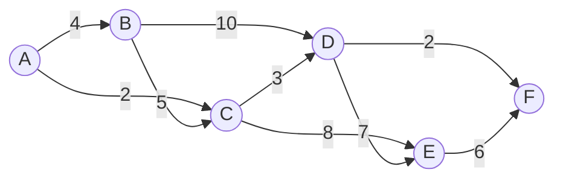

---
title: Minimum Spanning Tree
aliases: [MST, Kruskal, Prim, Minimum Spanning Forest]
tags: [DSA, Graphs, MST, Greedy, UnionFind, PriorityQueue]
domain: DSA
difficulty: Intermediate
created: 2026-07-26
related: [Union_Find, Priority_Queue, Graph_Representation]
status: complete
---

# 🌲 Minimum Spanning Tree

> [!abstract] TL;DR
> A Minimum Spanning Tree (MST) connects all V vertices with exactly V-1 edges, with minimum total edge weight, and no cycles. Two greedy algorithms: **Kruskal's** (sort edges + Union-Find, O(E log E)) and **Prim's** (grow from a vertex using a min-heap, O(E log V)). MST exists iff the graph is connected.

---

## Intuition — Analogy First

You're a city planner tasked with connecting N cities with roads. Building roads costs money, proportional to the distance. You want **every city reachable from every other** with the **minimum total road-building cost**. You don't need direct roads between all pairs — just a connected network with no unnecessary roads (no redundant cycles).

- **Kruskal's approach:** Sort all possible roads by cost. Greedily build the cheapest road that doesn't create a loop (doesn't connect two cities already in the same group). Stop when all cities are connected.
- **Prim's approach:** Start building from one city. Always extend the current network by the cheapest possible new road into an unconnected city. Like a growing blob that absorbs the nearest city at each step.

---

## How It Works + Mermaid

### Key Theoretical Properties
**Cut Property:** For any cut (partition of V into two sets S and V-S), the minimum weight edge crossing the cut **must** be in the MST. This justifies both Kruskal's and Prim's greedy choices.

**Cycle Property:** The maximum weight edge in any cycle is **never** in the MST (if it's the only edge of that weight; in case of ties, the MST is not unique).

### Kruskal's Algorithm
1. Sort all edges by weight ascending.
2. Initialize Union-Find (each node is its own component).
3. For each edge (u, v, w): if `find(u) != find(v)`, add edge to MST and `union(u, v)`.
4. Stop when V-1 edges are added or all edges processed.

### Prim's Algorithm
1. Start from any vertex. Initialize min-heap with `(0, start)`.
2. Track `visited` set.
3. Pop `(cost, u)`. If u is visited, skip.
4. Mark u visited. Add cost to total. Push all `(w, v)` for unvisited neighbors v.
5. Repeat until all nodes visited.



**Kruskal's Edge Selection:**

| Step | Edge  | Weight | Action          | MST Edges              |
|------|-------|--------|-----------------|------------------------|
| 1    | A-C   | 2      | Add (A,C diff)  | {A-C}                  |
| 2    | D-F   | 2      | Add (D,F diff)  | {A-C, D-F}             |
| 3    | C-D   | 3      | Add (C,D diff)  | {A-C, D-F, C-D}        |
| 4    | A-B   | 4      | Add (A,B diff)  | {A-C, D-F, C-D, A-B}   |
| 5    | B-C   | 5      | SKIP (B,C same) | —                      |
| 6    | E-F   | 6      | Add (E,F diff)  | {A-C, D-F, C-D, A-B, E-F} |

Total MST weight: 2+2+3+4+6 = 17. All 6 nodes connected with 5 edges.

---

## Complexity Analysis

| Algorithm        | Time        | Space  | Notes                                          |
|------------------|-------------|--------|------------------------------------------------|
| Kruskal's        | O(E log E)  | O(V+E) | Dominated by sorting; Union-Find nearly O(1)  |
| Prim's (heap)    | O(E log V)  | O(V+E) | Better for dense graphs                        |
| Prim's (matrix)  | O(V²)       | O(V²)  | Better when E ≈ V² (dense)                    |
| Borůvka's        | O(E log V)  | O(V+E) | Parallel-friendly; O(log V) rounds            |

- **Kruskal's vs Prim's:** For sparse graphs (E ≈ V), Kruskal's is O(V log V), Prim's is O(V log V) — similar. For dense graphs (E ≈ V²), Prim's matrix version is O(V²) which beats Kruskal's O(V² log V).
- **Borůvka's algorithm:** Each round, every component picks its cheapest outgoing edge. Halves the number of components each round → O(log V) rounds → O(E log V) total. Practical for parallel/distributed computation.

---

## Implementation (Python)

```python
import heapq
from typing import List, Tuple

# =========================================================
# UNION-FIND (needed for Kruskal's)
# =========================================================
class UnionFind:
    def __init__(self, n: int):
        self.parent = list(range(n))
        self.rank = [0] * n
        self.components = n

    def find(self, x: int) -> int:
        if self.parent[x] != x:
            self.parent[x] = self.find(self.parent[x])  # path compression
        return self.parent[x]

    def union(self, x: int, y: int) -> bool:
        px, py = self.find(x), self.find(y)
        if px == py:
            return False  # already connected
        # Union by rank
        if self.rank[px] < self.rank[py]:
            px, py = py, px
        self.parent[py] = px
        if self.rank[px] == self.rank[py]:
            self.rank[px] += 1
        self.components -= 1
        return True


# =========================================================
# KRUSKAL'S ALGORITHM
# =========================================================
def kruskal_mst(n: int, edges: List[Tuple[int, int, int]]) -> Tuple[int, List]:
    """
    Returns (total_weight, mst_edges).
    edges: list of (weight, u, v).
    Returns -1 if graph is not connected.
    """
    edges.sort()  # sort by weight
    uf = UnionFind(n)
    mst_weight = 0
    mst_edges = []

    for w, u, v in edges:
        if uf.union(u, v):
            mst_weight += w
            mst_edges.append((u, v, w))
            if len(mst_edges) == n - 1:
                break  # MST complete

    if len(mst_edges) < n - 1:
        return -1, []  # Graph not connected
    return mst_weight, mst_edges


# =========================================================
# PRIM'S ALGORITHM
# =========================================================
def prim_mst(n: int, adj: List[List[Tuple[int, int]]]) -> int:
    """
    Returns total MST weight, or -1 if not connected.
    adj: adjacency list, adj[u] = [(v, weight), ...]
    """
    visited = [False] * n
    # min-heap: (edge_weight, to_node)
    heap = [(0, 0)]  # start from node 0
    total_weight = 0
    nodes_added = 0

    while heap and nodes_added < n:
        cost, u = heapq.heappop(heap)
        if visited[u]:
            continue
        visited[u] = True
        total_weight += cost
        nodes_added += 1

        for v, w in adj[u]:
            if not visited[v]:
                heapq.heappush(heap, (w, v))

    return total_weight if nodes_added == n else -1


# =========================================================
# MIN COST TO CONNECT ALL POINTS (LC 1584)
# =========================================================
def minCostConnectPoints(points: List[List[int]]) -> int:
    """
    Manhattan distance MST using Prim's (O(n² log n) — complete graph).
    """
    n = len(points)

    def manhattan(i: int, j: int) -> int:
        return abs(points[i][0] - points[j][0]) + abs(points[i][1] - points[j][1])

    visited = [False] * n
    min_dist = [float('inf')] * n
    min_dist[0] = 0
    heap = [(0, 0)]
    total = 0
    added = 0

    while heap and added < n:
        cost, u = heapq.heappop(heap)
        if visited[u]:
            continue
        visited[u] = True
        total += cost
        added += 1

        for v in range(n):
            if not visited[v]:
                d = manhattan(u, v)
                if d < min_dist[v]:
                    min_dist[v] = d
                    heapq.heappush(heap, (d, v))

    return total


# =========================================================
# KRUSKAL'S — CONNECT ALL POINTS ALTERNATIVE
# =========================================================
def minCostConnectPointsKruskal(points: List[List[int]]) -> int:
    n = len(points)
    edges = []
    for i in range(n):
        for j in range(i+1, n):
            dist = abs(points[i][0]-points[j][0]) + abs(points[i][1]-points[j][1])
            edges.append((dist, i, j))

    total, _ = kruskal_mst(n, edges)
    return total
```

---

## Dry Run / Example Trace

**Kruskal's on: 4 nodes, edges (by weight): (1,2,w=1),(0,3,w=2),(0,1,w=3),(2,3,w=4),(1,3,w=5)**

```
Sorted edges: [(1,2,1),(0,3,2),(0,1,3),(2,3,4),(1,3,5)]
UF: parent=[0,1,2,3]

Edge (1,2,w=1): find(1)=1, find(2)=2 → DIFFERENT → union → MST:{1-2}
  UF: parent=[0,1,1,3] (2's root is now 1)
  mst_weight=1, edges=1

Edge (0,3,w=2): find(0)=0, find(3)=3 → DIFFERENT → union → MST:{1-2, 0-3}
  UF: parent=[0,1,1,0] (3's root is now 0)
  mst_weight=3, edges=2

Edge (0,1,w=3): find(0)=0, find(1)=1 → DIFFERENT → union → MST:{1-2,0-3,0-1}
  UF: parent=[0,0,1,0] (all connected to 0)
  mst_weight=6, edges=3 = n-1 → DONE

MST edges: {(1,2), (0,3), (0,1)}, Total weight: 6
```

---

## Patterns & LeetCode Applications

| Problem                                  | LC #  | Key Insight                                             |
|------------------------------------------|-------|---------------------------------------------------------|
| Min Cost to Connect All Points           | 1584  | MST with Manhattan distance (Prim's or Kruskal's)       |
| Connecting Cities With Minimum Cost     | 1135  | Direct MST application with Kruskal's                   |
| Optimize Water Distribution in a Village| 1168  | Add virtual node 0 with "well" edges → standard MST     |
| Remove Max Number of Edges              | 1579  | Max edges to remove while keeping graph connected       |
| Critical and Pseudo-Critical Edges      | 1489  | Identify MST edges by including/excluding and comparing |

**Virtual node trick (LC 1168 — wells):** Add a node 0 connected to each house i with edge weight = cost of digging a well in house i. Then find MST of this augmented graph. The MST edges represent either "dig a well" (edges from node 0) or "build a pipe."

---

## Common Pitfalls

1. **Not checking connectivity:** If the graph isn't connected, MST doesn't exist — check that V-1 edges were added.
2. **Kruskal's requires explicit edge list:** Unlike Prim's which works on adjacency lists, Kruskal's needs all edges sorted — builds edge list from adjacency list first.
3. **Parallel edges:** MST can include at most one edge between any pair of vertices — Union-Find handles this automatically.
4. **Undirected graph only:** MST is defined for undirected graphs. For directed graphs, use minimum spanning arborescence (Edmonds' algorithm).
5. **Ties:** When multiple edges have the same weight, the MST might not be unique — the total weight is the same but the edges chosen may differ.
6. **Prim's starting node:** Prim's result is the same regardless of starting node (same total weight), but the specific MST edges may differ.

---

## Related Concepts

- [[_MOC_Graphs|↑ Section MOC]]
- [[Union_Find]] — the core data structure enabling Kruskal's O(E log E) performance
- [[Priority_Queue]] — the min-heap powering Prim's algorithm
- [[Graph_Representation]] — Kruskal's uses edge list; Prim's uses adjacency list

---

## Review Questions

1. **Explain the Cut Property.** Why does it guarantee that the minimum-weight edge crossing any cut must be in the MST? How does this justify Kruskal's greedy choice?
2. **When would you prefer Prim's algorithm over Kruskal's, and vice versa?** Consider dense vs sparse graph scenarios with concrete complexity analysis.
3. **In LC 1168 (Optimize Water Distribution), a virtual node is added to convert a "wells or pipes" problem into a standard MST. Explain why this transformation works and what the MST edges represent in the original problem.**

---

## Sources

- CLRS — Introduction to Algorithms, Ch. 23 (Minimum Spanning Trees)
- [CP-Algorithms — MST Kruskal](https://cp-algorithms.com/graph/mst_kruskal.html)
- [CP-Algorithms — MST Prim](https://cp-algorithms.com/graph/mst_prim.html)
- LeetCode #1584, #1135, #1168
- [NeetCode — Advanced Graphs](https://neetcode.io)

#mst #minimumspanningtree #kruskal #prim #greedy #unionfind #graphs
