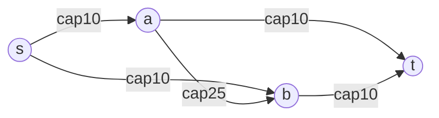

# 🌊 Network Flow (Max-Flow / Min-Cut)

> [!abstract] TL;DR
> Given a directed graph with edge **capacities**, a **source** `s`, and a **sink** `t`, the **maximum flow** is the greatest total amount that can be pushed from `s` to `t` without exceeding any capacity. The **Ford-Fulkerson method** repeatedly finds an **augmenting path** in the **residual graph** and pushes flow along it. **Edmonds-Karp** picks the *shortest* augmenting path with [[BFS]], giving **O(VE²)**. The **Max-Flow Min-Cut theorem** says the max flow equals the capacity of the minimum `s-t` cut.

---

## Intuition — Analogy First

Think of a **network of water pipes**. Each pipe has a maximum throughput (its capacity). You open a tap at the source `s` and want as much water as possible to reach the drain `t`. You keep discovering routes with spare room and pump more water through them — that's an **augmenting path**.

The clever twist is the **residual graph**: once you send water forward through a pipe, you create a "virtual backward pipe" that lets a *later* augmenting path **cancel and reroute** earlier flow. It's as if you can say "actually, send that earlier water somewhere better instead." This undo capability is what guarantees you eventually reach the true maximum — not just a locally-good arrangement.

And the beautiful duality: the water stops maxing out precisely when some **bottleneck set of pipes** (the minimum cut) is completely saturated. The tightest bottleneck *is* the answer.

---

## How It Works + Mermaid

**Key definitions**
- **Residual capacity** of edge `(u,v)`: `cap(u,v) − flow(u,v)`. When you push `f` units on `(u,v)`, you *decrease* its residual by `f` and *increase* the reverse edge `(v,u)`'s residual by `f`.
- **Augmenting path:** any `s → t` path in the residual graph where every edge has residual > 0. Its bottleneck = the minimum residual along it.
- **s-t cut:** a partition `(S, T)` with `s ∈ S`, `t ∈ T`. Its capacity = sum of capacities of edges crossing `S → T`.

**Ford-Fulkerson method**
```
max_flow = 0
while an augmenting path P exists in the residual graph:
    b = min residual capacity along P          # bottleneck
    push b units: forward edges -= b, reverse edges += b
    max_flow += b
return max_flow
```

- **Edmonds-Karp** = Ford-Fulkerson where "find a path" is always **BFS** (shortest augmenting path) → O(VE²), and terminates even with irrational capacities.
- **Dinic's algorithm** builds a BFS **level graph** then sends **blocking flows** with [[DFS]] → **O(V²E)** (and O(E√V) on unit-capacity / bipartite graphs). Preferred for large inputs.



Max flow here is **20**: push 10 via `s→a→t` and 10 via `s→b→t`; the middle edge `a→b` (cap 25) is not the bottleneck. The min cut `{s}` vs rest has capacity `10 + 10 = 20`, matching the max flow.

**Residual view after saturating `s→a` and `a→t`:** the forward edge `s→a` has residual 0, and a reverse edge `a→s` of residual 10 now exists to allow future rerouting.

---

## Complexity Analysis

| Algorithm | Path selection | Time | Notes |
|-----------|----------------|------|-------|
| Ford-Fulkerson (generic) | any augmenting path (DFS) | O(E · max_flow) | Can be slow / non-terminating with irrational caps |
| **Edmonds-Karp** | shortest path via [[BFS]] | **O(VE²)** | Always terminates; simple and robust |
| Dinic | level graph + blocking flow | O(V²E) | O(E√V) on unit-capacity & bipartite graphs |
| Push-Relabel | local pushes + relabels | O(V²E) or O(V²√E) | Fastest in practice for dense graphs |

**Max-Flow Min-Cut theorem:** `max s-t flow = min s-t cut capacity`. Three equivalent statements: (1) `f` is maximum; (2) the residual graph has no augmenting path; (3) `|f|` equals some cut's capacity. This duality is why flow solves so many problems.

---

## Python Implementation

```python
from collections import defaultdict, deque
from typing import Dict

class MaxFlow:
    """Edmonds-Karp: BFS-based Ford-Fulkerson. O(V * E^2)."""

    def __init__(self, n: int):
        self.n = n
        # residual capacity matrix via nested dict: cap[u][v]
        self.cap = defaultdict(lambda: defaultdict(int))
        self.adj = defaultdict(set)          # neighbors in the residual graph

    def add_edge(self, u: int, v: int, c: int) -> None:
        self.cap[u][v] += c                  # forward capacity
        # reverse edge starts at 0 residual (created implicitly)
        self.adj[u].add(v)
        self.adj[v].add(u)                   # reverse edge must be traversable

    def _bfs(self, s: int, t: int, parent: Dict[int, int]) -> int:
        """Return bottleneck of the shortest augmenting path, or 0 if none."""
        for k in list(parent):
            parent[k] = -1
        parent[s] = s
        # queue holds (node, bottleneck-so-far)
        q = deque([(s, float('inf'))])
        while q:
            u, flow = q.popleft()
            for v in self.adj[u]:
                if parent[v] == -1 and self.cap[u][v] > 0:   # unvisited, has residual
                    parent[v] = u
                    new_flow = min(flow, self.cap[u][v])
                    if v == t:
                        return new_flow
                    q.append((v, new_flow))
        return 0

    def max_flow(self, s: int, t: int) -> int:
        parent = {i: -1 for i in range(self.n)}
        total = 0
        while True:
            bottleneck = self._bfs(s, t, parent)
            if bottleneck == 0:
                break
            total += bottleneck
            # walk back along the path, updating residuals
            v = t
            while v != s:
                u = parent[v]
                self.cap[u][v] -= bottleneck   # consume forward residual
                self.cap[v][u] += bottleneck   # open reverse residual (undo capacity)
                v = u
        return total

    def min_cut_reachable(self, s: int):
        """After max_flow, BFS in residual graph → S side of the min cut."""
        seen = {s}
        q = deque([s])
        while q:
            u = q.popleft()
            for v in self.adj[u]:
                if v not in seen and self.cap[u][v] > 0:
                    seen.add(v)
                    q.append(v)
        return seen   # edges from S to (V \ S) form the min cut


# ---- Example ----
mf = MaxFlow(4)                 # nodes 0=s,1=a,2=b,3=t
for u, v, c in [(0,1,10),(0,2,10),(1,2,25),(1,3,10),(2,3,10)]:
    mf.add_edge(u, v, c)
print(mf.max_flow(0, 3))        # 20
```

---

## Dry Run / Trace

Graph: `s→a(10)`, `s→b(10)`, `a→b(25)`, `a→t(10)`, `b→t(10)`. Edmonds-Karp:

```
BFS #1: shortest path s→a→t, bottleneck = min(10,10) = 10
        push 10 -> flow=10 ; residual s→a=0, a→t=0 ; reverse a→s=10, t→a=10
BFS #2: s→a is saturated; shortest path s→b→t, bottleneck = min(10,10) = 10
        push 10 -> flow=20 ; residual s→b=0, b→t=0
BFS #3: from s, edges s→a (res 0) and s→b (res 0) both saturated
        no augmenting path -> STOP
Max flow = 20
Min cut: BFS in residual reaches only {s}; crossing edges s→a, s→b (10+10=20) ✅
```
Max flow (20) equals min-cut capacity (20), confirming the theorem.

---

## Patterns & LeetCode Applications

| Problem / Use case | Reduction to flow |
|--------------------|-------------------|
| **Bipartite matching** | Add source→left (cap 1), right→sink (cap 1); max flow = max matching → [[Bipartite_Matching]] |
| Edge-disjoint paths | Set every edge capacity = 1; max flow = number of disjoint `s-t` paths |
| Vertex-disjoint paths | Split each vertex into `in`/`out` with a cap-1 edge between |
| Image segmentation | Min-cut separates foreground/background pixels (Boykov-Kolmogorov) |
| Project selection / max-weight closure | Model prerequisites; min-cut = max profit |
| Maximum Students Taking Exam (LC 1349) | Bipartite / flow modeling of seat conflicts |
| Escape / Escape-the-Grid problems | Cap-1 flow to test disjoint escape routes |

**Meta-pattern:** if a problem asks for a maximum "throughput", a maximum set of disjoint things, or a minimum "cut/separation", suspect a flow reduction. The art is **modeling** — choosing the right source, sink, and capacities.

---

## Common Pitfalls

1. **Forgetting reverse edges.** Without residual back-edges the algorithm can't undo a bad earlier choice and returns a sub-optimal flow. Always create the reverse (initial residual 0).
2. **Using DFS-only Ford-Fulkerson on adversarial capacities** → exponential blowup or non-termination. Use BFS (Edmonds-Karp) or Dinic.
3. **Parallel edges collapsing:** with a capacity *matrix* you must **sum** `cap[u][v] += c`, or two edges between the same pair overwrite each other.
4. **Undirected edges:** model as two directed edges, each with the full capacity (or a shared symmetric residual), depending on the problem semantics.
5. **Confusing the min cut with removed edges:** the min cut is the set of edges crossing from the residual-reachable side `S` to the rest — found by a residual BFS *after* max flow.
6. **Integer vs float capacities:** Edmonds-Karp guarantees termination even for irrational caps; plain Ford-Fulkerson does not.

---

## Related Concepts

- [[_MOC_Graphs|↑ Section MOC]]
- [[BFS]] — Edmonds-Karp finds the shortest augmenting path with BFS
- [[Bipartite_Matching]] — the canonical flow reduction (matching = max flow)
- [[Dijkstra]] — min-cost max-flow uses shortest-path augmentation on costs
- [[Graph_Representation]] — residual graph = capacity + reverse-edge bookkeeping

---

## Review Questions

1. **State and justify the Max-Flow Min-Cut theorem.** Why does "no augmenting path in the residual graph" imply the current flow is maximum?
2. **Why does Edmonds-Karp achieve O(VE²) while generic Ford-Fulkerson can be O(E·max_flow)?** What property of BFS-chosen paths bounds the number of augmentations?
3. **Reduce maximum bipartite matching to a max-flow instance.** Specify the source, sink, and every capacity, and explain why an integral max flow yields a valid matching.

---

## Sources

- CLRS — *Introduction to Algorithms*, Ch. 26 (Maximum Flow)
- Ford & Fulkerson (1956); Edmonds & Karp (1972); Dinic (1970)
- [CP-Algorithms — Maximum Flow (Ford-Fulkerson / Edmonds-Karp)](https://cp-algorithms.com/graph/edmonds_karp.html)
- [CP-Algorithms — Dinic's Algorithm](https://cp-algorithms.com/graph/dinic.html)
- LeetCode #1349, matching/flow-modeling problems

#networkflow #maxflow #mincut #fordfulkerson #edmondskarp #dinic #graphs
