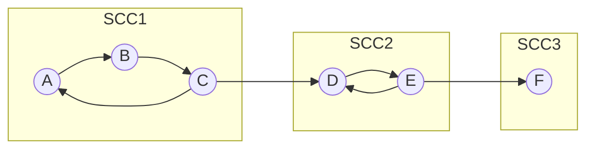
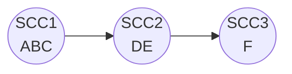

# 🔗 Strongly Connected Components

> [!abstract] TL;DR
> A **strongly connected component (SCC)** of a directed graph is a **maximal** set of vertices in which *every* vertex can reach *every* other vertex. Two classic linear-time algorithms find all SCCs in **O(V+E)**: **Kosaraju's** (two [[DFS]] passes — one on `G`, one on the transpose `Gᵀ`) and **Tarjan's** (a single DFS using discovery times and *low-link* values with a stack). Contracting each SCC to a point yields the **condensation graph**, which is always a DAG.

---

## Intuition — Analogy First

Think of a **road network with one-way streets**. Two intersections are in the same SCC if you can drive from either one to the other and back — a "neighborhood" you can never get trapped leaving and re-entering freely. Within a neighborhood you can loop around endlessly; between neighborhoods traffic flows **one way only**.

Now zoom out and shrink each neighborhood to a single dot. What remains is a map with strictly one-directional connections and **no cycles** — because if two neighborhoods could reach each other, they'd actually be one big neighborhood. That zoomed-out, cycle-free map is the **condensation DAG**, and it's why SCCs are the natural first step for analyzing any tangled directed graph.

---

## How It Works + Mermaid

### Kosaraju's Algorithm — two passes
1. Run [[DFS]] on `G`, pushing each vertex onto a stack **when it finishes** (post-order).
2. Build `Gᵀ`, the **transpose** (reverse every edge).
3. Pop vertices off the stack in reverse-finish order; each DFS tree in `Gᵀ` is one SCC.

*Why it works:* the finish-order gives a topological-like ordering of the condensation. Reversing edges means a DFS from the "last-finishing" vertex can only stay inside its own SCC — it can't leak into components that come "before" it.

### Tarjan's Algorithm — one pass
- Assign each vertex a `disc[v]` (DFS discovery index) and `low[v]` = the smallest `disc` reachable from `v`'s subtree via tree edges plus **at most one back/cross edge to a vertex still on the stack**.
- Keep vertices on an explicit stack as they're discovered.
- When `low[v] == disc[v]`, `v` is the **root** of an SCC → pop the stack down to `v`; those vertices form one SCC.



**Condensation DAG** (each SCC → one super-node):


The original graph has cycles inside `{A,B,C}` and `{D,E}`, but the condensation `SCC1 → SCC2 → SCC3` is acyclic — you can even run a [[Topological_Sort]] on it.

---

## Complexity Analysis

| Algorithm | Time | Space | Passes | Notes |
|-----------|------|-------|--------|-------|
| Kosaraju | O(V+E) | O(V+E) | 2 DFS + build transpose | Simpler to reason about; needs `Gᵀ` |
| Tarjan | O(V+E) | O(V+E) | 1 DFS | One pass, no transpose; SCCs emerge in reverse-topo order |
| Gabow | O(V+E) | O(V+E) | 1 DFS (two stacks) | Alternative to Tarjan, avoids `low` array |

Both are asymptotically optimal (you must at least read every edge). Tarjan is usually preferred in practice (single pass, no transpose), while Kosaraju is easier to teach and debug.

---

## Python Implementation

```python
from collections import defaultdict
from typing import List, Dict

# ---------- Kosaraju's Algorithm ----------
def kosaraju(graph: Dict[int, List[int]], n: int) -> List[List[int]]:
    visited = [False] * n
    finish_stack = []

    def dfs1(u):
        visited[u] = True
        for v in graph[u]:
            if not visited[v]:
                dfs1(v)
        finish_stack.append(u)          # push on FINISH (post-order)

    for u in range(n):
        if not visited[u]:
            dfs1(u)

    # transpose the graph
    transpose = defaultdict(list)
    for u in graph:
        for v in graph[u]:
            transpose[v].append(u)

    visited = [False] * n
    sccs = []

    def dfs2(u, comp):
        visited[u] = True
        comp.append(u)
        for v in transpose[u]:
            if not visited[v]:
                dfs2(v, comp)

    while finish_stack:
        u = finish_stack.pop()          # reverse finish order
        if not visited[u]:
            comp = []
            dfs2(u, comp)
            sccs.append(comp)
    return sccs


# ---------- Tarjan's Algorithm (single DFS, iterative-safe recursion) ----------
def tarjan(graph: Dict[int, List[int]], n: int) -> List[List[int]]:
    index_counter = [0]
    disc = [-1] * n                     # discovery index, -1 = unvisited
    low = [0] * n
    on_stack = [False] * n
    stack = []
    sccs = []

    def strongconnect(u):
        disc[u] = low[u] = index_counter[0]
        index_counter[0] += 1
        stack.append(u)
        on_stack[u] = True

        for v in graph[u]:
            if disc[v] == -1:            # tree edge → recurse
                strongconnect(v)
                low[u] = min(low[u], low[v])
            elif on_stack[v]:            # back/cross edge to active vertex
                low[u] = min(low[u], disc[v])

        if low[u] == disc[u]:            # u is an SCC root
            comp = []
            while True:
                w = stack.pop()
                on_stack[w] = False
                comp.append(w)
                if w == u:
                    break
            sccs.append(comp)

    for u in range(n):
        if disc[u] == -1:
            strongconnect(u)
    return sccs


# ---- Example ----
g = defaultdict(list)
for u, v in [(0,1),(1,2),(2,0),(2,3),(3,4),(4,3),(4,5)]:
    g[u].append(v)

print(kosaraju(g, 6))   # [[0,1,2],[3,4],[5]] (order may vary)
print(tarjan(g, 6))     # [[5],[3,4],[0,1,2]] (reverse-topological)
```

---

## Dry Run / Trace

**Graph:** `0→1→2→0`, `2→3`, `3→4→3`, `4→5`. Run **Tarjan** from `0`:

```
visit 0: disc=low=0, stack=[0]
 visit 1: disc=low=1, stack=[0,1]
  visit 2: disc=low=2, stack=[0,1,2]
   edge 2→0: 0 on stack -> low[2]=min(2,disc[0]=0)=0
   edge 2→3:
    visit 3: disc=low=3, stack=[0,1,2,3]
     visit 4: disc=low=4, stack=[..,4]
      edge 4→3: 3 on stack -> low[4]=min(4,3)=3
      edge 4→5:
       visit 5: disc=low=5, stack=[..,5]
        low[5]==disc[5]=5 -> POP {5}  ✅ SCC {5}
      back in 4: low[4]=3
     back in 3: low[3]=min(3,low[4]=3)=3
     low[3]==disc[3]=3 -> POP down to 3 -> {4,3}  ✅ SCC {3,4}
   back in 2: low[2]=0
  back in 1: low[1]=min(1,low[2]=0)=0
 back in 0: low[0]=min(0,low[1]=0)=0
 low[0]==disc[0]=0 -> POP down to 0 -> {2,1,0}  ✅ SCC {0,1,2}
```
SCCs discovered in reverse-topological order: `{5}, {3,4}, {0,1,2}`.

---

## Patterns & LeetCode Applications

| Problem / Use case | Angle |
|--------------------|-------|
| **2-SAT** | Build implication graph; formula satisfiable iff no variable `x` and `¬x` share an SCC |
| Critical Connections in a Network (LC 1192) | Related (bridges); SCC logic on directed variants |
| Course Schedule (LC 207/210) | Cycle detection; an SCC of size > 1 means a cyclic dependency |
| Detecting deadlocks / dependency cycles | Any SCC with ≥ 2 nodes is a cycle in the dependency graph |
| Compiler optimization | SCCs of the call graph = mutually recursive functions |
| Condensation + DP | Contract to DAG, then DP/longest-path on the acyclic condensation |

**Meta-pattern:** whenever a directed graph *might* have cycles and you want to reason about it "as if" it were a DAG, compute SCCs, condense, and work on the DAG.

---

## Common Pitfalls

1. **Kosaraju: pushing on discovery instead of finish.** The stack must record **post-order** finish times, or the second pass groups the wrong vertices.
2. **Tarjan: updating `low` with `low[v]` for a cross edge.** For non-tree edges you use `disc[v]` (only if `v` is on the stack), not `low[v]`.
3. **Forgetting the `on_stack` check in Tarjan.** A cross edge to a vertex already assigned to a finished SCC must **not** lower `low[u]`.
4. **Recursion depth:** deep graphs overflow Python's recursion limit — raise it or convert to an explicit stack.
5. **Confusing SCC (directed) with connected components (undirected).** In an undirected graph use plain DFS/[[Union_Find]]; SCCs are strictly a directed-graph concept.
6. **Assuming SCCs come out topologically ordered in Kosaraju** — they emerge in the order the second pass runs; sort the condensation explicitly if needed.

---

## Related Concepts

- [[_MOC_Graphs|↑ Section MOC]]
- [[DFS]] — the engine behind both Kosaraju and Tarjan
- [[Topological_Sort]] — the condensation of SCCs is a DAG you can topo-sort
- [[Articulation_Points_and_Bridges]] — Tarjan's `low`-link idea reused for undirected cut vertices/edges
- [[Union_Find]] — connectivity in *undirected* graphs (the analogous tool)
- [[Graph_Representation]] — transpose = reverse every edge in the adjacency list

---

## Review Questions

1. **Explain why Kosaraju's second DFS on the transpose, processed in reverse-finish order, isolates exactly one SCC per DFS tree.**
2. **In Tarjan's algorithm, what does `low[v]` represent, and why must you use `disc[v]` (not `low[v]`) when relaxing a back edge to a stacked vertex?**
3. **How does the condensation graph enable solving 2-SAT?** State the satisfiability condition in terms of SCCs.

---

## Sources

- CLRS — *Introduction to Algorithms*, Ch. 22.5 (Strongly Connected Components)
- Tarjan (1972) — *Depth-First Search and Linear Graph Algorithms*
- [CP-Algorithms — Strongly Connected Components & Condensation](https://cp-algorithms.com/graph/strongly-connected-components.html)
- [CP-Algorithms — 2-SAT](https://cp-algorithms.com/graph/2SAT.html)
- LeetCode #207, #210, #1192

#scc #graphs #dfs #kosaraju #tarjan #directedgraphs #2sat
